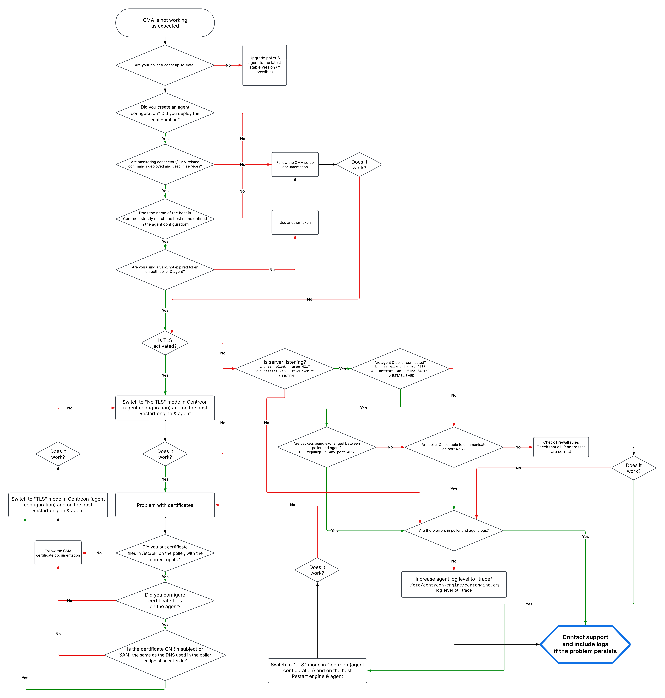

import Tabs from '@theme/Tabs';
import TabItem from '@theme/TabItem';



## Refresh a status

In many situations, you need to quickly re-check one or multiple resources to refresh their status.

Two types of check action are available:

The **Forced check** action on [Resources status page](/docs/alerts-notifications/resources-status) is a check available for CMA, that you can perform at any time (in or out of the configured check period).

Check your resources and refresh their status in three ways:

By directly clicking the button on the line when the mouse is over it.
By selecting one or multiple lines and clicking the Forced check button above the table.
By clicking the Forced check button in the detail panel of the resource.

## Host checks

<Tabs groupId="os">
<TabItem value="Linux" label="Linux">

### Check that the service is running

1. Execute the following command:

   ```bash
   systemctl status centagent
   ```

2. If the service is not running, start it.

   ```bash
   systemctl restart centagent
   ```

### Check that the agent log file does not contain any errors

Depending on the path configured for your log file, check for any errors:

```bash
grep error /var/log/centreon-monitoring-agent/centagent.log
```

No lines should be returned.

### Check that the connection with the poller is working

<Tabs groupId="sync">
<TabItem value="The agent connects to the poller" label="The agent connects to the poller">

1. Execute the following command in PowerShell:

   ```bash
   tnc <poller IP or DNS> -p 4317
   ```

   The following value must be returned:

   ```bash
   Connection to <IP ou DNS collecteur> 4317 port [tcp/http] succeeded!
   ```

</TabItem>

<TabItem value="The poller connects to the agent" label="The poller connects to the agent">

1. Port number 4317 must be open (inbound) on the host.

2. Execute the following command:

   ```bash
   ss -plant | grep 4317
   ```

   This command must return results, showing that the agent is listening (LISTEN) or that the connection is established (ESTABLISHED).

   ```bash
   State           Recv-Q       Send-Q             Local Address:Port                Peer Address:Port       Process
   LISTEN          0            0                      0.0.0.0:4317                       ::::
   ```

   ```bash
   State           Recv-Q       Send-Q             Local Address:Port                Peer Address:Port       Process
   ESTAB          0            0                      0.0.0.0:4317                       <POLLER IP>:<PORT> 
   ```

</TabItem>
</Tabs>
</TabItem>

<TabItem value="Windows" label="Windows">

### Check that the service is running

1. Execute the following command:

   ```bash
   services.msc
   ```

2. Search for **Centreon Monitoring Agent** in the list of services: if the service is not running, start it.

### Check that the logs do not contain any errors

Depending on the configuration, use the event viewer or look at the specified file.

### Check that the connection with the poller is working

<Tabs groupId="sync">
<TabItem value="The agent connects to the poller" label="The agent connects to the poller">

1. Execute the following command in PowerShell:

   ```bash
   tnc <poller IP or DNS> -p 4317
   ```

The value **true** must be returned.

</TabItem>

<TabItem value="The poller connects to the agent" label="The poller connects to the agent">

1. Port number 4317 must be open (inbound) on the host.

2. Execute the following command:

   ```bash
   netstat -an | find "4317"
   ```

   This command must return results, showing that the agent is listening (LISTEN) or that the connection is established (ESTABLISHED).

   ```bash
   Active Internet connections (servers and established)
   Proto Recv-Q Send-Q Local Address           Foreign Address         State
   tcp        0      0 0.0.0.0:4317          ::::                    LISTEN
   ```

   ```bash
   Active Internet connections (servers and established)
   Proto Recv-Q Send-Q Local Address           Foreign Address         State
   tcp        0      0 0.0.0.0:4317          <POLLER IP>:<PORT>      ESTABLISHED
   ```

</TabItem>
</Tabs>
</TabItem>
</Tabs>

## Poller checks

You need to run these checks on every poller that receives data from CMA agents.

### Check that the server is listening and that packets are arriving

<Tabs groupId="sync">
<TabItem value="The agent connects to the poller" label="The agent connects to the poller">

1. Port number 4317 must be open (inbound) on the poller.

2. Execute the following command:

   ```bash
   ss -plant | grep 4317
   ```

   This command must return results, showing that the poller is listening (LISTEN) or that the connection is established (ESTABLISHED).

   ```bash
   State           Recv-Q       Send-Q             Local Address:Port                Peer Address:Port       Process
   LISTEN          0            0                      0.0.0.0:4317                       ::::
   ```

   ```bash
   State           Recv-Q       Send-Q             Local Address:Port                Peer Address:Port       Process
   ESTAB          0            0                      0.0.0.0:4317                       <HOST IP>:<PORT> 
   ```

</TabItem>
<TabItem value="The poller connects to the agent" label="The poller connects to the agent">

Port number 4317 must be open (inbound) on the agent.

</TabItem>
</Tabs>

Execute the following command:

```bash
tcpdump -i any port 4317
```

This command must return results, showing that packets are exchanged between agent and poller.

### Change the OpenTelemetry log level

By default, the log level is **Error**. You may want to change this for debugging purposes.

1. Go to **Configuration > Pollers > Engine Configuration**, then select the poller you want.
2. In the **Log options** tab, in the **Debug Configuration** section, select the log level you want for OpenTelemetry logs.

   The different log levels are: trace, debug, info, warning, error, critical, disabled.

3. Restart the monitoring engine.

> Remember to lower the log level once you've finished debugging, to avoid cluttering the poller with unnecessary logs.

### Check that the engine log file does not contain any errors

Execute the following command:

```bash
grep error /var/log/centreon-engine/centengine.log
```

No CMA related lines should be returned.

## Checks in Centreon

Check in the **Monitoring > Resource status** page that all resources are up to date. The host and its configured services must return a status and metrics.

## Location of poller and agent logs

* You can find the engine logs for each poller here: `/var/log/centreon-engine/centengine.log`.

* On each host monitored by CMA, the agent's logs can be found here:
   * Linux: by default, `/var/log/centreon-monitoring-agent/centagent.log` (this log location can be configured in **/etc/centreon-monitoring-agent/centagent.json**)
   * Windows: the location is the one you specified when installing the agent (by default, in the Windows Event Viewer).
