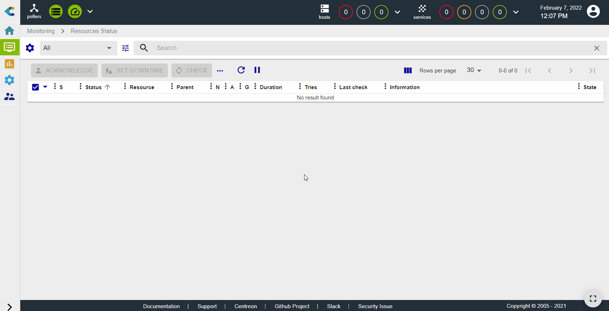
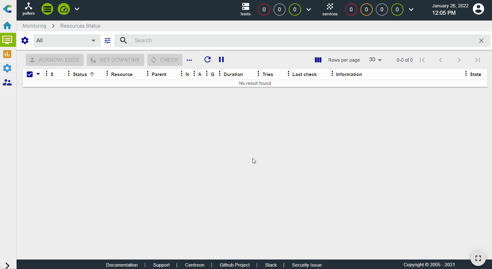
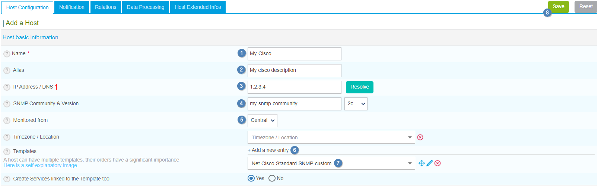
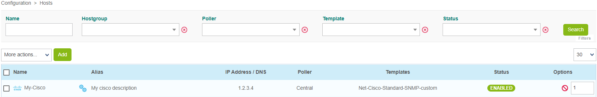
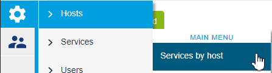
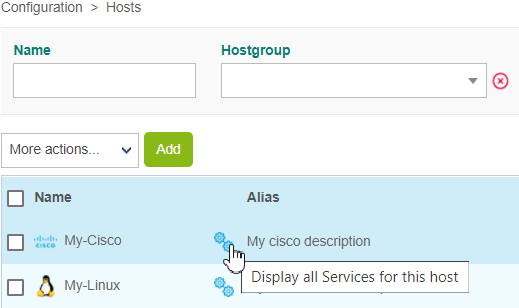
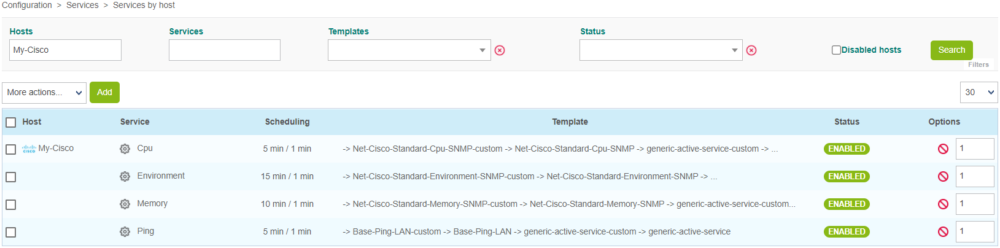
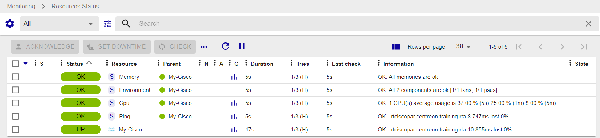

import Tabs from '@theme/Tabs';
import TabItem from '@theme/TabItem';

## Monitoring a Cisco Router with SNMP


In this tutorial, we're assuming that your Centreon platform is installed and running well, and that you have at least a [Centreon IT 100 Edition](it100.md) that provides Centreon Monitoring Connectors (your [license](../administration/licenses.md) is already set up).

Your Cisco router will be monitored using the [Cisco standard Monitoring Connector](/pp/integrations/plugin-packs/procedures/network-cisco-standard-snmp). (More about Monitoring Connectors [here](../monitoring/pluginpacks.md)). 


## Prerequisites

### On the Cisco router you want to monitor


The first step is to activate and configure an SNMP service on your Cisco device.
Please refer to the documentation of your Cisco device to find out how to configure the SNMP service. The monitoring procedure for the [Cisco standard Monitoring Connector](/pp/integrations/plugin-packs/procedures/network-cisco-standard-snmp) includes an example.


### Network flow

The target device must be reachable from the Centreon Poller on the UDP/161 SNMP port.

### On the poller

Connect to your poller using SSH and install the Cisco standard plugin (see the [monitoring procedure for the **Cisco standard** Monitoring Connector](/pp/integrations/plugin-packs/procedures/network-cisco-standard-snmp) for more information):

<Tabs groupId="sync">
<TabItem value="Alma / RHEL / Oracle Linux 8" label="Alma / RHEL / Oracle Linux 8">

``` shell
dnf install centreon-plugin-Network-Cisco-Standard-Snmp
```

</TabItem>
<TabItem value="Alma / RHEL / Oracle Linux 9" label="Alma / RHEL / Oracle Linux 9">

``` shell
dnf install centreon-plugin-Network-Cisco-Standard-Snmp
```

</TabItem>
<TabItem value="Debian 12" label="Debian 12">

```shell
apt install centreon-plugin-network-cisco-standard-snmp
```

</TabItem>

</Tabs>

### On the central server

In the web interface, go to **Configuration > Monitoring Connector Manager**, search for the **Cisco standard** Monitoring Connector; and install it:



## Configure the host and deploy the configuration

1. Go to **Configuration > Hosts > Hosts** and click **Add**:

  

2. Input the following information:

  * The name of the router (1)
  * A description of the router (2)
  * The IP address of the router (3)
  * The SNMP version and community (4)
  * Select the poller that will monitor the device (keep "Central" if you have no other poller) (5)

3. Click **+ Add a new entry** in the **Templates** field (6), then select the **Net-Cisco-Standard-SNMP-custom** template (7) from the list:

  

4. Click **Save**(8). Your device has been added to the list of hosts:

  

5. Go to **Configuration > Services > Services by host**. A set of indicators has been created automatically.

  

  You can also use the shortcut beside the host's name to go directly to **Configuration > Services > Services by host**. The list will be filtered by host name:

  

  

6. [Deploy the configuration](../monitoring/monitoring-servers/deploying-a-configuration.md).

7. Go to **Monitoring > Resources Status** and select **All** from the **Resource status** filter. At first, the resources appear with the status **Pending**, which means that no checks have been executed yet:

   

   After a few minutes, the first results of the monitoring appear:

   

   If not all services are in an OK state, check what is causing the error and fix the problem.
