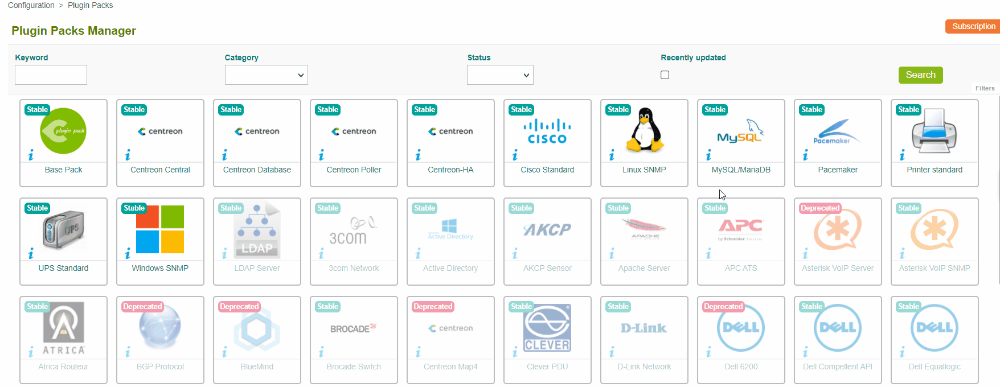
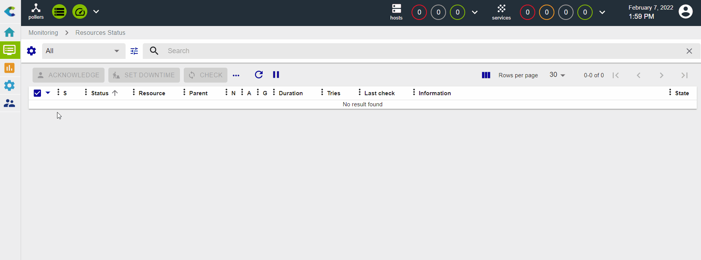
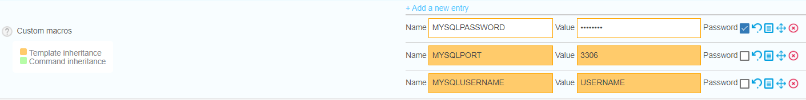
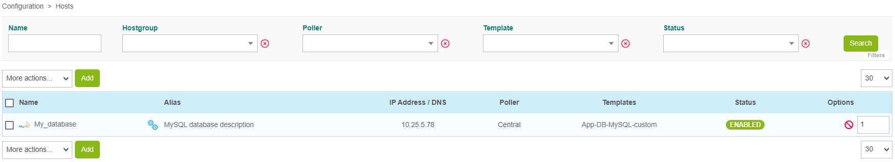
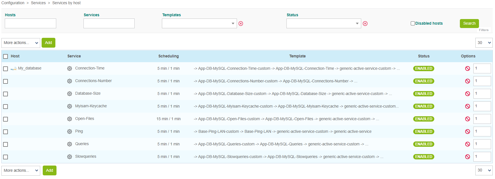

import Tabs from '@theme/Tabs';
import TabItem from '@theme/TabItem';

The objective of this tutorial is to monitor a Mysql/MariaDB database.

## Prerequisites

### On the database you want to monitor

To be able to collect the necessary information from the database, a database user with specific privileges is required. If the database you want to monitor is a Centreon database, a dedicated user already exists and is called **centreon**. Otherwise, start by creating a new user: log in to your database, then run the following command:

```shell
CREATE USER 'username'@'IP_POLLER' IDENTIFIED BY 'password';
```

Then, whether your database is a Centreon database or not, run the following command:

```shell
GRANT SELECT ON *.* TO 'username'@'IP_POLLER';
```

> Replace the username, the IP address of the poller and the password with the values you want.

### On the poller

Install the following plugin on the poller that will monitor your database:

<Tabs groupId="sync">
<TabItem value="Alma / RHEL / Oracle Linux 8" label="Alma / RHEL / Oracle Linux 8">

``` shell
dnf install centreon-plugin-Applications-Databases-Mysql
```

</TabItem>
<TabItem value="Alma / RHEL / Oracle Linux 9" label="Alma / RHEL / Oracle Linux 9">

``` shell
dnf install centreon-plugin-Applications-Databases-Mysql
```

</TabItem>
<TabItem value="Debian 11 & 12" label="Debian 11 & 12">

```shell
apt install centreon-plugin-applications-databases-mysql
```

</TabItem>

</Tabs>

### On the central server

The database will be monitored using the [**MySQL/MariaDB** Monitoring Connector](/monitoring-connectors/integrations/plugin-packs/procedures/applications-databases-mysql).
Go to **Configuration > Monitoring Connector Manager** and install the **MySQL/MariaDB** Monitoring Connector:



## Set up the host and deploy the configuration

1. Go to **Configuration > Hosts > Hosts** and click **Add**:

  

2. Input the following information:

  * The name of your server
  * A description of your server
  * Its IP address
  * Select the poller that will monitor the database (leave "Central" if you have no other poller)

3. Click the **+ Add New Entry** button for the **Templates** field and select the **App-DB-MySQL-custom** template:

  

4. A list of macros matching the template will appear:

  

  Fill in the value of following macros:

  * **MYSQLUSERNAME**: the name of the user that will connect to the database.
  * **MySQLPASSWORD**: the password associated with this user.
  * **MySQLPORT**: the listening port of the database, by default 3306.

5. Click **Save**. Your device has been added to the list of hosts:

  

6. Go to **Configuration > Services > Services by host**. A set of indicators has been deployed automatically:

  

7. [Deploy the supervision](first-supervision.md#deploying-a-configuration).

8. Go to **Monitoring > Status Details > Services** and select **All**
for the **Service Status** filter. At first, the resources appear with the status **Pending**,
 which means that no checks have been executed yet. After a few minutes, the first results of the monitoring appear:

  