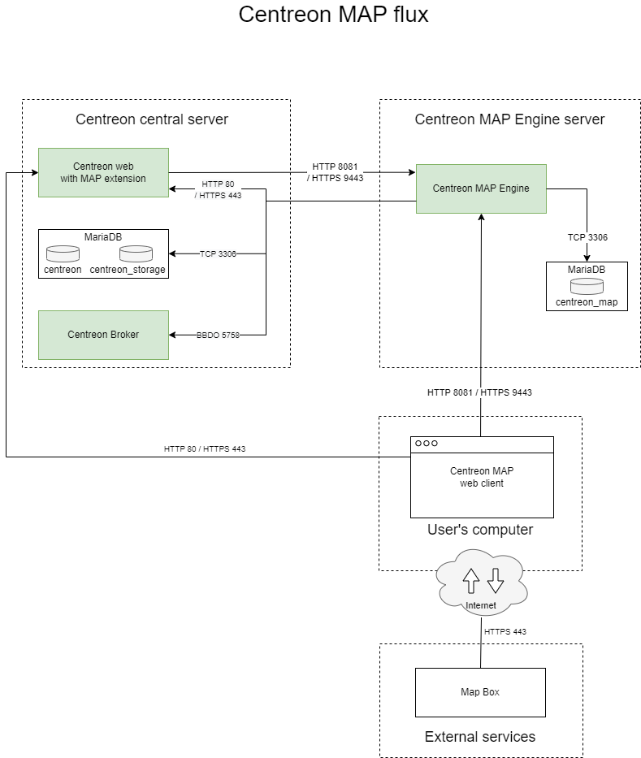
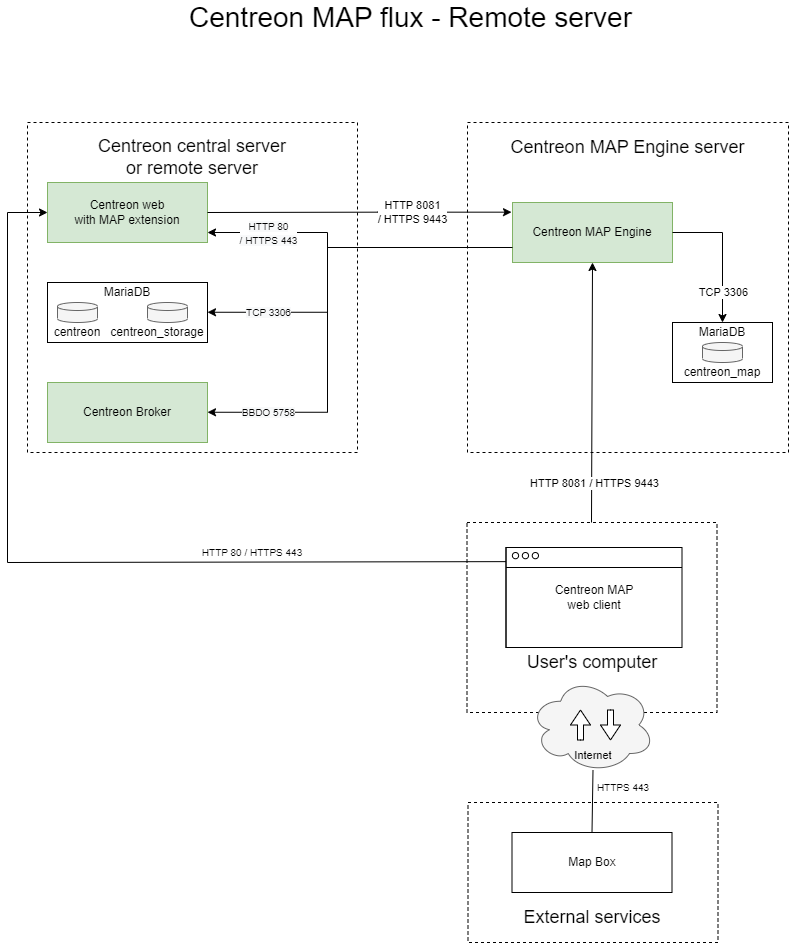

This topic describes the architecture of Centreon MAP.

## Standard architecture

The diagram below summarizes the MAP architecture.

- You can install Centreon MAP either on a dedicated server or on the central server.
- Centreon MAP does not require any installation on your machine; this solution is fully available in the Centreon web interface.

**Table of network flows**

| Application    | Source     | Destination               | Port      | Protocol   | Purpose                                             |
|----------------|------------|---------------------------|-----------|------------|-----------------------------------------------------|
| Map Server     | Map server | Centreon central broker   | 5758      | TCP        | Get real-time status updates                        |
| Map Server     | Map server | Centreon MariaDB database | 3306      | TCP        | Retrieve configuration and other data from Centreon |
| Web            | Map server | Centreon central          | 80/443    | HTTP/HTTPS | Authentication & data retrieval                     |
| Web interface  | User       | Map server                | 8081/9443 | HTTP/HTTPS | Retrieve views & content                            |
| Web interface  | User       | Internet\* (Mapbox)       | 443       | HTTPS      | Retrieve Mapbox data                                |

\* *With or without a proxy*

## Remote server architecture

The diagram below summarizes the MAP architecture when Centreon MAP is installed on a remote server:

