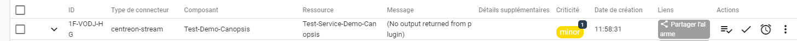

import Tabs from '@theme/Tabs';
import TabItem from '@theme/TabItem';

The Canopsis Events stream connector allows you to send data from Centreon to Canopsis
using their HTTP REST API.

## Before starting

- In most cases, you will want to send data from the central server. It is also possible 
to send it from a remote server or a poller (e.g. if you want to avoid the central 
server being a SPOF, or if you are an MSP and you install the stream connector on a 
poller or a remote server within your customer's infrastructure).
- By default, the Canopsis Events stream connector sends events from 
**[host_status](https://docs.centreon.com/docs/developer/developer-broker-mapping/#host-status)**, 
**[service_status](https://docs.centreon.com/docs/developer/developer-broker-mapping/#service-status)**,  
**[acknowledgement](https://docs.centreon.com/docs/developer/developer-broker-mapping/#acknowledgement)** 
and **[downtime](https://docs.centreon.com/docs/developer/developer-broker-mapping/#downtime)**. 
Broker events. The event format is shown **[here](#event-format)**.
- These events are sent each time a host or a service is checked. Various parameters let 
you [filter out events](#filtering-or-adapting-the-data-you-want-to-send-to-canopsis).

## Compatibility

This stream connector is designed to be compatible with Canopsis' API v.4, this include the following versions of **Canopsis** : 22.10, 
23.04, 23.10 and 24.04.

## Installation

Perform the installation on the server that will send data to Canopsis (central server, 
remote server, poller).

1. Login as `root` on the Centreon central server using your favorite SSH client.

2. Run the following command:

<Tabs groupId="sync">
<TabItem value="Alma / RHEL / Oracle Linux 8" label="Alma / RHEL / Oracle Linux 8">

```shell
dnf install centreon-stream-connector-canopsis
```

</TabItem>

<TabItem value="Alma / RHEL / Oracle Linux 9" label="Alma / RHEL / Oracle Linux 9">

```shell
dnf install centreon-stream-connector-canopsis
```

</TabItem>

<TabItem value="Debian 12" label="Debian 12">

```shell
apt install centreon-stream-connector-canopsis
```

</TabItem>
</Tabs>

## Configuring Canopsis

You will need to configure your Canopsis instance to receive data from Centreon. Refer to the 
[Canopsis user guide](https://doc.canopsis.net/guide-utilisation/menu-administration/droits/)
, in particular check if creation, reading and deletion rights are activated. See the following documentations: 
* [rights administration](https://doc.canopsis.net/guide-utilisation/menu-administration/droits/) 
* [planification administration](https://doc.canopsis.net/guide-utilisation/menu-administration/planification/) (in case of downtimes). 
For the user associated to the **Authentication key** you must modify the rights matrix on the Canopsis **Administration > Rights** page, **API** tab. 
You need to check at least the box listed in this table:

| Section   | Subsection            | Boxes to check                      |
|-----------|-----------------------|-------------------------------------------|
| Global    | Event                 | Check the only available box               |
| PBehavior | PBehaviors            | Check the create, read, update and delete boxes |
| PBehavior | PBehaviors Exceptions | Check the create and read boxes             |
| PBehavior | PBehaviors Reason     | Check the create and read boxes                 |
| PBehavior | PBehaviors Types      | Check the read box                            |

Make sure Canopsis is able to receive data sent by Centreon: flows must not be blocked 
by Canopsis's configuration or by a security equipment.

## Configuring the stream connector in Centreon

1. On your central server, go to **Configuration > Pollers > Broker configuration**.
2. Click on **central-broker-master** (or the appropriate broker configuration if it is 
a poller or a remote server that will send events).
3. On the **Output** tab, select **Generic - Stream connector** from the list and then 
click **Add**. A new output appears in the list.
4. Fill in the fields as follows:

| Field           | Value                                                      |
| --------------- |------------------------------------------------------------|
| Name            | Canopsis events                                            |
| Path            | /usr/share/centreon-broker/lua/canopsis2x-events-apiv2.lua |
| Filter category | Neb                                                        |

5. To enable Centreon to connect to your Canopsis equipment, fill in the following 
mandatory parameters. The fields for the first entry are already present. Click on 
the **+Add a new entry** link located below the **Filter category** table to add 
another one.

| Type   | Name             | Description                     | Example of value |
| ------ |------------------|---------------------------------------|--------------|
| string | canopsis_authkey | Canopsis API authentication key | `an_authkey` |
| string | canopsis_host    | Canopsis host address                 | `a host`     |

6. Fill in any optional parameters you want (using the **+Add a new entry** link):

| Type   | Name              | Description                          | Default value                                      |
| ------ | ----------------- |--------------------------------------------|----------------------------------------------------|
| string | logfile           | File in which logs are written             | /var/log/centreon-broker/canopsis-events-apiv2.log |
| number | log_level         | Logging level from 1 (errors) to 3 (debug) | 1                                                  |

7. Use the stream connector's optional parameters to [filter or adapt the data you want 
Centreon to send to Canopsis](#filtering-or-adapting-the-data-you-want-to-send-to-canopsis).
8. [Deploy the configuration](../../monitoring/monitoring-servers/deploying-a-configuration.md).
9. Restart **centengine** on all pollers:

   ```shell
   systemctl restart centengine
   ```

   Canopsis should now receive data from Centreon.


### Filtering or adapting the data you want to send to Canopsis

All stream connectors have a set of [optional parameters](https://github.com/centreon/centreon-stream-connector-scripts/blob/master/modules/docs/sc_param.md#default-parameters)
, that allow you to filter the data you will send to your Canopsis equipment, to reformat 
the data, to define a proxy...

Each optional parameter has a default value, that is indicated in the corresponding 
documentation.

* To override the default value of a parameter, click on the **+Add a new entry** link 
located below the **Filter category** table to add a custom parameter. For example, if 
you want to only send to Canopsis the events linked to a hostgroup called "Europe", enter:

   ```text
   type = string
   name = accepted_hostgroup
   value = Europe
   ```

* For the Canopsis Events stream connector, the following values always override the 
default values, you do not need to define them in the interface except if you want to 
change their values (for example to remove the downtimes in the **accepted_elements** variable).

| Type   | Name                             | Value explanation                                                                                                                                                             | Default value for the stream connector              | Possible values                                              |
|--------|----------------------------------|-------------------------------------------------------------------------------------------------------------------------------------------------------------------------------|-----------------------------------------------------|--------------------------------------------------------------|
| string | accepted_categories              | Each event is linked to a broker category (neb or bam) that we can use to filter events                                                                                       | neb                                                 | neb or bam                                                   |
| string | accepted_elements                | Centreon element handle by this connector (for more you need to add custom event format input see below), the list of elements needs to be separated by commas without spaces | host_status,service_status,acknowledgement,downtime | host_status or service_status or acknowledgement or downtime |
| string | canopsis_downtime_comment_route  | Canopsis route to send downtime comments                                                                                                                                      | /api/v4/pbehavior-comments                          | /api/v4/pbehavior-comments                                   |
| string | canopsis_downtime_reason_name    | Canopsis reason name for downtimes                                                                                                                                            | Centreon_downtime                                   | -                                                            |
| string | canopsis_downtime_reason_route   | Canopsis route to request "reason" field                                                                                                                                      | /api/v4/pbehavior-reasons                           | /api/v4/pbehavior-reasons                                    |
| string | canopsis_downtime_route          | Canopsis route to send downtime events                                                                                                                                        | /api/v4/pbehaviors                                  | /api/v4/pbehaviors                                           |
| number | canopsis_downtime_send_pbh       | Activate (1) the sending of downtimes if all rules to do it are checked (reason and type exists)                                                                              | 1                                                   | 0 ou 1                                                       |
| string | canopsis_downtime_type_name      | Canopsis downtime type category name                                                                                                                                          | Default maintenance                                 | -                                                            |
| string | canopsis_downtime_type_route     | Canopsis route to request the "type" field (except downtimes)                                                                                                                 | /api/v4/pbehavior-types                             | /api/v4/pbehavior-types                                      |
| string | canopsis_event_route             | Canopsis route to send events                                                                                                                                                 | /api/v4/event                                       | /api/v4/event                                                |
| number | canopsis_port                    | Canopsis port                                                                                                                                                                 | 443                                                 | -                                                            |
| number | canopsis_sort_list_hostgroups    | Activate (1) the sort of hosts groups lists                                                                                                                                   | 0                                                   | 0 ou 1                                                       |
| number | canopsis_sort_list_servicegroups | Activate (1) the sort of services groups lists                                                                                                                                | 0                                                   | 0 ou 1                                                       |
| string | connector                        | Connector type shows in Canopsis interface in Alarms > Connector Type                                                                                                         | centreon-stream                                     | -                                                            |
| string | connector_name                   | Connector name                                                                                                                                                                | centreon-stream-central                             | -                                                            |
| string | connector_name_type              | Connector type                                                                                                                                                                | poller                                              | -                                                            |
| string | sending_method                   | Sending method (only API is available at this moment)                                                                                                                         | api                                                 | api                                                          |
| string | sending_protocol                 | Sending protocol use (can be https or http)                                                                                                                                   | https                                               | http ou https                                                |
| number | use_severity_as_state            | Activate (1) convert the severity as state                                                                                                                                    | 0                                                   | 0 ou 1                                                       |

## Event bulking

This stream connector is not compatible with event bulking at this moment. Meaning that it is not able to send 
more than one event in each call to the Canopsis REST API.

## Event format

This stream connector will send events with the following format.

### Output example for service_status events

```json
[
	{
		"action_url": "",
		"component": "Host-name",
		"connector": "centreon-stream",
		"connector_name": "Central",
		"event_type": "check",
		"host_id": "15",
		"hostgroups": [
			"Group 1",
			"Group 2"
		],
		"long_output": "Plugin's long output",
		"notes_url": "",
		"output": "Plugin's output",
		"resource": "Service-name",
		"service_id": "47",
		"servicegroups": [],
		"source_type": "resource",
		"state": 1,
		"timestamp": 1708693347
	}
]
```

### Output example for host_status events

```json
[
	{
		"action_url": "",
		"component": "Host-1",
		"connector": "centreon-stream",
		"connector_name": "Central",
		"event_type": "check",
		"host_id": "15",
		"hostgroups": [
			"Group 1",
			"Group 2"
		],
		"long_output": "OK: Host is OK",
		"notes_url": "",
		"output": "OK: Host is OK",
		"source_type": "component",
		"state": 0,
		"timestamp": 1708953238
	}
]
```

### Output example for acknowledgement events

```json
[
	{
		"author": "admin",
		"component": "Host-1",
		"connector": "centreon-stream",
		"connector_name": "Central",
		"event_type": "ack",
		"long_output": "Acknowledged by admin",
		"output": "Acknowledged by admin",
		"resource": "passif",
		"source_type": "resource",
		"state": 1,
		"timestamp": 1709052753
	}
]
```

### Output example for downtime events

```json
[
	{
		"_id": "centreon-downtime-8-1715607730",
		"author": "admin",
		"enabled": true,
		"entity_pattern": [
			[
				{
					"field": "name",
					"cond": {
						"type": "eq",
						"value": "Test-Service-Demo-Canopsis/Test-Demo-Canopsis"
					}
				}
			]
		],
		"name": "centreon-downtime-8-1715607730",
		"reason": "XXXX",
		"rrule": "",
		"tstart": 1715607718,
		"tstop": 1715607958,
		"type": "XXXX"
	}
]
```

* Note: In version 22.10 of Canopsis there is also a "color" field.

### Custom event format

This stream connector allows you to change the format of the event to suit your needs. 
It allows you to handle event types that are not handled by default such as 
**ba_status** events.

In order to use this feature you need to configure a json event format file and add 
a new stream connector parameter.

| Type   | Name        | Value                                           |
| ------ |-------------|-------------------------------------------------|
| string | format_file | /etc/centreon-broker/canopsis-events-format.json|

> The event format configuration file must be readable by the **centreon-broker** user.

To learn more about custom event formats and templating files, read
**[this documentation](https://github.com/centreon/centreon-stream-connector-scripts/blob/master/modules/docs/templating.md#templating-documentation)**.

## Curl commands: testing the stream connector

### Configuration of the stream connector

If you want to test that the configuration commands are sent to Canopsis correctly, use the following curl commands.

#### Request pbehavior-reasons route

This command checks that the **pbehavior-reasons** route is accessible and returns the values for the **Reason** field for the downtimes. This allows you to check that the name of the **Reason** field for Centreon downtimes exists (the default value is **Centreon_downtime**).

1. Log in to the server that you configured to send events to Canopsis (your central 
server, a remote server or a poller).
2. Run the following command (replace with your own values):

```shell
curl -X GET -H 'accept: application/json' -H 'x-canopsis-authkey: <canopsis-auth-token>' '<https_canopsis_host_url>:<canopsis_port><canopsis_pbehavior_reasons>'
```

> Replace the *`<xxxx>`* inside the above command with the correct values for authentication to the Canopsis host.
> The default values defined in the connector are **443** for **canopsis_port** and **/api/v4/pbehavior-reasons** for **canopsis_pbehavior_reasons**.


3. Check if the command returns a data structure of this form:
```json
   "data":[
      {
         "_id":"XXXX",
         "description":"DESCRIPTION",
         "name":"NAME"         
      }
   ]
```

#### Request pbehavior-types route

This command checks that the **pbehavior-types** route is accessible and returns the possible IDs for the **Types** of downtimes. This allows you to check that the name of the **Type** field for Centreon downtimes exists (the default value is **Default maintenance**).

1. Log in to the server that you configured to send events to Canopsis (your central 
server, a remote server or a poller).
2. Run the following command:

```shell
curl -X GET -H 'accept: application/json' -H 'x-canopsis-authkey: <canopsis-auth-token>' '<https_canopsis_host_url>:<canopsis_port><canopsis_pbehavior_types>'
```

> Replace the *`<xxxx>`* inside the above command with the correct values for authentication to the Canopsis host.
> The default values defined in the connector are **443** for **canopsis_port** and **/api/v4/pbehavior-types** for **canopsis_pbehavior_types**.

3. Check if the command returns a data structure of this form:
```json
"data":[
      {
         "_id":"ec35c069-1651-4ee1-8944-3e5574e7b516",
         "name":"Default active",
         "description":"Default active",
         "type":"active",
         "priority":2,
         "icon_name":"",
         "color":"#2FAB63"
      },
      {
         "_id":"470c469c-77bc-402c-910f-30a8b2584343",
         "name":"Default inactive",
         "description":"Default inactive",
         "type":"inactive",
         "priority":1,
         "icon_name":"brightness_3",
         "color":"#979797"
      },
      {
         "_id":"5ea9d2d8-0f16-4e19-bcca-64b1e96e00fa",
         "name":"Default maintenance",
         "description":"Default maintenance",
         "type":"maintenance",
         "priority":3,
         "icon_name":"build",
         "color":"#BF360C"
      },
      {
         "_id":"1fb65097-ddaa-4e99-9239-8263095c156c",
         "name":"Default pause",
         "description":"Default pause",
         "type":"pause",
         "priority":4,
         "icon_name":"pause",
         "color":"#5A6D80"
      }
   ]
```
> With the default values of the Canopsis connector, downtimes have the "Default maintenance" type.

#### Request app-info route

This command checks that the **app-info** route is accessible and returns information about the Canopsis host.

1. Log in to the server that you configured to send events to Canopsis (your central 
server, a remote server or a poller).
2. Run the following command:

```shell
curl -X GET -H 'accept: application/json' -H 'x-canopsis-authkey: <canopsis-auth-token>' '<https_canopsis_host_url>:<canopsis_port>/api/v4/app-info'
```

> Replace all the *`<xxxx>`* inside the above command with the correct values for authentication to the Canopsis host.
> The default value defined in the connector for **canopsis_port** is **443**.

3. This command only allows access to the Canopsis version so no need to inspect all the returned content of it.

### Sending events

If you want to test that events are sent to Canopsis correctly:

1. Log in to the server that you configured to send events to Canopsis (your central 
server, a remote server or a poller).
2. Run the following command:

```shell
curl -X POST -H 'content-length: 400' -H 'content-type: application/json' -H 'x-canopsis-authkey: <canopsis-auth-token>' '<https_canopsis_host_url>:<canopsis_port><canopsis_event_route>' -d '[{"hostgroups":[],"component":"Test-Canopsis","host_id":"8","event_type":"check","resource":"passif","output":"Test_passif_output","servicegroups":[],"connector":"centreon-stream","source_type":"resource","action_url":"","long_output":"Test-curl-command Passif long output","notes_url":"","connector_name":"Central","timestamp":1710843117,"service_id":"10","state":1}]'
```

> Replace all the *`<xxxx>`* inside the above command with the correct values for authentication to the Canopsis host. 
> The default values defined in the connector are **443** for **canopsis_port** and **/api/v4/event** for **canopsis_event_route**.

3. Check that the event has been received by Canopsis. The status should appear in the **Alarms > In progress** page of Canopsis.

