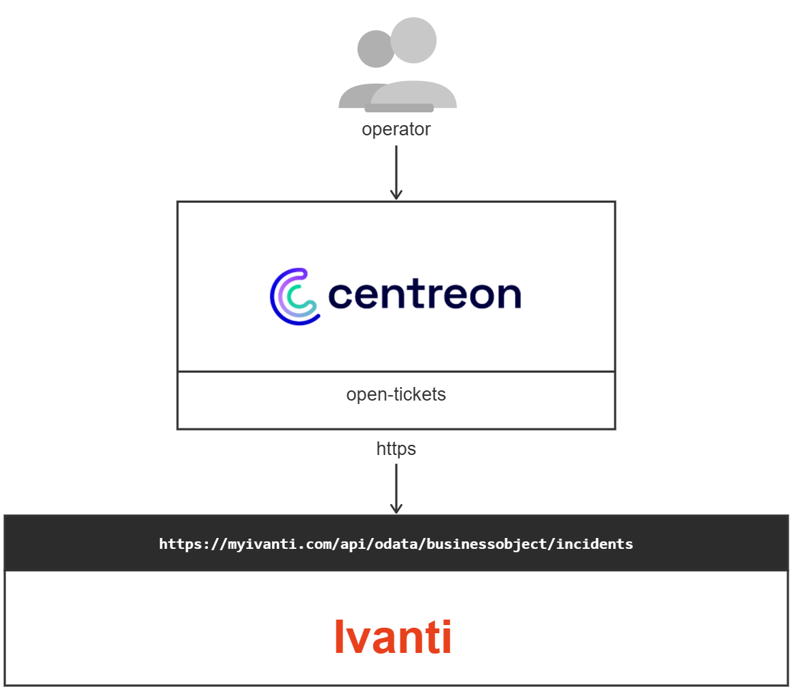

## How it works

The Ivanti provider connects to your Ivanti Neurons for ITSM (formerly known as Ivanti Service Manager / HEAT) instance and creates business objects — such as Incidents — through the Ivanti OData REST API. Authentication is handled via a REST API Key, a Session Key, or a JWT token (when OpenID Connect is enabled on the tenant).

Since the provider queries configuration objects (owners, teams, categories, etc.) from Ivanti at runtime, those values are cached locally. Logging out or waiting 10 hours will flush the cache.



## Compatibility

This integration is (at least) compatible with the following Ivanti Neurons for ITSM versions:

- 2020 and later (OData REST API)
- Ivanti Service Manager (ISM) 2020+

## Requirements

Before going any further, make sure that you have correctly set up
[centreon-open-ticket](https://docs.centreon.com/docs/alerts-notifications/ticketing/#advanced-configuration)
in your Centreon instance.

### Ivanti prerequisites

1. A running Ivanti Neurons for ITSM tenant (on-premise or cloud).
2. A dedicated REST API Key created in the Ivanti Configuration Console under **Configure > Security Controls > API Keys**. Note the **Reference ID** — this is the value used for authorization.
3. The API Key must be bound to a Key Group that has the appropriate roles to create Incidents (or other business objects).

### Provider parameters

| Parameter | Example value |
|---|---|
| Address | `https://mycompany.ivanti.com` |
| API path | `/api/odata/businessobject/` |
| REST API Key | `xxxxxxxx-xxxx-xxxx-xxxx-xxxxxxxxxxxx` |
| Tenant URL | `mycompany.ivanti.com` |
| Protocol | `https` |
| Timeout | `60` |

> **Note:** When using Session Key or JWT Token authentication instead of a REST API Key, set the `Authorization` header accordingly. Refer to the [Ivanti API Authentication documentation](https://help.ivanti.com/ht/help/en_US/ISM/2022/admin/Content/Configure/API/Authentication_of_APIs.htm) for details.

## Endpoint details

Business objects are created via the following base URL:

```
POST https://{tenant url}/api/odata/businessobject/{business object name}s
```

> **Important:** The business object name must be pluralized (suffixed with `s`). For example, to create an Incident, use `incidents`; for a Change, use `changes`.

### Example — Create an Incident

| | |
|---|---|
| **URL** | `https://{tenant url}/api/odata/businessobject/incidents` |
| **Method** | `POST` |
| **Header** | `Authorization: REST {REST API Key}` |
| **HTTP Status (success)** | `201 Created` |

**Minimal request payload:**

```json
{
  "Category": "Hardware",
  "Description": "Ticket opened automatically by Centreon monitoring",
  "Subject": "Host DOWN - server01.example.com",
  "Status": "Logged",
  "Owner": "JDoe",
  "OwnerTeam": "IT Support",
  "RequestorLink_RecID": "<employee RecID>"
}
```

> The `RequestorLink_RecID` field must reference the **RecID** of an existing Employee record in Ivanti. You can retrieve it via:
> ```
> GET https://{tenant url}/api/odata/businessobject/employees?$filter=NetworkUserName eq '{username}'
> ```

### Error responses

| HTTP Code | Ivanti Code | Description |
|---|---|---|
| `400` | `ISM_4000` | Invalid or empty request payload, or missing mandatory field |
| `500` | `ISM_5000` | Internal server error — retry the request |

## Possibilities

As of now, the provider is able to push the following objects to Ivanti:

- **Incidents** (default business object for alerts)
- **Changes** (optional, if configured)
- Any custom business object defined in your Ivanti tenant

It will also populate the following fields from Centreon alert data or from predefined lists. You can extend those lists inside the provider configuration since they are [custom lists](https://docs.centreon.com/docs/alerts-notifications/ticketing/#advanced-configuration):

- Subject (host/service name and status)
- Description (alert output)
- Category
- Status
- Impact
- Urgency
- Owner / OwnerTeam

## Additional resources

- [Ivanti REST API — Create a Business Object](https://help.ivanti.com/ht/help/en_US/ISM/2020/admin/Content/Configure/API/Create-a-Business-Object.htm)
- [Ivanti REST API Authentication](https://help.ivanti.com/ht/help/en_US/ISM/2022/admin/Content/Configure/API/Authentication_of_APIs.htm)
- [Ivanti REST API Key setup](https://help.ivanti.com/ht/help/en_US/ISM/2023/admin-user/Content/Configure/API/Using-REST-API-Key.htm)
