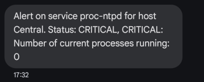

You can send notification SMS using an SMS provider and a custom notification command in Centreon. Here is an example with OVH SMS.

## Configuring SMS notifications

### Prerquisites

In our example, with OVH SMS, we need:

* an OVH SMS account. Its name will look like **sms-ab1234-1**.
* the credentials to access this account
* A [properly configured OVH SMS user](https://help.ovhcloud.com/csm/en-gb-sms-users?id=kb_article_view&sysparm_article=KB0051415), that is authorized to use this account.

### Step 1: Install the Centreon SMS notifications plugin

1. Install Git on each poller that will send SMS notifications.
2. On each poller, execute the following commands:

```bash
git clone https://github.com/centreon/centreon-plugins.git /usr/lib/centreon/plugins/git-plugins
```

### Step 2: Create notification commands

1. Go to **Configuration > Commands > Notifications**, then click **Add**.
2. Create a command that will send SMS for hosts and a command that will send SMS for services (replace the sample values and the name of the plugin by the ones you want):

   * Example for a host:

   ```bash
   $CENTREONPLUGINS$/git-plugins/src/centreon_plugins.pl --plugin=notification::ovhsms::plugin --mode=alert --account=sms-ab1234-1 --login=XXXX --password=XXXX --from="Centreon" --to="0033123456789" --message='Alert on host $HOSTNAME$. Status: $HOSTSTATE$, $HOSTOUTPUT$'
   ```

   * Example for a service:

   ```bash
   $CENTREONPLUGINS$/git-plugins/src/centreon_plugins.pl --plugin=notification::ovhsms::plugin --mode=alert --account=sms-ab1234-1 --login=XXXX --password=XXXX --from="Centreon" --to="0033123456789" --message='Alert on service $SERVICEDESC$ for host $HOSTNAME$. Status: $SERVICESTATE$, $SERVICEOUTPUT$'
   ```

* **--account**: in our example, this is the name of the OVH account used to send SMS.
* **--from** : in our example, an SMS user that is authorized for this account.

3. [Deploy the configuration](../../monitoring/monitoring-servers/deploying-a-configuration.md).

### Step 3: Configure the user and host

1. Go to **Configuration > Users > Contacts/Users**.
2. Create a dedicated user (e.g., **sms**) and in the **Host Notification Commands** and **Service Notification Commands** fields, select the commands your have created at step 2. Also select values for the **Host/service Notification Options** and **Host/service Notification Period** fields.
3. For the hosts you want, on the **Notification** tab, in the **Linked contacts** field, select the dedicated user you just created.
4. [Deploy the configuration](../../monitoring/monitoring-servers/deploying-a-configuration.md). A notification SMS will now be sent to the number you defined when the status changes you have configured go to HARD.



> The sms process is not parallelized. This means that no check will processed until the last SMS is sent by the server.

## Troubleshooting

* If you are not receiving SMS notifications, check **centengine**'s log file:

```shell
tail -f /var/log/centreon-engine/centengine.log
```

* You can also try to execute your notification command from the command line (run the command as user **centreon-engine**) and see if you receive the SMS instantly or not.
