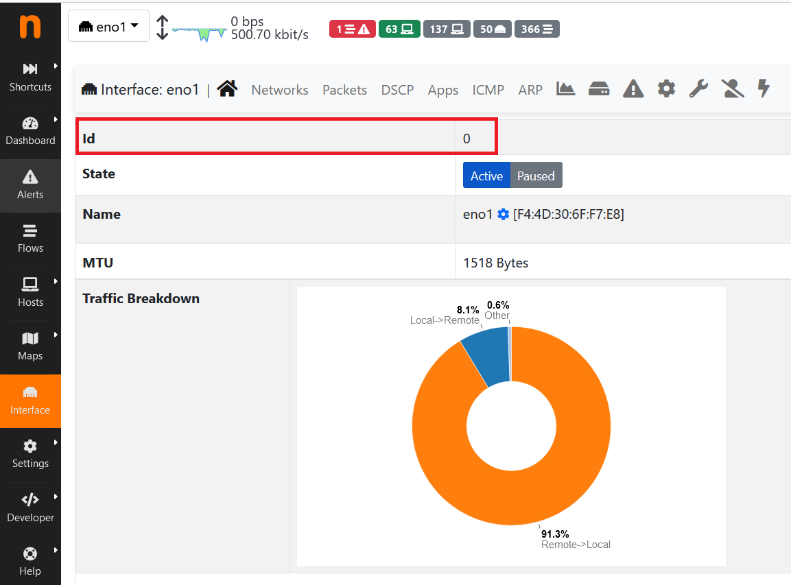
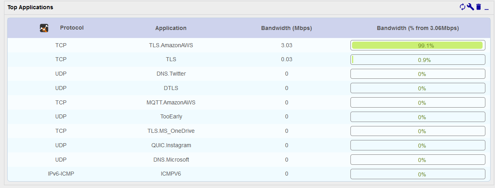

import Tabs from '@theme/Tabs';
import TabItem from '@theme/TabItem';

Use the NtopNG widget in [custom views](../../alerts-notifications/custom-views.md) to view data about network usage collected by an NtopNG server.

The widget can display the following views (see [**Examples**](#examples) below):

* **Top N Local address** : Display the n local hosts that receive/emit the most traffic
* **Top N Remote address** : Display the n remote hosts that receive/emit the most traffic
* **Top N Flows** : Display the top n flows by network usage (local/remote hosts and ports)
* **Top N Applications** : Display the n applications that emit/receive the most traffic (group flows by application)

## Install the widget

1. Install the following package on the central server:
  
<Tabs groupId="sync">
<TabItem value="Alma / RHEL / Oracle Linux 8" label="Alma / RHEL / Oracle Linux 8">

```shell
dnf install centreon-widget-ntopng-listing
```

</TabItem>
<TabItem value="Alma / RHEL / Oracle Linux 9" label="Alma / RHEL / Oracle Linux 9">

```shell
dnf install centreon-widget-ntopng-listing
```

</TabItem>
<TabItem value="Debian 11 & 12" label="Debian 11 & 12">

```shell
apt update && apt install centreon-widget-ntopng-listing
```

</TabItem>
</Tabs>


2. On page **Administration > Extensions > Manager**, install the **NtopNG** widget.

## Configure the widget

To configure the widget, click on the wrench icon in its top right corner. A window opens:


### NtopNG Probe

* **Login**: Account used to access NtopNG (we recommend not to use an admin account)
* **Password**: Password for this account
* **Probe**: IP address of your NtopNG server
* **Protocol**: Protocol to use to connect to NtopNG (https by default)
* **Port**: Network port to connect to NtopNG (TCP/3000 by default)
* **Interface**: ID of the interface. You can find it in the NtopNG interface, on page **Interface**:



### View

* **Mode**: Select the data you want to display
* **Top**: Define how many lines should be displayed

### Filters

Those filters only work for the **Top N Flows** view. You can filter on an IP address, on a port, or on both.

* **IP Address**: Display only the traffic related to a specific IP Address (do not use a hostname)
* **Port**: Display only the traffic on this particular port.

### Misc

* **Refresh interval (seconds)**: Define how often the data should be refreshed.

## Examples

### Top N Local address


### Top N Remote address


### Top N Flows

Widget without a filter:


Widget with a filter on an IP address:


Widget with a filter on a port and an IP address:


### Top N Applications


