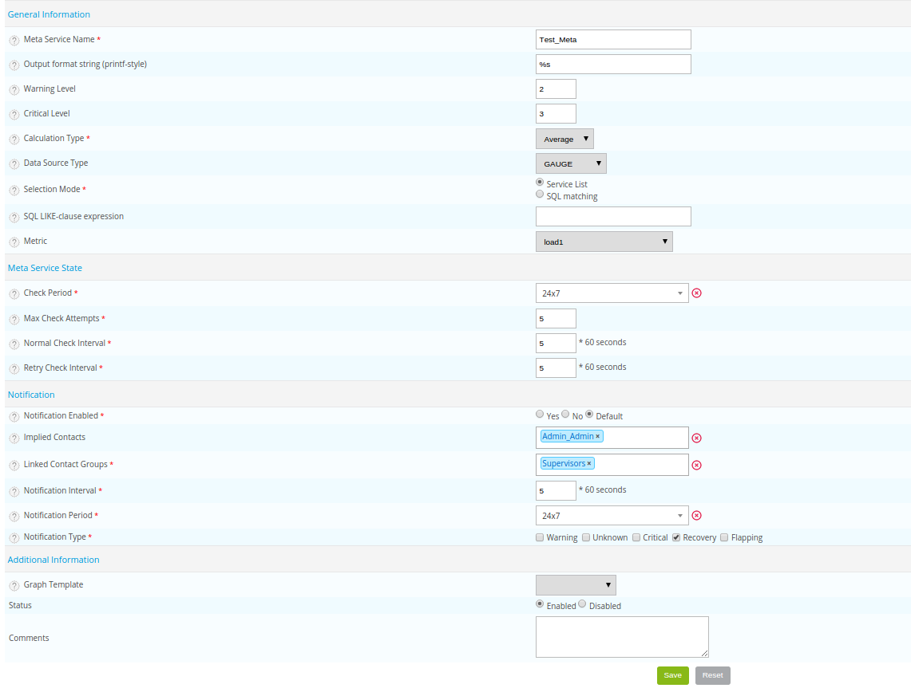
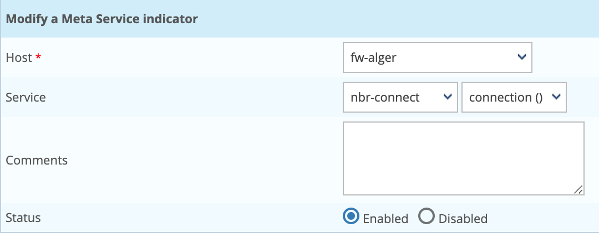

## Definition

A meta-service is a virtual service providing the aggregation of metrics from different services via a mathematical
operation. Meta-services are managed in the same way as a service, i.e. they have thresholds, a notification process,
generate a performance graph, etc.

Example: It is possible to determine the total consumption of WAN traffic by adding together, within a meta-service, all
the services supervising the WAN traffic individually.

### Types of computing

Several types of calculation are possible on the metrics retrieved:

* **Average**: calculate the average of the performance data
* **Sum**: calculate the sum of the performance data
* **Min**: retrieve the minimum of all the performance data
* **Max**: retrieve the maximum of all the performance data

### Types of data source

The result of the calculation is an item of performance data (metric), which generates a performance graph. To trace the
result most effectively, it is necessary to select the type of data source (GAUGE by default).

The types of data source available are as follows:

* The **GAUGE** type records an instantaneous value (temperature, humidity, processor, etc.)
* The **COUNTER** type records an incremental value in relation to the previous result
* The **DRIFT** type stores the derivative of the line from the last to the current value of the data. This can be useful
  for capacities, for example to measure the rate of people entering or leaving a room.
* The **ABSOLUTE** type is for counters which reset on reading. It is used for fast counters that have a tendency to overrun.

> More information on the *[RRDTools website](http://oss.oetiker.ch/rrdtool/doc/rrdcreate.en)*.

## Configuration

To add a meta-service:

Go to **Configuration \> Services \> Meta Services** and click **Add**:

### General information

* The **Meta Service Name** field corresponds to the name of the meta-service displayed in the interface. The only authorized special characters are: slash, hyphen and underscore.
* The **Output format string (printf-style)** field corresponds to the output message (‘output’) visible in Centreon.
  The “%d” value corresponds to the value calculated by the meta-service
* The **Warning level** and **Critical level** correspond to the “WARNING” and “CRITICAL” thresholds of the meta-service
  respectively.
* The **Calculation Type** and **Data source Type** fields correspond to the calculations and the description of the
  data source, respectively
* The **Selection Mode** field is used to select the services containing the metrics that will be used in the meta-service calculation.

If the **Service list** selection mode is selected, the metrics chosen will be obtained from services selected manually.

If the **SQL matching** selection mode is selected, the services used will be selected automatically by Centreon via a search
based on the LIKE type SQL expression to be searched field. The metric to be used in this case will be selected from the
Metric dropdown list.

> More information on *[PRINTF formatting](http://en.wikipedia.org/wiki/Printf_format_string)*.

### Meta Service status

* The **Check Period** field defines the time period during which the scheduler checks the status of the meta-service.
* The **Max Check Attempts** field defines the number of checks to be made before confirming the status of the meta-service:
  when the status is valid, a notification is sent.
* The **Normal Check Interval** field is expressed in minutes. It defines the interval between checks when the status of
  the meta-service is OK.
* The **Retry Check Interval** field is expressed in minutes. It defines the checking interval of the Not-OK status of
  the meta-service.

### Notification 

* The **Notification Enabled** field is used to enable the notifications.
* The **Linked Contacts Groups** list is used to define the groups of contacts that will be alerted.
* The **Notification Interval** field is expressed in minutes and can be used to define the time interval between the
  sending of two notifications.
* The **Notification Period** field can be used define the notification period.
* The **Notification Type** field defines the types of notification sent.

### Additional information

* The **Graphic Template** list defines the graphic model used by this meta-service.
* The **Status** and **Comments** fields are used to enable / disable or comment on the meta-service.

## Select services manually

If you have chosen the **Service list** option, in the screen containing all the meta-services:

1. Click the following icon to select the metrics entering into the calculation of the meta-service. These
  metrics are called indicators. 
2. Click **Add**

* The **Host** field is used to select the host to which the service to be selected belongs.
* The **Service** field is used to choose the service (first list) as well as the metric in this service (second list).
* The **Status** and **Comment** fields are used to enable / disable or comment on the indicator.

3. Repeat the operation until you have added all the indicators necessary for the calculation of the meta-service.

> A meta-service should be considered as a regular service. It is necessary to generate the configuration of the central
> scheduler to export it and then restart the scheduler.
