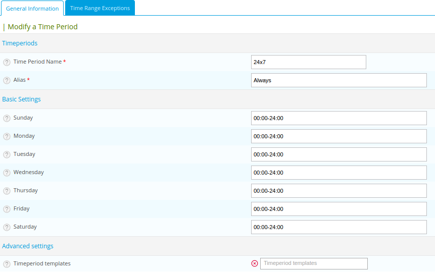

## Definition

Time periods define a time interval for each day of the week. They enable the functionality of the scheduler over a given period of time. They apply to two types of actions:

* The execution of check commands
* The sending of notifications.

## Configuration

To configure a time period, go to **Configuration \> Users \> Time periods**.

1. In the **Time Period Name** and **Alias** fields, enter a name and a description.

2. In the **Basic settings** section, for each day of the week, define the time periods during which the checks and notifications will be enabled. (Use the [syntax described below](#syntax-of-a-time-period).) 

    - These definitions are applied every week, indefinitely.
    - If you leave the field blank for a specific day, there will be no monitoring on that day for actions to which this time period is applied.

3. Use the [**Time Range Exceptions** tab](#time-range-exceptions-tab) to include days that would not normally belong to the time period.

4. Once you have created your time period, you can use it:
    - In the **Check Period** field for hosts, host templates, services and service templates.
    - In the **Notification Period** field for notifications defined for hosts, host templates, services, service templates, contacts, or in the **Escalation Period** field for an escalation of notifications. 

### Syntax of a time period

Use the following characters to define time periods:

* The character “:” separates the hours from the minutes, e.g.: HH:MM
* The character “-” indicates continuity between two time periods
* The character ”,” separates two time periods

Here are a few examples:

* 24 hours a day and 7 days a week: 00:00-24:00 (to be applied to every day of the week).
* From 8 AM to noon and from 2 PM to 6:45 PM on weekdays: 08:00-12:00,14:00-18:45 (to be applied to weekdays only).
* To not monitor during a whole day, leave the corresponding field blank.

### Time Range Exceptions tab

The **Time Range Exceptions** tab allows you to include exceptional days in the time period. The periods you define here override the definition of regular days defined in **Basic Settings**.

Example: An administrator wants to define a time period which covers the times when the offices are closed, i.e.:

* From 6 PM to 7:59 AM on weekdays
* Around the clock on weekends
* National holidays and exceptional closure days.

To be able to define the national holiday days and the exceptional closure days, it is necessary to use exceptions.

To add an exception, in the **Exceptions** field, click **Add new entry**. For each exceptional day, you will need to define a time period. 

> Use the following syntax to exclude whole days from the supervision: 00:00-00:00.

The table below shows some possible examples:

| Day(s)            | Time period             | Meaning                                                   |
| ----------------- | ----------------------- | --------------------------------------------------------- |
| january 1         | 00:00-24:00             | All day on the 1st of January, every year.                |
| 2014-02-10        | 00:00-24:00             | All day on 10 February 2014                               |
| july 1 - august 1 | 00:00-24:00             | All day, every day from July 1 to August 1, every year    |
| november 30       | 08:00-19:00             | From 08h00 to 19h00 every November 30, every year         |
| day 1 - 20        | 00:00-24:00             | All day from the 1st to the 20th of every month           |
| saturday -1       | 08:00-12:00,14:00-18:45 | Every last Saturday of the month during opening hours     |
| monday -2         | 00:00-24:00             | All day every second to last Monday of the month          |
| june 6 - june 21  | 00:00-00:00             | Do not monitor all day, every day from June 6th to the 21st        |
| june 12           | 00:00-08:00,18:00-24:00 | Monitor every June 12th, except between 08h00 and 18h00 |

> Exceptions are not taken into account in [BAM](../../service-mapping/introduction.md), and in reports concerning BAM in [MBI](../../reporting/introduction.md).
