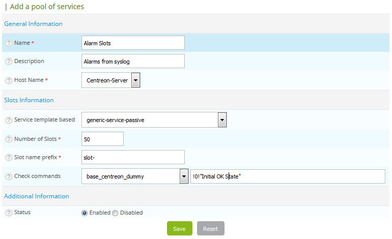
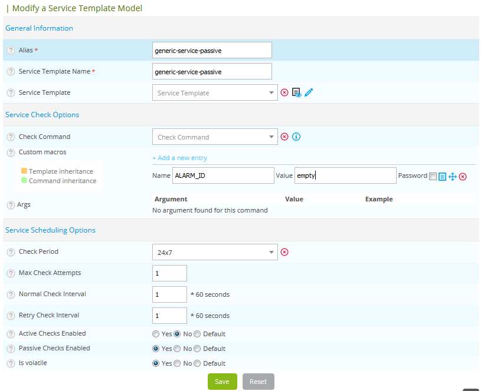
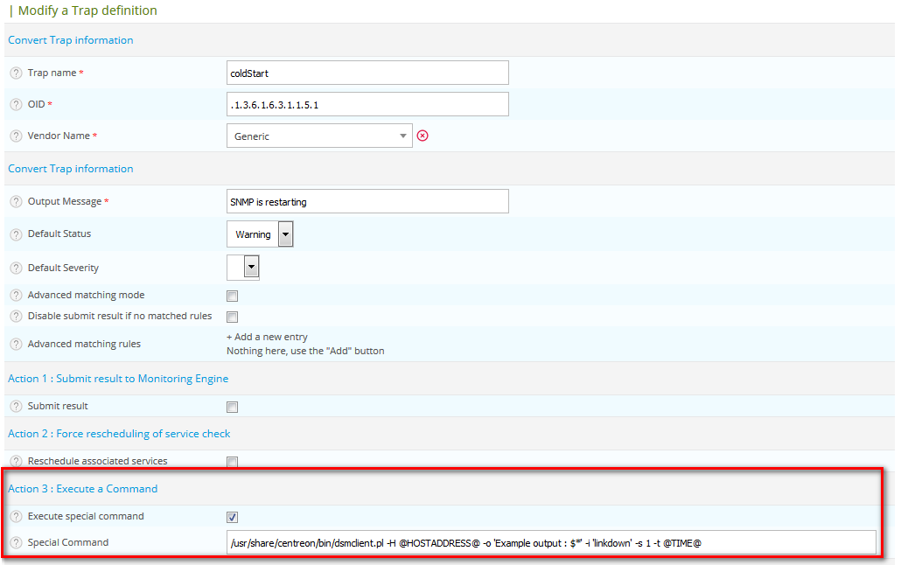

import Tabs from '@theme/Tabs';
import TabItem from '@theme/TabItem';

The Centreon Dynamic Service Management module (Centreon-DSM) is an extension to manage alarms with an eventlogs system.
With DSM, Centreon can receive events such as SNMP traps resulting from the detection of a problem and assign events
dynamically to a slot defined in Centreon, like a trap event.

A resource has a set number of "slots" (containers) on which alerts will be assigned (stored). Until this event has
been taken into account by a human action, it will remain visible in the Centreon interface. When the event is
acknowledged, the slot becomes available for new events.

The purpose of this module is to improve Centreon’s basic trap management system.

## Installation

### On a central server

This section describes how to install **Centreon DSM** on a central server. The Centreon DSM server and client will be installed on the
main server.

Run the command:

<Tabs groupId="sync">
<TabItem value="Alma / RHEL / Oracle Linux 8" label="Alma / RHEL / Oracle Linux 8">

``` shell
dnf install centreon-dsm-server centreon-dsm-client
```

</TabItem>
<TabItem value="Alma / RHEL / Oracle Linux 9" label="Alma / RHEL / Oracle Linux 9">

``` shell
dnf install centreon-dsm-server centreon-dsm-client
```

</TabItem>
<TabItem value="Debian 11 & 12" label="Debian 11 & 12">

``` shell
apt install centreon-dsm-server centreon-dsm-client
```

</TabItem>
</Tabs>

After installing the rpm, you must finish installing the module through the web frontend. Go to
**Administration > Extensions > Manager** and search for **dsm**. Click **Install selection**.
Your Centreon DSM Module is now installed.

You can now start and enable the daemon on your server:

```shell
systemctl enable dsmd
systemctl start dsmd
```

### On a poller

This part is to install **Centreon DSM** on a poller. Only the client will be installed.

Run the command:

<Tabs groupId="sync">
<TabItem value="Alma / RHEL / Oracle Linux 8" label="Alma / RHEL / Oracle Linux 8">

``` shell
dnf install centreon-dsm-client
```

</TabItem>
<TabItem value="Alma / RHEL / Oracle Linux 9" label="Alma / RHEL / Oracle Linux 9">

``` shell
dnf install centreon-dsm-client
```

</TabItem>
<TabItem value="Debian 11 & 12" label="Debian 11 & 12">

``` shell
apt install centreon-dsm-client
```

</TabItem>
</Tabs>

You must now create an access from the poller to the DBMS server on the **centreon_storage** database.

## Architecture

The event must be transmitted to the server via an SNMP trap. The SNMP trap is thus collected by the
**snmptrapd daemon**. If the reception parameters are not valid (authorized community), the event is deleted.

Once the SNMP trap has been received, it is sent to the **centreontrapdforward** script, which writes the information
received in a buffer folder (by default: **/var/spool/centreontrapd/**).

The **centreontrapd** service reads the information received in the buffer folder and interprets the traps received
checking, in the centreon database, the actions necessary to process these events. In Centreon DSM we execute a **special command**.

This special command is executing binary **dsmclient.pl** with arguments. This client will store the new trap in a slot
queue that the daemon reads every 5 seconds.

The daemon **dsmd.pl** will search in the "centreon" database for name slots (pool service liabilities) associated with the host.
If no slot is created, the event is deleted. Otherwise, the process will search to find out if there is at least one free slot. If at
least one slot is free, then it will transmit external commands to the monitoring engine to change the state of the slot.
Otherwise, the data will wait for a slot to be released. To be releasable, a slot must be created by a
passive service template.

## Configuration

### Configure Slots

Go to **Administration > Modules > Dynamic Services** and click **Add**



Please use the table below understand the roles of all the parameters:

* **Name**: This is the name of the slot group.
* **Description**: This is the description of the group.
* **Host Name**: The name which hosts the slots.
* **Service template based**: The base service template used to create service slots on the host. This template must
  have been a passive template. This template must be 100% passive and a custom macro must be created on it. The
  macro is named **ALARM_ID** and the default value must be **empty**.
* **Number of slots**: The number of slots that Centreon will create on the selected host when the form is validated.
* **Slot name prefix**: The prefix is used to name the slots. The name will be followed by a number incremented
  from 0 to the number of slots.
* **Check command**: This check command is used when the service has to be forced in order to free a slot. The check
  command must send an ok return code.
* **Status**: The status of the slot.

An example of a passive service template is available below:



> The macro **ALARM_ID** is mandatory. The default **empty** value is also necessary.

When you validate the form, Centreon will create or update all slots. If you have not changed any value, you do not
need to perform any other action. Otherwise, you must *[deploy the configuration](../monitoring-servers/deploying-a-configuration.md)*.

### Configure traps

The last step is to configure the traps that you want to redirect to your slots.

Edit an SNMP trap that you want to redirect to slot systems. Go to **Configuration > SNMP traps > SNMP traps**
and edit an SNMP trap definition.

In order to redirect alarms to slots, enable **Execute special command** in the form and add the following
command to the **special command** field:

```shell
/usr/share/centreon/bin/dsmclient.pl -H @HOSTADDRESS@ -o 'Example output : $*' -i 'linkdown' -s 1 -t @TIME@
```

Each trap receives this command in order to redirect alarms to dsmd daemon.

This command takes some parameters. You can find the list and the description of each parameter in the following table:

* **-H**: Host address (ip or name) in which you want to redirect the alarm. You can enter the value @HOSTADDRESS@ in
  order to keep the same host, or you can use whatever you want in order to centralize all alarms on the same virtual
  host, for example, that hosts all alarms.
* **-o**: This is the output that dsm will provide when the command submits the result in the correct slot. This output
  can be built with all $* values and with a specific string that you set as a parameter.
* **-i**: This is the id of the alarm. The alarm id can be built by concatenating some variables such as “$1-$4”.
  The id enables the possibility to use the option of auto-acknowledgement of an alarm when you have the possibility to
  create the same id during the opening and closing treatment of the alarm.
* **-s**: This is the status that you want to enter as a parameter to the alarm. You can use @STATUS@ in order to use the
  inherited status build from the matching rule system.
* **-t**: This is the time that you want to set to dsm in order to keep the real trap reception time.
* **-m**: This is the list of macros and its values that you want to update during the treatment of the alarm. Please
  use the following syntax: macro1=value1|macro2=value2|macro3=value3 This function is used to update some parameters in
  live on the Centreon-Engine core memory without a restart.

Your form should now be like this:



After saving the form, please generate the
*[SNMP traps database definition](monitoring-with-snmp-traps.md#Applying-the-changes)*.

### Configure Trap links

One thing that is different compared to the Centreon Trap system is that you cannot directly link the service template of the
slot to the trap in order to not receive the trap x times (here, x represents the number of slots).

You must link traps to an active service of the resource, for example the **Ping** service.

## Administration

### Advanced configuration

It is possible to overwrite the default configuration of the module by creating/editing the
**/etc/centreon/centreon_dsmd.pm** file:

```shell
%centreon_dsmd_config = (
    # which user will send action
    centreon_user => 'centreon',
    # timeout to send command
    submit_command_timeout => 5,
    # custom macro used to keep alarm ID
    macro_config => 'ALARM_ID',
    # number of alarms retrieved from the cache for analysis
    sql_fetch => 1000,
    # interval in seconds to clean locks
    clean_locks_time => 3600,
    # duration in seconds to keep locks
    clean_locks_keep_stored => 3600,
);

1;
```

### Purging cache

All actions performed by the DSMD engine are logged in the database
**centreon_storage**. A cron is provided to delete the data based on retention.

To modify the retention period, by default **180 days**, you can create/edit the
**/etc/centreon/centreon_dsmd.pm** file:

```shell
%centreon_dsm_purge_config = (
    # period in days
    history_time => 180,
);

1;
```

To modify the hour of the cron job, you can edit the **/etc/cron.d/centreon-dsm** file:

```shell
#####################################
# Centreon DSM
#

30 22 * * * root /usr/share/centreon/www/modules/centreon-dsm//cron/centreon_dsm_purge.pl --config='/etc/centreon/conf.pm' --severity=error >> /var/log/centreon/centreon_dsm_purge.log 2>&1
```
