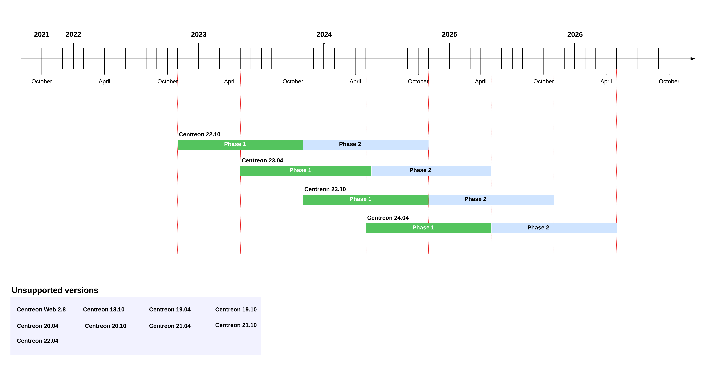

import Tabs from '@theme/Tabs';
import TabItem from '@theme/TabItem';

Centreon has been publishing new releases of the
Centreon solution at regular intervals since version 18.10, enabling the community, businesses and
developers to plan their roadmaps with the guarantee of upstream visibility on the
latest open source capabilities.

## Version numbers

Releases of Centreon are named according to the year and period of delivery: 
XX.04 for the spring release, and XX.10 for the fall release.
For example, Centreon 21.04 was released in spring 2021. All modules and
components of the Centreon software suite use the same version numbers.

## Release frequency

<Tabs groupId="sync">
<TabItem value="From version 24.10" label="From version 24.10">

Starting with Centreon 24.10, Centreon will release **one major version per year**.

Minor versions, with bug fixes and minor improvements will be released on a monthly basis. A Service Pack version, cumulating all minor versions changes, will typically be delivered after six months.

## Maintenance and security updates

- All Open Source major versions are supported for 18 months.
- Commercial major versions released in 2024, 2026 and any even years are LTS versions (supported for 3 years).
- Commercial major versions released in 2025, 2027 and any odd years are supported for 18 months.

## Lifecycle

The lifecycle of a version is divided into three phases:

1.  First phase: Bugs of all severity levels (minor, major, critical, blocker)
    and security issues are fixed according to their priority. Functional enhancements are added.
2.  Second phase: Major, critical bugs and blockers, or security issues are
    fixed according to their priority.
3.  Third phase: Blockers or security issues are fixed according to their priority.

> The prioritization is determined by Centreon’s Product team.

The first phase of the lifecycle begins on the day of a version release.

The second phase of a version begins when the next major version is available. For example, the release of Centreon 25.10 triggers the second phase of Centreon 24.10.

The third phase of a version begins when the second next major version is available. For example, the release of Centreon 26.10 triggers the third phase of Centreon 24.10 and the second phase of Centreon 25.10.

### Version lifecycle diagram

This diagram outlines the Centreon version lifecycle policy from version 24.10:

## Maintenance table for Centreon versions

> Any other products not described in the following tables are no longer supported
> by Centreon.

| Product        | Release      | End of support| State               |
|----------------|--------------|---------------|---------------------|
| Centreon 24.04 | 04/2024      | 04/2026       | Supported           |
| Centreon 23.10 | 10/2023      | 10/2025       | Supported           |
| Centreon 23.04 | 04/2023      | 04/2025       | Supported           |
| Centreon 22.10 | 10/2022      | 10/2024       | No longer supported |
| Centreon 22.04 | 05/2022      | 05/2024       | No longer supported |
| Centreon 21.10 | 11/2021      | 11/2023       | No longer supported |
| Centreon 21.04 | 04/2021      | 10/2022       | No longer supported |
| Centreon 20.10 | 10/2020      | 05/2022       | No longer supported |
| Centreon 20.04 | 04/2020      | 10/2021       | No longer supported |

</TabItem>
<TabItem value="Until version 24.04" label="Until version 24.04">

Centreon delivers two releases per year. The first will occur in the spring and will be major (including new products or features as well as larger architecture changes), while the second will be in the fall and will be minor (including primarily enhancements and fixes to existing features). Between these two, Centreon will regularly deliver minor updates (versioned YY.MM.NN), including security/vulnerability fixes, bug fixes and enhancements to the software.

## Maintenance and security updates

### Until version 21.04

Version 21.04 and prior versions were supported for 18 months. The lifecycle of a version is divided into three phases:

1.  First phase: Bugs of all severity levels (minor, major, critical, blocker)
    and security issues are fixed according to their priority.
2.  Second phase: Major, critical bugs and blockers, or security issues are
    fixed according to their priority.
3.  Third phase: Blockers or security issues are fixed according to their priority.

> The prioritization is determined by Centreon’s Product team.

The first phase of the lifecycle begins on the day of a version release.

The second phase of a version begins when the next major version is available.
For example, the release of Centreon 21.04 triggers the second phase of Centreon
20.10.

The third phase of a version begins when the second next major version is
available. For example, the release of Centreon 21.04 triggers the third phase of
Centreon 20.04 and the second phase of Centreon 20.10.

### From version 21.10

Since version 21.10, versions are supported for two years. The lifecycle of a version is divided into two phases of 12 months each.

1.  First phase: Bugs of all severity levels (minor, major, critical, blocker)
    and security issues are fixed according to their priority.
2.  Second phase: Major, critical bugs and blockers, or security issues are
    fixed according to their priority.

> The prioritization is determined by Centreon’s Product team.

### Version lifecycle diagram

This diagram outlines the Centreon version lifecycle policy until version 24.04:

## Maintenance table for Centreon versions

> Any other products not described in the following tables are no longer supported
> by Centreon.

| Product        | Release      | End of support| State               |
|----------------|--------------|---------------|---------------------|
| Centreon 24.04 | 04/2024      | 04/2026       | Supported           |
| Centreon 23.10 | 10/2023      | 10/2025       | Supported           |
| Centreon 23.04 | 04/2023      | 04/2025       | Supported           |
| Centreon 22.10 | 10/2022      | 10/2024       | No longer supported |
| Centreon 22.04 | 05/2022      | 05/2024       | No longer supported |
| Centreon 21.10 | 11/2021      | 11/2023       | No longer supported |
| Centreon 21.04 | 04/2021      | 10/2022       | No longer supported |
| Centreon 20.10 | 10/2020      | 05/2022       | No longer supported |
| Centreon 20.04 | 04/2020      | 10/2021       | No longer supported |
| Centreon 19.10 | 10/2019      | 04/2021       | No longer supported |
| Centreon 19.04 | 04/2019      | 10/2020       | No longer supported |
| Centreon 18.10 | 10/2018      | 04/2020       | No longer supported |

</TabItem>
</Tabs>
