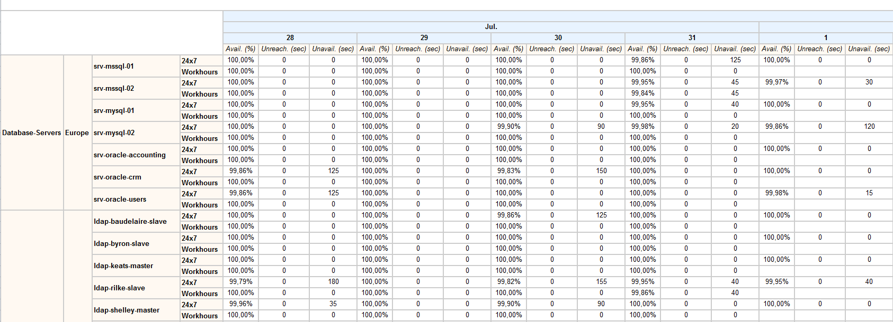
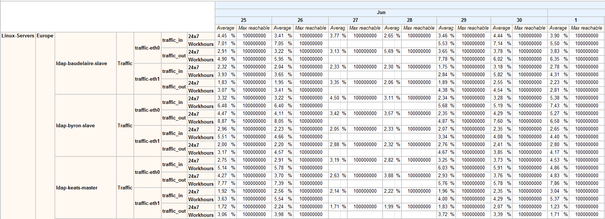
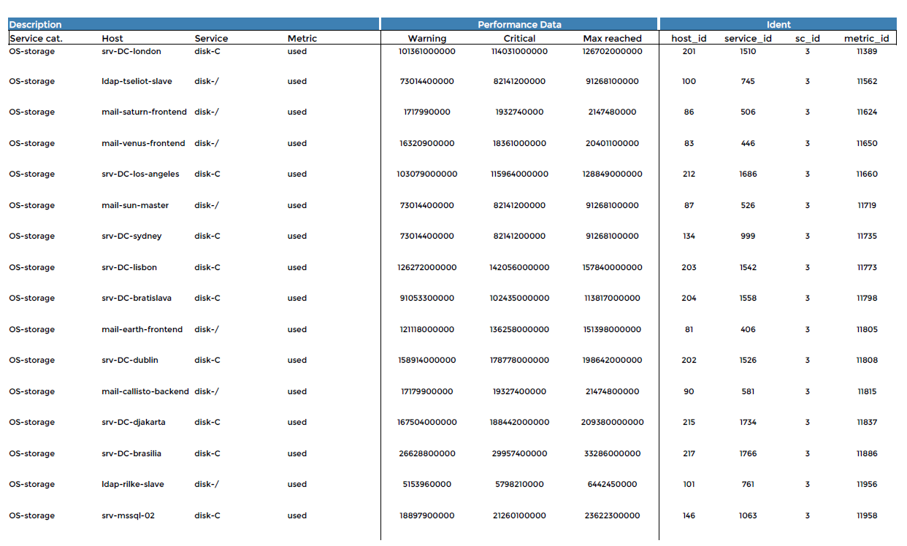

### Content-diagnostic

#### Description

This report enables you to check whether availability and performance
data aggregated by days and months are present in the database.

Color coding is used to display data by host group, host category and
time period.

- Green = a value is available
- Red = no value is available

> This report does not describe data quality, only data availability.

#### Parameters

Parameters required for the report:

- The reporting period
- The following Centreon objects:

| Parameter          | Parameter type | Description                    |
|--------------------|----------------|--------------------------------|
| Host group         | Multi select   | Select host group.             |
| Service Categories | Multi select   | Select service category.       |
| Host Categories    | Multi select   | Select host category.          |
| Metrics            | Multi select   | Specify metrics for filtering. |

### Content-diagnostic-availability

#### Description

This report provides a calendar view of host availability, displaying
the following information: availability of each host by day,
unavailability and unreachability. This data is shown for each time
period and organized by group and category.

#### Parameters

Parameters required for the report:

- The reporting period
- The following Centreon objects:

| Parameter        | Parameter type | Description             |
|------------------|----------------|-------------------------|
| Host group       | Drop-down list | Select host group.      |
| Hosts Categories | Multi select   | Select host categories. |

### Content-diagnostic-service-availability

#### Description

This report provides a calendar view of service availability,
displaying the following information: availability for each service by
day, warning time and critical time. This data is shown for each time
period and organized by group, host category and service category.

#### Parameters

Parameters required for the report:

- The reporting period
- The following Centreon objects:

| Parameter          | Parameter type | Description                |
|--------------------|----------------|----------------------------|
| Host group         | Drop-down list | Select host group.         |
| Hosts Categories   | Multi select   | Select host categories.    |
| Service Categories | Multi select   | Select service categories. |

### Content-diagnostic-performance

#### Description

This report provides a calendar view of average values by metrics and
time periods. It also indicates the maximum value reachable for each
metric. Data is organized by group, host and service categories.

#### Parameters

Parameters required for the report:

- The reporting period
- The following Centreon objects:

| Parameter          | Parameter type | Description                |
|--------------------|----------------|----------------------------|
| Host group         | Drop-down list | Select host group.         |
| Hosts Categories   | Multi select   | Select host categories.    |
| Service Categories | Multi select   | Select service categories. |
| Metrics            | Multi select   | Select metrics to include  |

### Metric-integrity-check

#### Description

This report checks the compatibility between the plugins/metrics and the
MBI performance reports. It allows you to quickly identify incompatible
services and to update the plugins.

#### How to interpret the report

If a warning is displayed on a line:

- Warning and Critical thresholds are not set.
- The maximum value was not returned by the plugin.

#### Parameters

Parameters required for the report:

- The reporting period
- The following Centreon objects:

| Parameter          | Parameter type | Description                |
|--------------------|----------------|----------------------------|
| Service Categories | Multi select   | Select service categories. |
| Metrics            | Multi select   | Select metrics to include  |
