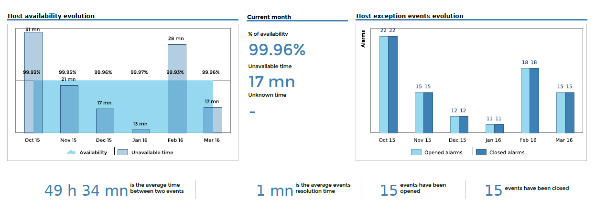
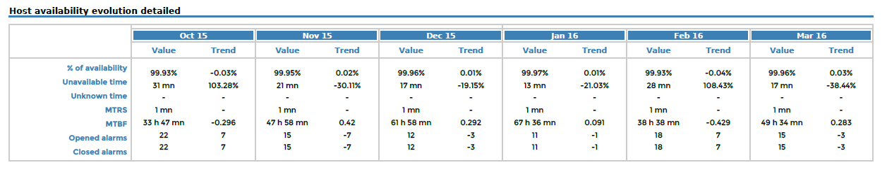
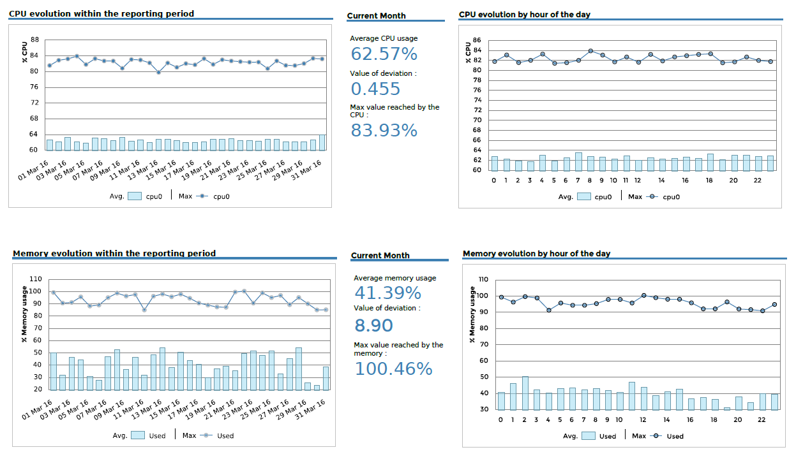
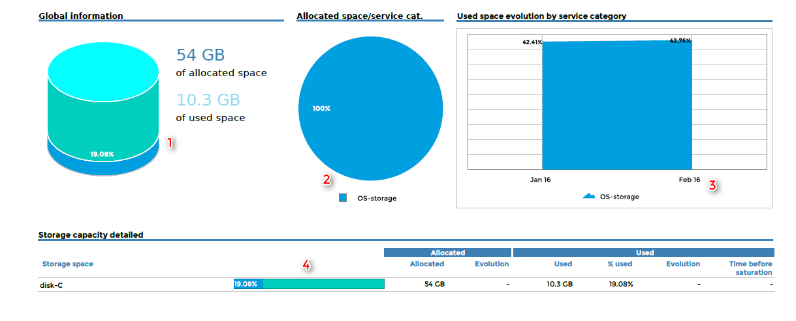
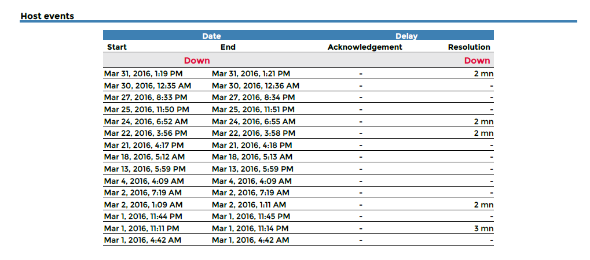
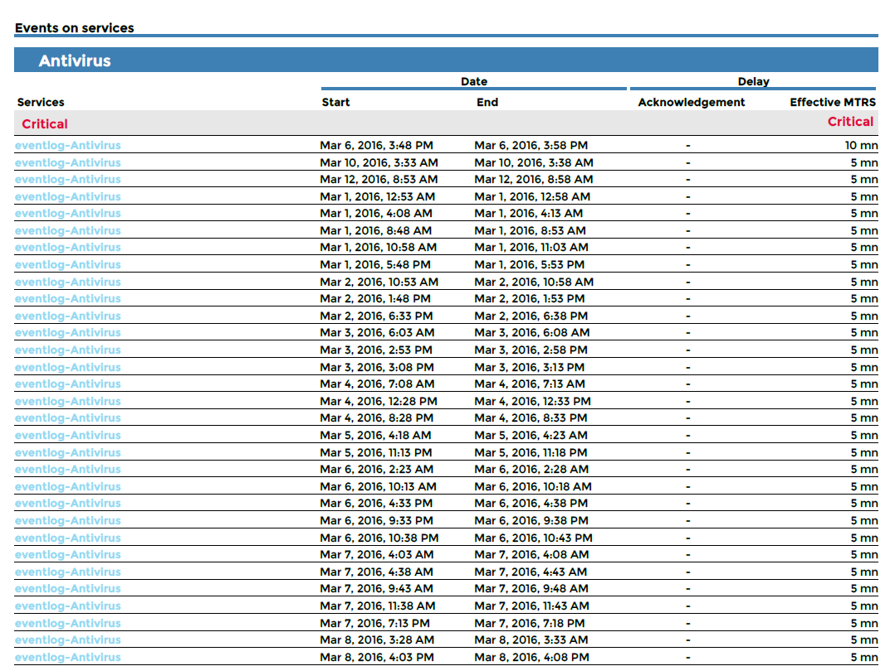
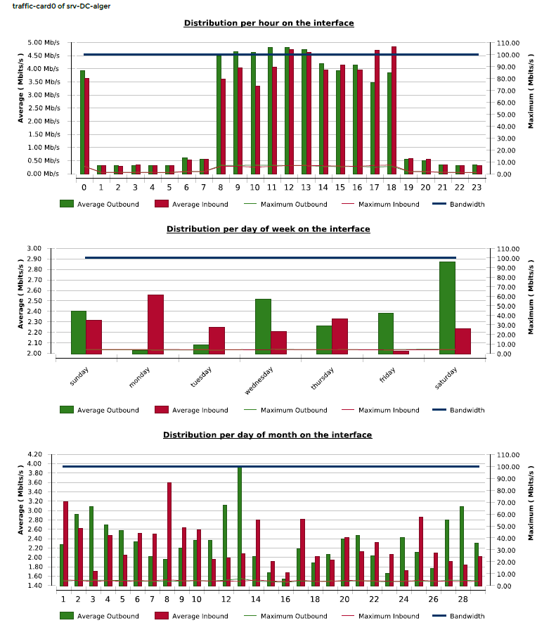

### Host-Detail-2

#### Description

This report provides detailed statistics on availability, alarms, storage usage,
memory and CPU for a given host.

#### How to interpret the report

The first page displays detailed statistics on a host's availability.
The second page shows statistics on the host's performance (CPU and
Memory). On the third page, statistics describe storage capacity by
partition.

The final page is an appendix displaying the alarms that occurred on the host.

#### First page





#### Second page



#### Third page



1 - Storage statistics on the last day of the reporting period

2 - Storage statistics on the last day of the reporting period

3 - Storage statistics on the last day of each month

4 - Storage statistics on the last day of the reporting period versus
the last day of the previous period.

#### Appendix





#### Parameters

Parameters required for the report:

- The reporting period
- The following Centreon objects:

| Parameter                | Parameter type | Description                                                          |
|--------------------------|----------------|----------------------------------------------------------------------|
| Time period              | Dropdown list  | Select time period.                                                  |
| Interval                 | Text field     | Specify number of months to display in evolution graphs.             |
| Host                     | Dropdown list  | Select host.                                                         |
| CPU service category     | Dropdown list  | Select service category containing CPU service(s).                   |
| CPU metric(s)            | Multi Select   | Select metric(s) for CPU statistics.                                 |
| Storage service category | Multi Select   | Select storage service categories containing the storage service(s). |
| Storage Metric(s)        | Multi Select   | Specify metric to exclude from the storage statistics.               |
| Memory service category  | Dropdown list  | Select service category containing memory service(s).                |
| Memory metric(s)         | Multi select   | Specify metric(s) to use for memory statistics.                      |

#### Prerequisites

For consistency in graphs and statistics, certain prerequisites apply to
performance data returned by the plugins. This data must be formatted as
follows, preceded by a pipe (|):

``` text
output-plugin | metric1=valueunit;warning_treshold;critical_treshold;minimum;maximum metric2=value...
```

Make sure that the storage and memory plugins return a maximum value,
which is required in order to calculate statistics. The unit must be
expressed in bytes for storage and memory plugins.

> **Warning**
>
> This report is compatible with the 24x7 time period only. This time
> period must be configured via the menu "General options | Capacity
> statistic aggregated by month | Live services for capacity statistics
> calculation".

### Host-Detail-3

#### Description

This report provides detailed statistics on availability, alarms,
storage usage, memory, CPU and traffic for a given host.

#### How to interpret the report

The first page displays detailed statistics on a host's availability.

The second page shows statistics on the host's performance (CPU and
memory).

The third page shows statistics on storage capacity by partition.

The fourth page displays performance statistics for inbound and outbound
traffic.

Finally, an appendix lists all the alarms occurring on the host.

#### First page


#### Second page


#### Third page


1 - Storage statistics on the last day of the reporting period

2 - Storage statistics on the last day of the reporting period

3 - Storage statistics on the last day of each month

4 - Storage statistics on the last day of the reporting period versus
the last day of the previous period.

#### Fourth page



#### Appendix


#### Parameters

Parameters needed by report are:

- The reporting period
- The following Centreon objects:

| Parameter                | Parameter type  | Description                                                          |
|--------------------------|-----------------|----------------------------------------------------------------------|
| Time period              | Dropdown list   | Select time period.                                                  |
| Interval                 | Text field      | Specify number of months to display in evolution graphs.             |
| Host                     | Dropdown list   | Select host.                                                         |
| CPU service category     | Dropdown list   | Select service category containing CPU service(s).                   |
| CPU metric(s)            | Multi Select    | Select metric(s) for CPU statistics.                                 |
| Storage service category | Multi Select    | Select storage service categories containing the storage service(s). |
| Storage Metric(s)        | Multi Select    | Specify metric to exclude from the storage statistics.               |
| Memory service category  | Dropdown list   | Select service category containing memory service(s).                |
| Memory metric(s)         | Multi select    | Specify metric(s) to use for memory statistics.                      |
| Traffic service category | Multi selection | Select service category containing traffic service(s).               |
| Traffic In metric        | Dropdown list   | Select inbound traffic metric.                                       |
| Traffic out metric       | Dropdown list   | Select outbound traffic metric.                                      |

#### Prerequisites

For consistency in graphs and statistics, certain prerequisites apply to
performance data returned by the plugins. This data must be formatted as
follows, preceded by a pipe (|):

``` text
output-plugin | metric1=valueunit;warning_treshold;critical_treshold;minimum;maximum metric2=value...
```

Make sure that the storage, memory and traffic plugins return a maximum
value, which is required in order to calculate statistics. The unit must
be expressed in bytes for storage and memory plugins and in Kbps for
traffic plugins.

> **Warning**
>
> This report is compatible with the 24x7 time period only. This time
> period must be configured via the "General options > Capacity
> statistics aggregated by month > Live services for capacity statistics
> calculation" menu.

### Hostgroup-Host-Details-1

#### Description

The report provides detailed statistics on availability, alarms, storage
usage, memory and CPU for all hosts within a host group.

#### How to interpret the report

For each host, the report is divided into four parts:

The first part displays detailed statistics on a host's availability.

The second part provides statistics on host performance (CPU and memory).

The third part shows statistics on storage capacity by partition.

The final part displays the distribution of inbound and outbound traffic
of all interfaces of the host.

#### First part


#### Second part


#### Third part


1 - Storage statistics on the last day of the reporting period

2 - Storage statistics on the last day of the reporting period

3 - Storage statistics on the last day of each month

4 - Storage statistics on the last day of the reporting period versus
the last day of the previous period.

#### Fourth part


#### Parameters

Parameters required for the report:

- The reporting period
- The following Centreon objects:

| Parameter                | Parameter type | Description                                                          |
|--------------------------|----------------|----------------------------------------------------------------------|
| Time period              | Dropdown list  | Select time period.                                                  |
| Interval                 | Text field     | Select number of months to display in evolution graphs.              |
| Hostgroup                | Dropdown list  | Select host group.                                                   |
| Host Category            | Multi Select   | Select host category.                                                |
| CPU service category     | Dropdown list  | Select service category containing CPU service(s).                   |
| CPU metric(s)            | Multi Select   | Select metric(s) to use for CPU statistics.                          |
| Storage service category | Multi Select   | Select storage service categories containing the storage service(s). |
| Storage Metric(s)        | Multi Select   | Specify metric to exclude from the storage statistics.               |
| Memory service category  | Dropdown list  | Select service category containing memory service(s).                |
| Memory metric(s)         | Multi select   | Select metric(s) for memory statistics.                              |
| Traffic service category | Dropdown list  | Select service category containing traffic service(s).               |
| Traffic In metric        | Dropdown list  | Select inbound traffic metric.                                       |
| Traffic Out metric       | Dropdown list  | Select outbound traffic metric.                                      |

#### Prerequisites

For consistency in graphs and statistics, certain prerequisites apply to
performance data returned by the plugins. This data must be formatted as
follows, preceded by a pipe (|):

``` text
output-plugin | metric1=valueunit;warning_treshold;critical_treshold;minimum;maximum metric2=value...
```

Make sure that the storage, memory and traffic plugins return a maximum
value, which is required in order to calculate statistics. The unit must
be expressed in bytes for storage and memory plugins and in Kbps for
traffic plugins.

> **Warning**
>
> This report is compatible with the 24x7 time period only. This time
> period must be configured via the **General options > Capacity
> statistics aggregated by month > Live services for capacity statistics
> calculation** menu.

