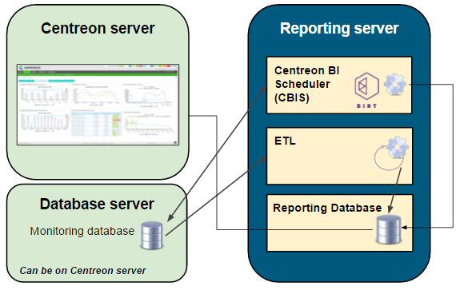
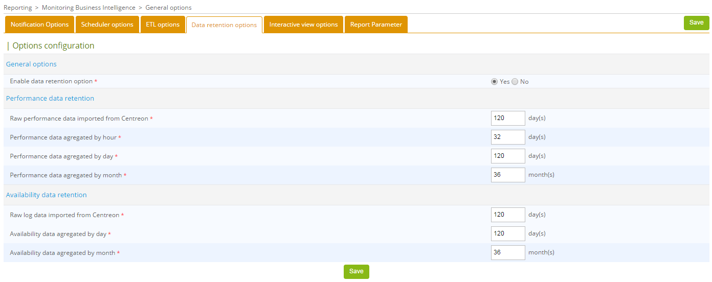

import Tabs from '@theme/Tabs';
import TabItem from '@theme/TabItem';
import DatabaseRepository from '../installation/_database-repository.mdx';

> This page is intended for administrators who will install and configure Centreon MBI.

This page presents the software architecture of the **Centreon MBI** extension, then explains how to install it. To do so, five main steps are required:

1. [Check the system requirements](#step-1-check-the-system-requirements).
2. [Install the Centreon MBI interface in the Centreon application](#step-2-install-the-extension-on-centreon).
3. [Install the reporting server (Centreon MBI Reporting Server)](#step-3-install-the-reporting-server).
4. [Configure the ETL in the Centreon interface](#step-4-configure-the-etl).
5. [Build the MBI database](#step-5-build-the-mbi-database).

Once installation is complete, you can [monitor your MBI server with Centreon](#monitor-your-mbi-server-with-centreon).

## Architecture

### A dedicated reporting server

The architecture and these requirements apply to:

- test
- pre-production
- production environments.

The diagram below highlights the main components of Centreon MBI:



*The monitoring database is not necessarily on the same server as the Centreon server*.

- **ETL**: Process that extracts, transforms and loads data into the reporting database.
- **CBIS**: The scheduler that manages the execution and publication of reports.
- **Reporting Database**: The MariaDB/MySQL database that contains the reporting data and some raw data extracted from the monitoring database.

### Network Flow Tables

The table below shows the different types of flows, by default,
between the dedicated BI server, the Centreon server and the databases:

| **Application** | **Source**               | **Destination**                      | **Port** | **Protocol** |
|-----------------|--------------------------|--------------------------------------|----------|--------------|
| ETL/CBIS        | Reporting server         | Centreon database server             | 3306     | TCP          |
| ETL             | Localhost                |Localhost                             | 8085     | TCP          |
| SSH             | Reporting server         | Centreon Server                      | 22       | TCP          |
| CBIS            | Reporting server         | Centreon Server                      | 80       | HTTP*        |
| CBIS            | Centreon                 | Reporting server                     | 1234     | TCP          |
| Widgets         | Centreon central server  | Reporting server                     | 3306     | TCP          |

*Only required for Host-Graph-v2 and Hostgroup-Graph-v2 reports that use the Centreon API to generate graphs.*

### Information about the packages

The Centreon MBI installation is based on two RPM packages:

- **Centreon-bi-server:** Installs the MBI interface integrated with the Centreon interface. The package is installed on the Centreon central server.
- **Centreon-bi-reporting-server**: Contains all the components needed to run the reporting server
  (report scheduler, ETL, standard reports). It must be installed on a server dedicated to reporting processes.

The installation of the database must be done at the same time. We strongly recommend installing the MariaDB/MySQL database on the
reporting server, for performance and isolation reasons.

## Step 1: Check the system requirements

### Central Centreon server

#### Software requirements

See the [software requirements](../installation/prerequisites.md#characteristics-of-the-servers).

You should install the MariaDB/MySQL database at the same time. We highly recommend
installing the database on the same server, due to performance and isolation
considerations.


<Tabs groupId="os" queryString>
<TabItem value="Alma / RHEL / Oracle Linux 8" label="Alma / RHEL / Oracle Linux 8">

- Centreon Web 25.10
- Check that `date.timezone` is correctly configured in the `/etc/php.d/50-centreon.ini` or `/etc/php.d/20-timezone.ini`
  file (same as the one returned by the `timedatectl status` command).
- Avoid using the following variables in the configuration file `/etc/my.cnf`. They interrupt the
  execution of long queries and can stop ETL or report generation jobs:
  - wait_timeout
  - interactive_timeout

#### Users and groups

| User                 | Group                      |
|----------------------|----------------------------|
| centreonBI (new)     | apache,centreon,centreonBI |
| apache (existing)    | centreonBI                 |
  
</TabItem>
<TabItem value="Alma / RHEL / Oracle Linux 9" label="Alma / RHEL / Oracle Linux 9">

- Centreon Web 25.10
- Check that `date.timezone` is correctly configured in the `/etc/php.d/50-centreon.ini` or `/etc/php.d/20-timezone.ini`
  file (same as the one returned by the `timedatectl status` command).
- Avoid using the following variables in the configuration file `/etc/my.cnf`. They interrupt the
  execution of long queries and can stop ETL or report generation jobs:
  - wait_timeout
  - interactive_timeout

#### Users and groups

| User                 | Group                      |
|----------------------|----------------------------|
| centreonBI (new)     | apache,centreon,centreonBI |
| apache (existing)    | centreonBI                 |
  
</TabItem>
<TabItem value="Debian 12" label="Debian 12">

- Centreon Web 25.10
- Check that `date.timezone` is correctly configured in the `/etc/php/8.2/mods-available/centreon.ini` or `/etc/php/8.2/mods-available/timezone.ini` file
  (same as the one returned by the `timedatectl status` command).
- Avoid using the following variables in the configuration file `/etc/mysql/mariadb.cnf`. They interrupt the
  execution of long queries and can stop ETL or report generation jobs:
  - wait_timeout
  - interactive_timeout
- When creating the CentreonBI user, you must execute the following command: `adduser centreonBI --force-badname`

#### Users and groups

| User                 | Group                        |
|----------------------|------------------------------|
| centreonBI (new)     | www-data,centreon,centreonBI |
| apache (existing)    | centreonBI                   |
  
</TabItem>
</Tabs>

#### Description of users, umask and home directory

| User        | umask | home             |
|-------------|-------|------------------|
| centreonBI  | 0002  | /home/centreonBI |

### Dedicated reporting server

#### Hardware layer

<Tabs groupId="sizing" queryString>
<TabItem value="Up to 500 hosts" label="Up to 500 hosts">

| Element                     | Value     |
| ----------------------------| --------- |
| CPU   | 4 vCPU    |
| RAM                         | 16 GB      |

This is how your MBI server should be partitioned:

| Volume group (LVM) | File system                | Description | Size                                                     |
|-| ----------------------------|-------------|----------------------------------------------------------|
| | /boot | boot images | 1 GB |
|  vg_root | /                          | system root            | 20 GB                                |
| vg_root | swap                       | swap | 4 GB                               |
| vg_root | /var/log                   | contains all log files | 10 GB                                |
| vg_data | /var/lib/mysql  | database | 233 GB                               |
| vg_data | /var/backup | backup directory | 10 GB |
| vg_data |   | Free space (unallocated) | 5 GB                               |

</TabItem>
<TabItem value="Up to 1,000 hosts" label="Up to 1,000 hosts">

| Element                     | Value     |
| ----------------------------| --------- |
| CPU   | 4 vCPU    |
| RAM                         | 16 GB      |

This is how your MBI server should be partitioned:

| Volume group (LVM) | File system                | Description | Size                                                     |
|-| ----------------------------|-------------|----------------------------------------------------------|
| | /boot | boot images | 1 GB |
|  vg_root | /                          | system root            | 20 GB                                |
| vg_root | swap                       | swap | 4 GB                               |
| vg_root | /var/log                   | contains all log files | 10 GB                                |
| vg_data | /var/lib/mysql  | database | 465 GB                               |
| vg_data | /var/backup | backup directory | 10 GB |
| vg_data |   | Free space (unallocated) | 5 GB                               |

</TabItem>
<TabItem value="Up to 2,500 hosts" label="Up to 2,500 hosts">

| Element                     | Value     |
| ----------------------------| --------- |
| CPU   | 4 vCPU    |
| RAM                         | 24 GB      |

This is how your MBI server should be partitioned:

| Volume group (LVM) | File system                | Description | Size                                                     |
|-| ----------------------------|-------------|----------------------------------------------------------|
| | /boot | boot images | 1 GB |
|  vg_root | /                          | system root            | 20 GB                                |
| vg_root | swap                       | swap | 4 GB                               |
| vg_root | /var/log                   | contains all log files | 10 GB                                |
| vg_data | /var/lib/mysql  | database | 1163 GB                               |
| vg_data | /var/backup | backup directory | 10 GB |
| vg_data |   | Free space (unallocated) | 5 GB                               |

</TabItem>
<TabItem value="Up to 5,000 hosts" label="Up to 5,000 hosts">

| Element                     | Value     |
| ----------------------------| --------- |
| CPU   | 8 vCPU    |
| RAM                         | 24 GB      |

This is how your MBI server should be partitioned:

| Volume group (LVM) | File system                | Description | Size                                                     |
|-| ----------------------------|-------------|----------------------------------------------------------|
| | /boot | boot images | 1 GB |
|  vg_root | /                          | system root            | 20 GB                                |
| vg_root | swap                       | swap | 4 GB                               |
| vg_root | /var/log                   | contains all log files | 10 GB                                |
| vg_data | /var/lib/mysql  | database | 2326 GB                               |
| vg_data | /var/backup | backup directory | 10 GB |
| vg_data |   | Free space (unallocated) | 5 GB                               |

</TabItem>
<TabItem value="Up to 10,000 hosts" label="Up to 10,000 hosts">

| Element                     | Value     |
| ----------------------------| --------- |
| CPU   | 12 vCPU    |
| RAM                         | 32 GB      |

This is how your MBI server should be partitioned:

| Volume group (LVM) | File system                | Description | Size                                                     |
|-| ----------------------------|-------------|----------------------------------------------------------|
| | /boot | boot images | 1 GB |
|  vg_root | /                          | system root            | 20 GB                                |
| vg_root | swap                       | swap | 4 GB                               |
| vg_root | /var/log                   | contains all log files | 10 GB                                |
| vg_data | /var/lib/mysql  | database | 4651 GB                               |
| vg_data | /var/backup | backup directory | 10 GB |
| vg_data |   | Free space (unallocated) | 5 GB                               |

</TabItem>
<TabItem value="Up to 20,000 hosts" label="Up to 20,000 hosts">

| Element                     | Value     |
| ----------------------------| --------- |
| CPU   | 16 vCPU    |
| RAM                         | 64 GB      |

This is how your MBI server should be partitioned:

| Volume group (LVM) | File system                | Description | Size                                                     |
|-| ----------------------------|-------------|----------------------------------------------------------|
| | /boot | boot images | 2 GB |
|  vg_root | /                          | system root            | 20 GB                                |
| vg_root | swap                       | swap | 8 GB                               |
| vg_root | /var/log                   | contains all log files | 10 GB                                |
| vg_data | /var/lib/mysql  | database | 8462 GB                               |
| vg_data | /var/backup | backup directory | 10 GB |
| vg_data |   | Free space (unallocated) | 5 GB                               |

</TabItem>
<TabItem value="Over 20,000 hosts" label="Over 20,000 hosts">

For very large amounts of data, contact your sales representative.

</TabItem>
</Tabs>

To check the free space, use the following command by replacing **vg_data** with the name of the group volume:

```shell
vgdisplay vg_data | grep -i free*
```

#### Firmware and software layer

- OS: see [compatibility info here](../installation/compatibility.md#operating-systems)
- SGBD: see [compatibility info here](../installation/compatibility.md#dbms)
- Firewalld: Disabled ([look here](../installation/installation-of-a-central-server/using-packages.md#configure-or-disable-the-firewall))
- SELinux: Disabled ([look here](../installation/installation-of-a-central-server/using-packages.md#disable-selinux))

> Make sure that the reporting server and the central server have the same time zone; otherwise report publications will fail (the link to download them will be missing).
> The same time zone must be displayed with the `timedatectl` command.
> You can change the time zone with this command:
>
>```shell
>timedatectl set-timezone Europe/Paris
>```

Be sure to optimize MariaDB/MySQL on your reporting server.
You will need at least 12 GB of RAM in order to use the [following file](../assets/reporting/installation/centreon.cnf).

> If you want to use a different directory than `/var/lib/mysql/`, edit the **datadir** and **tmpdir** variables in the centreon.cnf file.

Make sure a **tmp** folder is created inside the same partition as **/var/lib/mysql**.

> Do not set these MariaDB optimizations on your monitoring server.

If you are using MySQL:

1. Perform the following action:

<Tabs groupId="sync">
<TabItem value="Alma / RHEL / Oracle Linux 8" label="Alma / RHEL / Oracle Linux 8">

In the `/etc/my.cnf.d/mysql-server.cnf` file, add: 

```shell
log_bin_trust_function_creators=1
```

</TabItem>
<TabItem value="Alma / RHEL / Oracle Linux 9" label="Alma / RHEL / Oracle Linux 9">

In the `/etc/my.cnf.d/mysql-server.cnf` file, add:

```shell
log_bin_trust_function_creators=1
```

</TabItem>
<TabItem value="Debian 12" label="Debian 12">

In the `/etc/mysql/mysql.cnf` file, add:

```shell
[mysqld]
log_bin_trust_function_creators=1
```

</TabItem>
</Tabs>

2. Restart MySQL.

3. Check the database to confirm this variable is applied:

```shell
show global variables like 'log_bin_trust_function_creators';
+---------------------------------+-------+
| Variable_name                   | Value |
+---------------------------------+-------+
| log_bin_trust_function_creators | ON   |
```

If the variable is not turned on, set it manually:

```shell
mysql> SET GLOBAL log_bin_trust_function_creators = 1;
```

Users and groups:

| User        | Group      |
|-------------|------------|
| centreonBI  | centreonBI |

Description of users, umask and user directory:

| User        | umask | home             |
|-------------|-------|------------------|
| centreonBI  | 0002  | /home/centreonBI |

## Step 2: Install the extension on Centreon

The actions listed in this chapter must be performed on the **Centreon Central Server**.

1. Install the Business repository. You can find it on the [support portal](https://support.centreon.com/hc/en-us/categories/10341239833105-Repositories).

2. Then run the following commands:

<Tabs groupId="os" queryString>
<TabItem value="Alma / RHEL / Oracle Linux 8" label="Alma / RHEL / Oracle Linux 8">

```shell
dnf install centreon-bi-server
```

</TabItem>
<TabItem value="Alma / RHEL / Oracle Linux 9" label="Alma / RHEL / Oracle Linux 9">

```shell
dnf install centreon-bi-server
```

</TabItem>
<TabItem value="Debian 12" label="Debian 12">

Install **gpg**:

```shell
apt install gpg
```

Import the repository key:

```shell
wget -O- https://apt-key.centreon.com | gpg --dearmor | tee /etc/apt/trusted.gpg.d/centreon.gpg > /dev/null 2>&1
```

Then install Centreon MBI:

```shell
apt install centreon-bi-server
```

</TabItem>
</Tabs>

### Grant rights to the centreon user
      
In the central database, grant trigger rights to the **centreon** user:

```shell
GRANT TRIGGER ON centreon.* TO `centreon`@'%';
GRANT TRIGGER ON centreon_storage.* TO `centreon`@'%';
```

### Enable the extension

The **Administration > Extension > Manager** menu allows you to install the extensions detected by Centreon. Click the **Centreon MBI** tile to install.

Then, download the license sent by the Centreon team to start configuring the general options.

### Configure the extension

Enter the following values in the Centreon MBI general options
menu, *Reports > Monitoring Business Intelligence > General Options*:


| Tabs                                                                                   | Option                     | Value                                                                                |
|----------------------------------------------------------------------------------------|----------------------------|--------------------------------------------------------------------------------------|
| Scheduler options                                                                      | CBIS Host                  | IP address of the reporting server                                                   |
| ETL options | Reporting engine uses a dedicated MySQL server                | Yes                        |                                                                                      |
| Reporting widgets                                                                      | Reporting MariaDB database | IP address of the reporting base (default = IP address of the reporting server)      |

\**The connection test will not work at this point in the installation*.

### Access to the Central database

Download the license sent by the Centreon team to start configuring the general options.

<Tabs groupId="sync">
<TabItem value="Monitoring database on the central server" label="Monitoring database on the central server">

<Tabs groupId="db" queryString>
<TabItem value="MariaDB" label="MariaDB">

The MariaDB monitoring database is hosted on the central monitoring server.

Run the command below to allow the reporting server to connect to the databases on the monitoring server.
Use the following option:
```shell
perl /usr/share/centreon/www/modules/centreon-bi-server/tools/centreonMysqlRights.pl --root-password=@ROOTPWD@
```
**@ROOTPWD@**: Root password of the MariaDB monitoring database.
If there is no password for the "root" user, do not specify the **root-password** option.

</TabItem>
<TabItem value="MySQL" label="MySQL">

The MySQL monitoring database is hosted on the central monitoring server.

Run the command below to allow the reporting server to connect to the databases on the monitoring server.

Use the following option:

```shell
perl /usr/share/centreon/www/modules/centreon-bi-server/tools/centreonMysqlRights.pl --root-password=@ROOTPWD@
```

**@ROOTPWD@**: Root password of the MySQL monitoring database.
If there is no password for the "root" user, do not specify the **root-password** option.

</TabItem>
</Tabs>

</TabItem>
<TabItem value="Monitoring database on a remote server" label="Monitoring database on a remote server">

<Tabs groupId="db" queryString>
<TabItem value="MariaDB" label="MariaDB">

The MariaDB monitoring database is hosted on a dedicated server.

Connect via SSH to the database server, and run the following commands:
```SQL
CREATE USER 'centreonbi'@'$BI_ENGINE_IP$' IDENTIFIED BY 'centreonbi';
GRANT ALL PRIVILEGES ON centreon.* TO 'centreonbi'@'$BI_ENGINE_IP$';
GRANT ALL PRIVILEGES ON centreon_storage.* TO 'centreonbi'@'$BI_ENGINE_IP$';
```

**$BI_ENGINE_IP$**: IP address of the reporting server.

</TabItem>
<TabItem value="MySQL" label="MySQL">

The MySQL monitoring database is hosted on a dedicated server.

Connect via SSH to the database server, and run the following commands:

```SQL
CREATE USER 'centreonbi'@'$BI_ENGINE_IP$' IDENTIFIED BY 'centreonbi';
GRANT ALL PRIVILEGES ON centreon.* TO 'centreonbi'@'$BI_ENGINE_IP$';
GRANT ALL PRIVILEGES ON centreon_storage.* TO 'centreonbi'@'$BI_ENGINE_IP$';
```

**$BI_ENGINE_IP$**: IP address of the reporting server.

</TabItem>
</Tabs>

</TabItem>
</Tabs>

<Tabs groupId="db" queryString>
<TabItem value="MariaDB" label="MariaDB">

If you use MariaDB replication for your **monitoring databases**, some views
are created during the installation of Centreon MBI.
You must exclude them from replication by adding the following line to the **my.cnf**
file of the slave server or mariadb.cnf on Debian 12.
```shell
replicate-wild-ignore-table=centreon.mod_bi_%v01,centreon.mod_bi_%V01
```
Then, create the views manually on the slave server:
1. Download [the following file](../assets/reporting/installation/view_creation.sql) to a temporary folder (in our example, **/tmp**), for instance using **wget**.
2. Run the following command (change the name of your temporary folder if necessary):
```bash
mysql centreon < /tmp/view_creation.sql
```
#### Debian 12 specific configuration
MariaDB must listen on all interfaces instead of listening on localhost/127.0.0.1 (default value). Edit the following file:
```shell
/etc/mysql/mariadb.conf.d/50-server.cnf
```
Set **bind-address** to **0.0.0.0** and restart **mariadb**.
```shell
systemctl restart mariadb
```

</TabItem>
<TabItem value="MySQL" label="MySQL">

If you use MySQL replication for your **monitoring databases**, some views
are created during the installation of Centreon MBI.
You must exclude them from replication by adding the following line to the **my.cnf**
file of the slave server or mysql.cnf on Debian 12.

```shell
replicate-wild-ignore-table=centreon.mod_bi_%v01,centreon.mod_bi_%V01
```

Then, create the views manually on the slave server:

1. Download [the following file](../assets/reporting/installation/view_creation.sql) to a temporary folder (in our example, **/tmp**), for instance using **wget**.

2. Run the following command (change the name of your temporary folder if necessary):

```bash
mysql centreon < /tmp/view_creation.sql
```

#### Debian 12 specific configuration

MySQL must listen on all interfaces instead of listening on localhost/127.0.0.1 (default value). Edit the following file:

```shell
/etc/mysql/mysql.conf.d/mysqld.cnf
```

Set **bind-address** to **0.0.0.0** and restart **mysql**.

```shell
systemctl restart mysql
```

</TabItem>
</Tabs>

### Give rights to the cbis user

When you install Centreon MBI, a [user](../monitoring/basic-objects/contacts.md) named **cbis** is automatically created.
It allows the report generation engine to extract data from Centreon (using the APIs) in order to insert them in the report.
This user must [have access to all resources monitored by Centreon](../administration/access-control-lists.md) in order to extract the performance graphs for the following reports:

- Host-Graph-v2
- Hostgroup-Graph-v2.

To test the connection between the MBI reporting server and the Centreon API, use the following command to download a graph. Replace the graph parameters and timestamps, and replace XXXXXXXXX with the user's autologin token **cbis**:

```bash
curl -XGET 'https://IP_CENTRAL/centreon/include/views/graphs/generateGraphs/generateImage.php?akey=XXXXXXXXX&username=CBIS&hostname=<host_name>&service=<service_description>&start=<start_date>&end=<end_date>' --output /tmp/image.png

```

Example:

```bash
curl -XGET 'https://10.1.1.1/centreon/include/views/graphs/generateGraphs/generateImage.php?akey=otmw3n1hu03bvt9e0caphuf50ph8sdthcsk8ofdk&username=CBIS&hostname=my-poller&service=Cpu&start=1623016800&end=1623621600' --output /tmp/image.png
```

The result should look like the code below, and the desired graph image must have been uploaded to the `/tmp` directory:

```text
  % Total    % Received % Xferd  Average Speed   Time    Time     Time  Current
                                 Dload  Upload   Total   Spent    Left  Speed
100 18311  100 18311    0     0  30569      0 --:--:-- --:--:-- --:--:-- 30569
```

## Step 3: Install the reporting server

### Install the packages

This step is performed **on the machine that will become your MBI server**.

#### Prerequisites

You must have the following information before proceeding with the installation:

- IP/DNS of the monitoring database
- IP/DNS of the Centreon web interface
- IP/DNS of the reporting database (localhost strongly recommended)

Define and retrieve the SSH password for the **centreonBI** user on the central server (to make the reports generated on the interface available).

During database installation, note the password for the database's **root** account.

#### Install the Centreon repositories

1. Install the standard repository:

<Tabs groupId="os" queryString>
<TabItem value="Alma / RHEL / Oracle Linux 8" label="Alma / RHEL / Oracle Linux 8">

```shell
dnf install -y dnf-plugins-core
dnf config-manager --add-repo https://packages.centreon.com/rpm-standard/25.10/el8/centreon-25.10.repo
dnf clean all --enablerepo=*
dnf update
```

</TabItem>
<TabItem value="Alma / RHEL / Oracle Linux 9" label="Alma / RHEL / Oracle Linux 9">

```shell
dnf install -y dnf-plugins-core
dnf config-manager --add-repo https://packages.centreon.com/rpm-standard/25.10/el9/centreon-25.10.repo
dnf clean all --enablerepo=*
dnf update
```

</TabItem>
<TabItem value="Debian 12" label="Debian 12">

Install the required packages:

```shell
apt install lsb-release ca-certificates apt-transport-https software-properties-common wget gnupg2
```

Install the Centreon repositories:

```shell
echo "deb https://packages.centreon.com/apt-standard/ $(lsb_release -sc)-25.10-stable main" | tee -a /etc/apt/sources.list.d/centreon-25.10-stable.list
echo "deb https://packages.centreon.com/apt-plugins-stable/ $(lsb_release -sc) main" | tee /etc/apt/sources.list.d/centreon-plugins.list
```

Then import the repository key:

```shell
wget -O- https://apt-key.centreon.com | gpg --dearmor | tee /etc/apt/trusted.gpg.d/centreon.gpg > /dev/null 2>&1
apt update
```

</TabItem>
</Tabs>

2. Install the Business repository. You can find its address on the [support portal](https://support.centreon.com/hc/en-us/categories/10341239833105-Repositories).

#### Install the database repository

<DatabaseRepository />

#### Install dependencies

<Tabs groupId="os" queryString>
<TabItem value="RHEL 8" label="RHEL 8">

Install the **epel** repository:

```shell
dnf install -y https://dl.fedoraproject.org/pub/epel/epel-release-latest-8.noarch.rpm
```

Enable the **codeready-builder** repositories:

```shell
subscription-manager repos --enable codeready-builder-for-rhel-8-x86_64-rpms
```

</TabItem>
<TabItem value="Oracle Linux 8" label="Oracle Linux 8">

Install the **epel** repository:

```shell
dnf install -y https://dl.fedoraproject.org/pub/epel/epel-release-latest-8.noarch.rpm
```

Enable the **codeready-builder** repositories:

```shell
dnf config-manager --set-enabled ol8_codeready_builder
```

</TabItem>
<TabItem value="Alma 8" label="Alma 8">

Install the **epel** repository:

```shell
dnf install -y https://dl.fedoraproject.org/pub/epel/epel-release-latest-8.noarch.rpm
```

Enable the **powertools** repository:

```shell
dnf config-manager --set-enabled 'powertools'
```
</TabItem>
<TabItem value="RHEL 9" label="RHEL 9">

Install the **epel** repository:

```shell
dnf install -y https://dl.fedoraproject.org/pub/epel/epel-release-latest-9.noarch.rpm
```

Enable the **codeready-builder** repositories:

```shell
subscription-manager repos --enable codeready-builder-for-rhel-9-x86_64-rpms
```

</TabItem>
<TabItem value="Oracle Linux 9" label="Oracle Linux 9">

Install the **epel** repository:

```shell
dnf install -y https://dl.fedoraproject.org/pub/epel/epel-release-latest-9.noarch.rpm
```

Enable the **codeready-builder** repositories:

```shell
dnf config-manager --set-enabled ol9_codeready_builder
```
</TabItem>
<TabItem value="Alma 9" label="Alma 9">

Install the **epel** repository:

```shell
dnf install -y https://dl.fedoraproject.org/pub/epel/epel-release-latest-9.noarch.rpm
```

Run the following command:

```shell
dnf config-manager --set-enabled 'crb' 
```

</TabItem>
<TabItem value="Debian 12" label="Debian 12">

No dependencies need to be installed.

</TabItem>
</Tabs>

#### Install the MBI server's database

<Tabs groupId="db" queryString>
<TabItem value="MariaDB" label="MariaDB">
<Tabs groupId="os" queryString>
<TabItem value="Alma / RHEL / Oracle Linux 8" label="Alma / RHEL / Oracle Linux 8">

```shell
dnf install MariaDB-server MariaDB-client
```

</TabItem>
<TabItem value="Alma / RHEL / Oracle Linux 9" label="Alma / RHEL / Oracle Linux 9">

```shell
dnf install MariaDB-server MariaDB-client
```

</TabItem>
<TabItem value="Debian 12" label="Debian 12">

```shell
apt update
apt install mariadb-server mariadb-client
```

</TabItem>
</Tabs>

</TabItem>

<TabItem value="MySQL 8.4" label="MySQL 8.4">

<Tabs groupId="os" queryString>
<TabItem value="Alma / RHEL / Oracle Linux 8" label="Alma / RHEL / Oracle Linux 8">

```shell
dnf install https://dev.mysql.com/get/mysql84-community-release-el8-1.noarch.rpm
dnf config-manager --enable mysql-8.4-lts-community
dnf module disable mysql
dnf install mysql-community-server
systemctl start mysqld
```

</TabItem>
<TabItem value="Alma / RHEL / Oracle Linux 9" label="Alma / RHEL / Oracle Linux 9">

```shell
dnf install -y mysql-server mysql
dnf install -y centreon-mysql
systemctl enable --now mysqld
echo "default-authentication-plugin=mysql_native_password" >> /etc/my.cnf.d/mysql-server.cnf
systemctl daemon-reload
systemctl restart mysqld
systemctl list-units --type=service | grep -i mysql
sudo sed -Ei 's/LimitNOFILE\s*=\s*[0-9]+/LimitNOFILE = 32000/' /usr/lib/systemd/system/mysqld
sudo systemctl start mysqld
sudo systemctl status mysqld
```

</TabItem>
<TabItem value="Debian 12" label="Debian 12">

```shell
apt update
apt install -y centreon-mysql
# Sélectionner "Use Legacy Authentication Method"
systemctl daemon-reload
systemctl restart mysql
```

</TabItem>
</Tabs>

</TabItem>
</Tabs>

#### Install the MBI module on the MBI server

<Tabs groupId="os" queryString>
<TabItem value="Alma / RHEL / Oracle Linux 8" label="Alma / RHEL / Oracle Linux 8">

```shell
echo "deb https://packages.centreon.com/apt-standard/ $(lsb_release -sc)-25.10-stable main" | tee -a /etc/apt/sources.list.d/centreon-25.10-stable.list
dnf install centreon-bi-reporting-server
```

</TabItem>
<TabItem value="Alma / RHEL / Oracle Linux 9" label="Alma / RHEL / Oracle Linux 9">

```shell
dnf install centreon-bi-reporting-server
```

</TabItem>
<TabItem value="Debian 12" label="Debian 12">

```shell
apt update
apt install centreon-bi-reporting-server
```

</TabItem>
</Tabs>

Then, ensure a version of Java 17 (or 18) is installed before you start the procedure.
   
   - If you need to check the Java version, enter the following command:
   
   ```shell
   java -version
   ```
   
   - If you need to upgrade the Java installation to Java 17 (or 18), go to the [Oracle official download](https://www.oracle.com/java/technologies/downloads/#java17) page.
   
   - If several Java versions are installed, you need to activate the right version. Display the installed versions using the following command and select the Java 17 (or 18) version:
   
   ```shell
   sudo update-alternatives --config java
   ```

#### Enable services

Enable the **cbis** service:

```shell
systemctl enable cbis
```

Start and enable **gorgoned**:

```shell
systemctl start gorgoned && systemctl enable gorgoned
```

### Optimize the database

<Tabs groupId="db" queryString>
<TabItem value="MariaDB" label="MariaDB">
<Tabs groupId="os" queryString>
<TabItem value="Alma / RHEL / Oracle Linux 8" label="Alma / RHEL / Oracle Linux 8">

Make sure that the optimized configuration [file](../assets/reporting/installation/centreon.cnf) provided
in the prerequisites is present in `/etc/my.cnf.d/`, then restart the MariaDB service:

```shell
systemctl restart mariadb
```

It is necessary to change the **LimitNOFILE** limitation. Changing this
option in `/etc/my.cnf` will NOT work.

```shell
mkdir -p  /etc/systemd/system/mariadb.service.d/
echo -ne "[Service]\nLimitNOFILE=32000\n" | tee /etc/systemd/system/mariadb.service.d/limits.conf
systemctl daemon-reload
systemctl restart mariadb
```

If the MariaDB service fails to start, remove the *ib_logfile* files
(MariaDB must absolutely be stopped) and then restart MariaDB again:

```shell
rm -f /var/lib/mysql/ib_logfile*
systemctl start mariadb
```

If you are using a specific socket file for MariaDB, modify the file `/etc/my.cnf` and
in the [client] section, add :

```shell
socket=$PATH_TO_SOCKET$
```

</TabItem>
<TabItem value="Alma / RHEL / Oracle Linux 9" label="Alma / RHEL / Oracle Linux 9">

Make sure that the optimized configuration [file](../assets/reporting/installation/centreon.cnf) provided
in the prerequisites is present in `/etc/my.cnf.d/`, then restart the MariaDB service:

```shell
systemctl restart mariadb
```

It is necessary to change the **LimitNOFILE** limitation. Changing this
option in `/etc/my.cnf` will NOT work.

```shell
mkdir -p  /etc/systemd/system/mariadb.service.d/
echo -ne "[Service]\nLimitNOFILE=32000\n" | tee /etc/systemd/system/mariadb.service.d/limits.conf
systemctl daemon-reload
systemctl restart mariadb
```

If the MariaDB service fails to start, remove the *ib_logfile* files
(MariaDB must absolutely be stopped) and then restart MariaDB again:

```shell
rm -f /var/lib/mysql/ib_logfile*
systemctl start mariadb
```

If you are using a specific socket file for MariaDB, modify the file `/etc/my.cnf` and
in the [client] section, add :

```shell
socket=$PATH_TO_SOCKET$
```

</TabItem>
<TabItem value="Debian 12" label="Debian 12">

Make sure that the optimized configuration [file](../assets/reporting/installation/centreon.cnf)
provided in the requirements is present in `/etc/mysql/mariadb.conf.d/`.

Rename the file to `80-centreon.cnf`:

```shell
mv centreon.cnf 80-centreon.cnf
```

MariaDB should listen to all interfaces instead of localhost/127.0.0.1, which is the default.
Edit the following file:

```shell
/etc/mysql/mariadb.conf.d/50-server.cnf
```

Set the **bind-address** parameter to **0.0.0.0** and restart MariaDB.

```shell
systemctl restart mariadb
```

It is necessary to change the **LimitNOFILE** limitation. Changing this option in `/etc/mysql/mariadb.cnf` will not work.

```shell
mkdir -p  /etc/systemd/system/mariadb.service.d/
echo -ne "[Service]\nLimitNOFILE=32000\n" | tee /etc/systemd/system/mariadb.service.d/limits.conf
systemctl daemon-reload
systemctl restart mariadb
```

If the MariaDB service fails at the time of starting, remove the files *ib_logfile*
(MariaDB must absolutely be stopped) and then restart MariaDB again:

```shell
rm -f /var/lib/mysql/ib_logfile*
systemctl start mariadb
```

If you are using a specific socket file for MariaDB, edit the
file `/etc/mysql/mariadb.cnf` and in the [client] section, add :

```shell
socket=$PATH_TO_SOCKET$
```

</TabItem>
</Tabs>
</TabItem>
<TabItem value="MySQL" label="MySQL">
<Tabs groupId="os" queryString>
<TabItem value="Alma / RHEL / Oracle Linux 8" label="Alma / RHEL / Oracle Linux 8">

Ensure that the [optimized configuration file](../assets/reporting/installation/centreon.cnf) provided in the prerequisites is present in `/etc/my.cnf.d/`, then restart the MySQL service:

```shell
systemctl restart mysql
```

You must modify the **LimitNOFILE** limitation. Changing this option in `/etc/my.cnf` will NOT work.

```shell
mkdir -p  /etc/systemd/system/mysql.service.d/
echo -ne "[Service]\nLimitNOFILE=32000\n" | tee /etc/systemd/system/mysql.service.d/limits.conf
systemctl daemon-reload
systemctl restart mysql
```

If the MySQL service fails to start, delete the *ib_logfile* files (MySQL MUST be stopped) and then restart MySQL again:

```shell
rm -f /var/lib/mysql/ib_logfile*
systemctl start mysql
```

If you are using a specific socket file for MySQL, edit the `/etc/my.cnf` file and add the following to the [client] section:

```shell
socket=$PATH_TO_SOCKET$
```

</TabItem>
<TabItem value="Alma / RHEL / Oracle Linux 9" label="Alma / RHEL / Oracle Linux 9">

Ensure that the [optimized configuration file](../assets/reporting/installation/centreon.cnf) provided in the prerequisites is present in `/etc/my.cnf.d/`, then restart the MySQL service:


```shell
systemctl restart mysql
```

You must modify the **LimitNOFILE** limitation. Changing this option in `/etc/my.cnf` will NOT work.

```shell
mkdir -p  /etc/systemd/system/mysql.service.d/
echo -ne "[Service]\nLimitNOFILE=32000\n" | tee /etc/systemd/system/mysql.service.d/limits.conf
systemctl daemon-reload
systemctl restart mysql
```

If the MySQL service fails to start, delete the *ib_logfile* files (MySQL MUST be stopped) and then restart MySQL again:

```shell
rm -f /var/lib/mysql/ib_logfile*
systemctl start mysql
```

If you are using a specific socket file for MySQL, edit the `/etc/my.cnf` file and add the following to the [client] section:

```shell
socket=$PATH_TO_SOCKET$
```

</TabItem>
<TabItem value="Debian 12" label="Debian 12">

Ensure that the [optimized configuration file](../assets/reporting/installation/centreon.cnf) provided in the prerequisites is present in `/etc/mysql/mysql.conf.d/`.

Rename the file as `80-centreon.cnf`:

```shell
mv centreon.cnf 80-centreon.cnf
```

MySQL must listen to all interfaces instead of localhost/127.0.0.1, which is the default value. Edit the following file:

```shell
/etc/mysql/mysql.conf.d/mysqld.cnf
```

Set the **bind-address** parameter to **0.0.0.0** and restart mysql.

```shell
systemctl restart mysql
```

You must modify the **LimitNOFILE** limitation. Changing this option in `/etc/my.cnf` will NOT work.

```shell
mkdir -p  /etc/systemd/system/mysql.service.d/
echo -ne "[Service]\nLimitNOFILE=32000\n" | tee /etc/systemd/system/mysql.service.d/limits.conf
systemctl daemon-reload
systemctl restart mysql
```

If the MySQL service fails to start, delete the *ib_logfile* files (MySQL MUST be stopped) and then restart MySQL again:

```shell
rm -f /var/lib/mysql/ib_logfile*
systemctl start mysql
```

If you are using a specific socket file for MySQL, edit the `/etc/my.cnf` file and add the following to the [client] section:

```shell
socket=$PATH_TO_SOCKET$
```

</TabItem>
</Tabs>

</TabItem>
</Tabs>

### Secure the database

It is mandatory to secure the root access of the database before installing Centreon.
If you use a local database, execute the following command on the central server, otherwise on the database server:

<Tabs groupId="db" queryString>
<TabItem value="MariaDB" label="MariaDB"> 

```shell
mariadb-secure-installation
```

</TabItem>
<TabItem value="MySQL" label="MySQL"> 

```shell
mysql_secure_installation
```

</TabItem>
</Tabs>

- Answer **yes** to all questions except "Disallow root login remotely?"
- It is mandatory to define a password for the **root** user of the database. You will need this password during the [web-installation](../installation/web-and-post-installation.md).

> See advanced procedures to [Secure your MBI platform](../reporting/secure-your-mbi-platform.md).

> For more information, please see the [official MariaDB documentation](https://mariadb.com/kb/en/mysql_secure_installation/).

#### Start configuring

Make sure the MariaDB reporting system is started and then run the commands below and answer the questions:

```shell
/usr/share/centreon-bi/config/install.sh
```

The script manages the exchange of SSH keys between the monitoring server and the reporting server, and configures the default SFTP publishing rule
in order to publish the reports on the Centreon web interface. Finally, it enables the backup and starts the CBIS service.

Once the installation is complete, continue to the next chapter to configure the ETL.

#### Problem with the SSH exchange key

In some cases, SSH key exchange fails.
To solve the problem, do the following manually:

Switch to the `centreonBI` user:

```bash
su - centreonBI
```

Generate the SSH key:

```bash
ssh-keygen -t ed25519 -a 100 -f ~/.ssh/id_ed25519 -P "" -q
```

And print the `centreonBI` public key (in order to authorize it then on Centreon):

```bash
su - centreonBI
cat /home/centreonBI/.ssh/id_ed25519.pub
```

Now, **on the monitoring server**:

Create a `.ssh` folder that `centreonBI` will own, restrict permissions on this folder and paste into the `authorized_keys` file the contents of its public key on the reporting server (shown earlier):

```bash
mkdir -p /home/centreonBI/.ssh/ && chown centreonBI: /home/centreonBI/.ssh/ && chmod 700 /home/centreonBI/.ssh/ && echo "@reporting pub key content@" > /home/centreonBI/.ssh/authorized_keys
```

The key exchange must then be validated by a first connection that will accept the SSH server signature.
As the `centreonBI` user **from the reporting server**:

```bash
ssh centreonBI@@MONITORING_SERVER@
```

Then exit the `centreonBI` session with `exit` or `Ctrl-D` on both servers.

To continue, run the installation script (`/usr/share/centreon-bi/config/install.sh`) as above and answer **Yes** when asked to proceed with the SSH key exchange.
You will get an error when creating the USER, because it already exists. This is not a blocking step.

## Step 4: Configure the ETL

Centreon MBI integrates an ETL that allows you to:

- Synchronize the raw data from the monitoring to the reporting server
- Feed statistical data to the reporting server databases
- Control the retention of data on the reporting server

### General configuration of the ETL

Go to **Reporting > Monitoring Business Intelligence > General Options**, **ETL Options** tab, and specify the following options:

| **Options**                                                                            | **Values**                                                                                                                                                                                                                            |
|----------------------------------------------------------------------------------------|---------------------------------------------------------------------------------------------------------------------------------------------------------------------------------------------------------------------------------------|
| **General options**                                                                    |                                                                                                                                                                                                                                       |
| Reporting engine uses a dedicated dedicated MySQL server                             | The only appropriate option is **Yes**.                                                                                                                                                                                     |
| Temporary file storage directory on reporting server                                   | Folder where dumps will be stored on the reporting server                                                                                                                                                                             |
| Use large memory tweaks (store MariaDB temporary tables in memory)                     | Creates temporary tables using RAM rather than creating them on disk. Not recommended if you have databases with less than 64GB of RAM.                                                  |
| **Centile parameters**                                                                 |                                                                                                                                                                                                   |
| Calculating centile aggregation by                                                     | Select the desired aggregation level. The standard percentile report provided with BI 2.1 uses Month data.                                                                                                                            |
| Select service categories to aggregate centile on                                      | Filter on relevant service categories for centile statistics (e.g., Traffic).                                                                                                                                                         |
| First day of the week                                                                  | Select the first day of the week for Week aggregation.                                                                                                                                                                                |
| Centile / Timeperiod combination                                                       | Create a new centile/timeperiod combination on which to perform the calculation.                                                                                                                                                      |

### Defining which data will be used by MBI

Use the options on the **Reporting > Monitoring Business Intelligence > General Options** page, **ETL Options** tab to determine which data will be imported from your central server to the MBI database. Make sure you only import the data you want to see in reports: all unnecessary data will take space and use computation time for nothing.

| **Options**                                                                            | **Values**                                                                                                                                                                                                                            |
|----------------------------------------------------------------------------------------|---------------------------------------------------------------------------------------------------------------------------------------------------------------------------------------------------------------------------------------|
| **General options**                                                                    |   
| Type of statistics to build                                                            | <ul><li>Select **Availability only** if you only use [availability reports](available-reports/availability-events-reports.md).</li><li>Select **Performance and capacity only** if you only want to use capacity and performance reports ([performance](available-reports/performance-reports.md), [storage](available-reports/storage-reports.md), [network](available-reports/network-reports.md), [virtualization](available-reports/virtualization-reports.md), [electric consumption](available-reports/electric-consumption-reports.md) reports).</li><li>Select **All** to calculate the statistics for both types of report. This also enables the reports from the [Profiling](available-reports/profiling-reports.md) and [Database diagnostics](available-reports/database-diagnostics-reports.md) category.</li></ul> |
| **Reporting perimeter selection**                                                      |                                                                                                                                                                                                                                       |
| Host groups                                                                             | Select only host groups on which you want to create reports.                                                                                                                                                                         |
| Host categories                                                                         | Select only host categories on which you want to create reports.                                                                                                                                                                     |
| Service categories                                                                     | Select only service categories on which you want to create reports.                                                                                                                                                                  |
| **Availability statistic calculation**                                                 |                                                                                                                                                                                                                                       |
| Live services for availability statistics calculation                                  | Your [availability reports](available-reports/availability-events-reports.md) will only include data from these [time periods](../monitoring/basic-objects/timeperiods.md).                                                                                                                                                                                                         |
| **Performance and capacity statistic calculation**                                     |                                                                                                                                                                                                                                       |
| Granularity required for performance data statistics                                   | Select the level of granularity required to run the desired performance reports (1).                                                                                                                                                  |
| Live services for performance data statistics calculation                              | Select the required time periods.                                                                                                                                                                                                     |
| **Capacity statistic aggregated by month** (reports in the [storage](available-reports/storage-reports.md) category). Data is only aggregated by month.                                            |                                                                                                                                                                                                                                       |
| Live services for capacity statistics calculation                                      | Select **24x7**, as this is the only relevant time period to calculate disk space.                                                                                                                                                                                                        |
| Service categories related to capacity data monitoring	                                | Select the [service categories](../monitoring/categories.md) that have been associated with capacity-type services.                                                                                                                                                  |
| Exclude metrics from service categories that do not return capacity USAGE information  | Concerns the metrics linked to services which return capacity data. Select the metrics that do not return capacity usage information. but a maximum or total value. (e.g., the metric “size”).                                        |

**(1)** Reports requiring data granularity by the hour are listed below. If you do not wish to use these reports, disable the calculation of hourly statistics:

- Hostgroup-Host-details-1
- Host-detail-v2
- Hostgroup-traffic-Average-Usage-By-Interface
- Hostgroup-traffic-by-Interface-And-Bandwith-Ranges

### ETL: Data retention

The reporting server contains tables of statistics specific to Centreon MBI in the "centreon_storage" database.
The storage space used by these tables is increasing every day.
It is possible to control the size of these tables by defining data retention rules.

Under **Reports > Monitoring Business Intelligence > General Options > Data Retention Options** menu,
data retention can be managed by:

- Type of data (availability, performance).
- Data granularity (raw data, hourly, daily or monthly values)

> Before enabling the data retention options, make sure that the reporting engine
> uses a dedicated MariaDB server, and the corresponding option is set to
> **Yes** in the **Reporting > Business Intelligence > General Options ETL Options** menu.

Enable data retention management by selecting **Yes**, then set the configuration options (example below).



To enable automatic purging of old data, edit the cron file **/etc/cron.d/centreon-bi-purge**
on the reporting server, then uncomment the following line:

```shell
#0 20 * * * root @CENTREON_BI_HOME@/*etl*/dataRetentionManager.pl >> @CENTREON_BI_LOG@/dataRetentionManager.log 2>&1
```

Avoid scheduled periods for statistical calculations with Centreon MBI ETL and report generation.
You can run this cron daily or weekly, depending on the batch execution time and the load generated on the server.

<Tabs groupId="os" queryString>
<TabItem value="Alma / RHEL / Oracle Linux 8 / RHEL 7 / CentOS 7" label="Alma / RHEL / Oracle Linux 8 / RHEL 7 / CentOS 7">

Restart the cron service:

```shell
systemctl restart crond
```

</TabItem>
<TabItem value="Debian 12" label="Debian 12">

Restart the cron service:

```shell
systemctl restart cron
```

</TabItem>
</Tabs>

**BEST PRACTICES**: Select different retention periods depending on the granularity of the statistical data:

- Aggregated values per hour are used to analyze a metric over a short period of time. They take up a lot of disk space. You may not
  need to keep these statistics for more than two or three months.

- Beyond five or six months, you may only need to view the trend for availability or performance statistics.
  You could then retain daily aggregate data for up to six months, for example, and set up retention of monthly aggregate data for a period of several dozen months.

## Step 5: Build the MBI database

### Prerequisites

* Before continuing, make sure you have installed the MariaDB configuration file as described above in the prerequisites.
* Configure the ETL and enable data retention so that only the required data is imported and calculated.
* Make sure that [the data on the central server is ready](how-mbi-works.md#phase-1-data-is-prepared-by-the-central-server). 
* Make sure that the **gorgoned** process works fine: `systemctl status gorgoned`. If needed, restart it: `systemctl restart gorgoned`.
* Bear in mind that if you are building the MBI database for the first time, you have to import all of the data in one go. If you have a large amount of data and/or if you start the process late in the day, it's important to be aware that the database building phase might take a significant amount of time, possibly extending into the next day. In this case, you need to disable the daily build [temporarily](#reenable-daily-script-execution), until the initial build is complete, so as to avoid duplicate entries or other problems.
   1. Edit the **/etc/cron.d/centreon-bi-engine** cronfile and comment out the following line:

      ```shell
      #30 4 * * * root /usr/share/centreon-bi/bin/centreonBIETL -d >> /var/log/centreon-bi/centreonBIETL.log 2>&1
      ```

   2. Restart **crond**.

<Tabs groupId="os" queryString>
<TabItem value="Alma / RHEL / Oracle Linux 8 / RHEL 7 / CentOS 7" label="Alma / RHEL / Oracle Linux 8 / RHEL 7 / CentOS 7">

```shell
systemctl restart crond
```

</TabItem>
<TabItem value="Debian 12" label="Debian 12">

```shell
systemctl restart cron
```

</TabItem>
</Tabs>

### Construction of statistics from historical data

Run the following command on the reporting server. This will:

- Delete any existing data from the reporting server.
- Import raw monitoring data from the central server to the MBI server (depending on retention settings).
- Fill tables containing availability statistics for hosts and services.
- Fill tables containing performance and capacity statistics for hosts and services.

```shell
/usr/share/centreon-bi/bin/centreonBIETL -r
```

You may want to run it in the background and redirect the script's output to a log:

```shell
nohup /usr/share/centreon-bi//bin/centreonBIETL -r >> /var/log/centreon-bi/centreonBIETL.log 2>&1 &
```

Go to the **/var/log/centreon-bi/centreonBIETL.log** log file: you should see some lines appear with 4 parts like:

```shell
2025-08-01 13:34:16 - INFO - [SCHEDULER] >>>>>>> start
2025-08-01 13:34:16 - INFO - [SCHEDULER][IMPORT] >>>>>>> start
...
2025-08-01 13:35:18 - INFO- [SCHEDULER][IMPORT] <<<<<<< end
2025-08-01 13:35:18 - INFO - [SCHEDULER][DIMENSIONS] >>>>>>> start
...
2025-08-01 13:35:52 - INFO - [SCHEDULER][DIMENSIONS] <<<<<<< end
2025-08-01 13:35:52 - INFO - [SCHEDULER][EVENT] >>>>>>> start
...
2025-08-01 13:38:37 - INFO - [SCHEDULER][EVENT] <<<<<<< end
2025-08-01 13:38:37 - INFO - [SCHEDULER][PERFDATA] >>>>>>> start
...
2025-08-01 13:48:17 - INFO - [SCHEDULER][PERFDATA] <<<<<<< end
2025-08-01 13:58:17 - INFO - [SCHEDULER] <<<<<<< end
```

### Reenable daily script execution

Once the data building process is complete, you can reenable the daily calculation of statistics.

1. On the reporting server, edit the **/etc/cron.d/centreon-bi-engine** file and uncomment the following line:

   ```shell
   #30 4 * * * root /usr/share/centreon-bi/bin/centreonBIETL -d >> /var/log/centreon-bi/centreonBIETL.log 2>&1
   ```

2. Restart the cron service on the reporting server:

<Tabs groupId="os" queryString>
<TabItem value="Alma / RHEL / Oracle Linux 8 / RHEL 7 / CentOS 7" label="Alma / RHEL / Oracle Linux 8 / RHEL 7 / CentOS 7">

```shell
systemctl restart crond
```

</TabItem>
<TabItem value="Debian 12" label="Debian 12">

```shell
systemctl restart cron
```

</TabItem>
</Tabs>

The installation of Centreon MBI is now complete. You can start creating [jobs](concepts.md#jobs) in order to generate reports. See [the tutorial](../getting-started/analyze-resources-availability.md).

## Monitor your MBI server with Centreon

It is strongly advised that you monitor your MBI server using the [Centreon MBI connector](/pp/integrations/plugin-packs/procedures/applications-monitoring-centreon-mbi).
