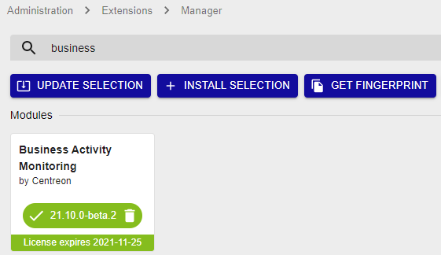

import Tabs from '@theme/Tabs';
import TabItem from '@theme/TabItem';

> Centreon BAM is a Centreon **extension** that requires a valid license key. To
> purchase one, contact
> [Centreon](mailto:sales@centreon.com).

## Prerequisites

See the [software requirements](../installation/prerequisites.md#software).

Install BAM on the central server.
The central server and Centreon BAM must be installed in the same major versions (i.e. both in 24.10.x).
If you want to be able to view the Business activities monitored by a remote server, install BAM on the remote server too. When BAM is installed on a remote server, the Business activities will only include the resources monitored by the remote server.

## Installation

### Install the package

Add the Centreon Business repository; you can find it on the
[support portal](https://support.centreon.com/hc/en-us/categories/10341239833105-Repositories).

And install the package using the following command:

<Tabs groupId="sync">
<TabItem value="Alma / RHEL / Oracle Linux 8" label="Alma / RHEL / Oracle Linux 8">

``` shell
dnf install centreon-bam-server
```

</TabItem>
<TabItem value="Alma / RHEL / Oracle Linux 9" label="Alma / RHEL / Oracle Linux 9">

``` shell
dnf install centreon-bam-server
```

</TabItem>
<TabItem value="Debian 11 & 12" label="Debian 11 & 12">

```shell
apt update && apt install centreon-bam-server
```

</TabItem>

</Tabs>

### Upload the license

A license file *bam.license* is provided by Centreon. Go to the
**Administration > Extensions > Manager** menu and upload the license
using the interface.

### Install the interface

Go to the **Administration > Extension > Manager** menu and click the install
button for the following modules:

- License Manager (if not yet installed)
- Business Activity Monitoring

Once installed and the license added, the module will have a green banner that indicates
the license expiry date:



> If you are using MariaDB replication for your monitoring databases,
> installing Centreon BAM generates a view. You need to exclude it from
> replication by adding the following line on the my.cnf file of the
> slave server:
>
> ``` text
> replicate-ignore-table=centreon.mod_bam_view_kpi
> ```
>
> Create the view manually on the slave server [using this file](view_creation.sql), by executing the
> following command:
>
> ``` shell
> mysql centreon < view_creation.sql
> ```
