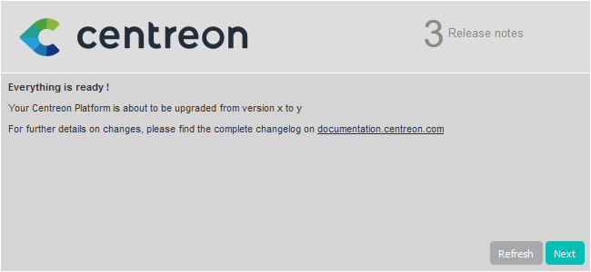

import Tabs from '@theme/Tabs';
import TabItem from '@theme/TabItem';

This chapter describes how to update your Centreon 24.10 platform (i.e. switch from version 24.10.x to version 24.10.y).

## Perform a backup

Make sure that you have fully backed up your environment for the following
servers:

- central server,
- database server.

If you use Open Ticket with custom configurations, you should make a backup before updating Centreon:

* Make a backup of these folders: **/usr/share/centreon/www/modules/centreon-open-tickets** and **/usr/share/centreon/www/widgets/open-tickets**
* After updating, copy paste the backup **register.php** file(s) to **/usr/share/centreon/www/modules/centreon-open-tickets/providers/**

## Update the Centreon central server

### Update the Centreon solution

Make sure all users are logged out from the Centreon web interface before starting the update procedure.

<Tabs groupId="sync">
<TabItem value="Alma / RHEL / Oracle Linux 8" label="Alma / RHEL / Oracle Linux 8">

Clean the cache:

  ```shell
  dnf clean all --enablerepo=*
  ```

Then upgrade all the components with the following command:

  ```shell
 dnf update centreon\*
  ```

</TabItem>
<TabItem value="Alma / RHEL / Oracle Linux 9" label="Alma / RHEL / Oracle Linux 9">

Clean the cache:

  ```shell
  dnf clean all --enablerepo=*
  ```

Then upgrade all the components with the following command:

  ```shell
 dnf update centreon\*
  ```

</TabItem>
<TabItem value="Debian 12" label="Debian 12">

Clean the cache:

  ```shell
  apt clean
  apt update
  ```

Then upgrade all the components with the following command:

  ```shell
  apt install --only-upgrade centreon*
  ```

</TabItem>
</Tabs>

Now you need to finalize the update:

<Tabs groupId="sync">
<TabItem value="Using the wizard" label="Using the wizard">

1. Log on to the Centreon web interface to continue the update process. Click **Next**:

  

2. Click **Next**:

  

3. The release notes describe the main changes. Click **Next**:

  

4. This process performs the various upgrades. Click **Next**:

  

5. Your Centreon server is now up to date. Click **Finish** to access the login
page:

  

  > If the Centreon BAM module is installed, refer to the [update procedure](../service-mapping/update.md).

6. Deploy the central's configuration from the Centreon web UI by following [this
procedure](../monitoring/monitoring-servers/deploying-a-configuration.md).
  
</TabItem>
<TabItem value="Using a dedicated API endpoint" label="Using a dedicated API endpoint">

1. Log on to the central server through your terminal to continue the update process.

  > You need an authentication token to reach the API endpoint. Perform the following procedure to get a token.

  In our case, we have the configuration described below (you need to adapt the procedure to your configuration).
   - address: 10.25.XX.XX
   -  port: 80
   -  version: 24.10
   -  login: Admin
   -  password: xxxxx

2. Enter the following request:

  ```shell
  curl --location --request POST '10.25.XX.XX:80/centreon/api/v24.10/login' \
  --header 'Content-Type: application/json' \
  --header 'Accept: application/json' \
  --data '{
    "security": {
      "credentials": {
        "login": "Admin",
        "password": "xxxxx"
      }
    }
  }'
  ```

  This is how the result should look:

    ```shell
    {"contact":{"id":1,"name":"Admin Centreon","alias":"admin","email":"admin@localhost","is_admin":true},"security":{"token":"hwwE7w/ukiiMce2lwhNi2mcFxLNYPhB9bYSKVP3xeTRUeN8FuGQms3RhpLreDX/S"}}
    ```

3. Retrieve the token number to use it in the next request.

4. Then enter this request:

  ```shell
  curl --location --request PATCH 'http://10.25.XX.XX:80/centreon/api/latest/platform/updates' \
  --header 'X-AUTH-TOKEN: hwwE7w/ukiiMce2lwhNi2mcFxLNYPhB9bYSKVP3xeTRUeN8FuGQms3RhpLreDX/S' \
  --header 'Content-Type: application/json' \
  --data '{
      "components": [
          {
              "name": "centreon-web"
          }
      ]
  }'
  ```

5. This request does not return any result. To check if the update has been successfully applied, read the version number displayed on the Centreon web interface login page.

</TabItem>
</Tabs>

Finally, restart Broker, Engine and Gorgone on the central server by running this command:

  ```shell
  systemctl restart cbd centengine gorgoned
  ```

### Update extensions

From **Administration > Extensions > Manager**, update all extensions, starting
with the following:

- License Manager,
- Monitoring Connector Manager,
- Auto Discovery.

Then you can update all other commercial extensions (such as [MBI](../reporting/update.md) and [MAP](../graph-views/map-web-update.md)).

## Update the Remote Servers

This procedure is the same as to update a Centreon central server.

> At the end of the update, the configuration should be deployed from the central
> server.

## Update the Pollers

<Tabs groupId="sync">
<TabItem value="Alma / RHEL / Oracle Linux 8" label="Alma / RHEL / Oracle Linux 8">

1. Clean the cache:

  ```shell
  dnf clean all --enablerepo=*
  ```

2. Then upgrade all the components with the following command:

  ```shell
  dnf update centreon\* --exclude=centreon-plugin*
  ```

</TabItem>
<TabItem value="Alma / RHEL / Oracle Linux 9" label="Alma / RHEL / Oracle Linux 9">

1. Clean the cache:

  ```shell
  dnf clean all --enablerepo=*
  ```

2. Then upgrade all the components with the following command:

  ```shell
  dnf update centreon\* --exclude=centreon-plugin*
  ```

</TabItem>
<TabItem value="Debian 12" label="Debian 12">

1. Clean the cache:

  ```shell
  apt clean
  apt update
  ```

2. Then upgrade all the components with the following command:

  ```shell
  apt-get update && apt-mark hold centreon-pack* && apt-mark hold centreon-plugin* && apt-get install --only-upgrade 'centreon*' 
  ```

</TabItem>
</Tabs>

  > Accept the new GPG keys from the repositories as needed.

3. Deploy the Poller's configuration from the Centreon web UI by following [this
procedure](../monitoring/monitoring-servers/deploying-a-configuration.md),
and choose the **Restart** method for the Engine process.

4. Finally, restart the Gorgone service if it is used on the Poller:

  ```shell
  systemctl restart centengine gorgoned
  ```

5. Run the following command:

<Tabs groupId="sync">
<TabItem value="Alma / RHEL / Oracle Linux 8" label="Alma / RHEL / Oracle Linux 8">

Nothing to do for this OS.

</TabItem>
<TabItem value="Alma / RHEL / Oracle Linux 9" label="Alma / RHEL / Oracle Linux 9">

Nothing to do for this OS.

</TabItem>
<TabItem value="Debian 12" label="Debian 12">

  ```shell
  apt-mark unhold centreon-pack* && apt-mark unhold centreon-plugin*
  ```

</TabItem>
</Tabs>

## Unattended update

You can perform an unattended update of your platform using the **unattended.sh** script.

1. Download the script using the following command:

```shell
curl -L https://download.centreon.com/24.10/unattended.sh -O /tmp/unattended
```

2. Run the script:

* For a central server:

```shell
bash unattended.sh update -t central -v 24.10 -r stable -s -p<my_admin_password> -l DEBUG  2>&1 |tee -a /tmp/unattended-$(date +"%m-%d-%Y-%H%M%S").log
```

* For a remote server:

```shell
bash unattended.sh update -t central -v 24.10 -r stable -s -p<my_admin_password> -l DEBUG  2>&1 |tee -a /tmp/unattended-$(date +"%m-%d-%Y-%H%M%S").log
```

* For a poller:

```shell
bash unattended.sh update -t poller -v 24.10 -r stable -l DEBUG  2>&1 |tee -a /tmp/unattended-$(date +"%m-%d-%Y-%H%M%S").log
```
