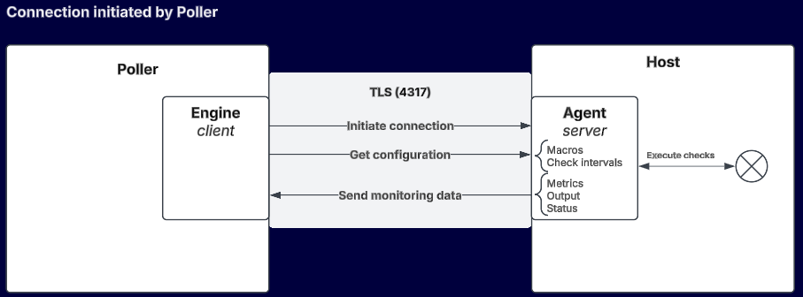

import Tabs from '@theme/Tabs';
import TabItem from '@theme/TabItem';

## Introduction

The Centreon Monitoring Agent (CMA) is a piece of software installed on the host it monitors: it collects metrics and computes statuses, and sends them to Centreon.

The agent can execute native checks, or use Centreon plugins to execute non-native checks. Native checks are run directly by the agent (as opposed to non-native checks, which require local plugins to be installed on the host). Native checks have better performance and a better footprint (reduced CPU and memory usage).

Both native and non-native checks are defined in either the **Linux Centreon Monitoring Agent** connector or the **Windows Centreon Monitoring Agent** connector. The connectors provide the templates and the agent retrieves the configuration of these checks at regular intervals after the connection has been established.

The agent performs the checks (for non-native checks, using the local plugins) and sends the data to the poller. The part of the poller's Engine that receives data from the agent is called the OTLP receiver (OTLP means OpenTelemetry protocol).

Custom Nagios-compatible plugins can also be used with this agent.

## When do I need to use an agent?

Use the CMA agent:

* when security policies only allow outgoing flows (no checks can be performed by pollers, SNMP is not authorized).
* on sites that have no local poller.
* when you need to run a script locally on the monitored machine for security (rights and/or protocols) or performance reasons.

## OSs you can monitor with CMA

The CMA can be installed on and monitor the following OSs:

<Tabs groupId="sync" queryString>
<TabItem value="Linux" label="Linux">

* RHEL/Oracle Linux/Alma Linux 8
* RHEL/Oracle Linux/Alma Linux 9
* RHEL/Oracle Linux/Alma Linux 10
* Debian 11
* Debian 12
* Debian 13
* Ubuntu 22.04/24.04 LTS

</TabItem>
<TabItem value="Windows" label="Windows">

* Windows 10
* Windows 11
* Windows Server 2016
* Windows Server 2019
* Windows Server 2022
* Windows Server 2025

</TabItem>
</Tabs>

## Applications you can monitor with CMA

* Included with the Centreon connectors:

   * [**Hitachi E Series**](/pp/integrations/plugin-packs/procedures/hardware-storage-hitachi-eseries-cma)
   * [**Hyper-V 2012**](/pp/integrations/plugin-packs/procedures/virtualization-hyperv-2012-cma)
   * [**Linux**](/pp/integrations/plugin-packs/procedures/operatingsystems-linux-centreon-monitoring-agent)
   * [**Linux Libvirt**](/pp/integrations/plugin-packs/procedures/virtualization-linux-libvirt-cma)
   * [**Microsoft Active Directory**](/pp/integrations/plugin-packs/procedures/infrastructure-active-directory-centreon-monitoring-agent)
   * [**Microsoft Cluster Server**](/pp/integrations/plugin-packs/procedures/applications-mscs-cma)
   * [**Microsoft Exchange**](/pp/integrations/plugin-packs/procedures/applications-exchange-cma)
   * [**Microsoft SCCM**](/pp/integrations/plugin-packs/procedures/applications-sccm-cma)
   * [**Microsoft WSUS**](/pp/integrations/plugin-packs/procedures/applications-wsus-cma)
   * [**Veeam**](/pp/integrations/plugin-packs/procedures/applications-veeam-centreon-monitoring-agent)
   * [**Windows**](/pp/integrations/plugin-packs/procedures/operatingsystems-windows-centreon-monitoring-agent).

* You can also [develop your own plugins](cma-custom.md).

## How do the host and the poller interact?

### Connection direction

Depending on the case, either the agent or the poller initiates the connection.
> Please note that the two connection modes described below only apply to establishing the connection.
> Once the connection is established, the behavior of the agent (scheduling checks, reporting information) and the collector (alerts, configuration sending) is strictly identical in both cases, and the connection is bidirectional.

* In the case of an **agent-initiated connection**, you simply configure the poller to listen on a specific port. A poller can receive data from n agents/hosts.
* If the agent is not allowed to connect to the poller for security reasons (e.g. when the poller is in a DMZ), you can use a **poller-initiated connection**. You need to declare in Centreon each host that will be monitored by this agent in the ****Configuration > Poller > Agent configurations** menu. The poller will receive data from n hosts via the agent.

The two connection directions can be combined within the same poller, depending on the type of your monitored fleet.

### Securing the connection

The connection between the poller and the agent must be secure in production. You must use:

- [a TLS connection with certificates](cma-certificates.md)
- [an authentication token](cma-setup.md#create-an-authentication-token).

### Operating diagram

<Tabs groupId="sync" queryString>
<TabItem value="Agent connects to poller" label="Agent connects to poller">

</TabItem>
<TabItem value="Poller connects to agent" label="Poller connects to agent">

</TabItem>
</Tabs>
