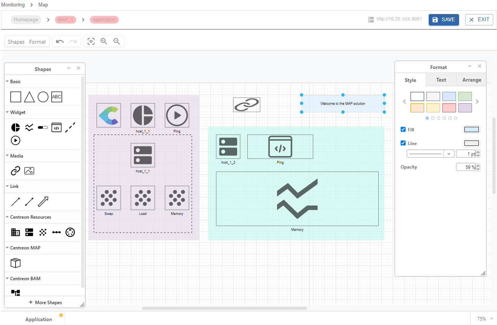
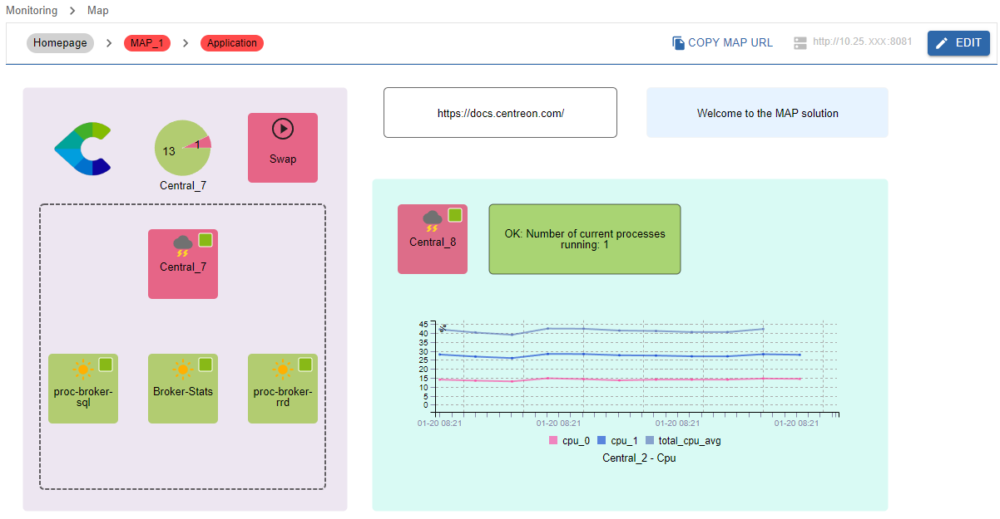

Centreon MAP is a solution fully available in the Centreon web interface while offering you the best possible experience in creating, visualizing and sharing graphical representations of your monitored infrastructure.

> Centreon MAP is a Centreon extension that requires a valid [license](../administration/licenses.md). To purchase one and retrieve the necessary repositories, contact [Centreon](mailto:sales@centreon.com).

> From Centreon 24.10, MAP Legacy is no longer available. Whether you were still using MAP Legacy or not, see [MAP Legacy end of life](https://docs.centreon.com/docs/graph-views/map-legacy-eol/).

> See how to manage views using the Centreon MAP REST API [here](https://docs-api.centreon.com/api/centreon-map/24.10/).

## Overview

Create, customize, and view your maps within a single web interface.

First, you need to create logical views using the MAP editor:

Then you can view your map directly in viewing mode:

Your maps can be displayed in two ways in the interface:
- In the **Monitoring > Map** page, in view mode.
- In the **Home > Custom Views** page, using a dedicated MAP [widget](../alerts-notifications/custom-views.md).

## Procedures

Use the following procedures to use and administer Centreon MAP.

### Administrating MAP
  - [Installing MAP](map-web-install.md) describes prerequisites and procedures to install MAP.
  - [Installing MAP on a remote server](map-web-install-remote.md) explains how to install MAP on a remote server.
  - [Updating MAP](map-web-update.md) describes the update process for MAP.
  - [Managing access rights in MAP](map-web-manage.md) describes the different rights and permissions on maps.
  
### Using MAP
  - [Managing maps in MAP](map-web-manage.md) gives you information about how to manage maps from the Centreon MAP interface.
  - [Creating a standard map](map-web-create-standard-map.md) describes how to create standard maps and how to customize them using the MAP editor.
  - [Creating a geographic view](map-web-create-geoview.md) explains how to display your resources across a defined geographical area.
  - [MAP known issues](map-web-known-issues.md) is a list of issues you may encounter using MAP.
  - [MAP troubleshooting](map-web-troubleshooting.md) helps you to solve some issues occurring in MAP.
