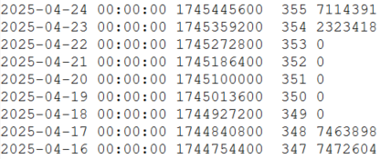
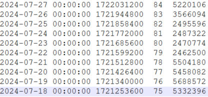
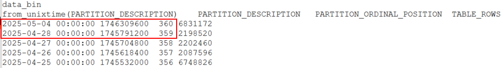

## How do I know MBI is properly configurated?

Use the following command to verify MBI is properly configured

```shell
/usr/share/centreon-bi/tools/diagnostic.sh | less
```

Use this command to verify the CBIS service status

```shell
systemctl status cbis
```

**expected result**

## The report I generated is empty

A cronjob is launched at approximately 4h30 AM that will compile and calculate all the data of the day before. CBIS then goes into the compiled data at the scheduled time to pick out the data relevant to the report it needs to generate. If reports are being generated without data in them, it's possible CBIS is sending its SQL requests before the cronjob is finished and so the data CBIS requests does not exist yet. Try pushing back the cyclic launch hour so that CBIS does not request data before the cronjob has finished. 


lien vers notre section bonne pratiques en demandant à l'utilisateur s'il a bien suivi les recommendations

on ne sait pas dans l'interface si tes paramètres de rétention sont trop élevés (obligé de faire un df -h)

Quand une partition est trop remplie tu peux perdre des données, perdre la synchro entre central et pollers - aucun moyen simple de récupération dans Centreon, l'utilisateur est dépendant du support si sa partition est pleine


trop de choses dans general options et tout dépend de la même table : si trop de données, la requête ne passe pas, il faut faire les modifs en base (ville de paris)

## I cannot see the report design/the hosts I need

MBI follows the rules of ACLs. If you can not see certain report designs or certain resources, it is possible you have not been authorized to do so in the ACLs. 
These can be configured by an administrator inside **Administration > ACL > ACL Rules**. Here, administrators can choose which report designs, jobs and job groups each user is allowed to access.

## I am still facing data-related issues after using the partitions and db-content commands.

The --db-content and --partitions options in the /usr/share/centreon-bi/etl/centreonbiMonitoring.pl script may not fully represent the data in MBI. If you did not find any issues using them but continue running into data-related issues, we have a series of queries to help. They will list all partitions of a singular table or tables to find missing partitions or empty ones.

- The --db-content option displays the date of the latest data present in each table. If the displayed information is recent, there could be data missing in dates previous to the one specified.

- The --partitions option indicates the number of partitions missing since the first partition of the table and today as well when they've been missing. However, partitions could be properly created but also be empty.

Each of these queries is a shell command which generates a file. This file will contain the partition list of each partitioned table of the db.

For all partitioned tables:

```shell
for i in $(mysql -Ne "select distinct TABLE_NAME from information_schema.partitions where TABLE_SCHEMA='centreon_storage' and (TABLE_NAME like 'mod_bi%' OR TABLE_NAME like 'data_bin') and PARTITION_NAME is NOT NULL;"); do echo $i && mysql -e "select from_unixtime(PARTITION_DESCRIPTION), PARTITION_DESCRIPTION, PARTITION_ORDINAL_POSITION, TABLE_ROWS from information_schema.partitions where table_schema = 'centreon_storage' and table_name = '$i' order by PARTITION_ORDINAL_POSITION desc;";done > /tmp/result
```

For all “mod_bi*” tables:

```shell
for i in $(mysql -Ne "select distinct TABLE_NAME from information_schema.partitions where TABLE_SCHEMA='centreon_storage' and TABLE_NAME like 'mod_bi%' and PARTITION_NAME is NOT NULL;"); do echo $i && mysql -e "select from_unixtime(PARTITION_DESCRIPTION), PARTITION_DESCRIPTION, PARTITION_ORDINAL_POSITION, TABLE_ROWS from information_schema.partitions where table_schema = 'centreon_storage' and table_name = '$i' order by PARTITION_ORDINAL_POSITION desc;";done > /tmp/result
```

For a specific table :

```shell
mysql -e "select from_unixtime(PARTITION_DESCRIPTION), PARTITION_DESCRIPTION, PARTITION_ORDINAL_POSITION, TABLE_ROWS from information_schema.partitions where table_schema = 'centreon_storage' and table_name = '<table_name>' order by PARTITION_ORDINAL_POSITION desc;"
```

After launching the query, you will see 4 columns for each partitioned table: 

- The partition datestamp (including the time), made readable to us thanks to the from_unixtime function
- The partition description, the datestamp in its raw state
- The PARTITION_ORDINAL_POSITION which is the position of the partition in the table. This value is unique and always increasing.
- The number of lines in the partition.

**This allows you to see empty partitions:**



You can see the partitions from 18/04 to 22/04 exist but they contain no lines

**As well as partitions with an unusually low number of lines:**



Partitions 81, 82 and 83 have particularly low number of lines. We can ignore this for 79 and 80 since they are from a week-end

**You can also notice missing partitions:**



Notice there are no partitions between 28/04 and 04/05
