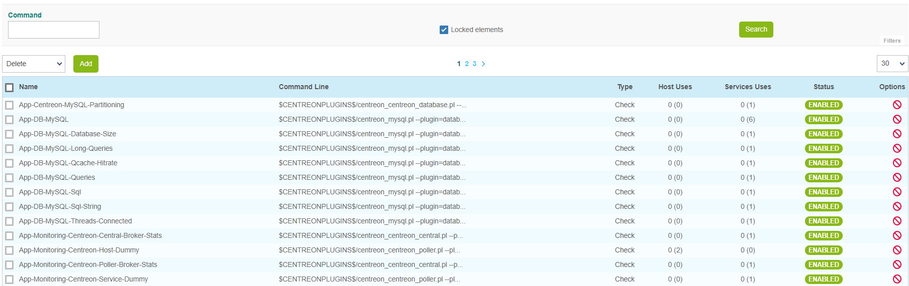
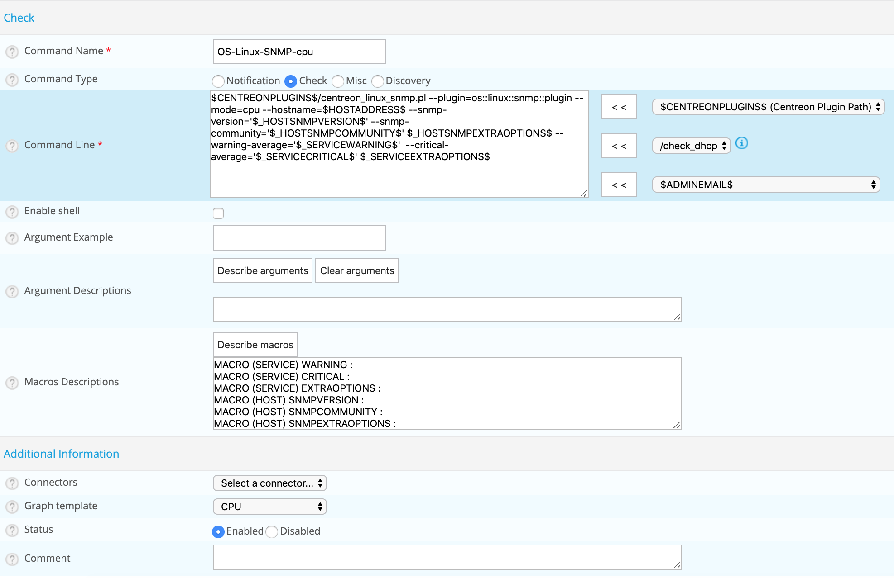

import Tabs from '@theme/Tabs';
import TabItem from '@theme/TabItem';

## Definition

A command is the definition of a command line that uses a script or an application to perform an action. It is
possible to execute this command by specifying arguments.

There are four types of command:

* **Verification** commands are used by the schedulers to verify the status of a host or service.
* **Notification** commands are used by the schedulers to alert the contacts (via mail, SMS, etc.).
* **Discovery** commands are used by the schedulers to discover.
* **Miscellaneous** commands are used by the additional modules (to perform certain actions), by the scheduler for
  data processing, etc.

All the commands can be configured in the following menu: **Configuration > Commands**.



> By default, locked commands are hidden. Check the "Locked elements" box to list all commands.

## Adding a command

1. Go to the **Configuration > Commands** menu
2. Click **Add**



> The configuration fields of a command are the same regardless of the type of command chosen.

## Configuration fields

* The **Command Name** field defines the name of the command.
* The **Command Type** field allows us to choose the type of command.
* The **Command Line** field indicates the application or script used with the command.
* The **Enable shell** box allows us to enable functions that are specific to a shell, such as the pipe, etc.
* The **Argument Example** field defines examples of arguments (each argument starts with a ”!”)
* The **Describe arguments** button is used to add a description to “$ARGn$”-type arguments. This description
  will be visible when using the command in a host or service form.
* The **Clear arguments** button deletes the description of arguments defined
* The **Describe macros** button is used to add a description to all macros. This description will be visible when
  using the command in a host or service form.
* The **Connectors** selectlist is used to link a Connector to the command. For more information on Connectors, refer to the
  chapters entitled *[Perl Connector](#perl-connector)* and *[SSH Connector](#ssh-connector)*.
* The **Graph template** field is used to link the command to a graph template.
* The **Comment** field can be used to make a comment on the command.

## Arguments and macros

In the **Command Line** field, it is possible to use *[macros](macros.md)* and arguments.

The macros are used to pass various settings to the scripts called up by the commands. During execution
of the command by the scheduler, all of the arguments and macros are replaced by their respective values.
Each macro appears in the form **$value$**:

```shell
$CENTREONPLUGINS$/centreon_linux_snmp.pl --plugin=os::linux::snmp::plugin --mode=cpu \
--hostname=$HOSTADDRESS$ --snmp-version='$_HOSTSNMPVERSION$' \
--snmp-community='$_HOSTSNMPCOMMUNITY$' $_HOSTSNMPEXTRAOPTIONS$ \
--warning-average='$_SERVICEWARNING$' \
--critical-average='$_SERVICECRITICAL$' $_SERVICEEXTRAOPTIONS$
```

> Good practice requires replacing the arguments by *[custom macros](macros.md#custom-macros)*.

## Testing a command

To make sure that a command works, you can test it in the command line on your poller.

1. On your central server, on the **Resource status** page, select the host or service whose check command you want to test.
2. Copy the check command at the bottom of the **Details** panel.
3. Log in to your poller as user **centreon-engine** (`su - centreon-engine`).
4. Run the command you copied (for password macros, replace *** with the actual password).

The command returns the same information as the **Information column** in the **Resource status** page (i.e., output, metrics and extended output provided by stdout), plus the messages for the error output (stderr). The solution to any problem is likely to be indicated there.

## Command whitelists

Centreon allows you to create whitelists that define which commands are allowed to be executed by the monitoring engine of each poller. By default, no whitelists exist and all commands are allowed. However, if you include one command in a whitelist file, all other commands will be blocked. In that case, remember to allow all commands from Centreon plugins (see below). Also, if you create custom plugins with your own custom commands in it, or are using a community plugin, you will have to add their commands to the command whitelist of the poller that will run the plugin.

### Add a command to the whitelist

1. Log in as **root** on the poller that will run the commmand.
2. Create the following directory and file: **/etc/centreon-engine-whitelist/my-whitelist.yml**. (You can create as many whitelist files as you want in this directory.)
3. Make sure the correct access rights are defined on all whitelist files:

   ```yaml
   chown root:centreon-engine /etc/centreon-engine-whitelist/my-whitelist.yml
   chmod 0640 /etc/centreon-engine-whitelist/my-whitelist.yml
   chown root:centreon-engine /etc/centreon-engine-whitelist
   chmod 750 /etc/centreon-engine-whitelist
   ```

4. Use a regex to define which commands to authorize. Example:

   ```text
   whitelist:
      regex:
		 - \/usr\/lib(64)?\/nagios\/plugins\/.*
		 - \/usr\/lib(64)?\/nagios\/plugins\/.check_.*
         - \/opt\/my_plugins\/my_custom_plugin\.py .*
   cma-whitelist:
   default:
    regex:
      - \/usr\/lib(?:64)?\/nagios\/plugins\/.*
      - \/usr\/lib(?:64)?\/centreon\/plugins\/check_centreon_bam.*
      - \"C:\/Program Files\/Centreon\/Plugins\/centreon_plugins.exe\"\s+.+
      - ^\{\s*"check":".*\}$
      - \/usr\/bin\/echo\s+Host\s+alive
      - cmd\.exe\s+\/C\s+echo\s+.*
   ```

5. Reload the **centengine** service:

   ```text
   systemctl reload centengine
   ```

The **whitelist** block defines the commands that can be executed by the poller.

> The first two lines must always be present in the “whitelist” block; they correspond to Centreon commands.

The **cma-whitelist** block defines the commands that can be executed by the CMA agent.

In the **cma-whitelist** block, you can specify whitelists by host if necessary. The syntax is as follows:

```text
whitelist:
  regex:
	 - \/usr\/lib(64)?\/nagios\/plugins\/.*
	 - \/usr\/lib(64)?\/nagios\/plugins\/.check_.*
	 - \/opt\/my_plugins\/my_custom_plugin\.py .*
cma-whitelist:
  default:
    regex:
      - \/usr\/lib(?:64)?\/nagios\/plugins\/.*
      - \/usr\/lib(?:64)?\/centreon\/plugins\/check_centreon_bam.*
      - \"C:\/Program Files\/Centreon\/Plugins\/centreon_plugins.exe\"\s+.+
      - ^\{\s*"check":".*\}$
      - \/usr\/bin\/echo\s+Host\s+alive
      - cmd\.exe\s+\/C\s+echo\s+.*
  hosts:
    - hostname:Host_1
    regex:
      - ...
      
    - hostname:Host_2
    regex:
      - ...
```


Use `.*` to include all arguments in the regex. The `.*`  at the end of the regex allows it to handle any arguments it may contain. Bear in mind that the format must be strictly indentical to the one above (including indents).

> If you have not authorized your custom command in a whitelist, it will say so in the **Information** column of the **Resources Status** page.

## Connectors

### SSH connector

Centreon SSH Connector is free software from Centreon available under the Apache Software License version 2 (ASL 2.0).
It speeds up execution checks over SSH when used with Centreon Engine.

#### Installation

Centreon recommends using its official packages. Most of Centreon’s endorsed software is available as RPM packages.

Run the following commands as a privileged user:

<Tabs groupId="sync" queryString>
<TabItem value="Alma / RHEL / Oracle Linux 8" label="Alma / RHEL / Oracle Linux 8">

``` shell
dnf install centreon-connector-ssh
```

</TabItem>
<TabItem value="Alma / RHEL / Oracle Linux 9" label="Alma / RHEL / Oracle Linux 9">

``` shell
dnf install centreon-connector-ssh
```

</TabItem>
<TabItem value="Debian 12" label="Debian 12">

``` shell
apt install centreon-connector-ssh
```

</TabItem>
</Tabs>

### Perl connector

Centreon Perl Connector is free software from Centreon available under the Apache Software License version 2 (ASL 2.0).
It speeds up execution of Perl scripts when used with Centreon Engine.

#### Installation

Centreon recommends using its official packages. Most of Centreon’ endorsed software are available as RPM packages.

Run the following commands as a privileged user:

<Tabs groupId="sync" queryString>
<TabItem value="Alma / RHEL / Oracle Linux 8" label="Alma / RHEL / Oracle Linux 8">

``` shell
dnf install centreon-connector-perl
```

</TabItem>
<TabItem value="Alma / RHEL / Oracle Linux 9" label="Alma / RHEL / Oracle Linux 9">

``` shell
dnf install centreon-connector-perl
```

</TabItem>
<TabItem value="Debian 12" label="Debian 12">

``` shell
apt install centreon-connector-perl
```

</TabItem>
</Tabs>
