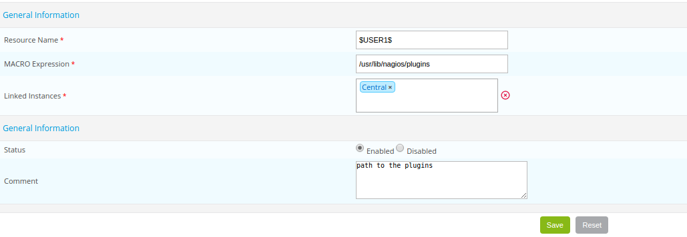

A macro is a variable used to retrieve certain values.
A macro always starts and finishes with the “$” sign.

## Standard macros

Standard macros are macros predefined in the source code of the monitoring engines. These macros allow us to
retrieve the value of various objects from commands.

e.g.:

* The macro called **$HOSTADDRESS$** enables us to retrieve the IP address of a host
* The macro called **$CONTACTEMAIL$** enables us to retrieve the e-mail address of the contact

> A complete [list of macros](#list-of-macros) is available as well as a description of what they represent.

## Custom macros

### Definition

Customized macros are macros defined by the user at the creation of a host or a service. They are used in check
commands. Customized macros start with $_HOST for customized macros of hosts and $_SERVICE for customized macros of
services.

There are several advantages to using customized macros instead of arguments:

* The function of the macro is defined in its name. The macro $_HOSTMOTDEPASSEINTRANET$ is easier to read than $ARG1$
* Macros inherit models of hosts and services; hence it is possible to modify a single macro for a host or a
  service. On the other hand, the arguments all need to be redefined if a single argument is changed
* The number of arguments is limited to 32, unlike customized macros, which are unlimited

A macro of a host is used to define a variable that is specific to the host and that will not change regardless of the
service questioned: host connection identifiers, a port of connection to a particular service, an SNMP community, etc.
A macro of a service is used more to define settings specific to a service: a WARNING / CRITICAL threshold, a partition
to be questioned, etc.

### Example

When a host is defined, the following macros are created:

To retrieve these macros in a check command, you need to call it using the following variables: $_HOSTUSERLOGIN$,
$_HOSTUSERPASSWORD$.

When a service is defined, the following macros are created:

To retrieve these macros in a check command, you need to invoke them using the following variables: $_SERVICEPARTITION$,
$_SERVICEWARNING$, $_SERVICECRITICAL$.

### A special case

The **Community SNMP & Version** fields in a host form automatically generate the following customized macros:
$_HOSTSNMPCOMMUNITY$ and $_HOSTSNMPVERSION$.

## Macros within macros

When Centreon Engine evaluates a command, macro resolution happens in two successive passes.

**Level 1 — Command level**: Macros embedded directly in the command line are resolved:

- A resolved standard or custom macro → replaced with its value.
- An unresolved or empty macro → replaced with an empty string.

**Level 2 — Macro value level**: If the value produced at Level 1 itself contains macro-like tokens, a second pass applies to that value:

- A resolved macro → replaced with its value.
- An unresolved or empty macro → **left as-is** (preserved verbatim, not stripped).

### Double-brace escape syntax

Use the `{{$MACRO$}}` format when you want unresolved macros inside a value to be replaced with an empty string rather than preserved verbatim:

- At Level 1 or Level 2: a resolved macro is replaced with its value and the double braces are removed.
- At Level 1 or Level 2: an unresolved or empty macro is replaced with an empty string and the double braces are removed.

### Use case: third-party plugin syntaxes

Some monitoring plugins use `$` characters in their own argument syntax that are not Centreon macro delimiters. A common example is NSClient++ syntax, which uses tokens such as `${name}`, `${state}`, `${problem_list}`, and `${drive}`.

Because these tokens are unresolved Centreon macros, Level 2 behaviour preserves them verbatim, allowing the plugin to receive the correct argument string.

:::warning

If you define a macro value that contains such tokens and export the configuration with an older Engine version that does not implement the two-level model, those tokens will be stripped and the plugin will receive a malformed command line.

:::

## Global macros

Global macros are used by the monitoring engine. These macros can be invoked by any type
of command. They come in the form: $USERn$ where ‘n’ lies between 1 and 256.

In general, these macros are used to refer to paths containing monitoring probes. By default the $USER1$
macro is created, and its value is the following: /usr/lib/nagios/plugins.

To add a global macro:

* Go into the **Configuration \> Pollers \> Global macros** menu
* Click **Add**

* The **Name** field defines the name of the macro, e.g.: $USER3$
* The **Expression** field defines the value of the macro.
* The **Linked Instances** list allows us to define which monitoring poller will be able to access this macro.
* The **Status** and **Comment** fields are used to enable / disable the macro and to comment on it.

## Environment macros

Environment macros (also called “on demand”) are used to retrieve information from all
the objects obtained from the monitoring. They are used to retrieve the value of an object at any given moment.

They are complementary to standard macros, e.g.:

* The standard macro $CONTACTEMAIL$ refers to the e-mail address of the contact who uses the 
  notification command
* The environment macro $CONTACTEMAIL:centreon$ returns the e-mail address of the user: “centreon”

The complete documentation on “on demand” macros is available at this *[address](https://assets.nagios.com/downloads/nagioscore/docs/nagioscore/3/en/macros.html)*.

> The use of these macros is not recommended, because the search for a value of a setting of an object from another
object consumes resources.

> The enabling of the setting **Use large installation tweaks** makes it impossible to use environment macros.

## List of macros

The following is an exhaustive list of macros by resource type, each type of resource also has a description section. 

> Some macros may have a number next to them (i.e. **[(2)](#notes)**). The [notes section](#notes) at the end of this page further explains possible restrictions or recommendations related to these macros.

### Host Macros

| Macro Name [[(3)](#notes)](#notes)   | Service Checks | Service Notifications  | Host Checks       | Host Notifications  | Service Event Handlers | Host Event Handlers | Note | Action URL |
|---------------------------------------|----------------|------------------------|-------------------|---------------------|------------------------|---------------------|------|------------|
| \$HOSTNAME\$                         | Yes            | Yes                    | Yes               | Yes                 | Yes                    | Yes                 | Yes | Yes        |
| \$HOSTDISPLAYNAME\$                  | Yes            | Yes                    | Yes               | Yes                 | Yes                    | Yes                 | No  | No         |
| \$HOSTALIAS\$                        | Yes            | Yes                    | Yes               | Yes                 | Yes                    | Yes                 | Yes | Yes        |
| \$HOSTADDRESS\$                      | Yes            | Yes                    | Yes               | Yes                 | Yes                    | Yes                 | Yes | Yes        |
| \$HOSTSTATE\$                        | Yes            | Yes                    | Yes [(1)](#notes) | Yes                 | Yes                    | Yes                 | Yes | Yes        |
| \$HOSTSTATEID\$                      | Yes            | Yes                    | Yes [(1)](#notes) | Yes                 | Yes                    | Yes                 | Yes | Yes        |
| \$LASTHOSTSTATE\$                    | Yes            | Yes                    | Yes               | Yes                 | Yes                    | Yes                 | No  | No         |
| \$LASTHOSTSTATEID\$                  | Yes            | Yes                    | Yes               | Yes                 | Yes                    | Yes                 | No  | No         |
| \$HOSTSTATETYPE\$                    | Yes            | Yes                    | Yes [(1)](#notes) | Yes                 | Yes                    | Yes                 | No  | No         |
| \$HOSTATTEMPT\$                      | Yes            | Yes                    | Yes               | Yes                 | Yes                    | Yes                 | No  | No         |
| \$MAXHOSTATTEMPTS\$                  | Yes            | Yes                    | Yes               | Yes                 | Yes                    | Yes                 | No  | No         |
| \$HOSTEVENTID\$                      | Yes            | Yes                    | Yes               | Yes                 | Yes                    | Yes                 | No  | No         |
| \$LASTHOSTEVENTID\$                  | Yes            | Yes                    | Yes               | Yes                 | Yes                    | Yes                 | No  | No         |
| \$HOSTPROBLEMID\$                    | Yes            | Yes                    | Yes               | Yes                 | Yes                    | Yes                 | No  | No         |
| \$LASTHOSTPROBLEMID\$                | Yes            | Yes                    | Yes               | Yes                 | Yes                    | Yes                 | No  | No         |
| \$HOSTLATENCY\$                      | Yes            | Yes                    | Yes               | Yes                 | Yes                    | Yes                 | No  | No         |
| \$HOSTEXECUTIONTIME\$                | Yes            | Yes                    | Yes [(1)](#notes) | Yes                 | Yes                    | Yes                 | No  | No         |
| \$HOSTDURATION\$                     | Yes            | Yes                    | Yes               | Yes                 | Yes                    | Yes                 | No  | No         |
| \$HOSTDURATIONSEC\$                  | Yes            | Yes                    | Yes               | Yes                 | Yes                    | Yes                 | No  | No         |
| \$HOSTDOWNTIME\$                     | Yes            | Yes                    | Yes               | Yes                 | Yes                    | Yes                 | No  | No         |
| \$HOSTPERCENTCHANGE\$                | Yes            | Yes                    | Yes               | Yes                 | Yes                    | Yes                 | No  | No         |
| \$HOSTGROUPNAME\$                    | Yes            | Yes                    | Yes               | Yes                 | Yes                    | Yes                 | No  | No         |
| \$HOSTGROUPNAMES\$                   | Yes            | Yes                    | Yes               | Yes                 | Yes                    | Yes                 | No  | No         |
| \$LASTHOSTCHECK\$                    | Yes            | Yes                    | Yes               | Yes                 | Yes                    | Yes                 | No  | No         |
| \$LASTHOSTSTATECHANGE\$              | Yes            | Yes                    | Yes               | Yes                 | Yes                    | Yes                 | No  | No         |
| \$LASTHOSTUP\$                       | Yes            | Yes                    | Yes               | Yes                 | Yes                    | Yes                 | No  | No         |
| \$LASTHOSTDOWN\$                     | Yes            | Yes                    | Yes               | Yes                 | Yes                    | Yes                 | No  | No         |
| \$LASTHOSTUNREACHABLE\$              | Yes            | Yes                    | Yes               | Yes                 | Yes                    | Yes                 | No  | No         |
| \$HOSTOUTPUT\$                       | Yes            | Yes                    | Yes [(1)](#notes) | Yes                 | Yes                    | Yes                 | No  | No         |
| \$LONGHOSTOUTPUT\$                   | Yes            | Yes                    | Yes [(1)](#notes) | Yes                 | Yes                    | Yes                 | No  | No         |
| \$HOSTPERFDATA\$                     | Yes            | Yes                    | Yes [(1)](#notes) | Yes                 | Yes                    | Yes                 | No  | No         |
| \$HOSTCHECKCOMMAND\$                 | Yes            | Yes                    | Yes               | Yes                 | Yes                    | Yes                 | No  | No         |
| \$HOSTACTIONURL\$                    | Yes            | Yes                    | Yes               | Yes                 | Yes                    | Yes                 | No  | No         |
| \$HOSTNOTESURL\$                     | Yes            | Yes                    | Yes               | Yes                 | Yes                    | Yes                 | No  | No         |
| \$HOSTNOTES\$                        | Yes            | Yes                    | Yes               | Yes                 | Yes                    | Yes                 | No  | No         |
| \$TOTALHOSTSERVICES\$                | Yes            | Yes                    | Yes               | Yes                 | Yes                    | Yes                 | No  | No         |
| \$TOTALHOSTSERVICESOK\$              | Yes            | Yes                    | Yes               | Yes                 | Yes                    | Yes                 | No  | No         |
| \$TOTALHOSTSERVICESWARNING\$         | Yes            | Yes                    | Yes               | Yes                 | Yes                    | Yes                 | No  | No         |
| \$TOTALHOSTSERVICESUNKNOWN\$         | Yes            | Yes                    | Yes               | Yes                 | Yes                    | Yes                 | No  | No         |
| \$TOTALHOSTSERVICESCRITICAL\$        | Yes            | Yes                    | Yes               | Yes                 | Yes                    | Yes                 | No  | No         |

### Host Macros description (3)

- **\$HOSTNAME\$**: Short name for the host (i.e. "biglinuxbox"). This value is taken from the host_name directive in the host definition.
- **\$HOSTDISPLAYNAME\$**: An alternate display name for the host. This value is taken from the display_name directive in the host definition.
- **\$HOSTALIAS\$**: Long name/description for the host. This value is taken from the alias directive in the host definition.
- **\$HOSTADDRESS\$**: Address of the host. This value is taken from the address directive in the host definition.
- **\$HOSTSTATE\$**: A string indicating the current state of the host ("UP", "DOWN", or "UNREACHABLE").
- **\$HOSTSTATEID\$**: A number that corresponds to the current state of the host: 0=UP, 1=DOWN, 2=UNREACHABLE.
- **\$LASTHOSTSTATE\$**: A string indicating the last state of the host ("UP", "DOWN", or "UNREACHABLE").
- **\$LASTHOSTSTATEID\$**: A number that corresponds to the last state of the host: 0=UP, 1=DOWN, 2=UNREACHABLE.
- **\$HOSTSTATETYPE\$**: A string indicating the state type for the current host check ("HARD" or "SOFT"). Soft states occur when host checks return a non-OK (non-UP) state and are in the process of being retried. Hard states result when host checks have been checked a specified maximum number of times.
- **\$HOSTATTEMPT\$**: The number of the current host check retry. For instance, if this is the second time that the host is being rechecked, this will be the number two. Current attempt number is really only useful when writing host event handlers for "soft" states that take a specific action based on the host retry number.
- **\$MAXHOSTATTEMPTS\$**: The max check attempts as defined for the current host. Useful when writing host event handlers for "soft" states that take a specific action based on the host retry number.
- **\$HOSTEVENTID\$**: A globally unique number associated with the host's current state. Every time a host (or service) experiences a state change, a global event ID number is incremented by one. If a host has experienced no state changes, this macro will be set to zero.
- **\$LASTHOSTEVENTID\$**: The previous (globally unique) event number that was given to the host.
- **\$HOSTPROBLEMID\$**: A globally unique number associated with the host's current problem state. Every time a host (or service) transitions from an UP or OK state to a problem state, a global problem ID number is incremented by one. This macro will be non-zero if the host is currently a non-UP state. State transitions between non-UP states (e.g. DOWN to UNREACHABLE) do not cause this problem id to increase. If the host is currently in an UP state, this macro will be set to zero. Combined with event handlers, this macro could be used to automatically open trouble tickets when hosts first enter a problem state.
- **\$LASTHOSTPROBLEMID\$**: The previous (globally unique) problem number that was given to the host. Combined with event handlers, this macro could be used for automatically closing trouble tickets, etc. when a host recovers to an UP state.
- **\$HOSTLATENCY\$**: A (floating point) number indicating the number of seconds that a scheduled host check lagged behind its scheduled check time. For instance, if a check was scheduled for 03:14:15 and it didn't get executed until 03:14:17, there would be a check latency of 2.0 seconds. On-demand host checks have a latency of zero seconds.
- **\$HOSTEXECUTIONTIME\$**: A (floating point) number indicating the number of seconds that the host check took to execute (i.e. the amount of time the check was executing).
- **\$HOSTDURATION\$**: A string indicating the amount of time that the host has spent in its current state. Format is "XXh YYm ZZs", indicating hours, minutes and seconds.
- **\$HOSTDURATIONSEC\$**: A number indicating the number of seconds that the host has spent in its current state.
- **\$HOSTDOWNTIME\$**: A number indicating the current "downtime depth" for the host. If this host is currently in a period of scheduled downtime, the value will be greater than zero. If the host is not currently in a period of downtime, this value will be zero.
- **\$HOSTPERCENTCHANGE\$**: A (floating point) number indicating the percent state change the host has undergone. Percent state change is used by the flap detection algorithm.
- **\$HOSTGROUPNAME\$**: The short name of the hostgroup that this host belongs to. This value is taken from the hostgroup_name directive in the hostgroup definition. If the host belongs to more than one hostgroup this macro will contain the name of just one of them.
- **\$HOSTGROUPNAMES\$**: A comma separated list of the short names of all the hostgroups that this host belongs to.
- **\$LASTHOSTCHECK\$**: This is a timestamp in time_t format (seconds since the UNIX epoch) indicating the time at which a check of the host was last performed.
- **\$LASTHOSTSTATECHANGE\$**: This is a timestamp in time_t format (seconds since the UNIX epoch) indicating the time the host last changed state.
- **\$LASTHOSTUP\$**: This is a timestamp in time_t format (seconds since the UNIX epoch) indicating the time at which the host was last detected as being in an UP state.
- **\$LASTHOSTDOWN\$**: This is a timestamp in time_t format (seconds since the UNIX epoch) indicating the time at which the host was last detected as being in a DOWN state.
- **\$LASTHOSTUNREACHABLE\$**: This is a timestamp in time_t format (seconds since the UNIX epoch) indicating the time at which the host was last detected as being in an UNREACHABLE state.
- **\$HOSTOUTPUT\$**: The first line of text output from the last host check (i.e. "Ping OK").
- **\$LONGHOSTOUTPUT\$**: The full text output (aside from the first line) from the last host check.
- **\$HOSTPERFDATA\$**: This macro contains any performance data that may have been returned by the last host check.
- **\$HOSTCHECKCOMMAND\$**: This macro contains the name of the command (along with any arguments passed to it) used to perform the host check.
- **\$HOSTACKAUTHOR\$** [(8)](#notes): A string containing the name of the user who acknowledged the host problem. This macro is only valid in notifications where the \$NOTIFICATIONTYPE\$ macro is set to "ACKNOWLEDGEMENT".
- **\$HOSTACKAUTHORNAME\$** [(8)](#notes): A string containing the short name of the contact (if applicable) who acknowledged the host problem. This macro is only valid in notifications where the \$NOTIFICATIONTYPE\$ macro is set to "ACKNOWLEDGEMENT".
- **\$HOSTACKAUTHORALIAS\$** [(8)](#notes): A string containing the alias of the contact (if applicable) who acknowledged the host problem. This macro is only valid in notifications where the \$NOTIFICATIONTYPE\$ macro is set to "ACKNOWLEDGEMENT".
- **\$HOSTACKCOMMENT\$** [(8)](#notes): 8	A string containing the acknowledgement comment that was entered by the user who acknowledged the host problem. This macro is only valid in notifications where the \$NOTIFICATIONTYPE\$ macro is set to "ACKNOWLEDGEMENT".
- **\$HOSTACTIONURL\$**: Action URL for the host. This macro may contain other macros (e.g. \$HOSTNAME\$), which can be useful when you want to pass the host name to a web page.
- **\$HOSTNOTESURL\$**: Notes URL for the host. This macro may contain other macros (e.g. \$HOSTNAME\$), which can be useful when you want to pass the host name to a web page.
- **\$HOSTNOTES\$**: Notes for the host. This macro may contain other macros (e.g. \$HOSTNAME\$), which can be useful when you want to host-specific status information, etc. in the description.
- **\$TOTALHOSTSERVICES\$**: The total number of services associated with the host.
- **\$TOTALHOSTSERVICESOK\$**: The total number of services associated with the host that are in an OK state.
- **\$TOTALHOSTSERVICESWARNING\$**: The total number of services associated with the host that are in a WARNING state.
- **\$TOTALHOSTSERVICESUNKNOWN\$**: The total number of services associated with the host that are in an UNKNOWN state.
- **\$TOTALHOSTSERVICESCRITICAL\$**: The total number of services associated with the host that are in a CRITICAL state.

### Host Group Macros

| Macro Name [(5)](#notes)      | Service Checks | Service Notifications  | Host Checks | Host Notifications  | Service Event Handlers | Host Event Handlers |
|-------------------------------|----------------|------------------------|-------------|---------------------|------------------------|---------------------|
| \$HOSTGROUPALIAS\$            | Yes            | Yes                    | Yes         | Yes                 | Yes                    | Yes                 |
| \$HOSTGROUPMEMBERS\$          | Yes            | Yes                    | Yes         | Yes                 | Yes                    | Yes                 |
| \$HOSTGROUPNOTES\$            | Yes            | Yes                    | Yes         | Yes                 | Yes                    | Yes                 |
| \$HOSTGROUPNOTESURL\$         | Yes            | Yes                    | Yes         | Yes                 | Yes                    | Yes                 |
| \$HOSTGROUPACTIONURL\$        | Yes            | Yes                    | Yes         | Yes                 | Yes                    | Yes                 |

### Host Group Macros description (5)

- **\$HOSTGROUPALIAS\$**: The long name / alias of either
  - 1) the hostgroup name passed as an on-demand macro argument or
  - 2) the primary hostgroup associated with the current host (if not used in the context of an on-demand macro). This value is taken from the alias directive in the hostgroup definition.
- **\$HOSTGROUPMEMBERS\$**: A comma-separated list of all hosts that belong to either
  - 1) the hostgroup name passed as an on-demand macro argument or
  - 2) the primary hostgroup associated with the current host (if not used in the context of an on-demand macro).
- **\$HOSTGROUPNOTES\$**: The notes associated with either
  - 1) the hostgroup name passed as an on-demand macro argument or
  - 2) the primary hostgroup associated with the current host (if not used in the context of an on-demand macro). This value is taken from the notes directive in the hostgroup definition.
- **\$HOSTGROUPNOTESURL\$**: The notes URL associated with either
  - 1) the hostgroup name passed as an on-demand macro argument or
  - 2) the primary hostgroup associated with the current host (if not used in the context of an on-demand macro). This value is taken from the notes_url directive in the hostgroup definition.
- **\$HOSTGROUPACTIONURL\$**: The action URL associated with either
  - 1) the hostgroup name passed as an on-demand macro argument or
  - 2) the primary hostgroup associated with the current host (if not used in the context of an on-demand macro). This value is taken from the action_url directive in the hostgroup definition.

### Service Macros

| Macro Name                              | Service Checks    | Service Notifications  | Host Checks | Host Notifications  | Service Event Handlers | Host Event Handlers | Note | Action URL |
|-----------------------------------------|-------------------|------------------------|-------------|---------------------|------------------------|---------------------|------|------------|
| \$SERVICEDESC\$                         | Yes               | Yes                    | No          | No                  | Yes                    | No                  | Yes | Yes        |
| \$SERVICEDISPLAYNAME\$                  | Yes               | Yes                    | No          | No                  | Yes                    | No                  | No  | No         |
| \$SERVICESTATE\$                        | Yes [(2)](#notes) | Yes                    | No          | No                  | Yes                    | No                  | Yes | Yes        |
| \$SERVICESTATEID\$                      | Yes [(2)](#notes) | Yes                    | No          | No                  | Yes                    | No                  | Yes | Yes        |
| \$LASTSERVICESTATE\$                    | Yes               | Yes                    | No          | No                  | Yes                    | No                  | No  | No         |
| \$LASTSERVICESTATEID\$                  | Yes               | Yes                    | No          | No                  | Yes                    | No                  | No  | No         |
| \$SERVICESTATETYPE\$                    | Yes               | Yes                    | No          | No                  | Yes                    | No                  | No  | No         |
| \$SERVICEATTEMPT\$                      | Yes               | Yes                    | No          | No                  | Yes                    | No                  | No  | No         |
| \$MAXSERVICEATTEMPTS\$                  | Yes               | Yes                    | No          | No                  | Yes                    | No                  | No  | No         |
| \$SERVICEISVOLATILE\$                   | Yes               | Yes                    | No          | No                  | Yes                    | No                  | No  | No         |
| \$SERVICEEVENTID\$                      | Yes               | Yes                    | No          | No                  | Yes                    | No                  | No  | No         |
| \$LASTSERVICEEVENTID\$                  | Yes               | Yes                    | No          | No                  | Yes                    | No                  | No  | No         |
| \$SERVICEPROBLEMID\$                    | Yes               | Yes                    | No          | No                  | Yes                    | No                  | No  | No         |
| \$LASTSERVICEPROBLEMID\$                | Yes               | Yes                    | No          | No                  | Yes                    | No                  | No  | No         |
| \$SERVICELATENCY\$                      | Yes               | Yes                    | No          | No                  | Yes                    | No                  | No  | No         |
| \$SERVICEEXECUTIONTIME\$                | Yes [(2)](#notes) | Yes                    | No          | No                  | Yes                    | No                  | No  | No         |
| \$SERVICEDURATION\$                     | Yes               | Yes                    | No          | No                  | Yes                    | No                  | No  | No         |
| \$SERVICEDURATIONSEC\$                  | Yes               | Yes                    | No          | No                  | Yes                    | No                  | No  | No         |
| \$SERVICEDOWNTIME\$                     | Yes               | Yes                    | No          | No                  | Yes                    | No                  | No  | No         |
| \$SERVICEPERCENTCHANGE\$                | Yes               | Yes                    | No          | No                  | Yes                    | No                  | No  | No         |
| \$SERVICEGROUPNAME\$                    | Yes               | Yes                    | No          | No                  | Yes                    | No                  | No  | No         |
| \$SERVICEGROUPNAMES\$                   | Yes               | Yes                    | No          | No                  | Yes                    | No                  | No  | No         |
| \$LASTSERVICECHECK\$                    | Yes               | Yes                    | No          | No                  | Yes                    | No                  | No  | No         |
| \$LASTSERVICESTATECHANGE\$              | Yes               | Yes                    | No          | No                  | Yes                    | No                  | No  | No         |
| \$LASTSERVICEOK\$                       | Yes               | Yes                    | No          | No                  | Yes                    | No                  | No  | No         |
| \$LASTSERVICEWARNING\$                  | Yes               | Yes                    | No          | No                  | Yes                    | No                  | No  | No         |
| \$LASTSERVICEUNKNOWN\$                  | Yes               | Yes                    | No          | No                  | Yes                    | No                  | No  | No         |
| \$LASTSERVICECRITICAL\$                 | Yes               | Yes                    | No          | No                  | Yes                    | No                  | No  | No         |
| \$SERVICEOUTPUT\$                       | Yes [(2)](#notes) | Yes                    | No          | No                  | Yes                    | No                  | No  | No         |
| \$LONGSERVICEOUTPUT\$                   | Yes [(2)](#notes) | Yes                    | No          | No                  | Yes                    | No                  | No  | No         |
| \$SERVICEPERFDATA\$                     | Yes [(2)](#notes) | Yes                    | No          | No                  | Yes                    | No                  | No  | No         |
| \$SERVICECHECKCOMMAND\$                 | Yes               | Yes                    | No          | No                  | Yes                    | No                  | No  | No         |
| \$SERVICEACKAUTHOR\$ [(8)](#notes)      | No                | Yes                    | No          | No                  | No                     | No                  | No  | No         |
| \$SERVICEACKAUTHORNAME\$ [(8)](#notes)  | No                | Yes                    | No          | No                  | No                     | No                  | No  | No         |
| \$SERVICEACKAUTHORALIAS\$ [(8)](#notes) | No                | Yes                    | No          | No                  | No                     | No                  | No  | No         |
| \$SERVICEACKCOMMENT\$ [(8)](#notes)     | No                | Yes                    | No          | No                  | No                     | No                  | No  | No         |
| \$SERVICEACTIONURL\$                    | Yes               | Yes                    | No          | No                  | Yes                    | No                  | No  | No         |
| \$SERVICENOTESURL\$                     | Yes               | Yes                    | No          | No                  | Yes                    | No                  | No  | No         |
| \$SERVICENOTES\$                        | Yes               | Yes                    | No          | No                  | Yes                    | No                  | No  | No         |

### Service Macros description

- **\$SERVICEDESC\$**: The long name/description of the service (i.e. "Main Website"). This value is taken from the service_description directive of the service definition.
- **\$SERVICEDISPLAYNAME\$**: An alternate display name for the service. This value is taken from the display_name directive in the service definition.
- **\$SERVICESTATE\$**: A string indicating the current state of the service ("OK", "WARNING", "UNKNOWN", or "CRITICAL").
- **\$SERVICESTATEID\$**: A number that corresponds to the current state of the service: 0=OK, 1=WARNING, 2=CRITICAL, 3=UNKNOWN.
- **\$LASTSERVICESTATE\$**: A string indicating the last state of the service ("OK", "WARNING", "UNKNOWN", or "CRITICAL").
- **\$LASTSERVICESTATEID\$**: A number that corresponds to the last state of the service: 0=OK, 1=WARNING, 2=CRITICAL, 3=UNKNOWN.
- **\$SERVICESTATETYPE\$**: A string indicating the state type for the current service check ("HARD" or "SOFT"). Soft states occur when service checks return a non-OK state and are in the process of being retried. Hard states result when service checks have been checked a specified maximum number of times.
- **\$SERVICEATTEMPT\$**: The number of the current service check retry. For instance, if this is the second time that the service is being rechecked, this will be the number two. Current attempt number is really only useful when writing service event handlers for "soft" states that take a specific action based on the service retry number.
- **\$MAXSERVICEATTEMPTS\$**: The max check attempts as defined for the current service. Useful when writing host event handlers for "soft" states that take a specific action based on the service retry number.
- **\$SERVICEISVOLATILE\$**: Indicates whether the service is marked as being volatile or not: 0 = not volatile, 1 = volatile.
- **\$SERVICEEVENTID\$**: A globally unique number associated with the service's current state. Every time a a service (or host) experiences a state change, a global event ID number is incremented by one. If a service has experienced no state changes, this macro will be set to zero.
- **\$LASTSERVICEEVENTID\$**: The previous (globally unique) event number that given to the service.
- **\$SERVICEPROBLEMID\$**: A globally unique number associated with the service's current problem state. Every time a service (or host) transitions from an OK or UP state to a problem state, a global problem ID number is incremented by one. This macro will be non-zero if the service is currently a non-OK state. State transitions between non-OK states (e.g. WARNING to CRITICAL) do not cause this problem id to increase. If the service is currently in an OK state, this macro will be set to zero. Combined with event handlers, this macro could be used to automatically open trouble tickets when services first enter a problem state.
- **\$LASTSERVICEPROBLEMID\$**: The previous (globally unique) problem number that was given to the service. Combined with event handlers, this macro could be used for automatically closing trouble tickets, etc. when a service recovers to an OK state.
- **\$SERVICELATENCY\$**: A (floating point) number indicating the number of seconds that a scheduled service check lagged behind its scheduled check time. For instance, if a check was scheduled for 03:14:15 and it didn't get executed until 03:14:17, there would be a check latency of 2.0 seconds.
- **\$SERVICEEXECUTIONTIME\$**: A (floating point) number indicating the number of seconds that the service check took to execute (i.e. the amount of time the check was executing).
- **\$SERVICEDURATION\$**: A string indicating the amount of time that the service has spent in its current state. Format is "XXh YYm ZZs", indicating hours, minutes and seconds.
- **\$SERVICEDURATIONSEC\$**: A number indicating the number of seconds that the service has spent in its current state.
- **\$SERVICEDOWNTIME\$**: A number indicating the current "downtime depth" for the service. If this service is currently in a period of scheduled downtime, the value will be greater than zero. If the service is not currently in a period of downtime, this value will be zero.
- **\$SERVICEPERCENTCHANGE\$**: A (floating point) number indicating the percent state change the service has undergone. Percent state change is used by the flap detection algorithm.
- **\$SERVICEGROUPNAME\$**: The short name of the servicegroup that this service belongs to. This value is taken from the servicegroup_name directive in the servicegroup definition. If the service belongs to more than one servicegroup this macro will contain the name of just one of them.
- **\$SERVICEGROUPNAMES\$**: A comma separated list of the short names of all the servicegroups that this service belongs to.
- **\$LASTSERVICECHECK\$**: This is a timestamp in time_t format (seconds since the UNIX epoch) indicating the time at which a check of the service was last performed.
- **\$LASTSERVICESTATECHANGE\$**: This is a timestamp in time_t format (seconds since the UNIX epoch) indicating the time the service last changed state.
- **\$LASTSERVICEOK\$**: This is a timestamp in time_t format (seconds since the UNIX epoch) indicating the time at which the service was last detected as being in an OK state.
- **\$LASTSERVICEWARNING\$**: This is a timestamp in time_t format (seconds since the UNIX epoch) indicating the time at which the service was last detected as being in a WARNING state.
- **\$LASTSERVICEUNKNOWN\$**: This is a timestamp in time_t format (seconds since the UNIX epoch) indicating the time at which the service was last detected as being in an UNKNOWN state.
- **\$LASTSERVICECRITICAL\$**: This is a timestamp in time_t format (seconds since the UNIX epoch) indicating the time at which the service was last detected as being in a CRITICAL state.
- **\$SERVICEOUTPUT\$**: The first line of text output from the last service check (i.e. "Ping OK").
- **\$LONGSERVICEOUTPUT\$**: The full text output (aside from the first line) from the last service check.
- **\$SERVICEPERFDATA\$**: This macro contains any performance data that may have been returned by the last service check.
- **\$SERVICECHECKCOMMAND\$**: This macro contains the name of the command (along with any arguments passed to it) used to perform the service check.
- **\$SERVICEACKAUTHOR\$** [(8)](#notes): A string containing the name of the user who acknowledged the service problem. This macro is only valid in notifications where the \$NOTIFICATIONTYPE\$ macro is set to "ACKNOWLEDGEMENT".
- **\$SERVICEACKAUTHORNAME\$** [(8)](#notes): A string containing the short name of the contact (if applicable) who acknowledged the service problem. This macro is only valid in notifications where the \$NOTIFICATIONTYPE\$ macro is set to "ACKNOWLEDGEMENT".
- **\$SERVICEACKAUTHORALIAS\$** [(8)](#notes): A string containing the alias of the contact (if applicable) who acknowledged the service problem. This macro is only valid in notifications where the \$NOTIFICATIONTYPE\$ macro is set to "ACKNOWLEDGEMENT".
- **\$SERVICEACKCOMMENT\$** [(8)](#notes): A string containing the acknowledgement comment that was entered by the user who acknowledged the service problem. This macro is only valid in notifications where the \$NOTIFICATIONTYPE\$ macro is set to "ACKNOWLEDGEMENT".
- **\$SERVICEACTIONURL\$**: Action URL for the service. This macro may contain other macros (e.g. \$HOSTNAME\$ or \$SERVICEDESC\$), which can be useful when you want to pass the service name to a web page.
- **\$SERVICENOTESURL\$**: Notes URL for the service. This macro may contain other macros (e.g. \$HOSTNAME\$ or \$SERVICEDESC\$), which can be useful when you want to pass the service name to a web page.
- **\$SERVICENOTES\$**: Notes for the service. This macro may contain other macros (e.g. \$HOSTNAME\$ or \$SERVICESTATE\$), which can be useful when you want to service-specific status information, etc. in the description

### Service Group Macros

| Macro Name [(6)](#notes)  | Service Checks | Service Notifications  | Host Checks | Host Notifications  | Service Event Handlers | Host Event Handlers |
|---------------------------|----------------|------------------------|-------------|---------------------|------------------------|---------------------|
| \$SERVICEGROUPALIAS\$     | Yes            | Yes                    | Yes         | Yes                 | Yes                    | Yes                 |
| \$SERVICEGROUPMEMBERS\$   | Yes            | Yes                    | Yes         | Yes                 | Yes                    | Yes                 |

### Service Group Macros description (6)

- **\$SERVICEGROUPALIAS\$**: The long name / alias of either
  - 1) the servicegroup name passed as an on-demand macro argument or
  - 2) the primary servicegroup associated with the current service (if not used in the context of an on-demand macro). This value is taken from the alias directive in the servicegroup definition.
- **\$SERVICEGROUPMEMBERS\$**: A comma-separated list of all services that belong to either
  - 1) the servicegroup name passed as an on-demand macro argument or
  - 2) the primary servicegroup associated with the current service (if not used in the context of an on-demand macro).

### Contact Macros

| Macro Name          | Service Checks | Service Notifications  | Host Checks | Host Notifications  | Service Event Handlers | Host Event Handlers |
|---------------------|----------------|------------------------|-------------|---------------------|------------------------|---------------------|
| \$CONTACTNAME\$     | No             | Yes                    | No          | Yes                 | No                     | No                  |
| \$CONTACTALIAS\$    | No             | Yes                    | No          | Yes                 | No                     | No                  |
| \$CONTACTEMAIL\$    | No             | Yes                    | No          | Yes                 | No                     | No                  |
| \$CONTACTPAGER\$    | No             | Yes                    | No          | Yes                 | No                     | No                  |
| \$CONTACTADDRESSn\$ | No             | Yes                    | No          | Yes                 | No                     | No                  |

### Contact Macros description

- **\$CONTACTNAME\$**: Short name for the contact (i.e. "jdoe") that is being notified of a host or service problem. This value is taken from the contact_name directive in the contact definition.
- **\$CONTACTALIAS\$**: Long name/description for the contact (i.e. "John Doe") being notified. This value is taken from the alias directive in the contact definition.
- **\$CONTACTEMAIL\$**: Email address of the contact being notified. This value is taken from the email directive in the contact definition.
- **\$CONTACTPAGER\$**: Pager number/address of the contact being notified. This value is taken from the pager directive in the contact definition.
- **\$CONTACTADDRESSn\$**: Address of the contact being notified. Each contact can have six different addresses (in addition to email address and pager number). The macros for these addresses are \$CONTACTADDRESS1\$ - \$CONTACTADDRESS6\$. This value is taken from the addressx directive in the contact definition.
- **\$CONTACTGROUPNAME\$**: The short name of the contactgroup that this contact is a member of. This value is taken from the contactgroup_name directive in the contactgroup definition. If the contact belongs to more than one contactgroup this macro will contain the name of just one of them.
- **\$CONTACTGROUPNAMES\$**: A comma separated list of the short names of all the contactgroups that this contact is a member of.

### Contact Group Macros

| Macro Name [(7)](#notes)  | Service Checks | Service Notifications  | Host Checks | Host Notifications  | Service Event Handlers | Host Event Handlers |
|---------------------------|----------------|------------------------|-------------|---------------------|------------------------|---------------------|
| \$CONTACTGROUPALIAS\$     | Yes            | Yes                    | Yes         | Yes                 | Yes                    | Yes                 |
| \$CONTACTGROUPMEMBERS\$   | Yes            | Yes                    | Yes         | Yes                 | Yes                    | Yes                 |

### Contact Group Macros description (5)

- **\$CONTACTGROUPALIAS\$ [(7)](#notes): The long name / alias of either
  - 1) the contactgroup name passed as an on-demand macro argument or
  - 2) the primary contactgroup associated with the current contact (if not used in the context of an on-demand macro). This value is taken from the alias directive in the contactgroup definition.
- **\$CONTACTGROUPMEMBERS\$** [(7)](#notes): A comma-separated list of all contacts that belong to either
  - 1) the contactgroup name passed as an on-demand macro argument or
  - 2) the primary contactgroup associated with the current contact (if not used in the context of an on-demand macro).

### Summary Macros

| Macro Name [(10)](#notes)          | Service Checks | Service Notifications  | Host Checks | Host Notifications  | Service Event Handlers | Host Event Handlers |
|------------------------------------|----------------|------------------------|-------------|---------------------|------------------------|---------------------|
| \$TOTALHOSTSUP\$                   | Yes            | Yes [(4)](#notes)      | Yes         | Yes [(4)](#notes)   | Yes                    | Yes                 |
| \$TOTALHOSTSDOWN\$                 | Yes            | Yes [(4)](#notes)      | Yes         | Yes [(4)](#notes)   | Yes                    | Yes                 |
| \$TOTALHOSTSUNREACHABLE\$          | Yes            | Yes [(4)](#notes)      | Yes         | Yes [(4)](#notes)   | Yes                    | Yes                 |
| \$TOTALHOSTSDOWNUNHANDLED\$        | Yes            | Yes [(4)](#notes)      | Yes         | Yes [(4)](#notes)   | Yes                    | Yes                 |
| \$TOTALHOSTSUNREACHABLEUNHANDLED\$ | Yes            | Yes [(4)](#notes)      | Yes         | Yes [(4)](#notes)   | Yes                    | Yes                 |
| \$TOTALHOSTPROBLEMS\$              | Yes            | Yes [(4)](#notes)      | Yes         | Yes [(4)](#notes)   | Yes                    | Yes                 |
| \$TOTALHOSTPROBLEMSUNHANDLED\$     | Yes            | Yes [(4)](#notes)      | Yes         | Yes [(4)](#notes)   | Yes                    | Yes                 |
| \$TOTALSERVICESOK\$                | Yes            | Yes [(4)](#notes)      | Yes         | Yes [(4)](#notes)   | Yes                    | Yes                 |
| \$TOTALSERVICESWARNING\$           | Yes            | Yes [(4)](#notes)      | Yes         | Yes [(4)](#notes)   | Yes                    | Yes                 |
| \$TOTALSERVICESCRITICAL\$          | Yes            | Yes [(4)](#notes)      | Yes         | Yes [(4)](#notes)   | Yes                    | Yes                 |
| \$TOTALSERVICESUNKNOWN\$           | Yes            | Yes [(4)](#notes)      | Yes         | Yes [(4)](#notes)   | Yes                    | Yes                 |
| \$TOTALSERVICESWARNINGUNHANDLED\$  | Yes            | Yes [(4)](#notes)      | Yes         | Yes [(4)](#notes)   | Yes                    | Yes                 |
| \$TOTALSERVICESCRITICALUNHANDLED\$ | Yes            | Yes [(4)](#notes)      | Yes         | Yes [(4)](#notes)   | Yes                    | Yes                 |
| \$TOTALSERVICESUNKNOWNUNHANDLED\$  | Yes            | Yes [(4)](#notes)      | Yes         | Yes [(4)](#notes)   | Yes                    | Yes                 |
| \$TOTALSERVICEPROBLEMS\$           | Yes            | Yes [(4)](#notes)      | Yes         | Yes [(4)](#notes)   | Yes                    | Yes                 |
| \$TOTALSERVICEPROBLEMSUNHANDLED\$  | Yes            | Yes [(4)](#notes)      | Yes         | Yes [(4)](#notes)   | Yes                    | Yes                 |

### Summary Macros description

- **\$TOTALHOSTSUP\$**: This macro reflects the total number of hosts that are currently in an UP state.
- **\$TOTALHOSTSDOWN\$**: This macro reflects the total number of hosts that are currently in a DOWN state.
- **\$TOTALHOSTSUNREACHABLE\$**: This macro reflects the total number of hosts that are currently in an UNREACHABLE state.
- **\$TOTALHOSTSDOWNUNHANDLED\$**: This macro reflects the total number of hosts that are currently in a DOWN state that are not currently being "handled". Unhandled host problems are those that are not acknowledged, are not currently in scheduled downtime, and for which checks are currently enabled.
- **\$TOTALHOSTSUNREACHABLEUNHANDLED\$**: This macro reflects the total number of hosts that are currently in an UNREACHABLE state that are not currently being "handled". Unhandled host problems are those that are not acknowledged, are not currently in scheduled downtime, and for which checks are currently enabled.
- **\$TOTALHOSTPROBLEMS\$**: This macro reflects the total number of hosts that are currently either in a DOWN or an UNREACHABLE state.
- **\$TOTALHOSTPROBLEMSUNHANDLED\$**: This macro reflects the total number of hosts that are currently either in a DOWN or an UNREACHABLE state that are not currently being "handled". Unhandled host problems are those that are not acknowledged, are not currently in scheduled downtime, and for which checks are currently enabled.
- **\$TOTALSERVICESOK\$**: This macro reflects the total number of services that are currently in an OK state.
- **\$TOTALSERVICESWARNING\$**: This macro reflects the total number of services that are currently in a WARNING state.
- **\$TOTALSERVICESCRITICAL\$**: This macro reflects the total number of services that are currently in a CRITICAL state.
- **\$TOTALSERVICESUNKNOWN\$**: This macro reflects the total number of services that are currently in an UNKNOWN state.
- **\$TOTALSERVICESWARNINGUNHANDLED\$**: This macro reflects the total number of services that are currently in a WARNING state that are not currently being "handled". Unhandled services problems are those that are not acknowledged, are not currently in scheduled downtime, and for which checks are currently enabled.
- **\$TOTALSERVICESCRITICALUNHANDLED\$**: This macro reflects the total number of services that are currently in a CRITICAL state that are not currently being "handled". Unhandled services problems are those that are not acknowledged, are not currently in scheduled downtime, and for which checks are currently enabled.
- **\$TOTALSERVICESUNKNOWNUNHANDLED\$**: This macro reflects the total number of services that are currently in an UNKNOWN state that are not currently being "handled". Unhandled services problems are those that are not acknowledged, are not currently in scheduled downtime, and for which checks are currently enabled.
- **\$TOTALSERVICEPROBLEMS\$**: This macro reflects the total number of services that are currently either in a WARNING, CRITICAL, or UNKNOWN state.
- **\$TOTALSERVICEPROBLEMSUNHANDLED\$**: This macro reflects the total number of services that are currently either in a WARNING, CRITICAL, or UNKNOWN state that are not currently being "handled". Unhandled services problems are those that are not acknowledged, are not currently in scheduled downtime, and for which checks are currently enabled.

### Notification Macros

| Macro Name                    | Service Checks | Service Notifications  | Host Checks | Host Notifications  | Service Event Handlers | Host Event Handlers | Note | Action URL |
|-------------------------------|----------------|------------------------|-------------|---------------------|------------------------|---------------------|------|------------|
| \$NOTIFICATIONTYPE\$          | No             | Yes                    | No          | Yes                 | No                     | No                  | No  | No         |
| \$NOTIFICATIONRECIPIENTS\$    | No             | Yes                    | No          | Yes                 | No                     | No                  | No  | No         |
| \$NOTIFICATIONISESCALATED\$   | No             | Yes                    | No          | Yes                 | No                     | No                  | No  | No         |
| \$NOTIFICATIONAUTHOR\$        | No             | Yes                    | No          | Yes                 | No                     | No                  | No  | No         |
| \$NOTIFICATIONAUTHORNAME\$    | No             | Yes                    | No          | Yes                 | No                     | No                  | No  | No         |
| \$NOTIFICATIONAUTHORALIAS\$   | No             | Yes                    | No          | Yes                 | No                     | No                  | No  | No         |
| \$NOTIFICATIONCOMMENT\$       | No             | Yes                    | No          | Yes                 | No                     | No                  | Yes | Yes        |
| \$HOSTNOTIFICATIONNUMBER\$    | No             | Yes                    | No          | Yes                 | No                     | No                  | No  | No         |
| \$HOSTNOTIFICATIONID\$        | No             | Yes                    | No          | Yes                 | No                     | No                  | No  | No         |
| \$SERVICENOTIFICATIONNUMBER\$ | No             | Yes                    | No          | Yes                 | No                     | No                  | No  | No         |
| \$SERVICENOTIFICATIONID\$     | No             | Yes                    | No          | Yes                 | No                     | No                  | No  | No         |

### Notification Macros description

- **\$NOTIFICATIONTYPE\$**: A string identifying the type of notification that is being sent ("PROBLEM", "RECOVERY", "ACKNOWLEDGEMENT", "FLAPPINGSTART", "FLAPPINGSTOP", "FLAPPINGDISABLED", "DOWNTIMESTART", "DOWNTIMEEND", or "DOWNTIMECANCELLED").
- **\$NOTIFICATIONRECIPIENTS\$**: A comma-separated list of the short names of all contacts that are being notified about the host or service.
- **\$NOTIFICATIONISESCALATED\$**: An integer indicating whether this was sent to normal contacts for the host or service or if it was escalated. 0 = Normal (non-escalated) notification , 1 = Escalated notification.
- **\$NOTIFICATIONAUTHOR\$**: A string containing the name of the user who authored the notification. If the \$NOTIFICATIONTYPE\$ macro is set to "DOWNTIMESTART" or "DOWNTIMEEND", this will be the name of the user who scheduled downtime for the host or service. If the \$NOTIFICATIONTYPE\$ macro is "ACKNOWLEDGEMENT", this will be the name of the user who acknowledged the host or service problem. If the \$NOTIFICATIONTYPE\$ macro is "CUSTOM", this will be name of the user who initated the custom host or service notification.
- **\$NOTIFICATIONAUTHORNAME\$**: A string containing the short name of the contact (if applicable) specified in the \$NOTIFICATIONAUTHOR\$ macro.
- **\$NOTIFICATIONAUTHORALIAS\$**: A string containing the alias of the contact (if applicable) specified in the \$NOTIFICATIONAUTHOR\$ macro.
- **\$NOTIFICATIONCOMMENT\$**: A string containing the comment that was entered by the notification author. If the \$NOTIFICATIONTYPE\$ macro is set to "DOWNTIMESTART" or "DOWNTIMEEND", this will be the comment entered by the user who scheduled downtime for the host or service. If the \$NOTIFICATIONTYPE\$ macro is "ACKNOWLEDGEMENT", this will be the comment entered by the user who acknowledged the host or service problem. If the \$NOTIFICATIONTYPE\$ macro is "CUSTOM", this will be comment entered by the user who initated the custom host or service notification.
- **\$HOSTNOTIFICATIONNUMBER\$**: The current notification number for the host. The notification number increases by one each time a new notification is sent out for the host (except for acknowledgements). The notification number is reset to 0 when the host recovers (after the recovery notification has gone out). Acknowledgements do not cause the notification number to increase, nor do notifications dealing with flap detection or scheduled downtime.
- **\$HOSTNOTIFICATIONID\$**: A unique number identifying a host notification. Notification ID numbers are unique across both hosts and service notifications, so you could potentially use this unique number as a primary key in a notification database. Notification ID numbers should remain unique across restarts of the Engine process, so long as you have state retention enabled. The notification ID number is incremented by one each time a new host notification is sent out, and regardless of how many contacts are notified.
- **\$SERVICENOTIFICATIONNUMBER\$**: The current notification number for the service. The notification number increases by one each time a new notification is sent out for the service (except for acknowledgements). The notification number is reset to 0 when the service recovers (after the recovery notification has gone out). Acknowledgements do not cause the notification number to increase, nor do notifications dealing with flap detection or scheduled downtime.
- **\$SERVICENOTIFICATIONID\$**: A unique number identifying a service notification. Notification ID numbers are unique across both hosts and service notifications, so you could potentially use this unique number as a primary key in a notification database. Notification ID numbers should remain unique across restarts of the Engine process, so long as you have state retention enabled. The notification ID number is incremented by one each time a new service notification is sent out, and regardless of how many contacts are notified.

### Date/Time Macros

| Macro Name                      | Service Checks | Service Notifications  | Host Checks | Host Notifications  | Service Event Handlers | Host Event Handlers |
|---------------------------------|----------------|------------------------|-------------|---------------------|------------------------|---------------------|
| \$LONGDATETIME\$                | Yes            | Yes                    | Yes         | Yes                 | Yes                    | Yes                 |
| \$SHORTDATETIME\$               | Yes            | Yes                    | Yes         | Yes                 | Yes                    | Yes                 |
| \$DATE\$                        | Yes            | Yes                    | Yes         | Yes                 | Yes                    | Yes                 |
| \$TIME\$                        | Yes            | Yes                    | Yes         | Yes                 | Yes                    | Yes                 |
| \$TIMET\$                       | Yes            | Yes                    | Yes         | Yes                 | Yes                    | Yes                 |
| \$ISVALIDTIME\$ [(9)](#notes)   | Yes            | Yes                    | Yes         | Yes                 | Yes                    | Yes                 |
| \$NEXTVALIDTIME\$ [(9)](#notes) | Yes            | Yes                    | Yes         | Yes                 | Yes                    | Yes                 |

### Date/Time Macros description

- **\$LONGDATETIME\$**: Current date/time stamp (i.e. Fri Oct 13 00:30:28 CDT 2000). Format of date is determined by date_format directive.
- **\$SHORTDATETIME\$**: Current date/time stamp (i.e. 10-13-2000 00:30:28). Format of date is determined by date_format directive.
- **\$DATE\$**: Date stamp (i.e. 10-13-2000). Format of date is determined by date_format directive.
- **\$TIME\$**: Current time stamp (i.e. 00:30:28).
- **\$TIMET\$**: Current time stamp in time_t format (seconds since the UNIX epoch).
- **\$ISVALIDTIME:\$** [(9)](#notes): This is a special on-demand macro that returns a 1 or 0 depending on whether or not a particular time is valid within a specified timeperiod. There are two ways of using this macro:
  - \$ISVALIDTIME:24x7\$ will be set to "1" if the current time is valid within the "24x7" timeperiod. If not, it will be set to "0".
  - \$ISVALIDTIME:24x7:timestamp\$ will be set to "1" if the time specified by the "timestamp" argument (which must be in time_t format) is valid within the "24x7" timeperiod. If not, it will be set to "0".
- **\$NEXTVALIDTIME:\$** [(9)](#notes): This is a special on-demand macro that returns the next valid time (in time_t format) for a specified timeperiod. There are two ways of using this macro:
  - \$NEXTVALIDTIME:24x7\$ will return the next valid time - from and including the current time - in the "24x7" timeperiod.
  - \$NEXTVALIDTIME:24x7:timestamp\$ will return the next valid time - from and including the time specified by the "timestamp" argument (which must be specified in time_t format) - in the "24x7" timeperiod.
  - If a next valid time cannot be found in the specified timeperiod, the macro will be set to "0".

### Misc Macros

| Macro Name           | Service Checks | Service Notifications  | Host Checks | Host Notifications  | Service Event Handlers | Host Event Handlers |
|----------------------|----------------|------------------------|-------------|---------------------|------------------------|---------------------|
| \$PROCESSSTARTTIME\$ | Yes            | Yes                    | Yes         | Yes                 | Yes                    | Yes                 |
| \$EVENTSTARTTIME\$   | Yes            | Yes                    | Yes         | Yes                 | Yes                    | Yes                 |
| \$ARGn\$             | Yes            | Yes                    | Yes         | Yes                 | Yes                    | Yes                 |
| \$USERn\$            | Yes            | Yes                    | Yes         | Yes                 | Yes                    | Yes                 |

### Misc Macros description

- **\$PROCESSSTARTTIME\$**: Time stamp in time_t format (seconds since the UNIX epoch) indicating when the Engine process was last (re)started. You can determine the number of seconds that Engine has been running (since it was last restarted) by subtracting \$PROCESSSTARTTIME\$ from \$TIMET\$.
- **\$EVENTSTARTTIME\$**: Time stamp in time_t format (seconds since the UNIX epoch) indicating when the Engine process starting process events (checks, etc.). You can determine the number of seconds that it took for Engine to startup by subtracting \$PROCESSSTARTTIME\$ from \$EVENTSTARTTIME\$.
- **\$ARGn\$**: The nth argument passed to the command (notification, event handler, service check, etc.). Engine supports up to 32 argument macros (\$ARG1\$ through \$ARG32\$).
- **\$USERn\$**: The nth user-definable macro. User macros can be defined in one or more resource files. Engine supports up to 256 user macros (\$USER1\$ through \$USER256\$).

## Notes

- **(1)** These macros are not valid for the host they are associated with when that host is being checked (i.e. they make no sense, as they haven't been determined yet).
- **(2)** These macros are not valid for the service they are associated with when that service is being checked (i.e. they make no sense, as they haven't been determined yet).
- **(3)** When host macros are used in service-related commands (i.e. service notifications, event handlers, etc) they refer to they host that they service is associated with.
- **(4)** When host and service summary macros are used in notification commands, the totals are filtered to reflect only those hosts and services for which the contact is authorized (i.e. hosts and services they are configured to receive notifications for).
- **(5)** These macros are normally associated with the first/primary hostgroup associated with the current host. They could therefore be considered host macros in many cases. However, these macros are not available as on-demand host macros. Instead, they can be used as on-demand hostgroup macros when you pass the name of a hostgroup to the macro. For example: $HOSTGROUPMEMBERS:hg1$ would return a comma-delimited list of all (host) members of the hostgroup hg1.
- **(6)** These macros are normally associated with the first/primary servicegroup associated with the current service. They could therefore be considered service macros in many cases. However, these macros are not available as on-demand service macros. Instead, they can be used as on-demand servicegroup macros when you pass the name of a servicegroup to the macro. For example: $SERVICEGROUPMEMBERS:sg1$ would return a comma-delimited list of all (service) members of the servicegroup sg1.
- **(7)** These macros are normally associated with the first/primary contactgroup associated with the current contact. They could therefore be considered contact macros in many cases. However, these macros are not available as on-demand contact macros. Instead, they can be used as on-demand contactgroup macros when you pass the name of a contactgroup to the macro. For example: $CONTACTGROUPMEMBERS:cg1$ would return a comma-delimited list of all (contact) members of the contactgroup cg1.
- **(9)** These macro are only available as on-demand macros - e.g. you must supply an additional argument with them in order to use them. These macros are not available as environment variables.
- **(10)** Summary macros are not available as environment variables if the use_large_installation_tweaks option is enabled, as they are quite CPU-intensive to calculate.
