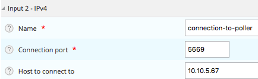
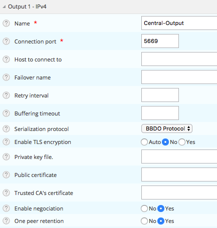
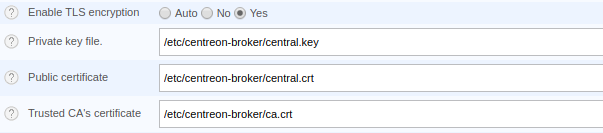

## Centreon Broker and the firewall

In certain cases you may not be able to initialize the Centreon Broker data flow
from the poller (or the Remote Server) to the Central Server or the Remote
Server.

Centreon has, however, developed a solution for initializing the flow from the
Centreon Central Server, or from the Remote Server, to the poller.

Go to the **Configuration > Pollers > Broker configuration** menu and click
**Centreon Broker SQL** configuration on the Central Server or Remote Server.

Go to the **Input** tab panel and add a new **TCP - IPv4** entry.

Enter the **Name** of the configuration, the TCP **Connection port** for
connecting to the poller, and the **Host to connect to**. Then **Save** your
configuration.



Go to the **Configuration > Pollers > Broker configuration** menu and click 
the **Broker module** of your poller.

On the **Output** tab panel, modify the **Output 1 - IPv4** form:

1.  Remove the entry for **Host to connect to**.
2.  Check the **Connection port**.
3.  Set **Yes** for the **One peer retention** option.



Click **Save** and generate the configuration of the affected servers.

## Centreon Broker flow authentication

If you need to authenticate pollers that are sending data to the monitoring
system, you can use the Centreon Broker authentication mechanism, which is based
on X.509 certificates.

First generate a Certificate Authority (CA) certificate with OpenSSL. *ca.key*
will be the private key (stored securely), while *ca.crt* will be the public
certificate for authenticating incoming connections:

```shell
openssl req -x509 -newkey rsa:2048 -nodes -keyout ca.key -out ca.crt -days 365
```

Now generate the certificates using the CA key:

```shell
openssl req -new -newkey rsa:2048 -nodes -keyout central.key -out central.csr -days 365
openssl req -new -newkey rsa:2048 -nodes -keyout poller.key -out poller.csr -days 365
openssl x509 -req -in central.csr -CA ca.crt -CAkey ca.key -CAcreateserial -out central.crt -days 365 -sha256
openssl x509 -req -in poller.csr -CA ca.crt -CAkey ca.key -CAcreateserial -out poller.crt -days 365 -sha256
```

Put *central.key*, *central.crt* and *ca.crt* on the Centreon central server
(e.g., in **/etc/centreon-broker**) and *poller.key*, *poller.crt* and *ca.crt*
on your poller.

You must now configure the Centreon Broker in order to use these files. Go to
`Configuration > Pollers > Broker configuration`. For the
*central-broker-master*, under the **Input** tab, set the following parameters
for *central-broker-master-input*:

  - Enable TLS encryption = Yes
  - Private key file = /etc/centreon-broker/central.key
  - Public certificate = /etc/centreon-broker/central.crt
  - Trusted CA's certificate = /etc/centreon-broker/ca.crt



As with the poller, you will have to modify the TCP output under the Output tab
with the following parameters:

  - Enable TLS encryption = Yes
  - Private key file = /etc/centreon-broker/poller.key
  - Public certificate = /etc/centreon-broker/poller.crt
  - Trusted CA's certificate = /etc/centreon-broker/ca.crt

Regenerate the configuration of the affected pollers (`Configuration >
Pollers > Pollers`) and the authentication will be complete.

## Advanced configuration of Centreon Broker

This section will help you understand how Centreon Broker works and how it
should be configured according to Centreon's best practices. The various options
used by Centreon Broker are described.

### General Overview

Centreon Broker is at its core a simple multiplexing engine. It takes events from
*Inputs* and send them to various *Outputs*. *Inputs* are typically other
instances of Centreon Broker over TCP/IP, while *Outputs* can be a SQL database,
other brokers, a BI/BAM engine, Centreon Map, etc.

Each *Input* or *Output* has a *type* that describe what it does and several
parameters, some of them mandatory and other optional. Additionally, an *Output*
can have a *Failover* that will start when the *Output* is in an error state to
allow retention of data.

An important distinction to make is the standalone Centreon Broker versus a
Centreon Broker installed as Centreon Engine's module. Both have the exact same
capabilities and support the same *Inputs* and *Outputs*. The difference is that
Centreon Broker configured as a module will be automatically started when
Centreon Engine starts and automatically generates the events associated to this
Centreon Engine. Often, those modules only have one *Output* to an instance of
Centreon Broker acting as a concentrator.

### Main Configuration Page

This section lists all the instances of Centreon Broker configured in your park,
either in standalone or module mode. Each instance has a name, is associated
with a poller, has a number of *Inputs*, *Outputs*, and *Loggers*, and can be
'enabled' or 'disabled'.

A poller of type 'Central' will have three instances of Centreon Broker by
default. One Centreon Broker installed as a module for Centreon Engine (here
called *central-module-master*), one Centreon Broker acting as a stand-alone
concentrator (here called *central-broker-master*) and one Centreon Broker
specialized in generating the RRD data used by the graphs (here called
*central-rrd-master*). A best practice is to always use a separate instance of
Centreon Broker to generate RRD data. This way, an issue in the RRD stack will
not cause any issue in your main monitoring.

As expected, *central-module-master* has only one *Output* and zero *Input*.
Configured as a module to Centreon Engine, it generates events on its own and
forward them to the standalone instance of Centreon Broker.

A poller generally only have an instance of Centreon Broker, configured as a
module for Centreon Engine.

### Broker General Configuration Page

This section lists all the general options associated with an instance of
Centreon Broker.

Main options:

  - Poller  
    The poller where this instance lives.

  - Name  
    The name of this instance.

  - Config file name  
    The name of the configuration file used by this instance.

  - Retention path  
    When an *Output* is in an error state, a *Failover* is launched. *Failovers*
    save data in files called retention files. Those in turn are saved in the
    directory specified here. Best practice is **/var/lib/centreon-broker/**
    For security reasons, you can use these directories:

      - **/var/lib/centreon-broker/**
      - **/var/lib/centreon-engine/**
      - **/var/cache/centreon/**

  - Status  
    This is used to enable or disable this instance.

Log options:

  - Log directory
    Path where the log file will be created.

  - Log filename	
    Name of the log file. Default is `<name of this broker configuration entry>`.log
    
  - Maximum files size (in bytes)
    A value different from zero will cause the creation of a new numbered log
    file as soon as the maximum size is reached. Recommended value is `0`.
    
  - core	
    Log level for `core` log messages, the main logs of centreon-broker.
    
  - config
    Log level for `config` log messages.
    Useful to troubleshoot configuration handling issues.
    
  - sql
    Log level for `sql` log messages.
    Useful to troubleshoot database queries issues.
    
  - processing
    Log level for `processing` log messages. You shouldn't change it unless 
    you know what you are looking for.
    
  - perfdata
    Log level for `perfdata` log messages.
    Useful to troubleshoot performance data processing issues.
    
  - bbdo
    Log level for `bbdo` log messages.
    Useful to troubleshoot [broker binary data objects](../../developer/developer-broker-bbdo.md) issues.
    
  - tcp
    Log level for `tcp` log messages.
    Useful to troubleshoot network related issues.
    
  - tls
    Log level for `tls` log messages.
    Useful to troubleshoot TLS encryption issues.
    
  - lua
    Log level for `lua` log messages.
    Useful to troubleshoot [Lua Stream Connectors](../../developer/developer-broker-stream-connector.md) issues.
    
  - bam
    Log level for `bam` log messages.
    Useful to troubleshoot [Business Activity Monitoring](../../service-mapping/introduction.md) issues.

  - Write timestamp (applies to the [deprecated loggger options](#broker-logger-configuration-page-deprecated))
    If activated, each log entry is preceded by the timestamp of the time it was
    written. This is useful to know when an error has occured. Best practice is
    *Yes*.

  - Write thread id  
    If activated, each log entry is preceded by the ID of the thread being
    executed at that instant. This is only used for advanced debugging purposes.
    Best practice is *No*.

Advanced Options:

  - Statistics  
    Centreon Broker has an on-demand status reporting mechanism that can be
    enabled here. This is used by Centreon Web to check the status of the
    instance at any time and determine which inputs and outputs are in an error
    state and to generate various statistics on event processing. Best practice
    is *Yes*.

  - Correlation  
    Centreon Broker has a top-level correlation mechanism. This should only be
    activated if top-level correlation has been properly configured in Centreon
    Web. In all other cases, default is *No*.

  - Event queue max size  
    The maximum size of the in-memory queue in events. If the number of events
    in memory exceeds this number, Centreon Broker will start to use temporary
    files to prevent the broker from using too much memory. This, however,
    causes additional disk I/O. The exact number can be adjusted to use more or
    less memory. A suggested default is 50000.

If *Statistics* is enabled, on-demand status can be queried manually through a
file in */var/lib/centreon-broker/name.stats*.

### Broker input configuration page

This section lists all the inputs activated for this instance of Centreon
Broker. Centreon Broker can have as many inputs as needed.

#### TCP - IPV4

This type of input is deprecated. Inputs read events from a TCP connection. All inputs have the following
parameters:

  - Name  
    The name of the input. Must be unique.

  - Serialization protocol  
    The protocol that was used to serialize the data. Can be either 'BBDO' or
    'NDO'. NDO is an old textual protocol that suffers from very poor
    performance, poor density of data, and poor security. BBDO is a next-gen
    binary protocol that is performant and secure. NDO is deprecated. It should
    never be used in new installation. Best practice is 'BBDO'.

  - Compression  
    If compression was used to serialize the data. Can be 'auto', 'yes', or
    'no'. If left on 'auto' Centreon Broker will detect if compression was used
    while doing a TCP handshake (or assume no compression was used for files).
    Default to 'auto' for TCP, 'no' for files.

  - Filter category  
    The categories of events accepted by this *Input*. If empty, no restriction
    on events accepted. If filled, only events of the given type will be
    processed. *Input* that accept data from Centreon Engines' Broker module
    should be set to accept only 'Neb' events.

  - Connection Port  
    Which port will be used for the connection. Mandatory.

  - Host to connect to  
    This important parameter will decide if this input will listen or attempt to
    initiate a connection. Left empty, this input will listen on its given port.
    If filled, this input will attempt to initiate a connection to the given
    host/port.

  - Enable TLS encryption  
    Enable the encryption of the flux. For the encryption to work, the private
    key file, the public certificate and the trusted CA's certificate need to be
    set on both end. Default to 'auto', i.e 'no' unless TCP negociation has been
    activated and the remote endpoint has activated encryption.

  - Private Key File  
    The private key file used for the encryption.

  - Public certificate  
    The public certificate used for the encryption.

  - Trusted CA's certificate  
    The trused CA certificate used for the encryption.

  - Enable negociation  
    Enable negociation. If 'yes', this *Intput* will try to negociate encryption
    and compression with the remote endpoint.

  - One peer retention mode  
    By default, a listening input will accept any number of incoming
    connections. In 'one peer retention' mode only one connection is accepted at
    the same time, on a first-come first-serve basis. Default to 'no'.

To reiterate, TCP *Input* can either listen on a given port or can attempt to
initiate a connection if a host is given. This allow flexible network topology.

#### BBDO Server

BBDO Server inputs receive events from a remote endpoint. They listen on a given port for a connection by a BBDO Client.

*BBDO Server*-type inputs have the following parameters:

  - Listening address
    Only with TCP transport protocol, if empty or if 0.0.0.0 the server listens for every connection.
    Otherwise, the server only listens on the interface behind the given address.

  - Listening port
    Port used for the connection. Mandatory.

  - Transport protocol
    Two choices are available: gRPC (based on http2) or TCP (a little faster).

  - Authorization token
    Only used with the gRPC transport protocol. This can be used to filter the BBDO flow.
    A BBDO client will be able to send data to this server only if their authorization tokens match.
    
  - Enable TLS encryption  
    Enables the encryption of the flow. For the encryption to work, the private
    key file, *Public certificate* and *Trusted CA's certificate* need to be set
    on both ends. Default is *auto*, i.e., *no* unless TCP negotiation has been
    activated and the remote endpoint has activated encryption.

  - Private key path  
    The private key file used for the encryption.

  - Certificate path
    The public certificate used for the encryption.

#### BBDO Client

BBDO Client inputs receive events from a remote endpoint. They establish a connection on a given port to a BBDO Server.

*BBDO Client*-type inputs have the following parameters:

  - Server address
    The address to connect to.

  - Server port  
    The server port.

  - Retry interval
    On failure, the client waits for this value (given in seconds) before retrying to connect.
    
  - Transport protocol
    Two choices are available: gRPC (based on http2) or TCP (a little faster).

  - Authorization token
    Only used with the gRPC transport protocol. This can be used to filter the BBDO flow.
    A BBDO client will be able to send data to this server only if their authorization tokens match.
    
  - Enable TLS encryption  
    Enables the encryption of the flow. For the encryption to work, the private
    key file, *Public certificate* and *Trusted CA's certificate* need to be set
    on both ends. Default is *auto*, i.e., *no* unless TCP negotiation has been
    activated and the remote endpoint has activated encryption.

  - Trusted CA's certificate path
    The Trusted CA's certificate file.

  - Certificate Common Name
    The certificate Common Name.

### Broker Output Configuration Page

This section lists all the *Outputs* activated for this instance of Centreon
Broker. Centreon Broker can have as many *Outputs* as needed.

For each *Outputs*, the parameters are:

  - Type
    There are several types of outputs managed by the Centreon Broker:

    1.  **TCP - IPV4** and **TCP - IPV6**: This output forwards data to another
        server, another Centreon Broker or Centreon Map. Currently, it doesn't work
        with IPV6. This output is also deprecated because we now have two outputs to
        replace it that are **BBDO Server** and **BBDO Client**.
    2.  **BBDO Server**: This output forwards data to a BBDO client, another Centreon Broker or Centreon Map.
    3.  **BBDO Client**: This output forwards data to a BBDO server, another Centreon Broker or Centreon Map.
    4.  **File**: Writes data into a file. This output is deprecated.
    5.  **RRD**: Generates RRD data from performance data.
    6.  **Storage**: Writes metrics into the database and generates performance
        data (deprecated).
    7.  **SQL**: Writes the real-time status into Centreon's database
        (deprecated).
    8.  **unified-sql**: Writes the real-time status into Centreon's database.
        One such output replaces **Storage** and **SQL** outputs at the same
        time.
    9.  **Dumper Reader**: Reads from a database when Broker is asked to synchronize
        databases (obsolete).
    10.  **Dumper Writer**: Writes into a database when Broker is asked to
        synchronize databases (obsolete).
    11.  **BAM Monitoring**: Generates BAM data from raw events and updates real-time
        BAM status.
    12. **BAM Reporting**: Writes long-term BAM logs that can then be used by MBI.
    13. **Generic - Stream connector**: This is a generic output. You need to
        write a Lua script to explain what you want.

  - Failover
    A *failover* is an output that will be started when in an error state.
    Examples are TCP connections "gone haywire" or a MySQL server suddenly
    disconnecting, etc. By default, each output has an automatic failover that
    will always store data in retention files and replay it when the primary
    output recovers from its error state. This is desirable 99% of the time.
    Alternatively, you can specify another output that will act as a failover if
    needed.

  - Retry interval
    When the output is in an error state, this parameter controls the amount of
    time the output will wait before retrying. Default is one attempt every 30
    seconds.

  - Buffering timeout  
    When this output is in an error state, Centreon Broker will wait a specified
    time before launching the failover. This is mainly useful if Centreon Broker
    should wait for another software to initialize before activating its
    failover. In all other cases, this parameter should not be used. Default is
    0 seconds.

  - Filter category
    The categories of events accepted by this output. If left empty, no
    restriction on events accepted. If filled, only events of the given type
    will be processed. The exact best practices are output specific:

    1.  *BAM Reporting* should only accept *BAM* events.
    2.  *Dump Writer* should only accept *dumper* events.
    3.  *RRD* should only accept *storage* events.

    In all other cases, no restriction should be configured.

Events generated by an output are reinjected into Centreon Broker's event queue.

Some outputs only work when consuming data generated by another output. An RRD
output consumes data from a storage output, a *dumper writer* output consumes
data from a *dumper reader*, and a *BAM reporting* output consumes data from a
*BAM monitoring* output.

Centreon Web needs at least an active output *SQL* ouput to activate its
real-time monitoring capabilities. The storage and RRD outputs are needed to
activate Centreon Web metric plotting. The BAM monitoring output is needed for
real-time BAM data and the BAM reporting output for BI reports.

Due to the fully distributed nature of Centreon Broker, producer and consumer
outputs can be located on logically or physically different instances as long as
they are connected to each other.

**Important**: Centreon Web 2.x features two databases, the configuration
database and the real-time database. Those are respectively called *centreon*
and *centreon-storage*. Different outputs expect may different databases in
their configuration.

| Output Type    | Expected database |
| -------------- | ----------------- |
| SQL            | centreon-storage  |
| Storage        | centreon-storage  |
| Unified SQL    | centreon-storage  |
| Dumper Reader  | centreon          |
| Dumper Writer  | centreon          |
| BAM Monitoring | centreon          |
| BAM Reporting  | centreon-storage  |

#### TCP outputs

TCP outputs forward events to a remote endpoint. As with TCP inputs, TCP outputs
can either listen on a given port or attempt to initiate a connection if a host
parameter is given. This allows for flexible network topology.

*TCP*-type outputs have the following parameters:

  - Serialization protocol  
    The protocol used to serialize the data. Can be either *BBDO* or *NDO*. NDO
    is an legacy textual protocol with inferior performance, data density and
    security. BBDO is a next-generation binary protocol that is effective and
    secure. NDO is deprecated. It should never be used for new installations.
    Best practice is *BBDO*.

  - Enable negotiation  
    If *yes*, this output will try to negotiate encryption and compression with
    the remote endpoint.

  - Connection Port  
    Port used for the connection. Mandatory.

  - Host to connect to  
    This key parameter decides whether the input will listen or attempt to
    initiate a connection. If left empty, the input will listen on its given
    port. If specified, it will attempt to initiate a connection to the given
    host/port.

  - Enable TLS encryption  
    Enables the encryption of the flow. For the encryption to work, the private
    key file, *Public certificate* and *Trusted CA's certificate* need to be set
    on both ends. Default is *auto*, i.e., *no* unless TCP negotiation has been
    activated and the remote endpoint has activated encryption.

  - Private Key File  
    The private key file used for the encryption.

  - Public certificate  
    The public certificate used for the encryption.

  - Trusted CA's certificate  
    The trusted CA certificate used for the encryption.

  - One peer retention mode  
    By default, a listening input will accept any number of incoming
    connections. In *one peer retention* mode only one connection at a time is
    accepted, on a first-come first-serve basis. Default is *no*.

  - Compression  
    If compression should be used to serialize the data. Can be *auto*, *yes*,
    or *no*. If left on *auto* Centreon Broker will detect if compression is
    supported by the endpoint during a TCP negotiation. Default is *auto* for
    TCP.

  - Compression Level  
    The level of compression that should be used, from 1 to 9. Default (or if
    not filled) is 6. The higher the compression level is, the higher the
    compression will be at the expense of processing power.

  - Compression Buffer  
    The size of the compression buffer that should be used. Best practice is *0*
    or nothing.

#### BBDO Server

BBDO Server outputs forward events to a remote endpoint. They listen on a given port for a connection by a BBDO Client.

*BBDO Server*-type outputs have the following parameters:

  - Listening address
    Only with TCP transport protocol, if empty or if 0.0.0.0 the server listens for every connection.
    Otherwise, the server only listens on the interface behind the given address.

  - Listening port  
    Port used for the connection. Mandatory.

  - Transport protocol
    Two choices are available: gRPC (based on http2) or TCP (a little faster).

  - Authorization token
    Only used with the gRPC transport protocol. This can be used to filter the BBDO flow.
    A BBDO client will be able to send data to this server only if their authorization tokens match.
    
  - Enable TLS encryption  
    Enables the encryption of the flow. For the encryption to work, the private
    key file, *Public certificate* and *Trusted CA's certificate* need to be set
    on both ends. Default is *auto*, i.e., *no* unless TCP negotiation has been
    activated and the remote endpoint has activated encryption.

  - Private key path  
    The private key file used for the encryption.

  - Certificate path
    The public certificate used for the encryption.

  - Compression  
    With this option, data is compressed.
    
  - Enable retention
    With this option, data cannot be lost. If the peer doesn't read sent data, the data is stacked until the peer succeeds to read it.

BBDO Client outputs forward events to a remote endpoint. They establish a connection on a given port to a BBDO Server.

*BBDO Client*-type outputs have the following parameters:

  - Server address
    The address to connect to.

  - Server port  
    The server port.

  - Retry interval
    On failure, the client waits for this value (given in seconds) before retrying to connect.
    
  - Transport protocol
    Two choices are available: gRPC (based on http2) or TCP (a little faster).

  - Authorization token
    Only used with the gRPC transport protocol. This can be used to filter the BBDO flow.
    A BBDO client will be able to send data to this server only if their authorization tokens match.
    
  - Enable TLS encryption  
    Enables the encryption of the flow. For the encryption to work, the private
    key file, *Public certificate* and *Trusted CA's certificate* need to be set
    on both ends. Default is *auto*, i.e., *no* unless TCP negotiation has been
    activated and the remote endpoint has activated encryption.

  - Trusted CA's certificate path
    The Trusted CA's certificate file.

  - Certificate Common Name
    The certificate Common Name.

  - Compression
    With this option, data is compressed.
    
#### File outputs

File *outputs* send events into a file on the disk. Additionally, they have the
capability of replaying the data of this file if used as a failover output. Most
file outputs will be used as failovers.

*File* type outputs have the following parameters:

  - Serialization protocol  
    The protocol that was used to serialize the data. Can be either *BBDO* or
    *NDO*. NDO is a legacy textual protocol with inferior performance, data
    density and security. BBDO is a next-generation binary protocol that is
    effective and secure. NDO is deprecated. It should never be used for new
    installations. Best practice is *BBDO*.

  - File path  
    The path of the file being written to.

  - Compression  
    If compression should be used to serialize the data. Can be *auto*, *yes*,
    or *no*. *auto* is equal to *no* for files.

  - Compression Level  
    The level of compression to be used, from 1 to 9. Default (or if not filled)
    is 6. The higher the compression level is, the higher the compression will
    be at the expense of processing power.

  - Compression Buffer  
    The size of the compression buffer to be used. Best practice is *0*.

#### RRD outputs

*RRD* outputs generate RRD data (used by Centreon Web to generate graphs) from
metrics data generated by a storage output. The best practice is to isolate this
output on its own Centreon Broker instance to ensure that an issue in the RRD
stack will not have any impact on the main Centreon Broker instance.

*RRD*-type outputs have the following parameters:

  - RRD file directory for metrics  
    The directory where the RRD files of the metrics will be written. A
    recommended default is */var/lib/centreon/metrics/*.

  - RRD file directory for status  
    The directory where the RRD files of the status will be written. A
    recommended default is */var/lib/centreon/status/*

  - TCP port  
    The port used by RRDCached, if RRDCached has been configured on this server.
    If not, leave empty.

  - Unix socket  
    The Unix socket used by RRDCached, if RRDCached has been configured on this
    server. If not, leave empty.

  - Write metrics  
    Should RRD metric files be written? Default is *yes*.

  - Write status  
    Should RRD status files be written? Default is *yes*.

#### Storage Outputs

Perfdata storage outputs save metric data into a database and generate RRD data
used by the RRD output. This output usually generates multiple queries and is
very performance intensive. If Centreon Broker is slow, try adjusting the
*maximum queries per transaction* parameter to optimize processing speed.

This output can be tasked to rebuild RRD data from a database of stored metric
data. This is usually a slow, costly process, though you can simultaneously
process new metric data at a reduced speed.

*Storage*-type outputs have the following parameters:

  - DB Type  
    The type of the database being accessed.

  - DB Port  
    The port of the database being accessed.

  - DB User  
    The user account for connecting to this database.

  - DB Name  
    The name of the database. In Centreon terms, this is the database containing
    the real-time monitoring data, generally called *centreon-storage*.

  - DB Password  
    The password used by the output to connect to this database.

  - Maximum queries per transaction  
    This parameter is used to batch several queries in large transactions. This
    allows for improved performance but can generate latency if an insufficient
    number of queries are generated to fill those batches. The default is 20000
    queries per transaction. If you have a low load and unexpectedly high
    latency, try lowering this number. If you have a high load and high latency,
    try raising it.

  - Transaction commit timeout  
    Number of seconds allowed before a forced commit is made. Default is
    infinite. If you have a low load and unexpectedly high latency, try 5
    seconds.

  - Replication enabled  
    Should Centreon Broker check that the replication status of this database is
    complete before trying to insert data? Only useful if replication is enabled
    for this database.

  - Rebuild check interval in seconds  
    The number of seconds between each rebuild check. Default 300 seconds.

  - Store in performance data in data\_bin  
    Should this output save the metric data in the database? Default is *yes*.
    If *no*, this output will generate RRD data without saving them into the
    database, making a rebuild impossible.

  - Insert in index data  
    Should new index data be inserted into the database? Default is *no*. This
    should never be modified unless prompted by Centreon Support or explicitly
    advised in the documentation.

#### SQL outputs

*SQL* outputs save real-time status data into the real-time database used by
Centreon Web. This is the most important output for the operation of Centreon
Web.

Moreover, this output has a *garbage collector* that will clean old data from
the database occasionally. This is an optional process, as old data is marked
*disabled*, and can actually be useful to keep for debugging purpose.

*SQL*-type outputs have the following parameters:

  - DB Type  
    The type of the database being accessed.

  - DB Port  
    The port of the database being accessed.

  - DB User  
    The user account for connecting to this database.

  - DB Name  
    The name of the database. In Centreon terms, this is the database containing
    the real-time monitoring data, generally called *centreon-storage*.

  - DB Password  
    The password used by the output to connect to this database.

  - Maximum queries per transaction  
    This parameter is used to batch several queries in large transactions. This
    allows for improved performance but can generate latency if an insufficient
    number of queries are generated to fill those batches. The default is 20000
    queries per transaction. If you have a low load and unexpectedly high
    latency, try lowering this number. If you have a high load and high latency,
    try raising this number.

  - Transaction commit timeout  
    Number of seconds allowed before a forced commit is made. Default is
    infinite. If you have a low load and unexpectedly high latency, try 5
    seconds.

  - Replication enabled  
    Should Centreon Broker check that the replication status of this database is
    complete before trying to insert data? Only useful if replication is enabled
    for this database.

  - Cleanup check interval  
    Number of seconds between each run of the garbage collector "cleaning" out
    old data in the database. Default is never.

  - Instance timeout  
    Number of seconds before an instance is marked as *unresponding* and all of
    its hosts and services marked as *unknown*. Default is 300 seconds.

#### Unified SQL outputs

Unified SQL outputs are the union of **Storage** outputs and **SQL** outputs.
They save metric data into a database and generate RRD data used by the RRD
output.

This output usually generates multiple queries and is very performance intensive.
If Centreon Broker is slow, try adjusting the
**maximum queries per transaction** parameter to optimize processing speed.

This output can be tasked to rebuild RRD data from a database of stored metric
data. This is usually a slow, costly process, though you can simultaneously
process new metric data at a reduced speed.

**Unified SQL** outputs also save real-time status data into the real-time
database used by Centreon Web. This is the most important output for the
operation of Centreon Web.

Moreover, this output has a **garbage collector** that will clean old data from
the database occasionally. This is an optional process, as old data is marked
**disabled**, and can actually be useful to keep for debugging purposes.

Since **bbdo 3**, this output is the preferred one instead of the **storage** and
**sql** outputs. That way, you just need one output to the database,
configurations have to be filled once and there are less conflicts between
outputs.

**unified-sql**-type outputs have the following parameters:

  - DB Type
    The type of the database being accessed.

  - DB Port
    The port of the database being accessed.

  - DB User
    The user account for connecting to this database.

  - DB Name
    The name of the database. In Centreon terms, this is the database containing
    the real-time monitoring data, generally called *centreon-storage*.

  - DB Password
    The password used by the output to connect to this database.

  - Maximum queries per transaction
    This parameter is used to batch several queries in large transactions. This
    allows for improved performance but can generate latency if an insufficient
    number of queries are generated to fill those batches. The default is 20000
    queries per transaction. If you have a low load and unexpectedly high
    latency, try lowering this number. If you have a high load and high latency,
    try raising it.

  - Transaction commit timeout
    Number of seconds allowed before a forced commit is made. Default is
    infinite. If you have a low load and unexpectedly high latency, try 5
    seconds.

  - Replication enabled
    Should Centreon Broker check that the replication status of this database is
    complete before trying to insert data? Only useful if replication is enabled
    for this database.

  - Rebuild check interval in seconds
    The number of seconds between each rebuild check. Default 300 seconds.

  - Store performance data in data\_bin
    Should this output save the metric data in the database? Default is *yes*.
    If *no*, this output will generate RRD data without saving them into the
    database, making a rebuild impossible.

  - Insert in index data
    Should new index data be inserted into the database? Default is *no*. This
    should never be modified unless prompted by Centreon Support or explicitly
    advised in the documentation.

  - Cleanup check interval
    Number of seconds between each run of the garbage collector "cleaning" out
    old data in the database. Default is never.

  - Instance timeout
    Number of seconds before an instance is marked as *unresponding* and all of
    its hosts and services marked as *unknown*. Default is 300 seconds.

  - Connections count
    Number of connections to the database maintained by this output. This allows broker to write data in parallel using up to 3 connections:

    * 1: all the database traffic goes through only one connection. It is fine for small platforms.
    * 2: one connection is dedicated to the traffic (BULK INSERT statements) towards the **data_bin** and **logs** tables and the second one handles the rest.
    * 3: two connections are dedicated to the traffic (BULK INSERT statements) towards the **data_bin** and **logs** tables and the third one handles the rest. We recommend this setting for large platforms.

#### Lua outputs

*Lua* outputs send metrics information into a script by a key-value system. The
Lua script should reside on your server.

  - Path
    The path of the Lua script in your server.

  - Filter category
    The categories of events accepted by this output. If empty, no restriction
    on events is accepted. If specified, only events of the given type will be
    processed. Outputs that accept data from Centreon Engine's Broker module
    should be set to only accept *Neb* events.

**Lua parameter**

  - Type
    Type of metric value.

  - Name/Key
    Name of metric value.

  - Value
    Value of metric.

#### Dumper reader/writer

A Dumper Reader/Writer pair is used to synchronize part of a database between
two instances of Centreon Broker. In the future there will be an extensive
synchronization mechanism, but today it is mainly used to synchronize BA for the
BAM Poller Display mechanism.

The BAM Poller Display configuration documentation explains how to properly
configure those *Outputs*.

*Outputs* of type 'Dumper Reader' and 'Dumper Writer' have the following
parameters:

  - DB Type  
    The type of the database being accessed.

  - DB Port  
    The port of the database being accessed.

  - DB User  
    The user used by this *Output* to connect to this database.

  - DB Name  
    The name of this database. In Centreon terms, this is the database containing
    the configuration data, generally called 'centreon'.

  - DB Password  
    The password used by this *Output* to connect to this database.
