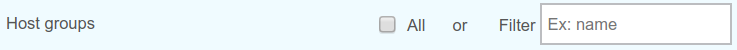
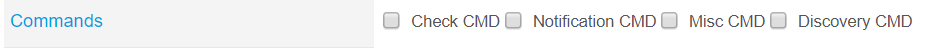

import Tabs from '@theme/Tabs';
import TabItem from '@theme/TabItem';

The Centreon Web Import/Export module is designed to help users configure
several Centreon Web platforms in a faster and easier way, thanks to its
import/export mechanism.

From a properly configured source environment, you can use the AWIE module to
export chosen objects toward a target environment. Those objects will be
replicated.

Centreon AWIE is based on CLAPI commands, but its added value is to allow the use of
the Centreon Web UI instead of command lines.

## Installation

### Installing packages

Run the following commands as a privileged user:

<Tabs groupId="sync">
<TabItem value="Alma / RHEL / Oracle Linux 8" label="Alma / RHEL / Oracle Linux 8">

``` shell
dnf install centreon-awie
```

</TabItem>
<TabItem value="Alma / RHEL / Oracle Linux 9" label="Alma / RHEL / Oracle Linux 9">

``` shell
dnf install centreon-awie
```

</TabItem>
<TabItem value="Debian 12" label="Debian 12">

``` shell
apt install centreon-awie
```

</TabItem>
</Tabs>

### UI installation

Go to **Administration > Extensions > Manager** and search **awie**. Click 
**Install selection**:


Your module is now installed:


## Export configuration

Once you have properly configured all Centreon Web objects you need (Poller,
Hosts, Services, Contacts, Time Periods... ) then you can export them to
another Centreon Web platform by going to the **Configuration > Import/Export**
menu.

The default page is the Export one.


### Exported Archive Name

Be aware that if you change the name of the created archive, you will not be
able to import it unless the name of the archive is identical to the name of the
file contained in the archive.

### Poller Export


If you set the **All** checkbox to yes (default value is no), then all
configured pollers will be exported with their configuration files (for engine,
Broker, etc.) after you have clicked the **Export** button.

If you want to export only one poller, type its **exact** name in the **Filter**
field (one single value is accepted; this field has no list of suggested items).

### Hosts Export


#### Hosts


Same principle as poller export, but:

If you choose to export all hosts, then host configurations, linked host
templates and linked service templates will be exported, but hosts will be
created in the target environment without their services. However, you will be able
to create services by selecting the value "Yes" for the **Create Services linked to
the Template too** radio button in the **Configuration > Hosts** page, for each
host. Save the host configuration and export the configuration.

If you export a specific host by using the *Filter* field (only one host at a
time), the host will be created in the new platform with all of its
services.

#### Host templates


Check the *Host templates* checkbox if you want to export all host templates.

Use the *Filter* field for one single value if you want to export one specific
host template.

#### Host groups



Check the **Host groups** checkbox if you want to export all host groups.

Use the **Filter** field for one single value if you want to export one specific
host group.

#### Host categories


Check the **Host categories** checkbox if you want to export all host
categories. There is no **Filter** field for this object.

### Services Export


#### Services


Same principle as poller export, but:

If you use the **Filter** field for a specific service, the Import/Export process
will create ALL services linked to the first host linked to the filtered
service.

#### Service templates


Check the **Service templates** checkbox if you want to export all service
templates.

Use the **Filter** field for one single value if you want to export one specific
service template.

#### Service groups


Check the **Service groups** checkbox if you want to export all service groups.

Use the **Filter** field for one single value if you want to export one specific
service group.

#### Service categories


Check the **Service categories** checkbox if you want to export all service
categories. There is no **Filter** field for this object.

### Contacts Export


You can export all Contacts (without linked contact groups) or all Contact
groups (with linked users). No **Filter**.

### Commands Export



Check the checkbox corresponding to the type of command you want to export
(Check, Notification, Miscellaneous or Discovery). No **Filter**.

> Command line notification commands are not exported entirely (known issue).

### Resources Export


### ACL

Check the **ACL** checkbox if you want to export ACL objects (Access groups,
Menu Access, Resource Access, Action Access). No **Filter**.

> Relations between ACL objects are exported, but links between those 
> objects are not created once they are imported.

### LDAP

Check the **LDAP** checkbox if you want to export your LDAP configuration(s).
No **Filter**.

### Time periods

Check the **Timeperiods** checkbox if you want to export all time periods. No
**Filter**.

## Import configuration

In the Export page, each time the Export button is pressed, a zip archive
file is created and downloaded.

This is the file that you will upload in the Import Page of another Centreon Web
platform.

Go to **Configuration > Import/Export > Import**:


Select the centreon-clapi-export zip file you want to import, and then click the
**Import** button:


You should get an **Import successful** message at the end of the process:


To check that objects have been properly imported, go to the Configuration pages as
usual.

> It is necessary to generate, test, and export a configuration.
