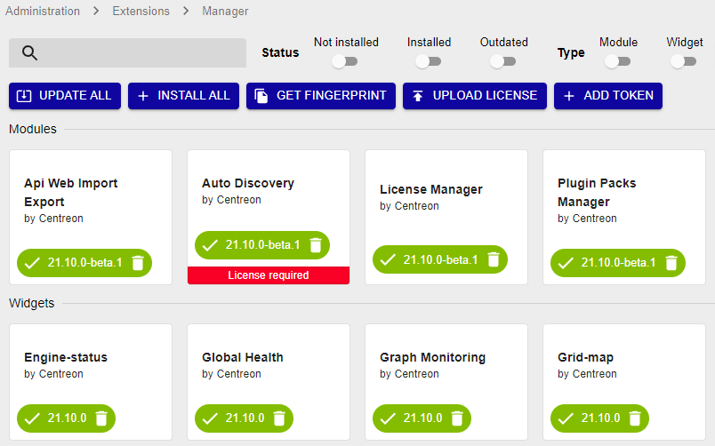
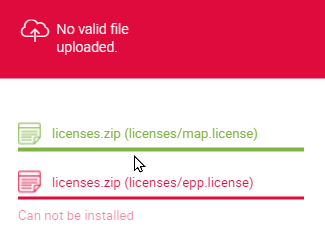

import Tabs from '@theme/Tabs';
import TabItem from '@theme/TabItem';

## How can I obtain a license?

* You can request your token for the [free IT-100 edition](../getting-started/it100.md) on our website.
* If you have purchased a license, request your license files from our [support](https://support.centreon.com) team.

## Types of license

According to your [Centreon edition](https://www.centreon.com/centreon-editions/), your license can be:
- online: uses a token. Your Centreon platform must be connected to the internet.
- offline: uses one or several license files

## Which modules require a license?

The following modules need to be installed separately and require a valid license.

- [Monitoring Connectors](../monitoring/pluginpacks.md#installing-a-monitoring-connector)
- [Auto Discovery](../monitoring/discovery/installation.md)
- [Anomaly Detection](../monitoring/anomaly-detection.md)
- [Service mapping (BAM)](../service-mapping/install.md)
- [Graphical views (MAP)](../graph-views/introduction-map.md)
- [Reporting (MBI)](../reporting/installation.md)

## Viewing license-based modules

Go to **Administration > Extensions > Manager**. All modules currently installed on your platform have a green button with a white check mark in it. Modules that require a license have a colored banner at the bottom (red if you have no valid license, green if you have one).



## Adding a license to your Centreon platform

<Tabs groupId="licences" queryString>
<TabItem value="Online licenses" label="Online licenses">

> Refer to the [tables of network flows](../installation/technical.md#tables-of-network-flows) to integrate your monitoring platform.

To use an online license, your Centreon platform must be connected to the internet.

#### Check the internet connection

Make sure your Centreon platform is allowed to reach the internet:

- Check that the machine can access this URL: https://api.imp.centreon.com

- If needed, set a proxy server:
  - Go to the **Administration > Parameters > Centreon UI** page, then the **Proxy options** section.
  - Click **Test Internet Connection**. The "Connection Successful" message should appear.

#### Add your license

1. Make sure you have your license token (provided by our support team).

2. Go to **Administration > Extensions > Manager**.

3. Click **Add Token**. A popup window appears.

4. Paste your token in the popup window, and then click **Add**.

    - If your token contains one license, a confirmation message appears.

    - If your token contains several licenses, choose the license you want and then click **Choose**. 

    Press **Esc** to close the popup window. The license is applied and the corresponding modules display their validity date:
    
    

    The **Add token** button changes to become a **View license** button.

</TabItem>
<TabItem value="Offline licenses" label="Offline licenses">

1. To request your license:

    1. Go to **Administration > Extensions > Manager**.

    2. Click **Get fingerprint**.

    3. Paste the fingerprint in an email to our [support](mailto:support@centreon.com) team requesting the license.

2. Once you have received your license, in the **Administration > Extensions > Manager** page, click **Upload license**.

5. Browse to the file and then click **OK**. The license is applied and the corresponding modules display their validity date:
    
    

6. If you have several licenses (e.g. for BAM, MBI, etc.), repeat the steps above until you have uploaded all license files.

</TabItem>
</Tabs>

## Free IT-100 license

See chapter [Set up your free IT-100 solution](../getting-started/it100.md).

## Troubleshooting licenses

### "No valid file uploaded"



Check the contents of the following directory:

```shell
ls -lah /etc/centreon/license.d/
```

If the directory already contains licenses with rights that are not **apache/apache**, delete them or change their rights so that they can be overwritten by the new licenses:

```shell
chown apache:apache /etc/centreon/license.d/*
chmod 640 /etc/centreon/license.d/*
```

### "Your EPP license is not valid"

* Check that the fingerprint of the central server (on the **Administration > Extensions > Manager** page) matches the fingerprint in the license.

    ```shell
    less /etc/centreon/license.d/epp.license
    ```

* Check that you do not have more hosts than your license allows. Use the following command:

    ```sql
    SELECT COUNT(*) FROM centreon.host WHERE host_register='1';
    ```

    > Disabled hosts are taken into account by the license. Make sure that the total number of existing hosts (enabled + disabled) is below the limit set by your license.

### License expired or host limit exceeded

When a license expires or the number of hosts on your platform exceeds the license limit, certain modules will stop working correctly. This section explains how to identify the issue and what behavior to expect.

#### Checking the number of registered hosts

Your license counts all hosts in the database, including disabled ones. To check the total number of registered hosts, run the following SQL query on the central server:

```sql
SELECT COUNT(*) FROM centreon.host WHERE host_register='1';
```

The result must be strictly inferior to your license limit. If the number of hosts exceeds your license limit, you must either delete unused hosts or upgrade your license to a higher limit.

> Disabled hosts are taken into account by the license. Make sure the total number of existing hosts (enabled + disabled) is below the limit set by your license.

#### Checking your license limit

License files are stored in the following directory:

```shell
/etc/centreon/license.d/
```

To view the host limit defined in your license, inspect the relevant license file:

```shell
less /etc/centreon/license.d/epp.license
```

The file contains information about the maximum number of hosts allowed by your license.

#### Module behavior when the license is invalid

When your license is expired or when the host limit is exceeded, the following behaviors are observed in the interface:

| Module | Behavior |
|---|---|
| Service Mapping (BAM) | Displays the message: "Oops! License Invalid or Expired" |
| Graphical views (MAP) | Displays a blank page, or the message: "Map server license is not valid, please contact Centreon support service" |
| Monitoring Connectors (EPP) | Displays the message: "Your EPP License is not valid" |
| Auto Discovery (Host/Service Discovery) | Displays the message: "Oops! License Invalid or Expired" |

> When the license host limit is exceeded, it is still possible to add new hosts, but they will no longer be able to inherit the host templates provided by the monitoring connectors.

#### Resolving the issue

To restore normal module behavior:

* If your license is expired: Contact the Centreon support team to renew your license.
* If the host limit is exceeded, either:
   * Delete or remove unused hosts (including disabled ones) to bring the total below the license limit.
   * Upgrade your license to a higher host limit by contacting your sales representative.
