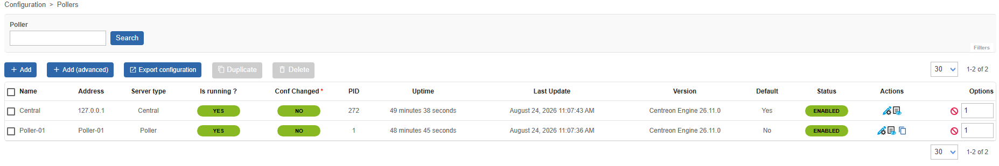

> The container-based poller deployment method is currently in **BETA**.

A ready-to-use installation command for container-based pollers can be retrieved from the central server's interface, tailored to your platform.

<details>
<summary>Container contents</summary>

Instead of a single monolithic container, each poller component runs in its own dedicated container
(Centreon Engine, Gorgone, and optionally SNMP trap handling and VMware
monitoring), orchestrated by a single `docker-compose.yaml` file.

This deployment method relies on a generated installation command that downloads
and runs an installer script on the target container host. The script generates the
`.env` and `docker-compose.yaml` files for you and starts the stack.

> See [Users and groups](https://docs.centreon.com/docs/installation/technical/) for the system users
> (`centreon-engine`, `centreon-gorgone`, etc.) used inside these containers.

</details>

## Prerequisites

* On the central server, [Gorgone's **pullwss** module must be configured to accept connections](./pollers-containers-prerequisites.md). This only needs to be done once, before you install your first poller in a container.
* A Linux host with **Docker Engine** and the **Docker Compose v2** plugin
  installed (`docker compose version` must succeed).
* You must have created a poller-type authentication token.
* Outbound network access from this host to your Centreon central server.
* If you plan to receive SNMP traps on this poller, UDP port 162 must be
  reachable on this host.
* If you plan to monitor VMware infrastructure from this poller, the
  `centreon-vmware` Docker image must be built beforehand (see
  [Centreon-vmware container](./using-containers-advanced-configuration.md#allow-the-poller-to-monitor-vmware-resources)).

## Step 1: Generate the install command

1. On the central server, click **Pollers** at the top left of the screen and in the popup that opens, click **Create new poller**.

   

2. Fill in the poller's information:

   * **Poller name**: a unique name for this poller. It will appear in the list of pollers.
   * **Poller address**: the address of the host machine where you are going to install the poller.
      > The **Poller address** does not affect connectivity: Gorgone uses
      > PullWSS, so the poller always initiates the connection to the central
      > server, not the other way around.
   * **Centreon Central address, as seen by this poller**: the URL this poller uses to reach the central server.

3. Select **Container** as the poller's environment.

4. Select the [authentication token](#prerequisites) you have created for this poller.

5. In the **Generate installation command** section, click the button and wait for the command to be generated.

6. Copy the command using the button at the top right of the code block. Keep the window open: you will need to use it again later.

7. Add to the command any [optional flags](#optional-services-to-add-to-the-installation-command) you want (e.g. to allow the poller to receive data from CMA agents, or if you want to monitor VMware resources. In both cases, you will need to follow the corresponding procedures in [Advanced container configuration](./using-containers-advanced-configuration.md)).

8. If you want to be able to use email notifications or custom plugins, follow the corresponding procedures in
[Advanced container configuration](./using-containers-advanced-configuration.md).

## Step 2: Run the install command on the container host

1. Run the copied command as a user who is allowed to use containers on the target
host.

   <details>
   <summary>What the script does</summary>

   The script:

   1. Checks that Docker and the Docker Compose v2 plugin are available.
   2. Generates a `.env` file and a `docker-compose.yaml` file in the current
      directory.
   3. Starts the stack with `docker compose up -d`, unless `--no-start` was
      added to the command (in that case, start it yourself later with
      `docker compose up -d`).

   By default, the generated stack always includes two services:

   * **centengine**: Centreon Engine, the monitoring engine.
   * **gorgone**: Gorgone, in charge of retrieving the poller's configuration and
   communicating with the central server.

   **Generated files reference**

   The `docker-compose.yaml` generated by the install script wires the services
   together using named Docker volumes, so you don't need to configure this
   yourself:

   | Volume | Shared between | Purpose |
   |--------|-----------------|---------|
   | `poller-engine` | centengine, gorgone | Centreon Engine configuration (`/etc/centreon-engine`) |
   | `poller-broker` | centengine, gorgone | Centreon Broker configuration (`/etc/centreon-broker`) |
   | `poller-centcmd` | centengine, gorgone, centreontrapd | Centreon Engine's external command pipe (`/var/lib/centreon-engine/rw`) |
   | `poller-snmp-spool` | snmptrapd, centreontrapd | Spool directory where received traps are written and then processed |
   | `poller-snmp-traps` | gorgone, centreontrapd | SNMP trap definitions pushed by the central server |

   Each service also has a Docker healthcheck, so `docker compose ps` reports
   `healthy` once a service is fully up.

   </details>

2. Check the health status of the `gorgone` container on the container's host:

   ```shell
   docker compose ps
   ```

   Once `gorgone` reports `healthy`, the connection to the central server is established.
   
   If `gorgone` does not become healthy after a few minutes, check its logs
(`docker compose logs gorgone`), then see
[Attach a poller to a central or a remote server](../../monitoring/monitoring-servers/add-a-poller-to-configuration.md)
and [Communications between servers](../../monitoring/monitoring-servers/communications.md)
for more details on how pollers register and communicate with the central
server.

## Step 3: Export the configuration

On the central server, go back to the poller creation window and click
**Export configuration** to push the monitoring configuration to the poller.

The poller then shows up as running on the **Configuration > Pollers** page:



## Step 4: Secure your platform

Remember to secure your Centreon platform following our
[recommendations](../../administration/secure-platform.md).

## Optional services to add to the installation command

The basic generated command looks like this:

```shell
curl -fsSL <CENTRAL_URL>/poller/install.sh | bash -s -- \
   --type docker \
   --poller_token <TOKEN_NAME>:<TOKEN_SECRET> \
   --uid <POLLER_UID> \
   --name '<POLLER_NAME>' \
   --central_url <CENTRAL_URL> \
   --appsecret <APP_SECRET> \
   --salt <SALT>
```

Add the following flags to the install command to include additional features:

| Flag | Effect |
|------|--------|
| `--with-snmptrap` | Adds the `snmptrapd` and `centreontrapd` services, for passive monitoring via SNMP traps. |
| `--with-vmware` | [Allow the poller to monitor VMware resources](using-containers-advanced-configuration.md#allow-the-poller-to-monitor-vmware-resources) (adds the `centreon-vmware` service). |
| `--with-cma` | [Allows the poller to receive data from Centreon Monitoring Agents (CMA)](./using-containers-advanced-configuration.md#allow-the-poller-to-receive-data-from-centreon-monitoring-agents-cma). Mounts TLS certificates and exposes port 4317, for pollers that accept connections from the Centreon Monitoring Agent (CMA) over OpenTelemetry gRPC. |
| `--tz <timezone>` | Sets the container timezone (default: `UTC`). |
| `--debug true` | Enables debug logging on the services. |
| `--gorgone-ssl <true\|false>` | Overrides the SSL setting used for the Gorgone connection to the central server. |
| `--no-start` | Only generates `.env` and `docker-compose.yaml`; does not start the stack. |

If you already ran the install command without these flags, you can also add
the corresponding service(s) by hand to the generated `docker-compose.yaml`
and `.env` files, then run `docker compose up -d` again.
