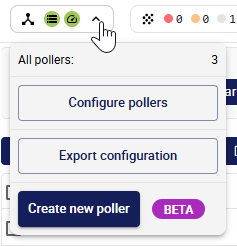
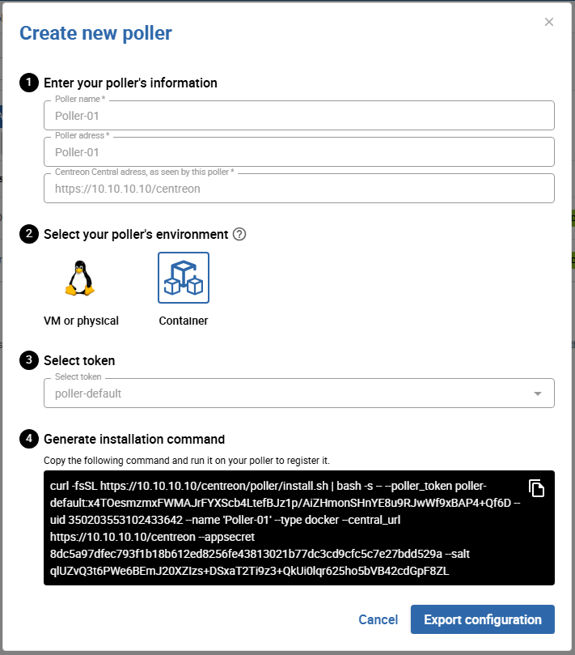

Centreon also provides a Docker-based deployment for pollers. Instead of a single
monolithic container, each poller component runs in its own dedicated container
(Centreon Engine, Gorgone, and optionally SNMP trap handling and VMware
monitoring), orchestrated by a single `docker-compose.yaml` file.

This deployment method relies on a generated installation command that downloads
and runs an installer script on the target Docker host. The script generates the
`.env` and `docker-compose.yaml` files for you and starts the stack.

> See [Users and groups](../../installation/technical.md) for the system users
> (`centreon-engine`, `centreon-gorgone`, etc.) used inside these containers.

## Prerequisites

* A Linux host with **Docker Engine** and the **Docker Compose v2** plugin
  installed (`docker compose version` must succeed).
* Outbound network access from this host to your Centreon central server.
* If you plan to receive SNMP traps on this poller, UDP port 162 must be
  reachable on this host.
* If you plan to monitor VMware infrastructure from this poller, the
  `centreon-vmware` Docker image must be built beforehand (see
  [Optional: centreon-vmware container](#optional-centreon-vmware-container)).

## Step 1: Generate the install command

1. In the Centreon UI, open the **Pollers** menu at the top of the screen and
   click **Create new poller** (currently in BETA).

   

2. Fill in the poller's name and address, and the Centreon Central address as
   seen by this poller. Select the **Container** environment and an existing
   token, then click the button to generate the installation command.

   

3. Copy the generated installation command, and keep this window open. It
   looks like this:

   

   ```shell
   curl -fsSL <CENTRAL_URL>/poller/install.sh | bash -s -- \
     --type docker \
     --poller_token <TOKEN_NAME>:<TOKEN_SECRET> \
     --uid <POLLER_UID> \
     --name '<POLLER_NAME>' \
     --central_url <CENTRAL_URL> \
     --appsecret <APP_SECRET> \
     --salt <SALT>
   ```

   > Replace **\<CENTRAL_URL\>** with the full URL of your Centreon central
   > server, including its web application base path (for example,
   > `https://centreon.example.com/centreon`).

## Step 2: Run the install command on the Docker host

Run the copied command as a user who is allowed to use Docker on the target
host. The script:

1. Checks that Docker and the Docker Compose v2 plugin are available.
2. Generates a `.env` file and a `docker-compose.yaml` file in the current
   directory.
3. Starts the stack with `docker compose up -d`, unless `--no-start` was
   added to the command (in that case, start it yourself later with
   `docker compose up -d`).

By default, the generated stack always includes two services:

* **centengine**: Centreon Engine, the monitoring engine.
* **gorgone**: Gorgone, in charge of retrieving the poller's configuration and
  communicating with the central server.

## Step 3: Add optional services

Add these flags to the install command **before running it** to include
additional services in the generated stack:

| Flag | Effect |
|------|--------|
| `--with-snmptrap` | Adds the `snmptrapd` and `centreontrapd` services, for passive monitoring via SNMP traps. |
| `--with-vmware` | Adds the `centreon-vmware` service (see prerequisite below). |
| `--with-cma` | Mounts TLS certificates and exposes port 4317, for pollers that accept connections from the Centreon Monitoring Agent (CMA) over OpenTelemetry gRPC. |
| `--tz <timezone>` | Sets the container timezone (default: `UTC`). |
| `--debug true` | Enables debug logging on the services. |
| `--gorgone-ssl <true\|false>` | Overrides the SSL setting used for the Gorgone connection to the central server. |
| `--no-start` | Only generates `.env` and `docker-compose.yaml`; does not start the stack. |

If you already ran the install command without these flags, you can also add
the corresponding service(s) by hand to the generated `docker-compose.yaml`
and `.env` files, then run `docker compose up -d` again.

### Optional: centreon-vmware container

Monitoring VMware infrastructure requires the proprietary VMware Perl SDK,
which cannot be redistributed for licensing reasons. Because of this, the
`centreon-vmware` container image is **not published on a registry**. The
generated `docker-compose.yaml` references it as
`connector-vmware:${VMWARE_TAG:-local}` with `pull_policy: never`, so you must
build it locally, on the Docker host, before using `--with-vmware`.

Clone the `centreon-plugins` repository and build the image from it:

```shell
git clone https://github.com/centreon/centreon-plugins.git
cd centreon-plugins
docker build \
  --build-arg PACKAGE_SOURCE=repo \
  --build-arg WITH_SDK=true \
  --file .github/docker/connector/Dockerfile.connector-vmware \
  --tag connector-vmware:local \
  .
```

> `WITH_SDK=true` requires the VMware vSphere Perl SDK and vSAN SDK archives,
> which you must download yourself from the Broadcom developer portal. See the
> [prerequisites of the VMware ESX plugin pack](/pp/integrations/plugin-packs/procedures/virtualization-vmware2-esx/#prerequisites)
> for instructions on obtaining these files. Place the downloaded archives in
> the `./centreon-plugins/sdks-vmware` directory before running the `docker
> build` command above. Building with `WITH_SDK=false` produces a working
> image, but it cannot decrypt encrypted vCenter credentials.

### Custom checks and plugin dependencies

The `centengine` container can install custom check scripts and extra APT
dependencies without rebuilding the image. Add the corresponding volumes to
the `centengine` service in the generated `docker-compose.yaml`:

```yaml
    volumes:
      # Custom plugin scripts (must be executable)
      - ./custom-plugins:/usr/lib/nagios/plugins/custom:ro
      # Extra APT packages, installed at startup
      - ./custom-deps.json:/etc/centreon-engine/custom-deps.json:ro
```

* **Custom plugin scripts** placed in `./custom-plugins` become available
  under `/usr/lib/nagios/plugins/custom` inside the container.
* **`custom-deps.json`** lists arbitrary APT packages to install, for example:

  ```json
  {
    "apt": ["snmp", "jq"]
  }
  ```

  This file is read when the container starts, and watched for changes
  afterward: editing it on the host triggers an automatic install of the
  listed packages, with no need to restart the container. Package
  installation runs in the background, so `centengine` is not blocked while
  it happens.

> Centreon monitoring plugins (from Monitoring Connectors) don't need to be
> configured here: Gorgone installs them automatically, in the same shared
> configuration volume, whenever **Automatic installation of plugins** is
> enabled on the **Configuration > Connectors > Monitoring Connectors** page
> and the poller's configuration is deployed from the central server. See
> [Monitoring Connectors](../../monitoring/pluginpacks.md) for details.

#### Baking dependencies into a custom image

Instead of installing dependencies at container startup, you can build your
own image on top of the official one and install everything at build time:

```dockerfile
FROM docker.centreon.com/centreon/centreon-engine-trixie:26.10

RUN apt-get update && apt-get install -y --no-install-recommends \
      snmp \
      jq \
    && rm -rf /var/lib/apt/lists/*
```

Build it, then reference it as `ENGINE_TAG` (or override the `image:` value
directly) in your `docker-compose.yaml`. The main advantage of this approach
is startup time: when a poller needs many dependencies, installing them once
at build time is faster than installing them every time the container starts
via `custom-deps.json`.

### Optional: Centreon Monitoring Agent (CMA) support

Add `--with-cma` to the install command so that `centengine` can accept
connections from the Centreon Monitoring Agent over OpenTelemetry gRPC. This
adds the following to the `centengine` service:

```yaml
    volumes:
      - ./certs/poller.crt:/etc/pki/poller.crt:ro
      - ./certs/poller.key:/etc/pki/poller.key:ro
    ports:
      - "4317:4317"
```

Generate the TLS certificates and configure the agent side following
[Configuring certificates](../../cma/cma-certificates.md) and
[Setting up the agent's environment](../../cma/cma-setup.md).

## Generated files reference

The `docker-compose.yaml` generated by the install script wires the services
together using named Docker volumes, so you don't need to configure this
yourself:

| Volume | Shared between | Purpose |
|--------|-----------------|---------|
| `poller-engine` | centengine, gorgone | Centreon Engine configuration (`/etc/centreon-engine`) |
| `poller-broker` | centengine, gorgone | Centreon Broker configuration (`/etc/centreon-broker`) |
| `poller-centcmd` | centengine, gorgone, centreontrapd | Centreon Engine's external command pipe (`/var/lib/centreon-engine/rw`) |
| `poller-snmp-spool` | snmptrapd, centreontrapd | Spool directory where received traps are written and then processed |
| `poller-snmp-traps` | gorgone, centreontrapd | SNMP trap definitions pushed by the central server |

Each service also has a Docker healthcheck, so `docker compose ps` reports
`healthy` once a service is fully up.

## Step 4: Confirm the connection and export the configuration

The Centreon UI does not display a "connected" status for the poller. Instead,
check the health status of the `gorgone` container on the Docker host:

```shell
docker compose ps
```

Once `gorgone` reports `healthy`, the connection to the central server is
established. Go back to the poller creation window and click
**Export configuration** to push the monitoring configuration to the poller.

If `gorgone` does not become healthy after a few minutes, check its logs
(`docker compose logs gorgone`), then see
[Attach a poller to a central or a remote server](../../monitoring/monitoring-servers/add-a-poller-to-configuration.md)
and [Communications between servers](../../monitoring/monitoring-servers/communications.md)
for more details on how pollers register and communicate with the central
server.

## Step 5: Secure your platform

Remember to secure your Centreon platform following our
[recommendations](../../administration/secure-platform.md).
