### Hostgroups-Incidents-1

#### Description

This report provides an overview of host exception events and
unavailability.

#### How to interpret the report

On the cover sheet, two pie charts show the number of hosts by host
groups and host categories.

On the first page, the graphs show the evolution of exception events by
day and by month. A radar graph provides the exception event
distribution by host groups.

On the second page, the graph shows the maintainability and reliability
of the host groups, as determined by an index based on MTRS and MTBF
times.

Afterwards, a series of bar charts present information by host group,
showing the evolution of exception events by host type. Finally, there
is a comparison of the least maintainable and reliable host for each
host group.

#### Cover sheet

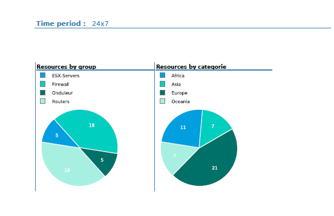

#### First page

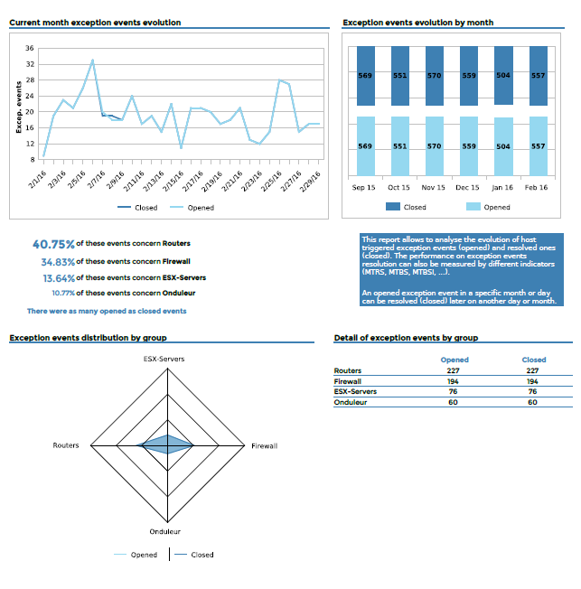

#### Second page

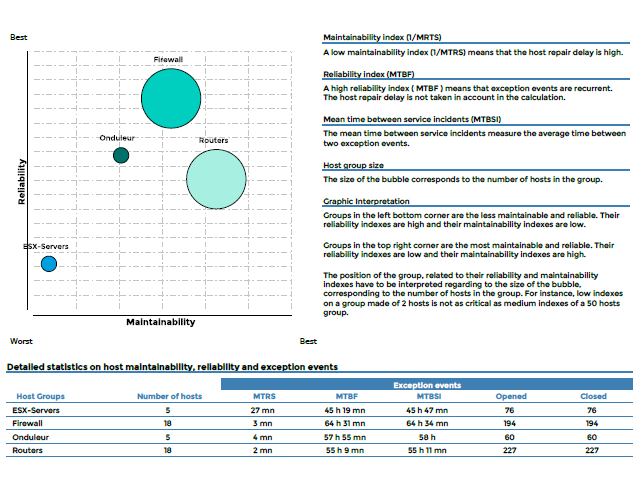

#### For each host group

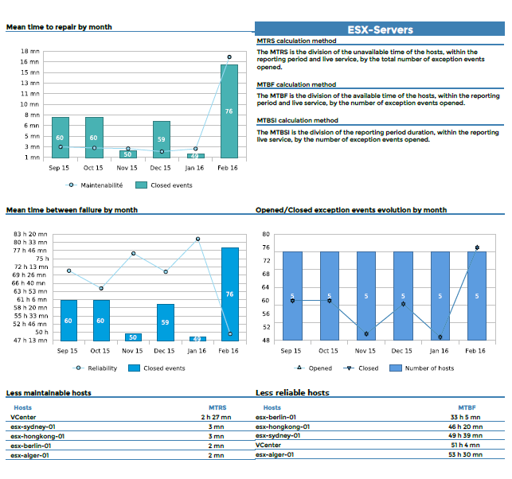

#### Parameters

Parameters required for the report:

- The reporting period.
- The following Centreon objects:

| Parameter       | Parameter type  | Description                            |
|-----------------|-----------------|----------------------------------------|
| Hostgroups      | Multi selection | Select host groups.                    |
| Host Categories | Multi selection | Select host categories.                |
| Time period     | Dropdown list   | Specify time period.                   |
| Interval        | Text field      | Specify no. of months in trend graphs. |

### Hostgroups-Availability-1

#### Description

This report shows availability, exception-type events for hosts and
services of multiple host groups. It also shows the evolution of the
hosts for each host group, the evolution of availability and number of
exception events for hosts and services.

#### How to interpret the report

On the first page, the report displays a graph of the host and service
availability for hostgroups, exception-events distribution, evolution of
the number of resources, and a cross table detailing the statistics for
all the previous information.

On the following pages, evolution of the unavailability and exception
events is detailed for each host group, sorted by host categories and
service categories.

Finally, host and service statistics are displayed with the top-most
unavailability and exception events.

#### First page

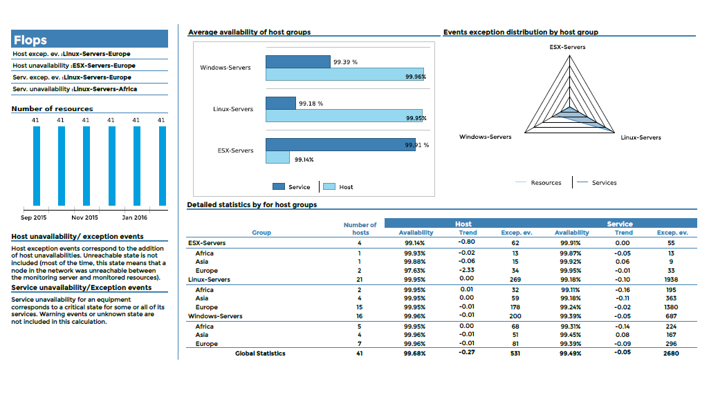

#### For each host group

##### First page

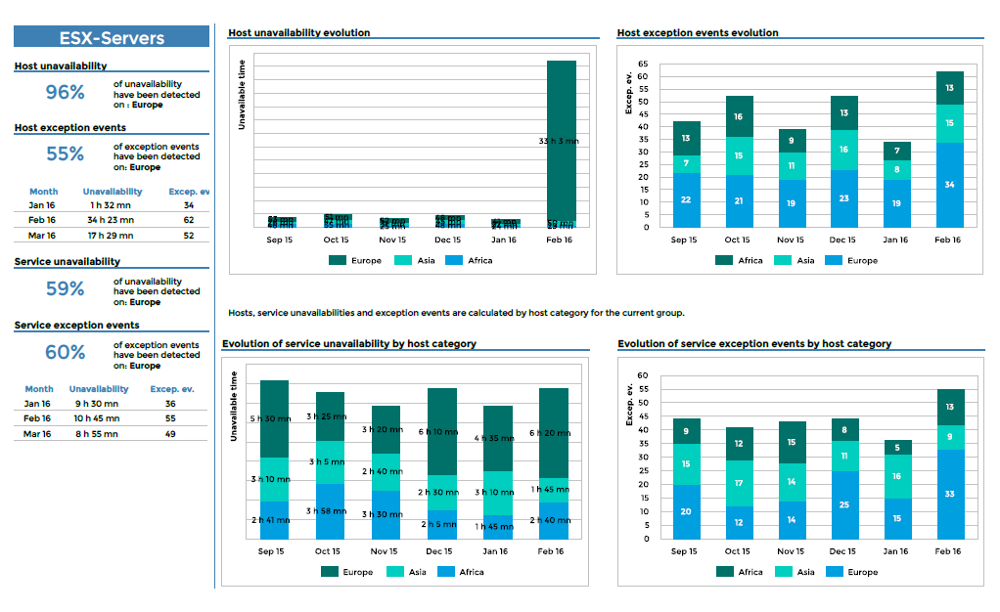

##### Second page

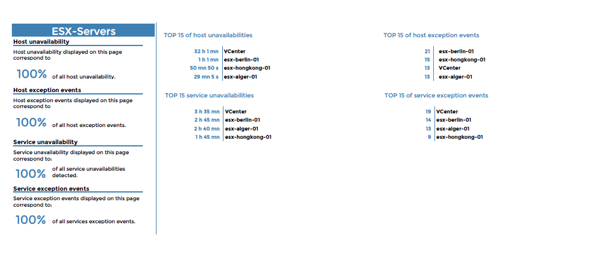

#### Parameters

Parameters required for the report:

- The reporting period
- The following Centreon objects:

| Parameter          | Parameter type  | Description                            |
|--------------------|-----------------|----------------------------------------|
| Hostgroups         | Multi selection | Select host groups.                    |
| Host Categories    | Multi selection | Select host categories.                |
| Service Categories | Multi selection | Select service categories.             |
| Time period        | Dropdown list   | Specify time period.                   |
| Interval           | Text field      | Specify no. of months in trend graphs. |

### Hostgroup-Availability-2

#### Description

This report displays information about availability and exception events
for a host group.

#### How to interpret the report

On the first page, the evolution of availability and exception events is
displayed for hosts and services. The evolution of host group resources
is also shown.

On the second page, statistics are shown for detailed availability and
exception events on a host according to category. A table lists the
hosts that were least available and that created the largest number of
exception events.

On the two last pages, detailed statistics for indicators on
availability and exception events are shown. The information is
organized by host and service category. The top 15 hosts are listed in
terms of service unavailability and exception events.

#### First page

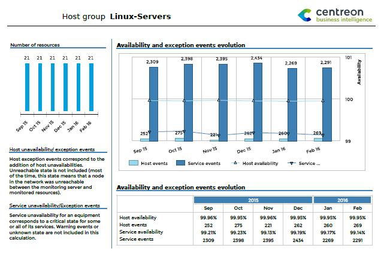

#### Second page

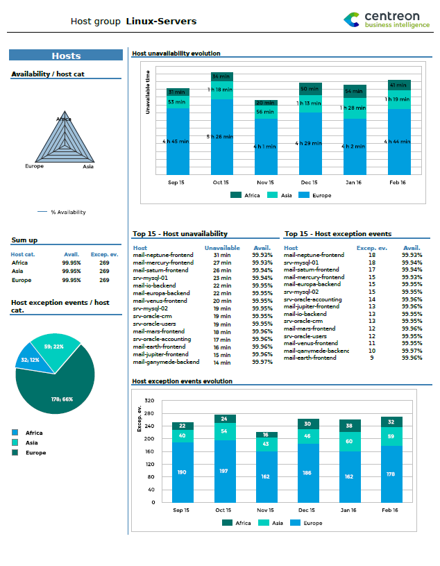

#### Third & Fourth pages

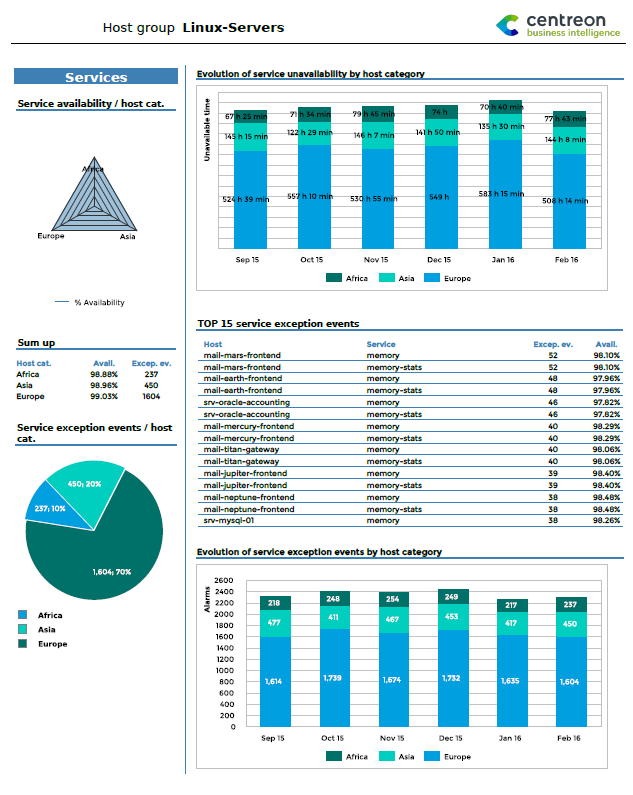

and

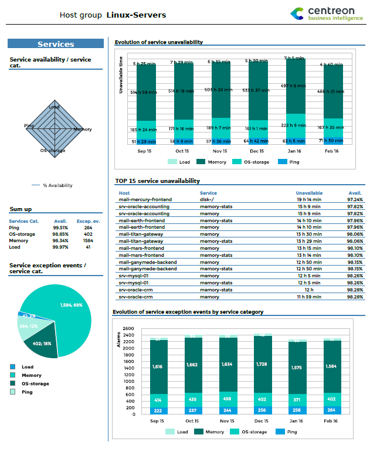

#### Parameters

Parameters required for the report:

- Reporting period
- The following Centreon objects:

| Parameter           | Parameter type | Description                                                                          |
|---------------------|----------------|--------------------------------------------------------------------------------------|
| Host group          | Drop-downlist  | Select host group.                                                                   |
| Host Categories     | Multi select   | Select host categories.                                                              |
| Services Categories | Multi select   | Select host categories.                                                              |
| Time period         | Dropdown list  | Time period to report. Note: Only use the time period from the ETL month properties. |
| Evolution interval  | Text field     | Specify no. of months of history for the evolution graph                             |

### Hostgroup-Service-Incident-Resolution-2

#### Description

This report displays the rate of acknowledged and resolved events, the
longest-lasting events, the least reliable indicators, and hosts
generating the most events for a given host group.

#### How to interpret the report

The first graph displays the rate of acknowledged and resolved events
within a specific time frame.

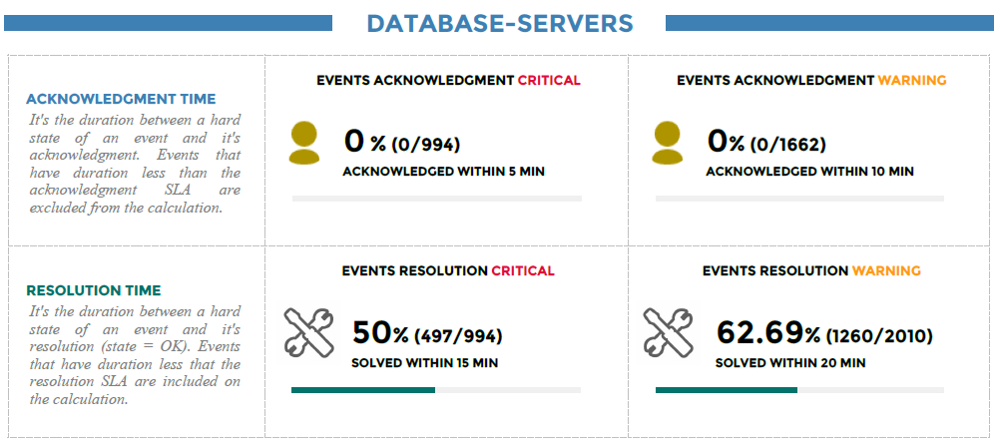

The second graph displays the top 10 longest events with the start, end and
resolution time.

Indicators in a critical-state appear in red, in a warning-state in orange, and
an unknown state in gray.

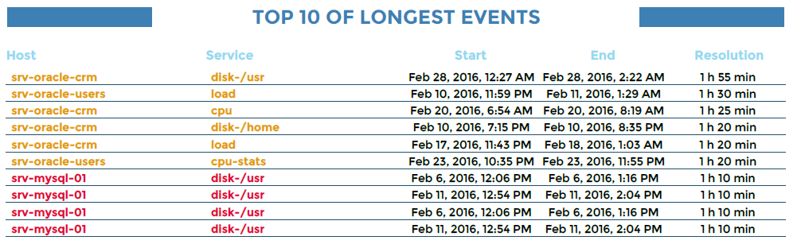

The third graph in the report displays the top 10 the least reliable
indicators.

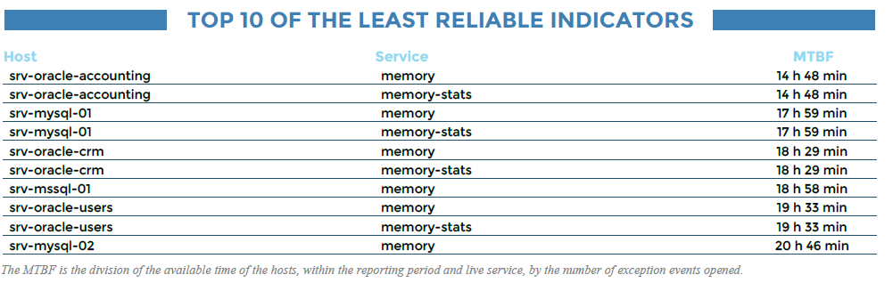

Finally, the top 10 hosts generating the most events.

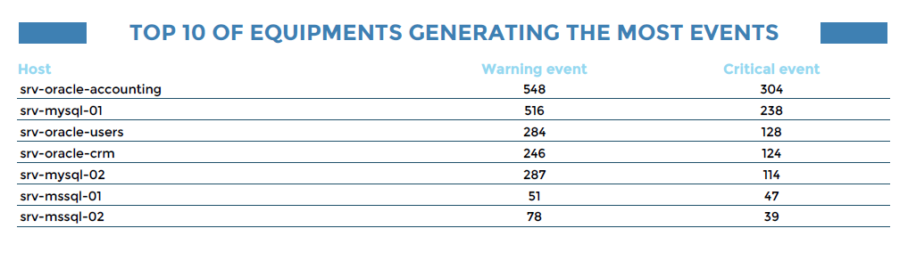

#### Parameters

Parameters required for the report:

- Reporting period
- SLA of acknowledgment in minutes
- SLA of resolution in minutes
- The number of rows to display in top objects
- The following Centreon objects:

| Parameter          | Parameter type  | Description                |
|--------------------|-----------------|----------------------------|
| Hostgroups         | Multi selection | Select host groups.        |
| Host Categories    | Multi selection | Select host categories.    |
| Service Categories | Multi selection | Select service categories. |
| Time period        | Dropdown list   | Specify time period.       |

### Hostgroup-Host-Availability-List

#### Description

This report displays information on availability and exception events for hosts
within a hostgroup.

#### How to interpret the report

For each host, the table lists the percentage of availability,
unavailability and number of exception events and trends.

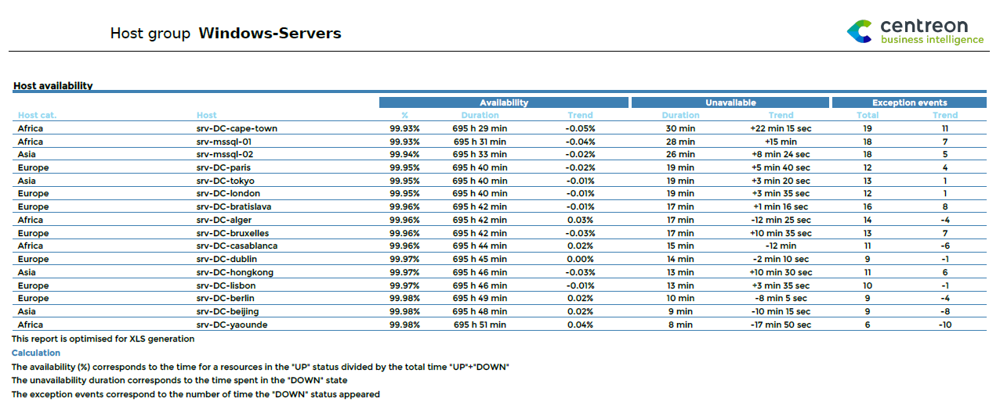

This report is optimized for generating XLS files.

#### Parameters

Parameters required for the report:

- Reporting period
- The following Centreon objects:

| Parameter        | Parameter type | Description             |
|------------------|----------------|-------------------------|
| Host group       | Drop-down list | Select host group.      |
| Hosts Categories | Multi select   | Select host categories  |
| Time period      | Drop-down list | Specify time period    |

### Hostgroup-Host-Event-List

#### Description

This report provides a list of exception events for hosts.

#### How to interpret the report

The table contains detailed statistics on critical or warning-type
exception events on hosts indicating start, acknowledgment and end
dates. The report also calculates the real and the effective MTRS for
each event.

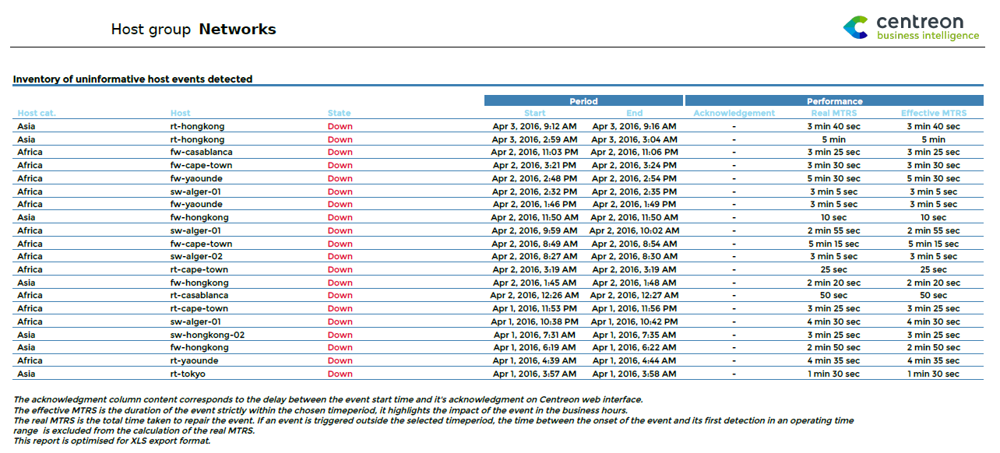

This report is optimized for generating XLS files.

#### Parameters

Parameters required for the report:

- Reporting period
- The following Centreon objects:

| Parameter        | Parameter type | Description             |
|------------------|----------------|-------------------------|
| Host group       | Drop-down list | Select host group.      |
| Hosts Categories | Multi select   | Select host categories. |
| Time period      | Drop-down list | Specifiy time period    |

### Hostgroup-Service-Availability-List

#### Description

This report displays events and the availability of services for a host group.

#### How to interpret the report

For each service, detailed statistics are provided: availability (in
percentage), unavailability, exception and warning events, as well as the trends
for these various indicators.

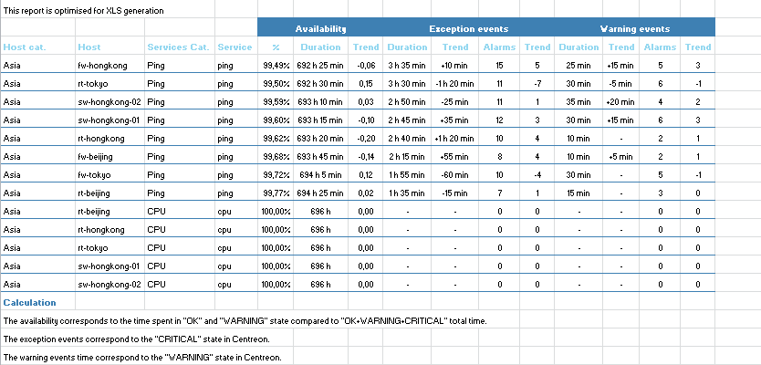

This report is optimized for generating XLS files.

#### Parameters

Parameters required for the report:

- The reporting period
- The following Centreon objects:

| Parameter          | Parameter type  | Description                |
|--------------------|-----------------|----------------------------|
| Hostgroup          | Drop-down list  | Select host group.         |
| Host Categories    | Multi selection | Select host categories.    |
| Service Categories | Multi selection | Select service categories. |
| Time period        | Dropdown list   | Specify time period.       |

### Hostgroup-Service-Event-List

#### Description

This report displays a table listing critical or warning-type events for
services in a hostgroup.

#### How to interpret the report

The report also calculates the real and the effective MTRS for each alarm. A
table contains detailed statistics on events occurring on hosts indicating start,
acknowledgment and end dates.

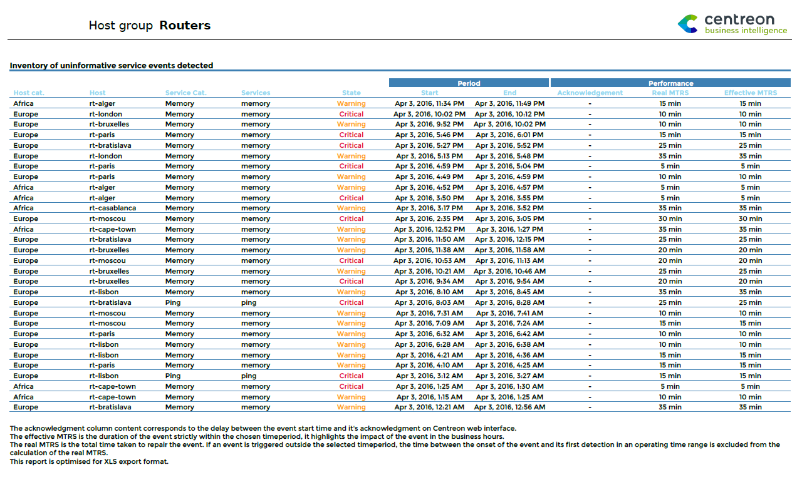

#### Parameters

Parameters required for the report:

- Reporting period
- The following Centreon objects:

| Parameter          | Parameter type  | Description                |
|--------------------|-----------------|----------------------------|
| Hostgroup          | Drop-down list  | Select host group.         |
| Host Categories    | Multi selection | Select host categories.    |
| Service Categories | Multi selection | Select service categories. |
| Time period        | Dropdown list   | Specify time period.       |

### Hostgroup-Host-Pareto

#### Description

This report allows you to identify hosts responsible for the largest
number of exception events in a host group. The data is represented in a
Pareto chart.

#### How to interpret the report

Hosts responsible for 80% of events are highlighted. Hosts are sorted in
descending order in terms of number of generated events. The ratio of
cumulative events is also shown.

This report helps you to focus on the most problematic hosts by applying
the Pareto principle (or 80-20 rule): approximately 80% of the effects
come from 20% of the causes.

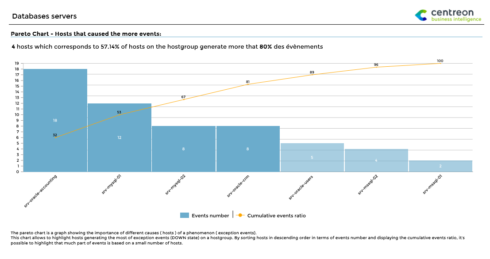

#### Parameters

Parameters required for the report:

- Reporting period
- The following Centreon objects:

| Parameter       | Parameter type  | Description             |
|-----------------|-----------------|-------------------------|
| Hostgroup       | Drop-down list  | Select host group.      |
| Host Categories | Multi selection | Select host categories. |
| Time period     | Dropdown list   | Specify time period.    |

### Hostgroups-Host-Current-Events

#### Description

This is one of the only reports that displays the events occurring on hosts at the time it is
generated rather than the events up to the previous day.

#### How to interpret the report

The report consists of four parts. On each part, you can use a filter to
select a restricted perimeter for host groups and host categories. Data
is displayed with real-time results when the report is generated. In
addition:

- Events can be sorted by state, duration or hostname.
- You can display and/or filter acknowledged hosts or hosts in downtime.
- Only confirmed events (hard state) are taken in account.
- A report can have fewer than four parts by specifying the value -1 in its
  title.

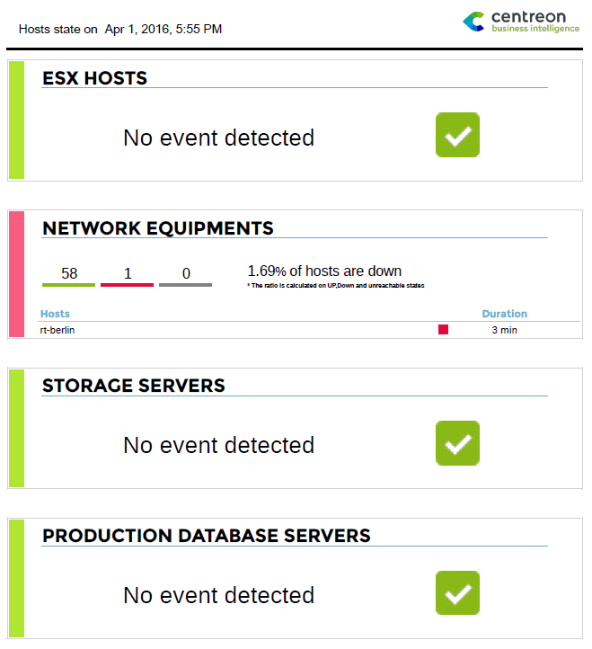

#### Parameters

Parameters required for the report:

| Parameters        | Type         | Description                                     |
|-------------------|--------------|-------------------------------------------------|
| Title             | Text field   | Specify the title for part 1 of report.         |
| Hostgroups        | Multi select | Select host groups for part 1 of report.        |
| Host category     | Multi select | Select host categories for part 2 of report.    |
| Title             | Text field   | Specify title for part 2 of report.             |
| Hostgroups        | Multi select | Select host groups for part 2 of report.        |
| Host category     | Multi select | Specify host categories for part 2 of report.   |
| Title             | Text field   | Specify title for part 3 of report.             |
| Hostgroups        | Multi Select | Select host groups to use for part 3 of report. |
| Host category     | Multi select | Select host categories for part 3 of report.    |
| Title             | Text field   | Specify title for part 4 of report.             |
| Hostgroups        | Multi select | Specify host groups for part 4 of report.       |
| Host category     | Multi select | Select host categories for part 4 of report.    |
| sort\_by          | Radio button | Sort results by state, duration or host name.   |
| display\_ack      | Radio button | Display or filter acknowledged hosts.           |
| display\_downtime | Radio button | Display or filter hosts in downtime.            |

### Hostgroups-Service-Current-Events

#### Description

This is one of the only reports that displays the events occurring on services at the time it is
generated rather than the events up to the previous day.

#### How to interpret the report

This report consists of four parts. On each part, you can use a filter
to select a restricted perimeter for host groups, host categories and
service categories. Data is displayed with real-time results when the
report is generated. In addition:

- Events can be sorted by state, duration or hostname.
- You can display and/or filter acknowledged hosts or hosts in downtime.
- Only confirmed events (hard state) are taken in account.
- A report can have fewer than four parts by specifying the value -1 in its
  title.

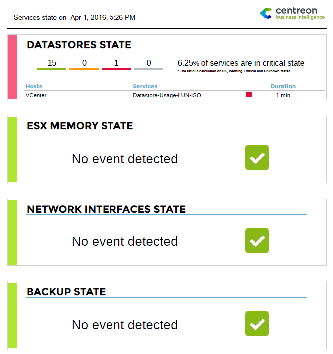

####  Parameters

Parameters required by the report:

| Parameters              | Type         | Description                                     |
|-------------------------|--------------|-------------------------------------------------|
| title                   | Text field   | Specify title for part 1 of report.             |
| Hostgroups              | Multi select | Select host groups for part 1 of report.        |
| Host category           | Multi select | Select host categories for part 2 of report.    |
| Service category        | Multi select | Select service categories for part 1 of report. |
| title                   | Text field   | Specify title for part 2 of report.             |
| Hostgroups              | Multi select | Select host groups for part 2 of report.        |
| Host category           | Multi select | Select host categories for part 2 of report.    |
| Service category        | Multi select | Select service categories for part 2 of report. |
| title                   | Text field   | Specify title for part 3 of report.             |
| Hostgroups              | Multi Select | Select host groups for part 3 of report.        |
| Host category           | Multi select | Select host categories for part 3 of report.    |
| Service category        | Multi select | Select service categories for part 3 of report. |
| title                   | Text field   | Specify title for part 4 of report.             |
| Hostgroups              | Multi select | Select host groups for part 4 of report.        |
| Host category           | Multi select | Select host categories for part 4 of report.    |
| Service category        | Multi select | Select service categories for part 4 of report. |
| sort\_by                | Radio button | Sort results by state, duration or hostname.    |
| display\_ack            | Radio button | Display or filter acknowledged hosts.           |
| display\_downtimes      | Radio button | Display or filter hosts in downtime.            |
| display\_only\_critical | Radio button | Display only services in critical state.        |
