### BV-BA-Availabilities-1

#### Description

This report displays statistics about application availability and
events for a business view. It is generated using the default reporting
time period for each business activity configured in the Centreon BAM
module.

#### How to interpret the report

The first page presents a focus on the following attributes:

- Availability

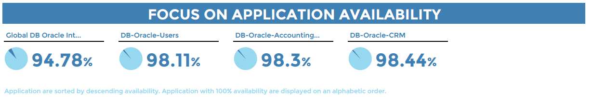

- Unavailability

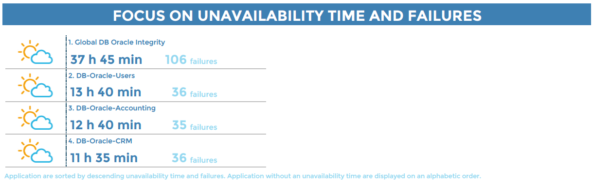

The weather icons change according to the SLAs defined in each business
activity, in terms of minutes.

- Reliability and Maintainability

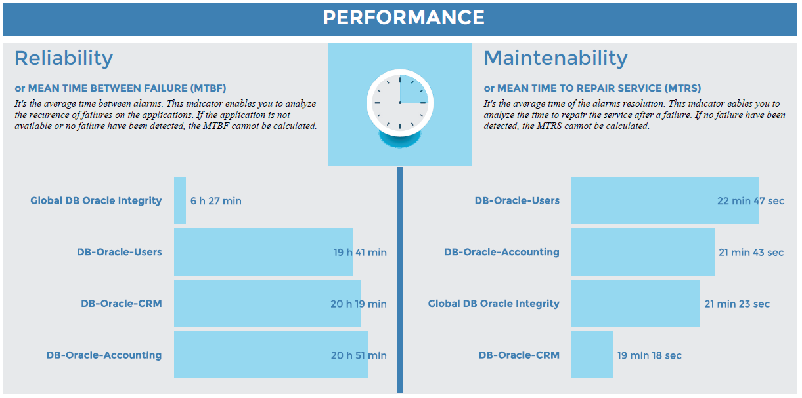

The following pages display additional statistics for each business activity in
the business view:

- Availability, unavailability, downtime, service performance index
  and number of events that occurred.

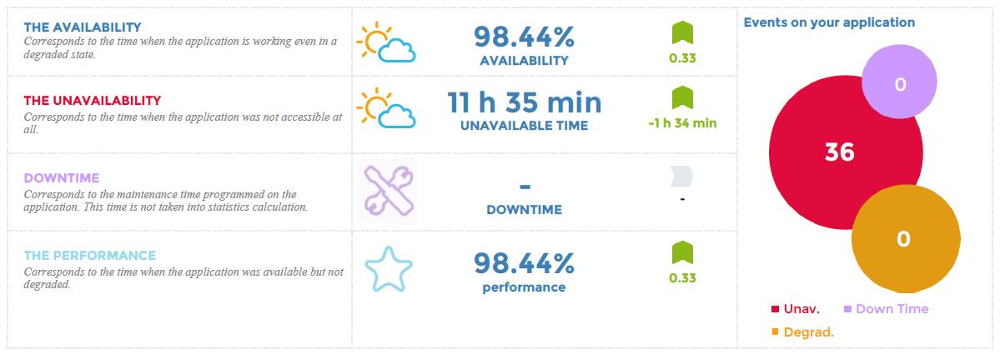

The weather icons change according to the SLAs defined in each business
activity, in terms of percentages and minutes.

- Change in availability, performance and number of events.

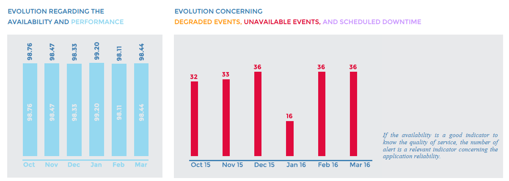

- An availability calendar displays only days when availability was below 100%.
- For days with 100% availability, the cell background color appears in a light
  gray with no values displayed.
- If data are not present on a specific day, the cell background color appears
  in white with no values displayed.

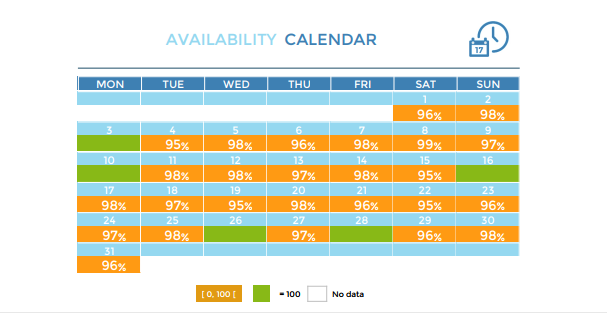

- As an option, the list of events appears with their respective key performance
  indicators (KPIs).

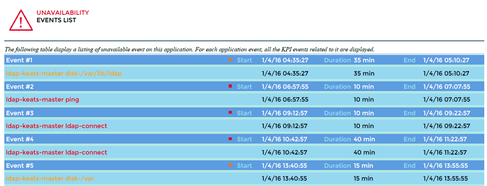

#### Parameters

Parameters required for the report:

- Start date representing the month in which you want to generate the report
  (matching the start date in the Centreon MBI interface)
- The following Centreon objects:

| Parameter      | Type          | Description                                          |
|----------------|---------------|------------------------------------------------------|
| logo           | Dropdown list | Select logo to display in header.                    |
| Business View  | Dropdown list | Select a Business View for generating the report.    |
| hide event     | Radio button  | Hide events list in the Business activity.           |
| calendar color | Radio button  | Color the calendar in green/orange/red based on SLA. |
| title          | Text field    | Specify report title.                                |
| time period    | Dropdown list | Specify reporting time period.\*                     |

\* *If different from "Default", be sure that the selected time period
is defined as a Default or Extra reporting time period in the BA
configuration or it will not appear in the report.*

> In the **Time period** field, do not use time periods that
include [exceptions](../../monitoring/basic-objects/timeperiods.md), as the exceptions will not not be taken into account.

#### Prerequisites

- Monitoring of at least one business activity to be linked to one business view
- One month minimum of data from Centreon BAM module.

### BA-Availability-1

This report displays statistics about business activity availability and
events.

#### How to interpret the report

The following information is displayed on the report for the selected
business activity:

- Availability, unavailability, downtime, service performance index and number
  of events.

The weather icons change according to the SLAs defined in each business
activity, in terms of percentages and minutes.

- Change in the availability, performance and number of events

- An availability calendar displays only the days when availability was below
  SLA in terms of percentage defined in the business activity configuration.

- As an option, the list of events appears with their respective key performance
  indicators (KPIs).

#### Parameters

Parameters required for the report:

- Start date representing the month in which you want to generate the report
  (matching the start date in the Centreon MBI interface)
- The following Centreon objects:

| Parameter              | Type                             | Description                                           |
|------------------------|----------------------------------|-------------------------------------------------------|
| logo                   | Dropdown list                    | Select logo to display in header.                     |
| Business Activity      | Dropdown list                    | Select a Business Activity for generating the report. |
| hide event             | Radio button                     | Hide events list in the business activity.            |
| calendar color         | Radio button                     | Color the calendar in green/orange/red based on SLA.  |
| title                  | text field                       | Specify report title.                                 |
| time period - Dropdown | Specify reporting time period.\* |                                                       |

\* *If different from "Default", be sure that the selected time period is
defined as a Default or Extra reporting time period in the BA configuration.*

> In the **Time period** field, do not use time periods that
include [exceptions](../../monitoring/basic-objects/timeperiods.md), as the exceptions will not not be taken into account.

### BV-BA-Availabilities-List

#### Description

For a business view, this report lists statistics showing availability,
unavailability, degraded service time and business activity alarms.

#### How to interpret the report

The weather icons change according to the SLA percentage defined in each
business activity. If no SLA is defined, 100% availability will be
represented by a sun icon, and all values below 100% by a cloud.

Changes are calculated in relation to the previous period:

- If the reporting period is a full month, the previous period is
  the previous full month.
- In all other cases, the change is calculated by the number of days
  preceding the number of days of the reporting period.

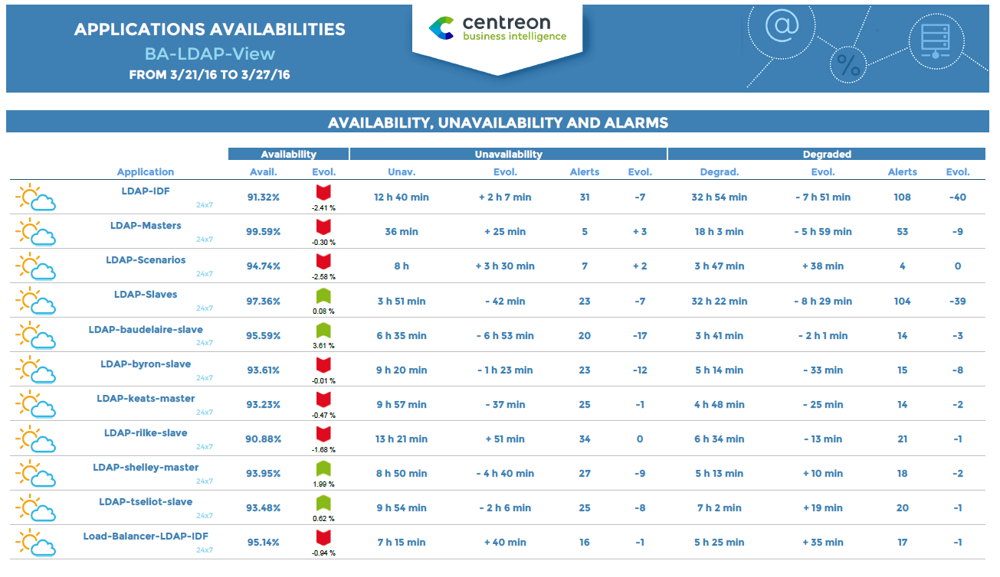

Parameters required for the report:

> - Start date representing the month in which you want to generate
>   the report (matching the start date in the Centreon MBI interface)
> - The following Centreon objects:

| Parameter      | Type          | Description                                          |
|----------------|---------------|------------------------------------------------------|
| logo           | Dropdown list | Select logo to display in header.                    |
| Business View  | Dropdown list | Select a Business View for generating the report.    |
| hide event     | Radio button  | Hide events list in the Business activity.           |
| calendar color | Radio button  | Color the calendar in green/orange/red based on SLA. |
| title          | Text field    | Specify report title.                                |
| time period    | Dropdown list | Specify reporting time period.\*                     |

\* *If different from "Default", be sure that the selected time period
is defined as a Default or Extra reporting time period in the BA
configuration or it will not appear in the report.*

> In the **Time period** field, do not use time periods that
include [exceptions](../../monitoring/basic-objects/timeperiods.md), as the exceptions will not not be taken into account.

#### Prerequisites

- Monitoring of at least one business activity to be linked to one business view

### BA-Event-List

This report displays a list of events that occurred for a business activity.

#### How to interpret the report

The report displays a list of events for a business activity during a given period and the related KPIs. The time period applied is the default value set in the configuration BA menu.

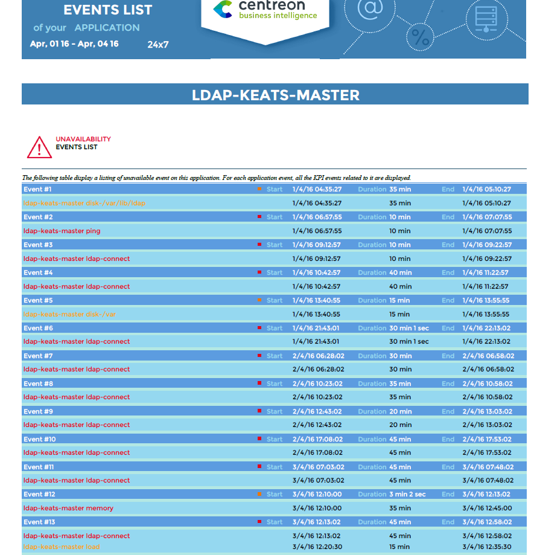

#### Parameters

| Parameter         | Type          | Description                                           |
|-------------------|---------------|-------------------------------------------------------|
| logo              | Dropdown list | Select logo to display in header.                     |
| Business Activity | Dropdown list | Select a Business Activity for generating the report. |
| hide event        | Radio button  | Hide events list in the business activity.            |
| calendar color    | Radio button  | Color the calendar in green/orange/red based on SLA.  |
| title             | text field    | Specify report title.                                 |
| time period       | Dropdown      | Specify reporting time period.\*                      |

\* *If different from "Default", be sure that the selected time period is
defined as a Default or Extra reporting time period in the BA configuration.*

> In the **Time period** field, do not use time periods that
include [exceptions](../../monitoring/basic-objects/timeperiods.md), as the exceptions will not not be taken into account.

### BV-BA-Current-Health-VS-Past

#### Description

This report displays the current health of business activities at the time the
report is generated. It also displays availability for a defined period.

#### How to interpret the report

For a given business view, the report displays the real-time health state of
each business application, the hour of latest state change and duration of the
current state. The report also indicates whether the application has been
acknowledged or in downtime. Depending on the parameter selected, the report
displays availability and failures for each application.

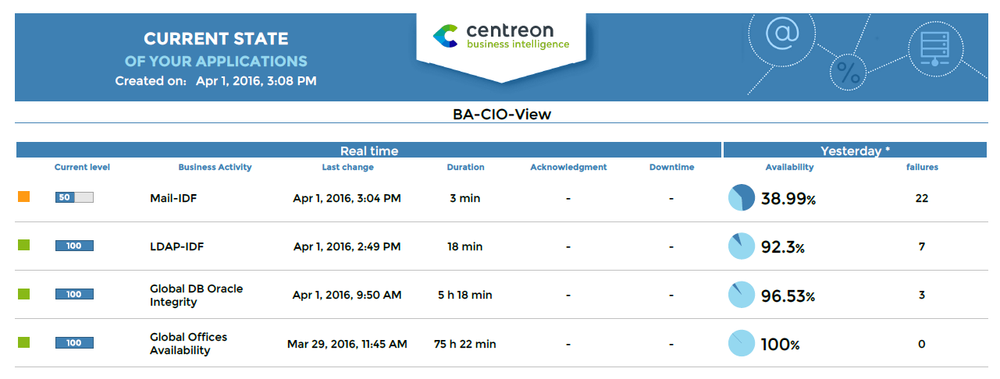

#### Parameters

Parameters required for the report:

| Parameters                    | Type          | Description                                                            |
|-------------------------------|---------------|------------------------------------------------------------------------|
| logo                          | List box      | Select logo to display in header.                                      |
| title                         | Text field    | Specify report title.                                                  |
| Business View                 | List box      | Select a Business View for generating the report.                      |
| compare\_with                 | Radio button  | Display historical data according to specified period.                 |
| show the reporting timeperiod | Radio botton  | Show or hide the default time period related to the business activity. |
| title                         | Text field    | Specify report title.                                                  |
| time period                   | Dropdown list | Specify reporting time period or other.\*                            |

\* *If different from "Default", be sure that the selected time period is
defined as a Default or Extra reporting time period in the BA configuration or
it will not appear in the report.*

> In the **Time period** field, do not use time periods that
include [exceptions](../../monitoring/basic-objects/timeperiods.md), as the exceptions will not not be taken into account.

#### Prerequisites

- Monitoring of at least one business activity to be linked to one
  business view.

### BV-BA-Availabilities-Calendars

#### Description

This report displays statistics about business activity availability and
events. The statistics appear in calendars, by month and by day. This
report is generated using the default reporting time period configured
in the Centreon BAM module for each business activity.

#### How to interpret the report

The first calendar displays the availability of your business activities
by month. Cells are colored according to the SLA defined for each
business activity in percentages (in the Extended Information tab menu).
If the SLAs are not defined in the BA configuration, values are
displayed in cells if availability is below 100% or if unavailability >
0 seconds. The time period that applies is the "Default reporting
period" selected for each business activity (in the Configuration tab
menu).

The second calendar displays the unavailability and number of events for
your business activities by month. Cells are colored according to the
SLA defined for each business activity in minutes. If the SLAs are not
defined in the BA configuration, values are displayed in cells if
availability is below 100% or if unavailability > 0 seconds. The time
period that applies is the "Default reporting period" selected for
each business activity.

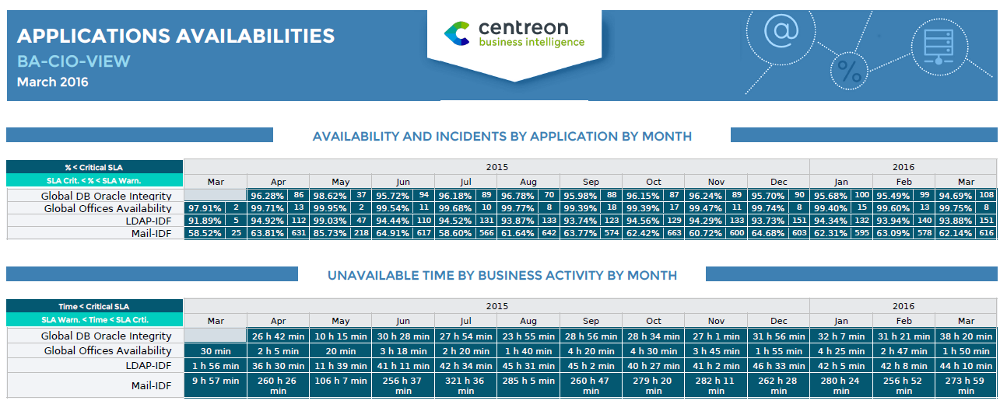

The third calendar displays availability for each business activity by
day. Cells are colored according to time frames (in minutes) of
unavailability, configured for the report. If unavailability is below
100%, availability is displayed for that day.

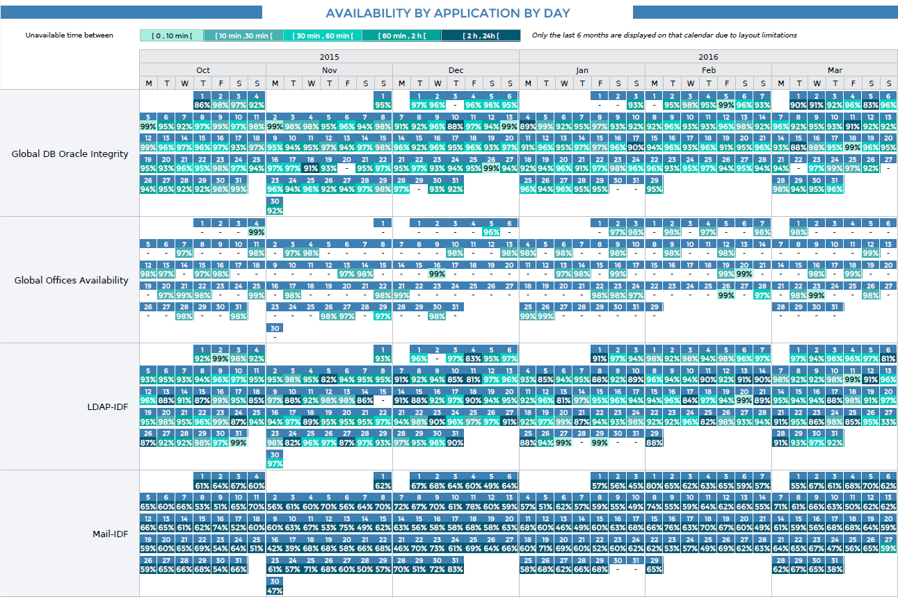

#### Parameters

Parameters required for the report:

> - A start date corresponding to the month for which you want to generate the
>   report (corresponding to the start date in the Centreon MBI interface)
> - The following objects:

| Parameter     | Type          | Description                                                                                    |
|---------------|---------------|------------------------------------------------------------------------------------------------|
| logo          | Dropdown list | Select logo to display in header.                                                              |
| business View | Dropdown list | Select a Business View for generating the report.                                              |
| sla 1\*       | Text field    | Time in minutes corresponding to the high threshold of the first interval [0 min, **sla1**]    |
| sla 2\*       | Text field    | Time in minutes corresponding to the high threshold of the second interval [sla1, **sla2**]    |
| sla 3\*       | Text field    | Time in minutes corresponding to the high threshold of the third interval [sla2, **sla3**]     |
| sla 4\*       | Text field    | Time in minutes corresponding to the high threshold of the fourth interval [sla3, **sla4**]    |
| title         | Text field    | Specify report title.                                                                          |
| time period   | Dropdown list | Specify reporting time period or a specific one.\*\*                                           |

\* SLA thresholds appear above the calendar displaying availability by day.

\* *If different from "Default", be sure that the selected time period is
defined as a Default or Extra reporting time period in the BA configuration or
it will not appear in the report.*

> In the **Time period** field, do not use time periods that
include [exceptions](../../monitoring/basic-objects/timeperiods.md), as the exceptions will not not be taken into account.

#### Prerequisites

- Monitoring of at least one business activity to be linked to one
  business view
- One month minimum of data from Centreon BAM extension.
