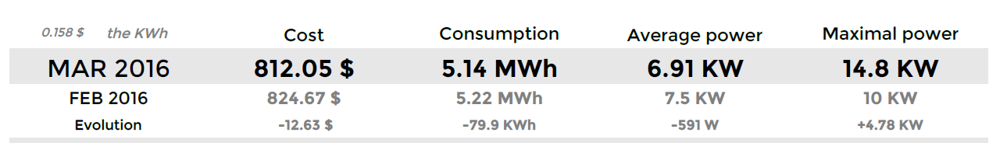
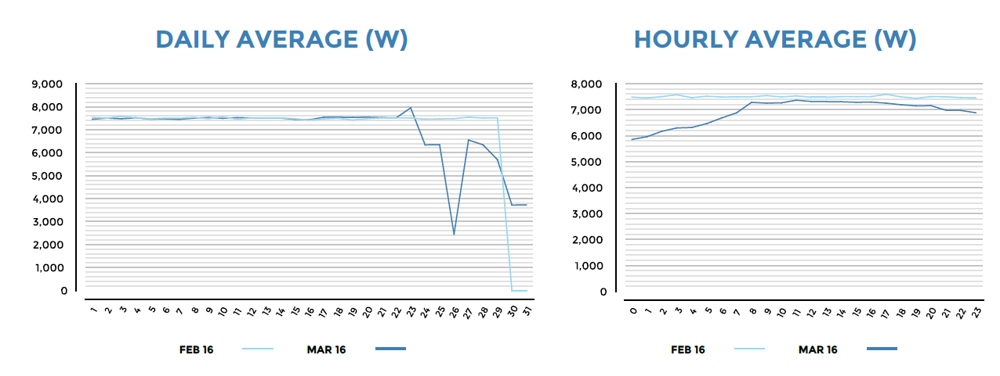
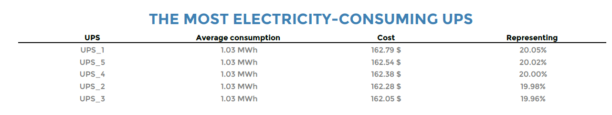
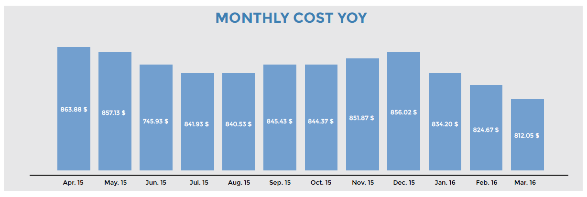

### Hostgroup-Electricity-Consumption-1

#### Description

This report displays statistics on the energy consumption of the hosts
connected to an uninterrupted power supply (UPS).

#### How to interpret the report

For a given host group, reporting period and price per kilowatt-hour,
the first table displays the cost, consumption, average power and
maximum power reached for month N. A reminder of these values for the
previous month is provided along with the evolution over time.

The next two graphs display the average power used per day of the month
and per hour of the day. A comparison with the previous month also
appears.

Then, the top five most energy-consuming UPSs are displayed, along with
consumption distribution by UPS, average consumption and cost by UPS.

> If the host group contains more than five UPSs, only the four most
> energy-consuming ones will be displayed. A fifth category will include
> the remaining UPSs.

Finally, a graph is shown of the monthly cost year over year (YOY).

#### Parameters

Parameters required for the report:

- The reporting period
- The following Centreon objects:

| Parameters                | type          | Description                                                |
| ------------------------- | ------------- | ---------------------------------------------------------- |
| Time period               | Dropdown list | Select time period.                                        |
| Host group                | Dropdown list | Select the host group.                                     |
| Host category             | Multi select  | Select host categories.                                    |
| Service category          | Multi select  | Select service categories containing the power indicators. |
| Select metrics to include | Multi select  | Select the metric name of the output power.                |
| Price KWh                 | Text          | Enter price of the kilowatt-hour.                          |

#### Prerequisites

The prerequisites for the report are:

- Monitoring of the output power of the UPSs.
- Creation of a service category containing all the power-output
  indicators.
- Sufficient historical data for the evolution graphs.

> UPS consumption corresponds to the consumption by all hosts connected to the
> UPS.
