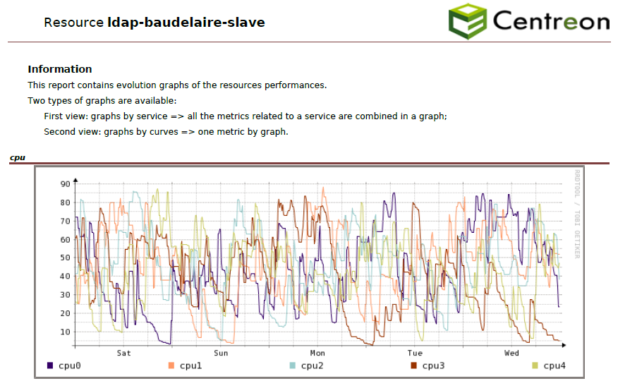
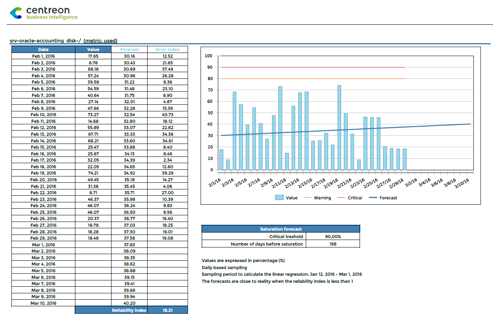
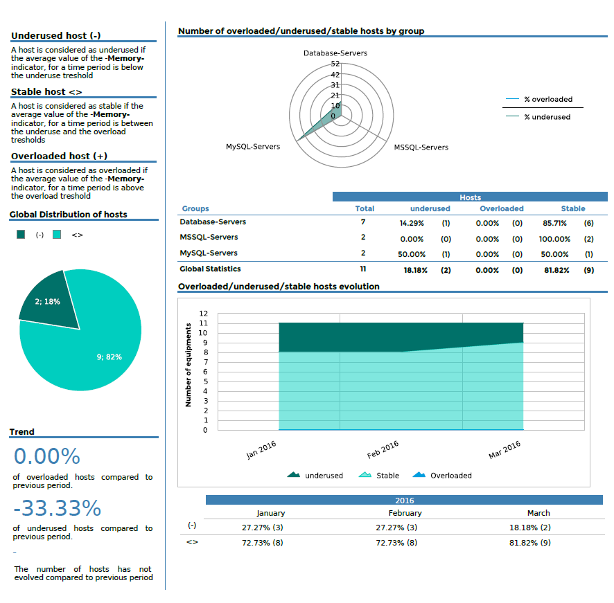
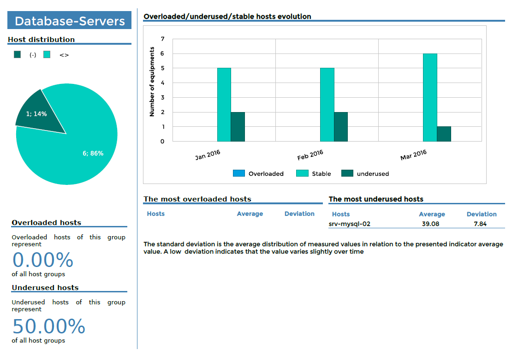
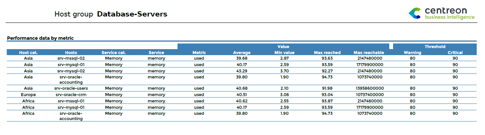
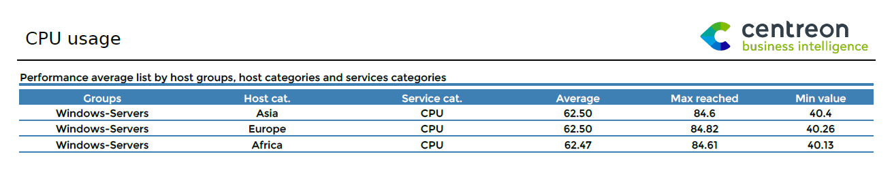

### Host-Graphs-V2

#### Description

This report presents round-robin database (RRD) graphs for the evolution
and performance of Centreon services over a defined period.



#### Parameters

Parameters required for the report:

- Reporting period
- The following Centreon objects:

| Parameter           | Parameter type | Description                                                                                                |
|---------------------|----------------|------------------------------------------------------------------------------------------------------------|
| Host                | Selection      | Select host.                                                                                               |
| Service Categories  | Multi select   | Select service category.                                                                                   |
| Metrics             | Multi select   | Metrics to use. If no metric is selected, graphs by metric will not displayed.                             |
| Graphs display rule | Check box      | Sets whether you want to see all the metrics on one graph for each service, one graph per metric, or both. |

#### Prerequisites

Go to **Reporting > Business Intelligence > General Options > Scheduler Options**
and configure the following field:


In order to export RRD graphs using the Centreon API, the reporting
server needs to access it using HTTP or HTTPS protocol. A curl command
sent to the URL of the API should generate an image file.

``` shell
curl http://$CENTREON-IP-OR-DNS$/centreon/include/views/graphs/generateGraphs/generateImage.php?akey=$AUTH_KEY$&username=$USER$&hostname=$HOSTNAME$&service=$SERVICENAME$&start=$TIMESTAMPSTART$&end=$TIMESTAMPEND$
```

Replace the values between $ signs with real values.

Example:

``` shell
curl http://centreon.enterprise.com/centreon/include/views/graphs/generateGraphs/generateImage.php?akey=af9c583c5f31bd2459c07&username=myUser&hostname=host-1&service=cpu&start=1490997600&end=1493157600
```

> If you are using SSL/TLS on your Central server, and if the certificate is
> self-signed or signed by an unknown authority, you must add it to the trusted
> certificates database:
>
> - Install *ca-certificates* package:
>
>   ``` shell
>   yum install -y ca-certificates
>   ```
>
> - Retrieve and store certificate:
>
>   ``` shell
>   echo quit | openssl s_client -showcerts -servername <hostname> -connect <hostname>:<port> > /etc/pki/ca-trust/source/anchors/<hostname>.pem
>   ```
>
>   The *servername* option value must be the exact hostname defined in the
>   certificate. It must also be the hostname defined in Centreon Web
>   configuration, and used by the reports scheduler to contact the Central
>   server.
>
> - Reload the trusted certificates database:
>
>   ```shell
>   update-ca-trust
>   ```
>
> CBIS must be restarted after these actions.

### Hostgroup-Graphs-v2

#### Description

This report presents round-robin database (RRD) graphs for the evolution and
performance of Centreon services for a given host group over a defined period.


#### Parameters

Parameters required for the report:

- Reporting period
- The following Centreon objects:

| Parameter           | Parameter type | Description                                                                                                |
|---------------------|----------------|------------------------------------------------------------------------------------------------------------|
| Report title        | Text           | Select title on cover page and report header.                                                              |
| Host group          | Drop-down list | Select host group.                                                                                         |
| Service Categories  | Multi select   | Select service category.                                                                                   |
| Hosts Categories    | Multi select   | Select host categories.                                                                                    |
| Metrics             | Multi select   | Select metrics. If no metric is selected, graphs by metric will not be displayed.                          |
| Graphs display rule | Check box      | Specify whether you want to see all the metrics on one graph for each service, a graph by metric, or both. |

#### Prerequisites

Go to **Reporting > Business Intelligence > General Options > Scheduler Options** 
and configure the following field:


In order to export RRD graphs using the Centreon API, the reporting
server needs to access it using HTTP or HTTPS protocol. A curl command
sent to the URL of the API should generate an image file.

``` shell
curl http://$CENTREON-IP-OR-DNS$/centreon/include/views/graphs/generateGraphs/generateImage.php?akey=$AUTH_KEY$&username=$USER$&hostname=$HOSTNAME$&service=$SERVICENAME$&start=$TIMESTAMPSTART$&end=$TIMESTAMPEND$
```

Replace the values between $ signs with real values.

Example:

``` shell
curl http://centreon.enterprise.com/centreon/include/views/graphs/generateGraphs/generateImage.php?akey=af9c583c5f31bd2459c07&username=myUser&hostname=host-1&service=cpu&start=1490997600&end=1493157600
```

> If you are using SSL/TLS on your Central server, and if the certificate is
> self-signed or signed by an unknown authority, you must add it to the trusted
> certificates database:
>
> - Install *ca-certificates* package:
>
>   ``` shell
>   yum install -y ca-certificates
>   ```
>
> - Retrieve and store certificate:
>
>   ``` shell
>   echo quit | openssl s_client -showcerts -servername <hostname> -connect <hostname>:<port> > /etc/pki/ca-trust/source/anchors/<hostname>.pem
>   ```
>
>   The *servername* option value must be the exact hostname defined in the
>   certificate. It must also be the hostname defined in Centreon Web
>   configuration, and used by the reports scheduler to contact the Central
>   server.
>
> - Reload the trusted certificates database:
>
>   ```shell
>   update-ca-trust
>   ```
>
> CBIS must be restarted after these actions.

### Hostgroup-Capacity-Planning-Linear-Regression

#### Description

This report shows the evolution and performance forecasting metrics for
a host group.

#### How to interpret the report

The evolution of the value of the metric is represented on a graph and in a table.
Forecasts are calculated from the value of the metric during the reporting period and projected
into the future. An additional table provides information about critical
threshold and days before saturation.



#### Parameters

Parameters required for the report:

- Reporting period
- The following Centreon objects:

| Parameter                                                     | Parameter type | Description                                                                   |
|---------------------------------------------------------------|----------------|-------------------------------------------------------------------------------|
| Host groups                                                   | Multi select   | Select host groups for filter.                                                |
| Host Categories                                               | Multi select   | Select host categories for filter.                                            |
| Services Categories                                           | Multi select   | Select service categories for filter.                                         |
| Time period                                                   | Dropdown list  | Specify time period.                                                          |
| Metrics                                                       | Multi select   | Select metric to **include** in report.                                       |
| Historical period in days in addition to the reporting period | Number         | Specify days used to calculate the linear regression before reporting period. |
| Forecast period in days                                       | Number         | Specify forecast days calculated by linear regression.                        |

#### Prerequisites

Metrics must return a maximum value on their performance data. Using warning
and critical thresholds on performance data is highly recommended.

Performance data returned by a plugin must be formatted as follows, preceded by
a pipe (|):

``` text
output-plugin | metric1=valeur(unité);seuil_warning;seuil_critique;minimum;maximum metric2=valeur ...
```

### Hostgroups-Rationalization-Of-Resources-1

#### Description

This report provides an overview of resource usage by host groups and
displays hosts and host groups that are overloaded or underused.

On the first page, this information is displayed for all host groups.

Then, for each host group a separate page is generated showing load
distribution.

#### Summary page



#### For each host group



#### Parameters

Parameters required for the report:

- Reporting period
- The following Centreon objects:
  
| Parameter          | Parameter type | Description                                                                                                |
|--------------------|----------------|------------------------------------------------------------------------------------------------------------|
| Host groups        | Multi select   | Select host group.                                                                                         |
| Service Categories | Multi select   | Select service category.                                                                                   |
| Hosts Categories   | Multi select   | Select host categories.                                                                                    |
| Metrics            | Multi select   | Select metrics. If no metric is selected, graphs by metric will not be displayed.                          |
| Time period        | Dropdown list  | Specify whether you want to see all the metrics on one graph for each service, a graph by metric, or both. |
| Interval         | Text field     | Specify no. of months to show in trend graphs.                                                             |
| overloaded         | number         | Specify threshold determining resource is overloaded. *Unit : see prerequisites*.                          |
| underused          | number         | Specify threshold determining resource is underused. *Unit : see prerequisites*.                           |

#### Prerequisites

This report can be generated using indicators that return a maximum value or not.

- If the metric has a maximum value, the threshold must be filled with a
  **percent** value (between 0 and 100).
- If the metric does not have a maximum value (e.g., counter for visitors on a
  website), the thresholds must be expressed in the same unit as the indicator
  (the counter for visitors).

### Hostgroup-Service-Metric-Performance-List

#### Description

This report displays the average performance data for a list of
services. It also shows the minimum and maximum values reached over
the time period, the maximum potential value, and warning and critical
thresholds for all service metrics selected.

- If the maximum value is returned by the plugin, the Average, Max and Min
  columns are displayed in percentage (%).
  The calculation is: value / maximum value.
- If the maximum value not returned by the plugin, the Average, Max and Min
  columns are displayed in the metric's units.



#### Parameters

Parameters required for the report:

- Reporting period
- The following Centreon objects:

| Parameter          | Parameter type  | Description                |
|--------------------|-----------------|----------------------------|
| Hostgroup          | Drop-down list  | Select host group.         |
| Host Categories    | Multi selection | Select host categories.    |
| Service Categories | Multi selection | Select service categories. |
| Metrics            | Multi select    | Specify metric to INCLUDE. |
| Time period        | Dropdown list   | Specify time period.       |

### Hostgroups-Categories-Performance-List

#### Description

This report displays the average performance data for a list of host
groups, host categories and service categories. It also shows the
minimum and maximum value reached over the time period.

- If the maximum value is returned by the plugin, the Average, Max and
  Min columns are displayed in percentage (%). The calculation is:
  value / maximum value.
- If the maximum value is not returned by the plugin, the Average, Max
  and Min columns are displayed in the metric's units.



#### Parameters

Parameters required for the report:

- Reporting period
- The following Centreon objects:

| Parameter          | Parameter type  | Description                |
|--------------------|-----------------|----------------------------|
| Hostgroups         | Multi selection | Select host groups.        |
| Host Categories    | Multi selection | Select host categories.    |
| Service Categories | Multi selection | Select service categories. |
| Metrics            | Mutli select    | Specify metric to INCLUDE. |
| Time period        | Dropdown list   | Specify time period.       |
