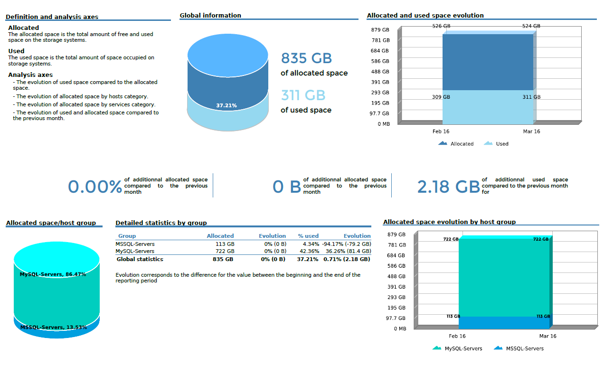
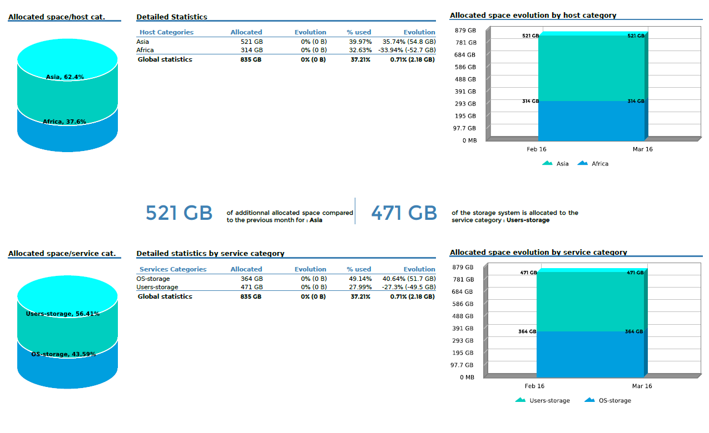
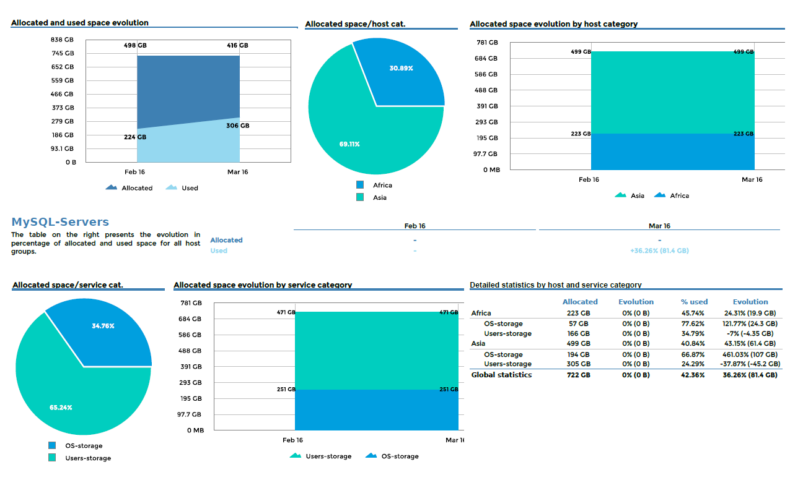
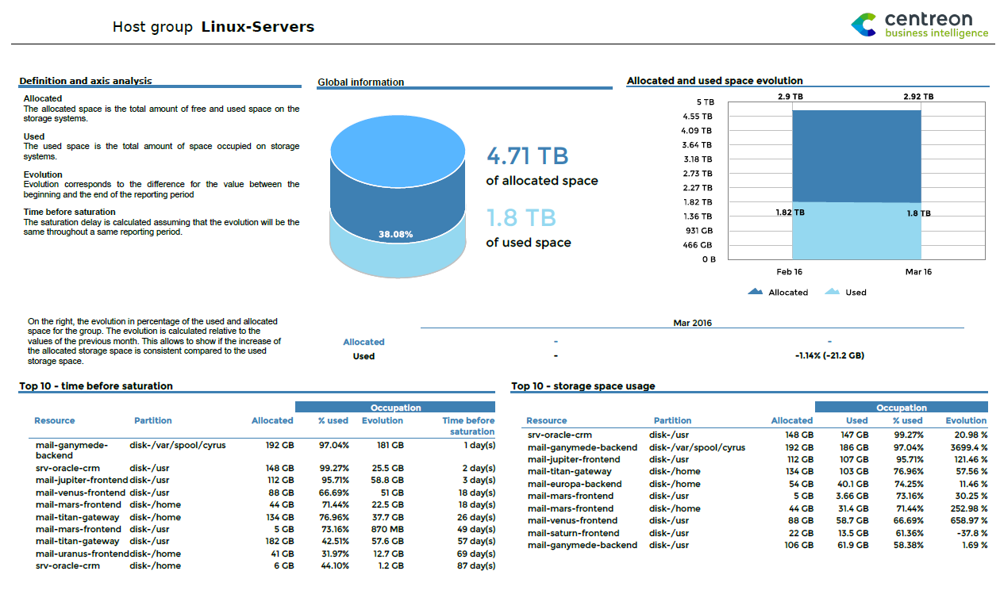
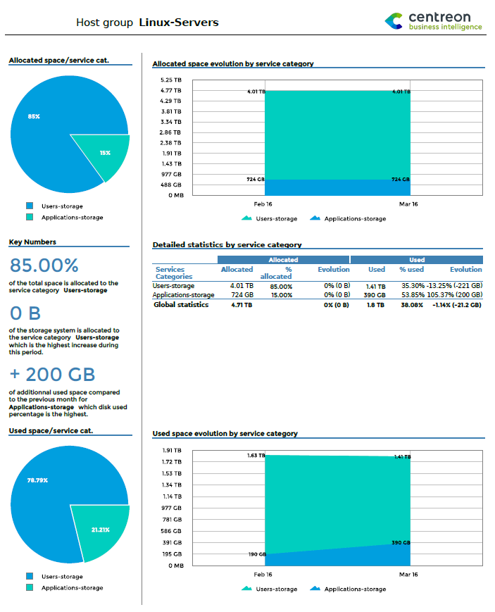
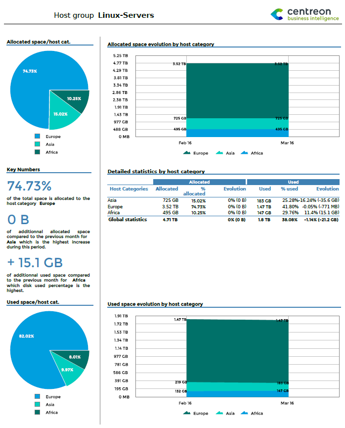
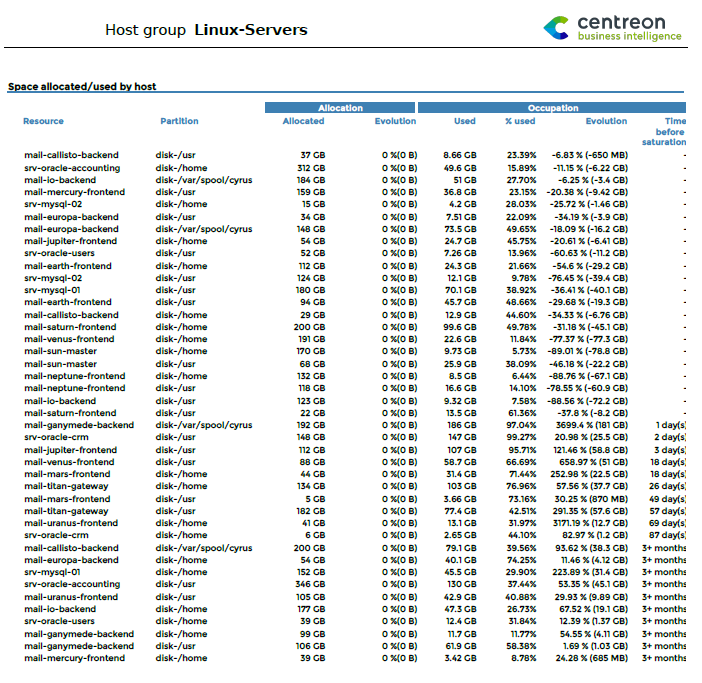
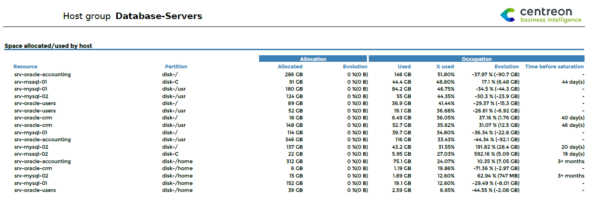

### Hostgroups-Storage-Capacity-1

#### Description

This report displays statistics on allocated and used storage space for
multiple host groups.

#### How to interpret the report

On the first page, statistics are summarized by host group.

On the second page, statistics are displayed by host category and service
category.

On the following pages, overall statistics are detailed for each host group,
displayed by host categories and service categories.

#### First page



#### Second page



#### For each host group



> Statistics displayed in evolution tables and graphs by month
> correspond to values of indicators measured on the last day of the
> month. "Snapshot" statistics (versus evolution statistics by month)
> correspond to values of indicators measured the last day of the
> reporting period. Evolution calculations are based on a comparison of
> the values of indicators the last day of the reporting period with the
> values of indicators the day before the first day of the reporting
> period.

##### Parameters

Parameters required for the report:

- Reporting period
- The following Centreon objects:

| Parameter          | Parameter type  | Description                                                     |
|--------------------|-----------------|-----------------------------------------------------------------|
| Hostgroups         | Multi selection | Select host groups.                                             |
| Host Categories    | Multi selection | Select host categories.                                         |
| Service Categories | Multi selection | Select service categories.                                      |
| Metrics            | Mutli select    | Specify metric to INCLUDE.                                      |
| Time period        | Dropdown list   | Specify time period.                                            |
| Evolution interval | Text field      | Specify number of historical months for the evolution graphics. |

##### Prerequisites

For consistency in graphs and statistics, certain prerequisites apply to
performance data returned by the storage plugins. This data must be formatted as
follows, preceded by a pipe (|):

``` text
output-plugin | metric1=valueunit;warning_treshold;critical_treshold;minimum;maximum metric2=value...
```

Make sure that the plugins return the maximum value, which is required in order
to calculate statistics. The unit must be expressed in bytes.

> **Warning**
>
> - The ETL configuration must include service categories for storage,
>   otherwise the evolution graphics remain empty.
> - This report is compatible with the 24x7 time period only. This time
>   period must be configured on the menu "General options | Capacity
>   statistic aggregated by month | Live services for capacity statistics
>   calculation".

### Hostgroup-Storage-Capacity-2

#### Description

This report provides detailed storage statistics and shows the evolution of the
storage space of your IT infrastructure.

#### How to interpret the report

The first page displays overall information about allocated and used
space for host groups. A graph traces the past evolution of these two
parameters. Two tables list the most critical information for hosts in
terms of storage space.

On the second and third pages, statistics for allocated and used space
are organized by service category and host category.

The fourth page shows storage space per host group, with the allocated
and used space for each partition, the evolution over the last month,
and estimated time before saturation.

#### First page



##### Second & third pages

##### By service categories



##### By host categories



#### Fourth page



> Statistics displayed in evolution tables and graphs by month
> correspond to values of indicators measured on the last day of the
> month. "Snapshot" statistics (versus evolution statistics by month)
> correspond to values of indicators measured the last day of the
> reporting period. Evolution calculations are based on comparing the
> values of indicators the last day of the reporting period with the
> values of indicators the day before the first day of the reporting
> period.

#### Parameters

Parameters required for this report:

- The reporting period
- The following Centreon objects:

| Parameter          | Parameter type  | Description                                                     |
|--------------------|-----------------|-----------------------------------------------------------------|
| Hostgroup          | Dropdown list   | Select host groups.                                             |
| Host Categories    | Multi selection | Select host categories.                                         |
| Service Categories | Multi selection | Select service categories.                                      |
| Metrics            | Multi select    | Specify metric to INCLUDE.                                      |
| Time period        | Dropdown list   | Specify time period.                                            |
| Evolution interval | Text field      | Specify number of historical months for the evolution graphics. |

#### Prerequisites

For consistency in graphs and statistics, certain prerequisites apply to
performance data returned by the storage plugins. This data must be
formatted as follows, preceded by a pipe (|):

``` text
output-plugin | metric1=valueunit;warning_treshold;critical_treshold;minimum;maximum metric2=value...
```

Make sure that the plugins return the maximum value, which is required
in order to calculate statistics. The unit must be expressed in bytes.

> **Warning**
>
> - The ETL configuration must include service categories for storage,
>   otherwise the evolution graphics remain empty.
> - This report is compatible with the 24x7 time period only. This time
>   period must be configured via the "General options | Capacity
>   statistic aggregated by month | Live services for capacity statistics
>   calculation" menu.

### Hostgroup-Storage-Capacity-List

#### Description

This report displays storage space usage on hosts within a host group.

#### How to interpret the report

The report presents a table with all available partitions for
a hostgroup's resources. Detailed information is provided on the
allocated and used space, the change since the last month, and
estimated time before saturation.



> Statistics displayed in evolution tables and graphs by month
> correspond to values of indicators measured on the last day of the
> month. "Snapshot" statistics (versus evolution statistics by month)
> correspond to values of indicators measured the last day of the
> reporting period. Evolution calculations are based on comparing the
> values of indicators the last day of the reporting period with the
> values of indicators the day before the first day of the reporting
> period.

#### Parameters

Parameters required for the report:

- Reporting period
- The following Centreon objects:

| Parameter          | Parameter type  | Description                |
|--------------------|-----------------|----------------------------|
| Hostgroup          | Dropdown list   | Select host groups.        |
| Host Categories    | Multi selection | Select host categories.    |
| Service Categories | Multi selection | Select service categories. |
| Metrics            | Multi select    | Specify metric to INCLUDE. |
| Time period        | Dropdown list   | Specify time period.       |

#### Prerequisites

For consistency in graphs and statistics, certain prerequisites apply to
performance data returned by the storage plugins. This data must be
formatted as follows, preceded by a pipe (|):

``` text
output-plugin | metric1=valueunit;warning_treshold;critical_treshold;minimum;maximum metric2=value...
```

Make sure that the plugins return the maximum value, which is required
in order to calculate statistics. The unit must be expressed in bytes.
