### VMWare-Cluster-Performances-1

#### Description

This report displays CPU and memory performance for an ESX cluster
including the use of hosted virtual machines and datastores.

#### How to interpret the report

For a given ESX cluster and a specific reporting period as input, the
report displays the following information:

On the first page, the report shows the total number of datastores
available on the cluster. Included are average usage of space, expressed
in percentage and bytes, the last usage value for the selected period
and allocated space for all datastores. The evolution of these three
values is shown in comparison to the previous period.

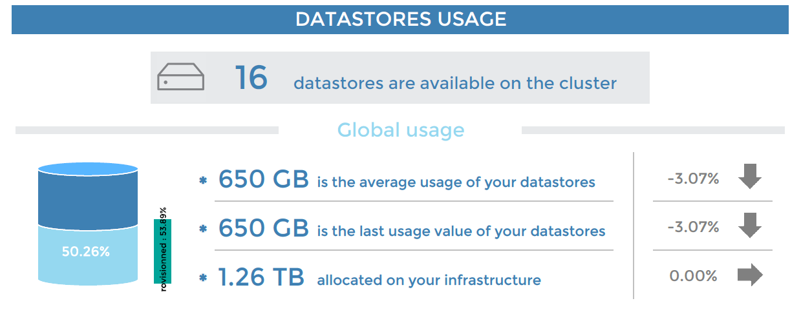

Next, the top five and a bottom five datastores used are presented. For
each datastore, you can see the percentage of usage, the maximum value
reached and allocated space.

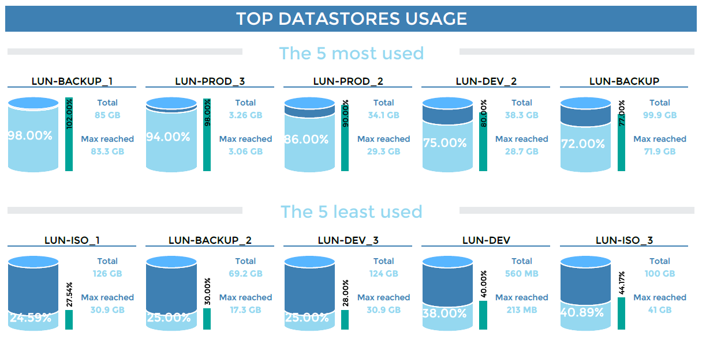

The report then displays the top five and bottom five datastores
generating read and write IOPS (input/output per second).

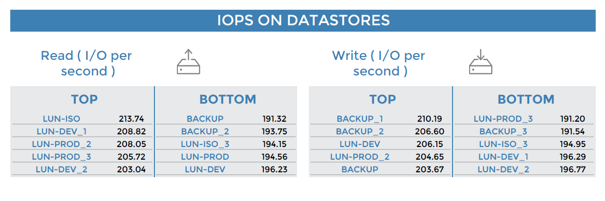

The second page shows average CPU consumption for all ESX clusters and
the evolution from the previous period.

ESXs using the most and the least CPU are highlighted, with the average
consumption and the maximum value reached for each ESX.

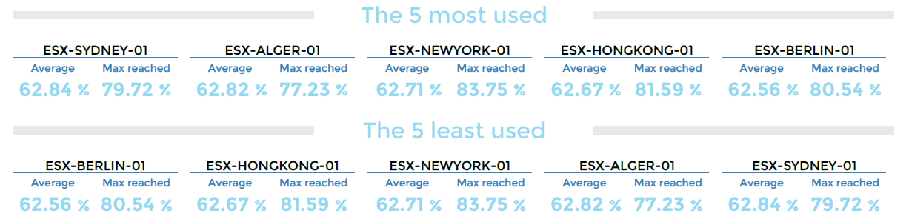

The report shows the average memory usage on all ESX clusters and the
total memory allocated.

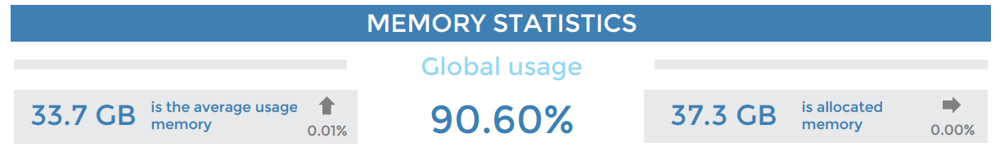

The top and bottom five memory-consuming ESXs are highlighted along with
average usage over time, the total memory available and the maximum
value reached for each ESX.

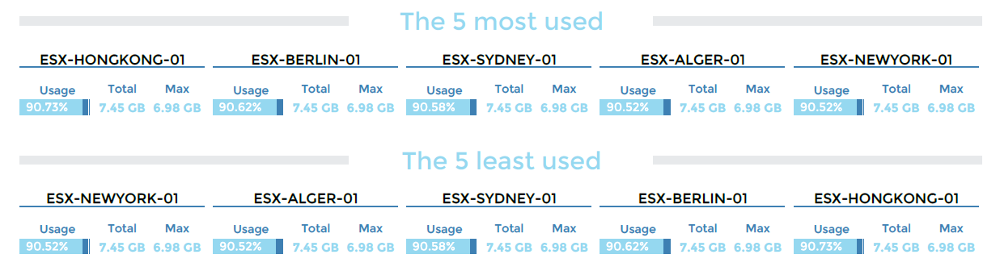

Finally, an overview of the average number of virtual machines on the
cluster that have been powered on and powered off.

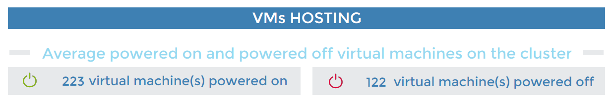

The report provides details on the ESXs hosting the greatest and fewest
number of virtual machines powered on and powered off:

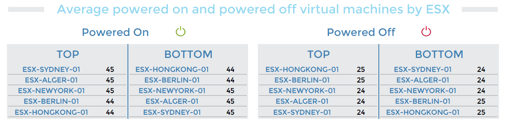

#### Parameters

Parameters required for the report:

- The reporting period
- The following Centreon objects:

| Parameter                  | Type            | Description                                                   |
|----------------------------|-----------------|---------------------------------------------------------------|
| Time period                | Dropdown list   | Select time period.                                           |
| Host group                 | Dropdown list   | Select cluster.                                               |
| Host category              | Multi selection | Select host categories for filtering on cluster.              |
| Datastore Service category | Multi selection | Select service categories with datastore usage.               |
| IOPs Service category      | Multi selection | Select service categories with datastore IOPS.                |
| CPU Service category       | Multi selection | Select service categories with the ESX CPU usage.             |
| Memory Service category    | Multi selection | Select service categories with the ESX Memory usage.          |
| VM Count Service category  | Multi selection | Select service categories with the VM count services on ESXs. |
| Datastore usage (filter)   | Text field      | Type common part for filter and replacement (% to keep all).  |
| Datastore iops (filter)    | Text field      | Type common part for filter and replacement (% to keep all).  |

#### Prerequisites

This report is developed for full compatibility with the Monitoring Connector
Virt-VMware2-ESX and the Centreon-VMWare-2.0 connector. The following
prerequisites for the proper generation of the report shall apply.

Implement monitoring of the following indicators:

- CPU service, a memory service and a VM Count service for each ESX.
- Datastore-usage service for each datastore, or for all datastores,
  linked to the vCenter or to only one ESX of the cluster. By
  default, the service will have the following nomenclature:
  Datastore-Usage-xxxx (xxxx is the datastore name).
- Datastore-IOPS service for each datastore or for all datastores,
  linked to the vCenter or to only on ESX of the cluster. By
  default, the service will have the following nomenclature:
  Datastore-Iops-xxxx (xxxx is the datastore name).

Create host groups that correspond to the clusters. A cluster (host
group) contains:

- Several ESXs (hosts).
- The vCenter, only if Datastore-usage and Datastore-IOPS services are linked to
  the vCenter and not to one cluster's ESX.

Create at least one host category containing the whole cluster (vCenter + ESXs).
If there are multiple ESX clusters, you can split them into several host
categories to filter the report on a single cluster.

Create the following service categories:

- CPU-ESX: combines all CPU indicators on ESXs.
- Memory-ESX: combines all memory indicators on ESXs.
- VMcount-ESX: combines all VM Count indicators on ESXs.
- Datastore-usage: combines all datastore usage indicators.
- Datastore-IOPS: combines all datastore IOPS indicators.

> If a datastore or an ESX host name contains more than 16 characters, only the
> first 16 will be shown, supplemented by 3 dots.

### VMWare-VM-Performances-List

#### Description

This report displays statistics on usage of the vCPU, memory and IOPS on
virtual machines.

It has been optimized for generating XLSX files to create the desired filters
and perform sorting.

#### How to interpret the report

The first tab shows information on the reporting period, the live-service period
selected and the report generation day and time.

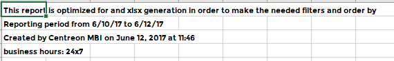

The second tab lists the virtual machines with vCPU usage (average, average
formatted, max, max formatted) and memory usage (average, average formatted,
max, max formatted, % of usage, % of usage formatted).

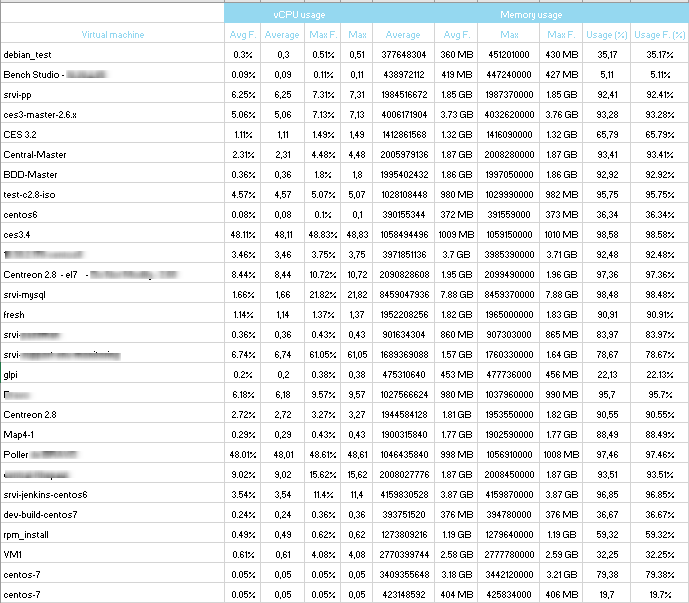

The last tab lists the virtual machines by datastore and their read/write IOPS
usage showing the average and the maximum reached.

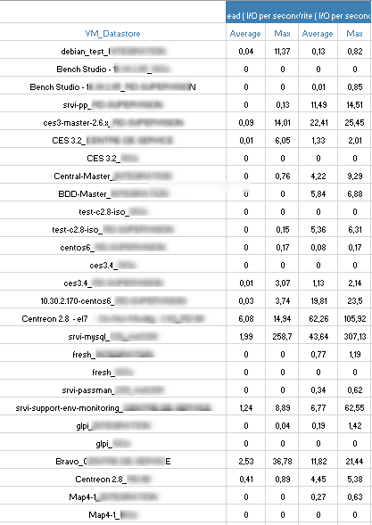

#### Parameters

Parameters required for the report:

- The reporting period
- The following Centreon objects:

| Parameters       | Type            | Description                                                  |
|------------------|-----------------|--------------------------------------------------------------|
| Time period      | Dropdown list   | Specify the reporting live service.                          |
| Host to report   | Dropdown list   | Select the vCenter for report.                               |
| Host category    | Multi selection | Select host category for filter.                             |
| Service category | Multi selection | Select service category containing the global VM statistics. |

#### Prerequisites

This report is developed for full compatibility with the
Virt-VMware2-ESX Monitoring Connector and Centreon-VMWare-2.0 connector. Certain
prerequisites apply to ensure proper report creation:

Monitoring of the following indicators:

- Vm-Cpu-Global service
- Vm-Memory-Global service
- Vm-Datastore-Iops-Global service.

Creation of the following service category:

- VM-Statistics with these indicators: Vm-Cpu-Global, Vm-Memory-Global and
  Vm-Datastore-Iops-Global.
  