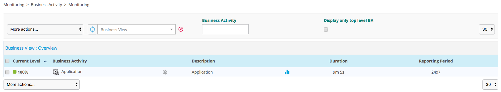
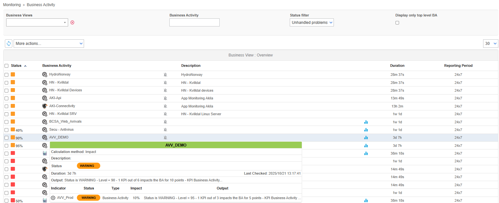
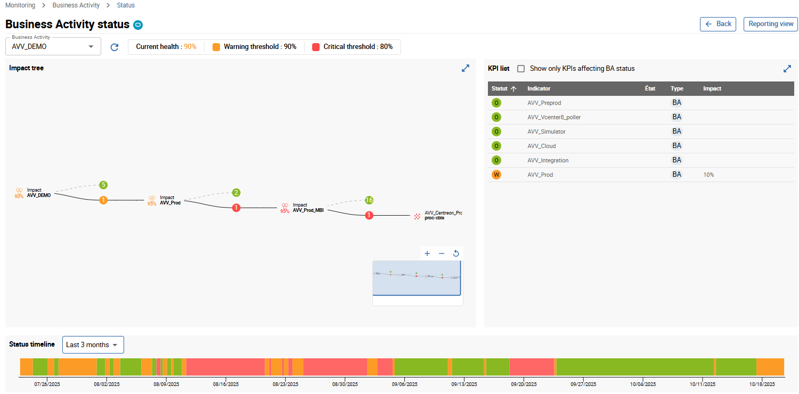

After adding, editing or deleting the BAs, KPIs and BVs, the objects
linked to Centreon BAM, go to **Configuration > Poller**, generate the
configuration files, and push them to the Centreon central server.

After you have loaded the configuration and checked the services linked to the
KPIs, the BA will be up to date and available under
`Monitoring > Business Activity > Monitoring`.

## Interpret real-time data

### Main page

A table on the main page lists all the essential information concerning
the live status and health level of the BAs.

Non-admin users can only see the BAs associated with BVs linked to their
access group:

| Column            | Description                               |
| ----------------- | ----------------------------------------- |
| Current Level     | Current level in %                        |
| Business Activity | Name of the BA                            |
| Description       | Description of the BA                     |
| Duration          | Duration of the current status            |
| Reporting Period  | Default reporting period used for that BA |

You can view the evolution of BA health level by hovering your mouse over
the name or description of the BA, and a pop-up appears displaying all the KPIs
and status information.

Click on the name of the BA to bring up a detailed live view.

### Detailed View

The detailed view is divided into six parts:

- Business Activity dropdown list to change the BA.
- Status information on the BA Current health level and alert thresholds.
- Reporting view button to access the reporting page.
- Area containing the BA Impact tree. You can open a sublevel, zoom in and out and move the tree.
- Table containing the KPI list impacting the BA level.
- The Status timeline bar displaying a timeline of statuses.
