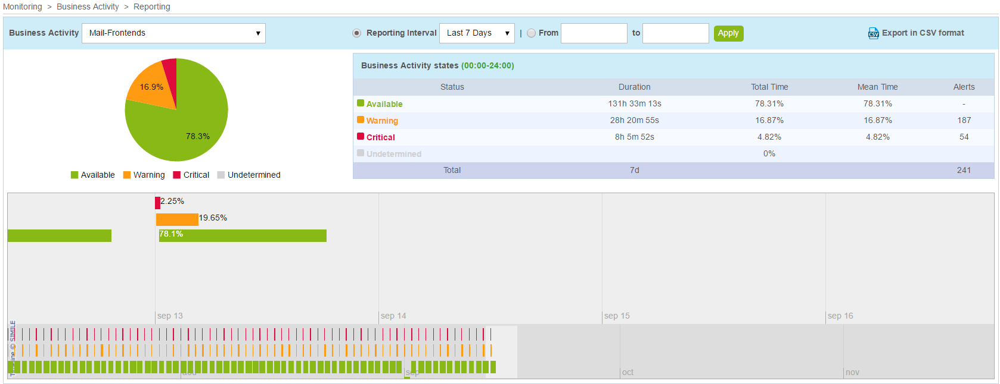

You can view history data at any time on the 
reporting and log screens, and on performance graphs. These screens are
similar to those used on the Centreon server.

## Reporting

The reporting page is in the **Reporting > Availability** menu in Centreon.
Select a BA to display operational availability, warning and critical
statistics for a given period:



You can export the data to a .csv file by clicking the **Export in CSV
format** link.

## Force statistics calculation

Events & availability statistics are automatically calculated daily. In
case you modify the default reporting period, add an extra one or change
BV association, you may need to rebuild the previously calculated data.

To do so, run the following script:

``` shell
/usr/share/centreon/www/modules/centreon-bam-server/engine/centreon-bam-rebuild-events --all
```

It is also possible to rebuild a specific BA:

``` shell
/usr/share/centreon/www/modules/centreon-bam-server/engine/centreon-bam-rebuild-events --ba=<id of ba>
```

For more information regarding this script, run the following command:

``` shell
/usr/share/centreon/www/modules/centreon-bam-server/engine/centreon-bam-rebuild-events --help
```

**If you are also using Centreon MBI** and wish to use the updated data, run
the following command on the reporting server:

``` shell
/usr/share/centreon-bi/etl/importData.pl -r --bam-only
```
