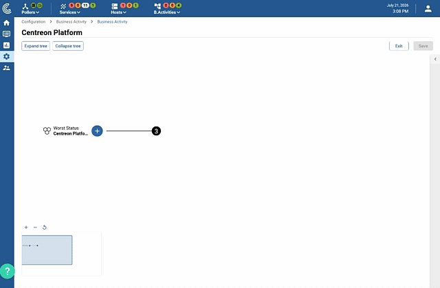

The service mapping capabilities in Centreon rely on the **Centreon Business
Activity Monitoring (BAM)** extension.

> Centreon BAM is a Centreon **extension** that requires a valid [license](../administration/licenses.md). To
> purchase one and retrieve the necessary repositories, contact
> [Centreon](mailto:sales@centreon.com).

## What is centreon BAM?

**Centreon Business Activity Monitoring (BAM)** helps ITSM and business
operation teams gain a common perspective to align IT with business. Based on
ITIL practices, it measures real-time IT operating vitals from
Centreon-monitored data to show crucial correlations to service performance.
Prioritizing and proactively managing IT operations and service delivery for
the required SLA becomes easier. Centreon BAM contributes to showing that IT counts for
business operations.

**Centreon BAM** uses an advanced Business Activities (BA) calculation engine
based on Key Performance Indicators.

Definitions:

  - **BA** - Business Activity
  - **BV** - Business View: a group of business activities.
  - **KPI** - Key Performance Indicator: the weighted indicator considered in the
    BA calculation.

## Business Activity configuration

> You can [simulate](../service-mapping/ba-simulation.md) the behavior of a Business Activity dependency tree before saving your changes and pushing the configuration to production. This lets you decide afterward whether to keep or discard the changes you made.

Centreon BAM's configuration interface lets you manage a whole business
activity from a single screen:

- **See the whole structure at a glance**: the Business Activity and all
  its indicators are displayed as a single tree, so you get a full picture
  of what's being monitored without jumping from screen to screen.

  

- **Edit every node in its context**: select any node in the tree to edit
  its calculation method, thresholds, or downtime inheritance directly,
  without switching menus.

  

- **Save all your changes at once**: make several changes across the tree,
  then save them together instead of one node at a time.

  
