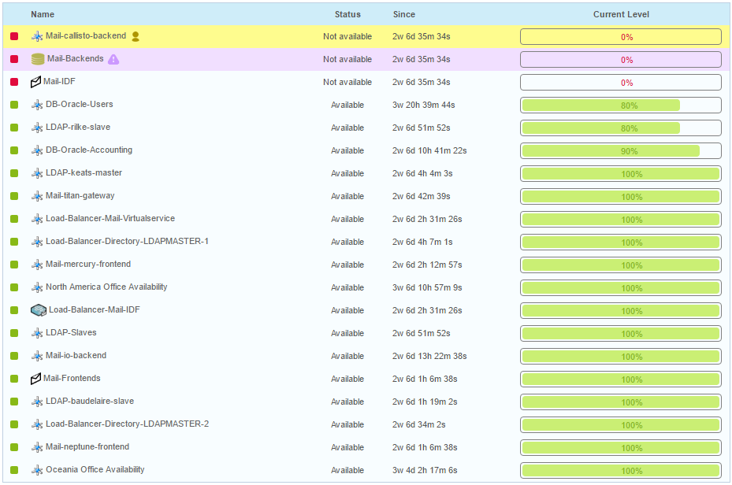
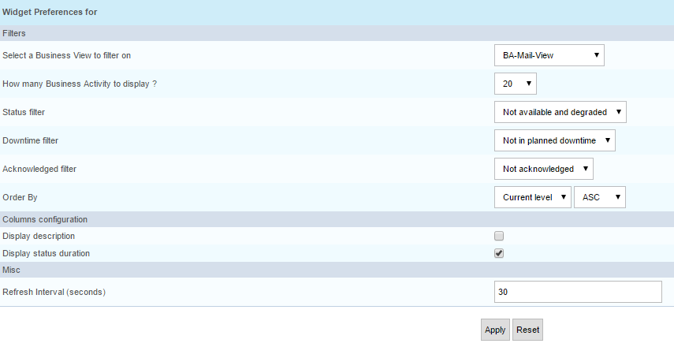

> The following Centreon BAM widgets are available in [Dashboards](../alerts-notifications/dashboards.md):
> - Business Activity diagram
> - Business Activity status timeline

## Live Business Activity Status

This widget is used in **Custom views**. It displays the live business activity status and current level in a
listing widget that you can add to your home page.

### Parameters

**Description**

-   Select a Business View for filtering.
-   Number of Business Activities to display.
-   Status filter: Select BA status for filtering.
-   Downtime filter: Retain only the BA with or without downtime.
-   Acknowledged filter: Retain only acknowledged or non-acknowledged BA.
-   Order By: Criteria for sorting the BAs.
-   Display description.
-   Display status duration.
-   Display only top level BA: Only display BA without a parent. For a
    non-admin user, this is calculated based on the ACL.
-   Refresh Interval (in seconds).

**Example**

