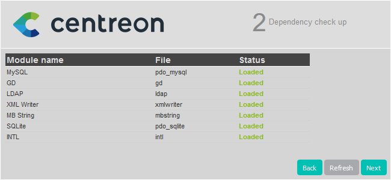

import Tabs from '@theme/Tabs';
import TabItem from '@theme/TabItem';

This chapter describes how to upgrade your Centreon platform from version 22.10
to version 25.10.

> Version 22.10 is no longer supported. Upgrade from this version has not been tested by the Centreon QA team.

> When you upgrade your central server, make sure you also upgrade all your remote servers and your pollers. All servers in your architecture must have the same version of Centreon. In addition, all servers must use the same [version of the BBDO protocol](../developer/developer-broker-bbdo-switch-versions.md).

> If you want to migrate your Centreon platform to another server/OS, follow the [migration procedure](../migrate/introduction.md). If your Centreon platform has HA, please contact your Centreon sales representative to discuss any migration scenario.

> Business edition users: MAP Legacy is no longer available in Centreon 25.10. If you are still using MAP Legacy, you will need to migrate to MAP. See [MAP Legacy end of life](https://docs.centreon.com/docs/graph-views/map-legacy-eol/).

> Version 25.10 means the end of support for Debian 11. If you were using Debian 11, you must first migrate to Debian 12 before you can upgrade Centreon. See [How to migrate from Debian 11 to Debian 12](https://thewatch.centreon.com/product-how-to-21/how-to-migrate-from-debian-11-to-debian-12-3874).

> Warning: If you were using the following monitoring connectors, from version 25.10 you must declare all of their configurations using [the **Configuration \> Additional connector configurations** page](/pp/integrations/plugin-packs/getting-started/how-to-guides/additional-connector-configuration) before deploying the configuration of the corresponding poller:
> * [VMware ESX](https://docs.centreon.com/pp/integrations/plugin-packs/procedures/virtualization-vmware2-esx/)
> * [VMware vCenter](https://docs.centreon.com/pp/integrations/plugin-packs/procedures/virtualization-vmware2-vcenter-generic/)
> * [VMware VM](https://docs.centreon.com/pp/integrations/plugin-packs/procedures/virtualization-vmware2-vm/)
> * [VMware vCenter v4](https://docs.centreon.com/fr/pp/integrations/plugin-packs/procedures/virtualization-vmware2-vcenter-4/)
> * [VMware vCenter v5](https://docs.centreon.com/fr/pp/integrations/plugin-packs/procedures/virtualization-vmware2-vcenter-5/)
> * [VMware vCenter v6](https://docs.centreon.com/pp/integrations/plugin-packs/procedures/virtualization-vmware2-vcenter-6/)

## Prerequisites

### Perform a backup

Be sure that you have fully backed up your environment for the following
servers:

- Central server
- Database server

If you use Open Ticket providers with custom configurations, [make a backup of these before updating Centreon](../alerts-notifications/ticketing-install.md#creating-a-backup-of-your-custom-open-ticket-provider-configurations).

### Check the repositories

Before upgrading your Centreon platform, make sure the following package repositories are enabled:

<Tabs groupId="sync" queryString>
<TabItem value="EL" label="EL">

* EPEL
* BaseOS
* AppStream
* centreon
* centreon-modules, if you are using Centreon Business Edition.

</TabItem>
<TabItem value="Debian 11" label="Debian 11">

* bullseye, bullseye-updates, bullseye-backports and bullseye security
* BaseOS
* AppStream
* centreon
* centreon-modules, if you are using Centreon Business Edition.

</TabItem>
<TabItem value="Debian 12" label="Debian 12">

* bookworm, bookworm-updates, bookworm-backports and bookworm security
* BaseOS
* AppStream
* centreon
* centreon-modules, if you are using Centreon Business Edition.

</TabItem>
</Tabs>

## Upgrade the Centreon Central server

> When you run a command, check its output. If you get an error message, stop the procedure and fix the issue.

### Install the new repositories

<Tabs groupId="sync" queryString>
<TabItem value="Alma / RHEL / Oracle Linux 8" label="Alma / RHEL / Oracle Linux 8">

1. Update your Centreon 22.10 to the latest minor version.

   ```shell
   dnf config-manager --add-repo https://archives.centreon.com/standard/22.10/el8/centreon-22.10-el8.repo
   dnf clean all --enablerepo=*
   dnf update
   ```

2. Remove the **centreon-22.10.repo** file:

   ```shell
   cd /etc/yum.repos.d/
   rm -rf centreon*
   ```

3. Install the new repository:

   ```shell
   dnf install -y dnf-plugins-core
   dnf config-manager --add-repo https://packages.centreon.com/rpm-standard/25.10/el8/centreon-25.10.repo
   systemctl stop cbd
   dnf clean all --enablerepo=*
   ```

</TabItem>
<TabItem value="Debian 12" label="Debian 12">

1. Update your Centreon 22.10 to the latest minor version.
2. Run the following commands:

```shell
rm -f /etc/apt/sources.list.d/centreon.list
echo "deb https://packages.centreon.com/apt-standard/ $(lsb_release -sc)-25.10-stable main" | tee -a /etc/apt/sources.list.d/centreon-26.10-stable.list
echo "deb https://packages.centreon.com/apt-plugins-stable/ $(lsb_release -sc) main" | tee /etc/apt/sources.list.d/centreon-plugins.list
```

3. Then import the repository key:

```shell
wget -O- https://apt-key.centreon.com | gpg --dearmor | tee /etc/apt/trusted.gpg.d/centreon.gpg > /dev/null 2>&1
apt update
```

</TabItem>
</Tabs>

> If you have an [offline license](../administration/licenses.md#types-of-license), also remove the old Monitoring Connectors repository, then install the new one.
>
> You can find the address of these repositories on the [support portal](https://support.centreon.com/hc/en-us/categories/10341239833105-Repositories).

### Upgrade the Centreon solution

1. Make sure all users are logged out from the Centreon web interface before starting the upgrade procedure.

2. If you have installed Business extensions, delete the configuration of the 22.10 repository: 

<Tabs groupId="sync" queryString>
<TabItem value="Alma / RHEL / Oracle Linux 8" label="Alma / RHEL / Oracle Linux 8">

```shell
rm /etc/yum.repos.d/centreon-business-22.10.repo
```

</TabItem>

<TabItem value="Alma / RHEL / Oracle Linux 9" label="Alma / RHEL / Oracle Linux 9">

```shell
rm /etc/yum.repos.d/centreon-business-22.10.repo
```

</TabItem>

<TabItem value="Debian" label="Debian">

```shell
rm /etc/apt/sources.list.d/centreon-business.list
```

</TabItem>
</Tabs>

3. Install the 25.10 Business repository: visit the [support portal](https://support.centreon.com/hc/en-us/categories/10341239833105-Repositories) to get its address.

4. If your OS is Debian and you have a customized Apache configuration, perform a backup of your configuration file (**/etc/apache2/sites-available/centreon.conf**).

5. Stop the Centreon Broker process:

```shell
systemctl stop cbd
```

6. Delete existing retention files:

```shell
rm /var/lib/centreon-broker/* -f
```

### Upgrade PHP

Centreon 25.10 uses PHP in version 8.2.

<Tabs groupId="sync" queryString>
<TabItem value="Alma / RHEL / Oracle Linux 8" label="Alma / RHEL / Oracle Linux 8">

You need to change the PHP stream from version 8.1 to 8.2 by executing the following commands and answering **y**
to confirm:

```shell
dnf config-manager --disable remi-modular remi-safe
dnf module disable composer:2
dnf module disable php:remi-8.1
rm -rf /etc/yum.repos.d/remi*
dnf module reset php
```

```shell
dnf module enable php:8.2
dnf distro-sync php\* --allowerasing
```

Ensure the `memory_limit` parameter in `/etc/php.d/50-centreon.ini` is set to at least 256mb. If it isn't, insert it manually. 

```shell
su - apache -s /bin/bash -c "/usr/share/centreon/bin/console cache:clear"
systemctl restart php-fpm
```

</TabItem>
<TabItem value="Alma / RHEL / Oracle Linux 9" label="Alma / RHEL / Oracle Linux 9">

You need to change the PHP stream from version 8.1 to 8.2 by executing the following commands and answering **y**
to confirm:

```shell
dnf module reset php
```

```shell
dnf module enable php:8.2
```

Ensure the `memory_limit` parameter in `/etc/php.d/50-centreon.ini` is set to at least 256mb. If it isn't, insert it manually. 

</TabItem>
<TabItem value="Debian 12" label="Debian 12">

```shell
systemctl stop php8.1-fpm
systemctl disable php8.1-fpm
```

Ensure the `memory_limit` parameter in `/etc/php/8.2/fpm/conf.d/50-centreon.ini` is set to at least 256mb. If it isn't, insert it manually. 

</TabItem>
</Tabs>

Then finish upgrading the Centreon solution.

1. Clean the cache:

<Tabs groupId="sync" queryString>
<TabItem value="Alma / RHEL / Oracle Linux 8" label="Alma / RHEL / Oracle Linux 8">
   
```shell
dnf clean all --enablerepo=*
```

</TabItem>
<TabItem value="Alma / RHEL / Oracle Linux 9" label="Alma / RHEL / Oracle Linux 9">
   
```shell
dnf clean all --enablerepo=*
```

</TabItem>
<TabItem value="Debian" label="Debian">
   
```shell
apt clean all
apt update
```

</TabItem>
</Tabs>

2. Then upgrade all the components with the following command:

<Tabs groupId="sync" queryString>
<TabItem value="Alma / RHEL / Oracle Linux 8" label="Alma / RHEL / Oracle Linux 8">

```shell
dnf update centreon\* php-pecl-gnupg
```

</TabItem>
<TabItem value="Debian 12" label="Debian 12">

```shell
apt install --only-upgrade centreon
```

</TabItem>
</Tabs>

> Accept new GPG keys from the repositories as needed.

### Update your customized Apache configuration

This section only applies if you customized your Apache configuration. 

<Tabs groupId="sync" queryString>
<TabItem value="Alma / RHEL / Oracle Linux 8" label="Alma / RHEL / Oracle Linux 8">

When you upgrade your platform, the Apache configuration file is not upgraded automatically. The new configuration file brought by the rpm does not replace the old file. You must copy the changes manually to your customized configuration file.

Run a diff between the old and the new Apache configuration files:

```shell
diff -u /etc/httpd/conf.d/10-centreon.conf /etc/httpd/conf.d/10-centreon.conf.rpmnew
```

* **10-centreon.conf** (post upgrade): this file contains the custom configuration. It does not contain anything new brought by the upgrade.
* **10-centreon.conf.rpmnew** (post upgrade): this file is provided by the rpm; it does not contain any custom configuration.

For each difference between the files, assess whether you should copy it from **10-centreon.conf.rpmnew** to **10-centreon.conf**.

Check that Apache is configured properly by running the following command:

```shell
apachectl configtest
```

The expected result is the following:

```shell
Syntax OK
```

Restart the Apache and PHP processes to take the new configuration into account:

```shell
systemctl restart php-fpm httpd
```

Then check its status:

```shell
systemctl status httpd
```

If everything is ok, you should have:

```shell
● httpd.service - The Apache HTTP Server
   Loaded: loaded (/usr/lib/systemd/system/httpd.service; enabled; vendor preset: disabled)
  Drop-In: /usr/lib/systemd/system/httpd.service.d
           └─php-fpm.conf
   Active: active (running) since Tue 2020-10-27 12:49:42 GMT; 2h 35min ago
     Docs: man:httpd.service(8)
 Main PID: 1483 (httpd)
   Status: "Total requests: 446; Idle/Busy workers 100/0;Requests/sec: 0.0479; Bytes served/sec: 443 B/sec"
    Tasks: 278 (limit: 5032)
   Memory: 39.6M
   CGroup: /system.slice/httpd.service
           ├─1483 /usr/sbin/httpd -DFOREGROUND
           ├─1484 /usr/sbin/httpd -DFOREGROUND
           ├─1485 /usr/sbin/httpd -DFOREGROUND
           ├─1486 /usr/sbin/httpd -DFOREGROUND
           ├─1487 /usr/sbin/httpd -DFOREGROUND
           └─1887 /usr/sbin/httpd -DFOREGROUND

```

</TabItem>
<TabItem value="Debian 12" label="Debian 12">

Use the backup file you created in the previous step to copy your customizations to the file **/etc/apache2/sites-available/centreon.conf**.

Check that Apache is configured properly by running the following command:

```shell
apache2ctl configtest
```

The expected result is the following:

```shell
Syntax OK
```

Check the status of Apache:

```shell
systemctl status apache2
```

If everything is ok, you should have:

```shell
● apache2.service - The Apache HTTP Server
    Loaded: loaded (/lib/systemd/system/apache2.service; enabled; vendor pres>
     Active: active (running) since Tue 2022-08-09 05:01:36 UTC; 3h 56min ago
       Docs: https://httpd.apache.org/docs/2.4/
   Main PID: 518 (apache2)
      Tasks: 11 (limit: 2356)
     Memory: 18.1M
        CPU: 1.491s
     CGroup: /system.slice/apache2.service
             ├─ 518 /usr/sbin/apache2 -k start
             ├─1252 /usr/sbin/apache2 -k start
             ├─1254 /usr/sbin/apache2 -k start
             ├─1472 /usr/sbin/apache2 -k start
             ├─3857 /usr/sbin/apache2 -k start
             ├─3858 /usr/sbin/apache2 -k start
             ├─3859 /usr/sbin/apache2 -k start
             ├─3860 /usr/sbin/apache2 -k start
             ├─3876 /usr/sbin/apache2 -k start
             ├─6261 /usr/sbin/apache2 -k start
             └─6509 /usr/sbin/apache2 -k start
```

</TabItem>
</Tabs>

#### Customized Apache configuration: enable text compression

In order to improve page loading speed, you can activate text compression on the Apache server. It requires the **brotli** package to work. This is optional, but it provides a better user experience.

Add the following code to your Apache configuration file, in both the `<VirtualHost *:80>` and `<VirtualHost *:443>` elements:

```shell
<IfModule mod_brotli.c>
    AddOutputFilterByType BROTLI_COMPRESS text/html text/plain text/xml text/css text/javascript application/javascript application/json
</IfModule>
AddOutputFilterByType DEFLATE text/html text/plain text/xml text/css text/javascript application/javascript application/json
```

### Finalizing the upgrade

Before starting the web upgrade process, upgrade the [Centreon BAM module](../service-mapping/upgrade.md) and reload the Apache server with the
following command:

<Tabs groupId="sync" queryString>
<TabItem value="Alma / RHEL / Oracle Linux 8" label="Alma / RHEL / Oracle Linux 8">

```shell
systemctl reload php-fpm httpd
```

</TabItem>
<TabItem value="Debian 12" label="Debian 12">

```shell
apt autoremove
systemctl daemon-reload
systemctl enable php8.2-fpm
systemctl start php8.2-fpm
systemctl restart apache2
```

</TabItem>
</Tabs>

Then you need to finalize the upgrade process:

  <Tabs groupId="sync" queryString>
  <TabItem value="Using the wizard" label="Using the wizard">

1. Log on to the Centreon web interface to continue the update process. Click **Next**:

  

2. Click **Next**:

  

3. The release notes describe the main changes. Click **Next**:

  

4. This process performs the various upgrades. Click **Next**:

  

5. Your Centreon server is now up to date. Click **Finish** to access the login
page:

  

Refer to the [Centreon MBI](../reporting/update.md) and [Centreon MAP](../graph-views/map-web-upgrade.md) dedicated procedures to update these modules.

6. Deploy the central's configuration from the Centreon web UI by following [this
procedure](../monitoring/monitoring-servers/deploying-a-configuration.md).
  
</TabItem>
<TabItem value="Using a dedicated API endpoint" label="Using a dedicated API endpoint">

1. Log on to the central server through your terminal to continue the update process.

  > You need an authentication token to reach the API endpoint. Perform the following procedure to get a token.

  In our case, we have the configuration described below (you need to adapt the procedure to your configuration).
   - address: 10.25.XX.XX
   -  port: 80
   -  version: 25.10
   -  login: Admin
   -  password: xxxxx

2. Enter the following request:

  ```shell
  curl --location --request POST '10.25.XX.XX:80/centreon/api/v25.10/login' \
  --header 'Content-Type: application/json' \
  --header 'Accept: application/json' \
  --data '{
    "security": {
      "credentials": {
        "login": "Admin",
        "password": "xxxxx"
      }
    }
  }'
  ```

  This is how the result should look:

    ```shell
    {"contact":{"id":1,"name":"Admin Centreon","alias":"admin","email":"admin@localhost","is_admin":true},"security":{"token":"hwwE7w/ukiiMce2lwhNi2mcFxLNYPhB9bYSKVP3xeTRUeN8FuGQms3RhpLreDX/S"}}
    ```

3. Retrieve the token number to use it in the next request.

4. Then enter this request:

  ```shell
  curl --location --request PATCH 'http://10.25.XX.XX:80/centreon/api/latest/platform/updates' \
  --header 'X-AUTH-TOKEN: hwwE7w/ukiiMce2lwhNi2mcFxLNYPhB9bYSKVP3xeTRUeN8FuGQms3RhpLreDX/S' \
  --header 'Content-Type: application/json' \
  --data '{
      "components": [
          {
              "name": "centreon-web"
          }
      ]
  }'
  ```

5. This request does not return any result. To check if the update has been successfully applied, read the version number displayed on the Centreon web interface login page.

</TabItem>
</Tabs>

Finally, restart Broker, Engine and Gorgone on the central server by running this command:

  ```shell
  systemctl restart cbd centengine gorgoned
  ```

Add the **apache** user to the **centreon-broker** group and vice versa.

<Tabs groupId="sync" queryString>
<TabItem value="Alma / RHEL / Oracle Linux 8" label="Alma / RHEL / Oracle Linux 8">

```shell
usermod -a -G centreon-broker apache
usermod -a -G apache centreon-broker
```

</TabItem>
<TabItem value="Debian 12" label="Debian 12">

```shell
usermod -a -G centreon-broker www-data
usermod -a -G www-data centreon-broker
```

</TabItem>
</Tabs>


### Post-upgrade actions

1. Upgrade extensions. From **Administration > Extensions > Manager**, upgrade all extensions, starting
with the following:

   - License Manager,
   - Monitoring Connector Manager,
   - Auto Discovery.

   Then you can upgrade all other commercial extensions.

2. If you were using custom commands for a poller (on the **Configuration > Pollers > Pollers** page, in the **Monitoring Engine Information** section), be aware that a new validation regex is now applied (`[a-zA-Z0-9\-\_]+`): your custom commands may need to be adapted. On the central server:
   * To identify commands that must be adapted, run:
     ```shell
     sudo -u apache php /usr/share/centreon/bin/console w:m:c --dry-run
     ```
   * To adapt the commands automatically, run:
     ```shell
     sudo -u apache php /usr/share/centreon/bin/console w:m:c
     ```
     (You can also adapt them manually.)

3. [Deploy the configuration](../monitoring/monitoring-servers/deploying-a-configuration.md).

4. Restart the processes:

    ``` shell
    systemctl restart cbd centengine centreontrapd gorgoned
    ```

## Upgrade MariaDB

Follow [this procedure](upgrade-mariadb.md) to upgrade MariaDB to version 10.11.

## Upgrade the Remote Servers

This procedure is the same as for upgrading a Centreon Central server with the addition of needing to retrieve the decryption key at the end.

### Retrieving the decryption key

Run the following script with the central server IP address to enable the remote server to receive and process encrypted data: 

```shell
/usr/share/centreon/bin/writeEngineSecrets.sh <BASE_URL> <API_ACCOUNT> <PASSWORD>
```

Example:

``` shell
/usr/share/centreon/bin/writeEngineSecrets.sh https://10.10.10.10/centreon admin password
```

> You must use **admin** as the **\<API_ACCOUNT\>**.

Restart **centengine**:

```shell
systemctl restart centengine
```

> At the end of the update, the configuration should be deployed from the Central server.

## Upgrade the Pollers

### Update the Centreon repository

Run the following command:

<Tabs groupId="sync" queryString>
<TabItem value="Alma / RHEL / Oracle Linux 8" label="Alma / RHEL / Oracle Linux 8">

```shell
dnf install -y dnf-plugins-core && \
rm -f /etc/yum.repos.d/centreon* && \
dnf config-manager --add-repo https://packages.centreon.com/rpm-standard/25.10/el8/centreon-25.10.repo
```

</TabItem>
<TabItem value="Debian 12" label="Debian 12">

```shell
rm -f /etc/apt/sources.list.d/centreon*
echo "deb https://packages.centreon.com/apt-standard/ $(lsb_release -sc)-25.10-stable main" | tee -a /etc/apt/sources.list.d/centreon-25.10-stable.list
apt update
```

</TabItem>
</Tabs>

### Upgrade the Centreon solution

Clean the cache:

<Tabs groupId="sync" queryString>
<TabItem value="Alma / RHEL / Oracle Linux 8" label="Alma / RHEL / Oracle Linux 8">

```shell
dnf clean all --enablerepo=*
```

</TabItem>
<TabItem value="Debian 12" label="Debian 12">

```shell
apt clean
apt update
```

</TabItem>
</Tabs>

Then upgrade all the components with the following command:

<Tabs groupId="sync" queryString>
<TabItem value="Alma / RHEL / Oracle Linux 8" label="Alma / RHEL / Oracle Linux 8">

```shell
dnf update centreon\*
```

</TabItem>
<TabItem value="Debian 12" label="Debian 12">

```shell
apt install --only-upgrade centreon-poller
```

</TabItem>
</Tabs>

> Accept new GPG keys from the repositories as needed.

Restart **centreon**:

```shell
systemctl restart centreon
```

### Retrieving the decryption key

Run the following script with the correct IP address to enable the poller to receive and process encrypted data.

The IP address to use depends on the following conditions:
- When updating pollers linked directly to the central server, use the central server's IP.
- When updating pollers linked to a remote server, use the remote server's IP. However, in this instance, you must first confirm the remote server has the correct key by checking that the value of `app_secret` in the `/etc/centreon-engine/engine-context.json` file is the same as the central server's. If this is not the case, relaunch the script with the right IP to correct the .json file.

```shell
/usr/share/centreon/bin/writeEngineSecrets.sh <BASE_URL> <API_ACCOUNT> <PASSWORD>
```

Example:

``` shell
/usr/share/centreon/bin/writeEngineSecrets.sh https://10.10.10.10/centreon admin password
```

> You must use **admin** as the **\<API_ACCOUNT\>**.

Restart **centengine**:

```shell
systemctl restart centengine
```
